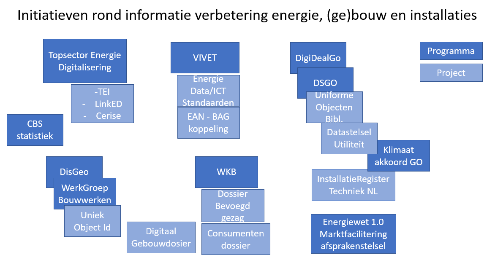
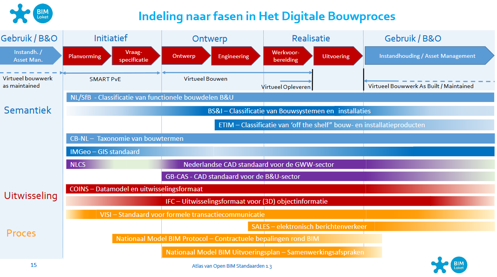
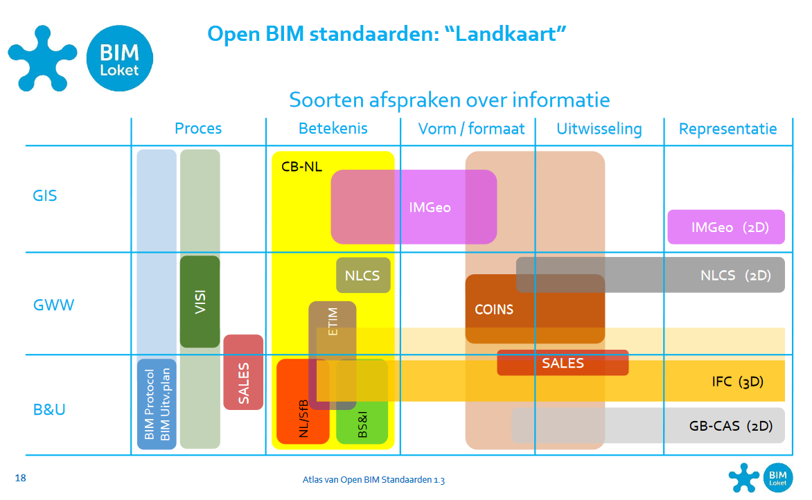

Analyse/inhoudelijke keuzes
---------------------------

Zoals aangegeven in hoofdstuk 1 kan het karakter van dit onderzoek worden
gekenschetst als een landschapsverkenning/omgevingsanalyse en veel minder als
een ontwerp-proces. Dit hoofdstuk beschrijft kort de project-context (VIVET &
VIMET-I).

Nog doen: Iets over de paragraaf Scope installaties / Criteria en inhoudelijke
keuzes / Bevindingen landschapsverkenning.

Nog doen: laatste paragraaf: Uitgangspunten informatiemodel.

Aan een deel van de inventarisatie van losse elementen die in de
landschapsverkenning heeft plaatsgevonden, is vervolgens enige structuur
gegeven. Dat is gebeurd door de geïdentificeerde datasets in tabelvorm te
verbinden met resp. infotools, Informatiemodellen en kernentiteiten.

Klopt dit nog? Nog doen: Iets over Het (keten)werkproces waarin de informatie
(over installaties) wordt geproduceerd - Stakeholders - Bestaande registraties -
Wettelijk kader  
- Relevante standaarden en rekenmodellen - Relevante documentatie

### Beschrijving VIVET & VIMET-I

Lorem ipsum dolor.

### Scope installaties

Herschrijven (is verplaatste tekst): Beperkingen / issues / randvoorwaarden

Tijdens de ontwikkeling van dit document zijn er door diverse betrokkenen de
volgende opmerkingen gemaakt, die het waard zijn om hier te benoemen en t.z.t.
op te pakken. Deze zijn opgenomen in de teksten per categorie; hieronder volgen
enkele generieke opmerkingen, die in willekeurige volgorde zijn opgesomd.

-   *Processen* zijn nu in de inventarisatie niet meegenomen. Door deze wel te
    beschouwen zou (de beschrijving van) het speelveld wijzigen. Bijvoorbeeld
    het aanleggen van aansluitingen gebeurt vaak in multi-utility-verband
    (telecom, water) en heeft betrekking op andere wetgeving (vergunningen,
    omgevingswet).

-   Deze beschrijving/indeling roept de vraag op, of er bij installatieregister
    en informatiemodel ook aandacht moet zijn voor het temporele aspect
    (verleden / heden / toekomst).

-   De term ‘installatieregister’ roept de gedachte op van één grote database
    met alle informatie, maar dit register zal toch eerder bestaan door het
    verbinden van datasets dan door het verzamelen van concrete data.

### Criteria en inhoudelijke keuzes

### Bevindingen landschapsverkenning

In Nederland is door de op gang gekomen energietransitie en de hiermee verwante digitalisering van de bouw een groot aantal programma's, projecten en initiatieven ontstaan die met elkaar verbonden moeten worden. Vanuit informatiekunidg oogpunt gaan ze deels over  gemeenschappelijke informatieobjecten (zie [Tabel projecten en kernentiteiten](#Tabel projecten en kernentiteiten), waarvan we vanuit gaan dat deze data uitgewisseld kan worden. Dit is echter geen vanzelfsprekendheid, omdat er op de samenhang maar beperkt regie wordt gevoerd. 
De Topsector energie kent een thema [digitalisering](https://www.topsectorenergie.nl/digitalisering), maar stuurt niet intergraal over alle projecten op verduurzaming van de informatieuitwisseling.
De DigitDeal Gebouwde Omgeving richt zich op digitalisering en standaadisatie in de bouw. Hier is wel enige afstemming met het de Wet Kwaliteitsborging en realiseren van uniek ojbect identificatie van gebouwen. Succes is echter ook afhankelijk van automatische koppeling van (energie)aansluitinformatie met de BAG wat binnen Vivet en NetbeheerNL op de agenda is geplaatst. 
Vanuit het perspectief 'installatieregister' is het TechniekNL voortvarend bezig om informaite over alle in onderhoud zijn installaties te kunnen verbinden onder andere voor de uitvoering van de WKB verplichtingen. Deze landsdekkende informatie is nog niet betrokken bij bv de CBS statistiek en hiermee niet beschikbaar voor NPRES plannen en energiemodellen.
Deze plaat laat hiermee duidelijk het cross sectorale karakter zien (bouw, energie, installatie onderhoud, assetmanagement, basisregistraties) van de problematiek rond de energie-installaties en hiermee verbonden omgeving.
Het initiatief om te komen tot een afsprakenstelsel voor een betere marktfacilering is een mooi voorbeeld om de informatie te laten stromen en vernieuwing en innovatie te stimuleren. Dit heeft nog wel een bilaterale scope van NetbeheerNL(transport) en Energie Nederland (opwek) .

afkortingen:
DigiDealGO = DigiDealGO is een overeenkomst tussen de overheid, de brancheverenigingen van de bouw, de installatiesector en de toeleverende industrie, ondersteund door de 
  BIR (Bouw Informatie Raad) het 
  BIM Loket en de 
  DSBI (Digitaal Stelsel Bouw en Installatie ).
DSGO =  Digitaal Stelsel voor de Gebouwde Omgeving
DBR = Bouw Digitaliserings Raad
UOB = Uniforme Obejcten Bibliotheek
DiS Geo = Doorontwikkeling in Samenhang van de basisregistraties
UOI = Unieke Object Identificate
WKB = wet kwaliteitsborging voor het bouwen met derde begeleidingsgroep; digitale dossiers. 
EGO = datavoorziening energietransitie Gebouwde Omgeving door PAW en VNG 
EAN = European Article Numbering voor een leveringspunt voor gas of elektriciteit te identificeren
Topsector Energie
  TEI = Toegankelijke Energie Informatie (Enexis , TNO, KPN)
  LinkED = Linked Energie Data (TNO, Alliander en Enexis) wat oa  MHM (Model Harmonisatie Methodiek) introduceert
Digitaal Gebouwdosier = BZK project met uses cases consumentendossier, dossier bevoegd gezag, het vernieuwde energielabel en het platform verbeterjehuis.nl voor ogen.

### Bestaande datasets aan elkaar relateren

#### Infotooling en datasets

Een poging om relaties aan te leggen tussen de verschillende onderdelen van het
informatieveld in de energie- en bouwwereld

Intro

De deskresearch voor VIMET-I is gestart met een inventarisatie van:
*Afsprakenstelsels* /*Datasets* / *Informatiemodellen* / *Taxonomieën* /
*Standaarden&normen*.

Deze inventarisatie bestaat uit een opsomming, zonder nadere duiding van
verbanden. In dit document wordt hier een aanzet toe gegeven.

Als eerste volgt een opsomming van mogelijk indelingen, gevolgd door de
toepassing van (enkele van die) indelingen op dat wat geïnventariseerd is.

#### Mogelijke indelingen

Inspiratie is geput uit de [Atlas van Open BIM Standaarden
1.3](https://www.bimloket.nl/upload/documents/downloads/Standaarden/Atlas%20Open%20BIM%20Standaarden%20v1.3.pdf),
die als doel heeft om een afstemmingsagenda voor standaarden in het BIM-domein
te maken.

##### Processen als leidraad

Analoog aan de indeling van BIM-standaarden lenen ook energie-installaties zich
voor het beschouwen met een procesbenadering.

Ter illustratie volgt hieronder een plaat met de toepassing van standaarden in
Het Digitale Bouwproces. Dit bouwproces bevindt zich tussen
Instandhouding/Assetmanagement.

Het bouwproces is voor het energieveld vergelijkbaar maar de processen voor
instandhouding/assetmanagement nog toegevoegd moeten worden, en daarvoor zal de
juiste indeling gezocht moeten worden. Procesbeschrijvingen van netbeheer (NB
NL) en marktfacilitering (EDSN) kunnen die input leveren. Alliander heeft een
indeling analoog aan het
<https://en.wikipedia.org/wiki/Business_Process_Framework_(eTOM)>; het heeft de
voorkeur om een framework te hanteren dat herkenbaar is voor verschillende
partijen.

NB: De kleuren geven de intensiteit van het gebruik aan:

-   daar waar de kleur in een balk het donkerst is, ligt het zwaartepunt van de
    toepassing

-   daar waar de kleur in een balk het lichtst is, wordt de standaard het minst
    toegepast

##### Soorten afspraken over informatie (en sectoren)

Maar een andere indeling, die naar afspraken over informatie, kan ook inzicht
bieden. De indeling in de sectoren in de bouwwereld zal in het energieveld
anders zijn. De Atlas van Open BIM-standaarden geeft deze indeling:

Evenzo kunnen ook de standaarden etc. van het energieveld gemapt worden op
‘soorten afspraken over informatie’.

Overigens zijn bovenstaande schema’s overgenomen uit de BIM-atlasversie 1.3; een
actuele beschrijving van de Open BIM Standaarden bevindt zich hier:
<https://www.bimloket.nl/p/144/Atlas-van-open-BIM-standaarden>

#### Tabel Datasets en infotools

De geïnventariseerde datasets zijn vaak lang geleden ontstaan voor bepaalde
doeleinden. Dat is gebeurd in een organisatorische context (vaak het
energiedomein) die in de loop van de jaren vaak veranderd is. Eigendom en beheer
van de datasets zijn daarmee ook regelmatig bij verschillende partijen
ondergebracht. De schaalvergroting in de sector heeft ervoor gezorgd dat een
aantal datasets inmiddels wel een landelijke dekking hebben, en dat maakt het
maken van een beschrijving beter werkbaar.

Het zijn niet alleen de datasets zelf, die op deze manier ontstaan zijn,
hetzelfde geldt voor de beschrijvingen van die datasets. In onderstaande tabel
is per dataset aangegeven welke infotools gehanteerd zijn om de inhoud ervan te
beschrijven.

De datasets zijn hier geordend naar de relaties met het begrip
‘energie-installaties’. Zo bieden de *basisregistraties* de context van
energie-installaties (locatie, eigenaar), zijn installaties (deels)
geregistreerd in de *databronnen energie-installaties’*, bestaan er datasets
waarin *deelverzamelingen* van een type installaties is geregistreerd en zijn er
datasets met *gerelateerde informatie* over energie-installaties (subsidies,
verslaggeving).

| **Generieke datasets**                                    | **Informatiemodel**     | **Productclassificatie Bouw- en installatie**                                                                                                                                                  | **Afsprakenstelsel**          | **Standaarden/normen**       | **Overige**       |
|-----------------------------------------------------------|-------------------------|------------------------------------------------------------------------------------------------------------------------------------------------------------------------------------------------|-------------------------------|------------------------------|-------------------|
| **Basisregistraties**                                     |                         |                                                                                                                                                                                                | Stelsel van Basisregistraties |                              |                   |
| BAG                                                       | IMGEO, IMBAG            |                                                                                                                                                                                                |                               |                              |                   |
| BGT                                                       | IMGEO, BGT              |                                                                                                                                                                                                |                               |                              |                   |
| Top10NL                                                   | IMTOP                   |                                                                                                                                                                                                |                               |                              |                   |
| NHR                                                       | IMHR                    |                                                                                                                                                                                                |                               |                              |                   |
| **Databronnen energie-installaties**                      |                         |                                                                                                                                                                                                |                               |                              |                   |
| Aansluitingen (C-AR, EDSN)                                | ?                       |                                                                                                                                                                                                | Afspraken Marktfacilitering   |                              |                   |
| Kabels en Leidingen (Assetmanagement Netbeheerders)       | Prorietary              |                                                                                                                                                                                                |                               |                              |                   |
| Landelijke voorziening kabels en leidingeninformatie      | IMKL                    |                                                                                                                                                                                                | WIBON/KLIC                    |                              |                   |
| Bestand met energiemeters                                 |                         |                                                                                                                                                                                                | Meetcode (VMNED)              |                              |                   |
| PIR/CERES (Productie-installaties, EDSN)                  | Deels IEC CIM gebaseerd |                                                                                                                                                                                                |                               |                              |                   |
| Laadpalen (eco-movement)                                  |                         |                                                                                                                                                                                                |                               |                              |                   |
| Energie Management Systemen (Netbeheerders)               | IEC CIM of proprietary  |                                                                                                                                                                                                |                               |                              |                   |
| Stookinstallaties (SCIOS)                                 |                         |                                                                                                                                                                                                |                               |                              |                   |
| Installatieregister (Techniek NL; zie schema Bijlage 7)   |                         | ETIM, NL-SfB, FGO Onderhoud                                                                                                                                                                    | Beheerd door Techniek NL      |                              |                   |
| Keuringenregisters: OK-CV, OK-WP? Airco                   |                         | ETIM?                                                                                                                                                                                          | OK-CV, OK-WP                  |                              |                   |
| (zie schema Bijlage 7)                                    |                         |                                                                                                                                                                                                |                               |                              |                   |
| **Toepassingen / deelverzamelingen energie-installaties** |                         |                                                                                                                                                                                                |                               |                              |                   |
| CBS-Datasets: LIV, …                                      | IMVG (BAG,WOZ,HR,BRP)   |                                                                                                                                                                                                |                               |                              |                   |
| Rijksvastgoed aansluitingen (RVB, RWS)                    |                         |                                                                                                                                                                                                |                               |                              | Relatie met C-AR? |
| Glastuinbouw (RVO)                                        |                         |                                                                                                                                                                                                |                               |                              |                   |
| **Gerelateerd aan installaties**                          |                         |                                                                                                                                                                                                |                               |                              |                   |
| ISDE Investeringssubsidies (RVO)                          |                         | apparatenlijst ISDE RVO (warmtepompen en zonneboilers) https://www.rvo.nl/subsidie-en-financieringswijzer/isde/voorwaarden-apparaten                                                           |                               | Relatie met ETIM onderzoeken |                   |
| EIA (Energieinvesteringsaftrek) (RVO)                     |                         | RVO energie lijst EIA 2020 https://www.rvo.nl/subsidie-en-financieringswijzer/energie-investeringsaftrek-eia/publicaties-energie-investeringsaftrek-eia                                        |                               |                              |                   |
| SDE-subsidie (RVO)                                        |                         | RVO SDE++ categorien https://www.rvo.nl/subsidie-en-financieringswijzer/stimulering-duurzame-energieproductie-sde kengetallen en specificaties duurzame opwek met biomassa, water, wind en zon |                               |                              |                   |
| Informatieplicht grotere gebruikers                       |                         | RVO (EML)nerkende maatregelenlijsten                                                                                                                                                           |                               |                              |                   |
| **Gerelateerd**                                           |                         |                                                                                                                                                                                                |                               |                              |                   |
| EP-Online energie-labels (RVO)                            | ..., IMBAG              |                                                                                                                                                                                                |                               |                              |                   |
| E-MJV (milieu-jaar-verslagen) (RIVM)                      |                         | Lijst energiedragers RVO - IPCC https://www.e-mjv.nl/onderwerpen/rie-en-ippc en https://www.infomil.nl/onderwerpen/duurzaamheid-energie/beste-beschikbare/bbt/wettelijk-aangewezen/            |                               | E-PRTR                       |                   |
| Energie-audit EED (RVO)                                   |                         | RVO EML( Erkende Maatregel Lijst) https://www.rvo.nl/onderwerpen/duurzaam-ondernemen/energie-besparen/informatieplicht-energiebesparing/bedrijven-en-instellingen/erkende-maatregelenlijsten   |                               |                              |                   |

~~~~~~~~~~~~~~~~~~~~~~~~~~~~~~~~~~~~~~~~~~~~~~~~~~~~~~~~~~~~~~~~~~~~~~~~~~~~~~~~
**Beschreven met informatiemodel …** (CIM, IFC, COINS, IM-SG, IM-KL)  
**Productclassificatie Bouw- en installatie** (NL-SfB, ETIM, FGO, Productdata, UOB, CB-NL, Stabu, BS&I)   
**Standaarden/normen...** (Sales Unifeed berichtenset, NEN 2660, Lijst energiedragers, ..)  
~~~~~~~~~~~~~~~~~~~~~~~~~~~~~~~~~~~~~~~~~~~~~~~~~~~~~~~~~~~~~~~~~~~~~~~~~~~~~~~~

#### Tabel Datasets en informatiemodellen

In bovenstaande tabel is per dataset aangegeven welke infotools zijn gehanteerd
om de dataset te beschrijven.

Qua informatiemodellen is er een onderscheid te maken tussen modellen voor één
specifieke dataset en modellen waarmee diverse datasets beschreven kunnen
worden. Dat geldt bijvoorbeeld voor CIM en ESDL. Het is van belang om te zien
welke datasets door (of: met behulp van) deze generieke informatiemodellen
beschreven zijn, omdat daarmee inzicht ontstaat in de inhoudelijke verschillen
in de datasets en mogelijkheden tot harmonisatie. En dat is in onderstaande
tabel weergegeven.

Op dit moment is met een x aangegeven welke datasets concreet door deze
informatiemodellen zijn beschreven. Een verwacht marginaal resultaat, gezien de
wijze waarop datasets ontstaan zijn, zoals beschreven in de toelichting bij de
bovenstaande tabel. Een volgende stap is om te onderzoeken welke
informatiemodellen gebruikt *kunnen worden* om de bestaande datasets te
beschrijven.

De datasets zijn hier – evenals in bovenstaande tabel - geordend naar de
relaties met het begrip ‘energie-installaties’. Zo bieden de *basisregistraties*
de context van energie-installaties (locatie, eigenaar), zijn installaties
(deels) geregistreerd in de *databronnen energie-installaties’*, bestaan er
datasets waarin *deelverzamelingen* van een type installaties is geregistreerd
en zijn er datasets met *gerelateerde informatie* over energie-installaties
(subsidies, verslaggeving).

| **Generieke datasets**                                    | **CIM**          | **IMKL** | **ESDL** | **ETIM** | **CB-NL** | **Overige**     |
|-----------------------------------------------------------|------------------|----------|----------|----------|-----------|-----------------|
| **Basisregistraties:**                                    |                  |          |          |          |           |                 |
| BAG                                                       |                  |          |          |          |           | IMGEO, IMBAG    |
| BGT                                                       |                  |          |          |          |           | IMGEO, BGT      |
| Top10NL                                                   |                  |          |          |          |           | IMTOP           |
| NHR                                                       |                  |          |          |          |           | IMHR            |
| BRO                                                       |                  |          |          |          |           | IMBOR           |
| **Databronnen energie-installaties**                      |                  |          |          |          |           |                 |
| Aansluitingen (C-AR, EDSN)                                | CIM geinspireerd |          |          |          |           |                 |
| Kabels en Leidingen (Assetmanagement Netbeheerders)       |                  |          |          |          |           |                 |
| Landelijke voorziening kabels en leidingeninformatie      |                  | X        |          |          |           |                 |
| Meters(Netbeh., meetbedr.)??                              |                  |          |          |          |           |                 |
| CERES/PIR(EDSN)                                           | X                |          |          |          |           |                 |
| Laadpalen (eco-movement)                                  |                  |          |          |          |           |                 |
| Energie Management Systemen (Netbeheerders)               |                  |          |          |          |           |                 |
| Stoominstallaties (SCIOS)                                 |                  |          |          |          |           |                 |
| Installatieregister?                                      |                  |          |          | X        |           | NL-Sfb?         |
| (zie schema Bijlage7)                                     |                  |          |          |          |           |                 |
| Keuringenregisters: OK-CV, OK-WP? Airco                   |                  |          |          |          |           |                 |
| (zie schema Bijlage 7)                                    |                  |          |          |          |           |                 |
| **Toepassingen / deelverzamelingen energie-installaties** |                  |          |          |          |           |                 |
| CBS-Datasets                                              |                  |          |          |          |           |                 |
| LIV                                                       |                  |          |          |          |           |                 |
| Rijksvastgoed aansluitingen (RWS)                         |                  |          |          |          |           |                 |
| Glastuinbouw (RVO)                                        |                  |          |          |          |           |                 |
| **Gerelateerd aan installaties**                          |                  |          |          |          |           |                 |
| ISDE Investeringssubsidies (RVO)                          |                  |          |          |          |           |                 |
| Energieinvesteringsaftrek (RVO)                           |                  |          |          |          |           |                 |
| SDE-subsidie (RVO)                                        |                  |          |          |          |           |                 |
| **Gerelateerd**                                           |                  |          |          |          |           |                 |
| EP-Online energie-labels (RVO)                            |                  |          |          |          |           | Relatie met BAG |
| E-MJV (milieu-jaar-verslagen) (RIVM)                      |                  |          |          |          |           |                 |
| Energie-audit EED (RVO)                                   |                  |          |          |          |           |                 |

#### Tabel Datasets en kernentiteiten

Het onderzoek VIMET-I richt zich op energie-installaties, omdat voor sturing en
monitoring van de energietransitie inzicht gewenst is in eigenschappen van
energie-installaties (vermogen, productie, ouderdom, efficiency, etc.). Door
middel van use cases wordt een afbakening gemaakt van de scope van de te
onderzoeken data van‘energie-installaties’.  
Dit is een valide use case/gebruikersvraag en evanals deze use case zijn er in
de loop van de tijd tal van use cases geweest, zoals marktfacilitering,
monitoring van graafwerkzaamheden, load flow berekeningen, etc. De daarvoor
benodigde informatiesystemen zijn doorgaans ‘in splendid isolation’ ontworpen en
dus niet op elkaar afgestemd. Een verbinding met bestaande datasets, met goed
afgestemde definities/informatiemodellen is een verstandiger aanpak dan het
ontwerp van een nieuw informatiesysteem voor energie-installaties. Daartoe is
inzicht nodig in welke kernentiteiten onderdeel uitmaken van welke datasets. En
dat is in onderstaande tabel beschreven.

De datasets zijn hier – evenals in bovenstaande tabellen - geordend naar de
relaties met het begrip ‘energie-installaties’. Zo bieden de *basisregistraties*
de context van energie-installaties (locatie, eigenaar), zijn installaties
(deels) geregistreerd in de *databronnen energie-installaties’*, bestaan er
datasets waarin *deelverzamelingen* van een type installaties is geregistreerd
en zijn er datasets met *gerelateerde informatie* over energie-installaties
(subsidies, verslaggeving).

| **Generieke datasets**                                    | **Aansluiting** | **Kabel/leiding** | **Productie-eenheid** | **Afnemer** | **Overige** |
|-----------------------------------------------------------|-----------------|-------------------|-----------------------|-------------|-------------|
| Basisregistraties:                                        |                 |                   |                       |             |             |
| BAG, BGT, Top10NL, LIV, NHR                               |                 |                   |                       |             |             |
| CBS-Datasets                                              |                 |                   |                       |             |             |
| **Databronnen energie-installaties**                      |                 |                   |                       |             |             |
| Aansluitingen (C-AR, EDSN)                                |                 |                   |                       |             |             |
| Kabels en Leidingen (Assetmanagement Netbeheerders)       |                 |                   |                       |             |             |
| Landelijke voorziening kabels en leidingeninformatie      |                 |                   |                       |             |             |
| Meters(Netbeh., meetbedr.)??                              |                 |                   |                       |             |             |
| CERES(EDSN)                                               |                 |                   |                       |             |             |
| Laadpalen (eco-movement)                                  |                 |                   |                       |             |             |
| Energie Management Systemen (Netbeheerders)               |                 |                   |                       |             |             |
| Stoominstallaties (SCIOS)                                 |                 |                   |                       |             |             |
| Installatieregister?                                      |                 |                   |                       |             |             |
| (zie schema Bijlage7)                                     |                 |                   |                       |             |             |
| Keuringenregisters: OK-CV, OK-WP? Airco                   |                 |                   |                       |             |             |
| (zie schema Bijlage 7)                                    |                 |                   |                       |             |             |
| **Toepassingen / deelverzamelingen energie-installaties** |                 |                   |                       |             |             |
| Rijksvastgoed aansluitingen (RWS)                         |                 |                   |                       |             |             |
| Glastuinbouw (RVO)                                        |                 |                   |                       |             |             |
| **Gerelateerd aan installaties**                          |                 |                   |                       |             |             |
| ISDE Investeringssubsidies (RVO)                          |                 |                   |                       |             |             |
| Energieinvesteringsaftrek (RVO)                           |                 |                   |                       |             |             |
| SDE-subsidie (RVO)                                        |                 |                   |                       |             |             |
| **Gerelateerd**                                           |                 |                   |                       |             |             |
| EP-Online energie-labels (RVO)                            |                 |                   |                       |             |             |
| E-MJV (milieu-jaar-verslagen) (RIVM)                      |                 |                   |                       |             |             |
| Energie-audit EED (RVO)                                   |                 |                   |                       |             |             |

#### Tabel projecten en kernentiteiten

Zoals in paragraaf [bevindingen-landschapsverkenning](#bevindingen-landschapsverkenning) is aangegeven is informatie over energieinstallaties verdeeld over verschillende sectoren. Om informatie te laten stromen is  overeenstemming nodig over de semantiek en kwaliteit van de belangrijkste kernentiteiten. De onderstaande tabel geeft beknopt inzicht welke kernentiteiten geraakt worden. Op te merken valt dat voor de entiteiten Gebouw en Persoon/Bedrijf basisregistraties en dus ook gegevenseigenaren zijn. Voor de entiteiten Installatie en Meetwaarde is dit niet geregeld en is er governance nodig om overeenstemming te bereiken over de semantiek, kwaliteit en uitwisselingsafspraken. Om de relaties tussen de entiteiten consistent te houden zijn er ook beheersafspraken en financiering nodig.

| **Projecten**                        | **Installatie** | **Gebouw** | **Persoon/Bedrijf** | **Meetwaarde** |
|--------------------------------------|-----------------|------------|---------------------|----------------|
| Datastelsel Utiliteitsbouw           | x               | x          | x                   | x              |
| Consumenten dossier                  | x               | x          | x                   |                |
| Digitaal Gebouwdossier               |                 | x          |                     |                |
| Document-analyse                     | x               | x          | x                   | x              |
| Rekenmodellen                        | x               | x          |                     |                |
| EGO Datavoorziening                  | x               | x          |                     |                |
| PoC Installatie Register (onderhoud) | x               | x          | x                   | x              |
| LinkED                               |                 |            |                     |                |
| UOI: Unieke Object Identificatie     |                 | x          |                     |                |
|                                      |                 |            |                     |                |
|                                      |                 |            |                     |                |

### Uitgangspunten informatiemodel
