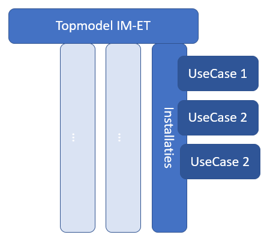

## Analyse

Zoals aangegeven in hoofdstuk 1 kan het karakter van dit onderzoek worden
gekenschetst als een landschapsverkenning/omgevingsanalyse en veel minder als
een ontwerpproces. Door het voortschrijdend inzicht zijn bepaalde elementen
weggelaten (zoals scoping door usecases) of juist uitgebreid (zoals
afsprakenstelsels, relevante projecten en stakeholder analyse).

Aan een deel van de inventarisatie van losse elementen die in de
landschapsverkenning heeft plaatsgevonden, is tijdens de analyse structuur
gegeven, wat de basis is voor analyse en aanbevelingen.

### Scope van installaties

Zoals in de volgende paragraaf aangegeven is het landschap cross-sectoraal
(bouw, energie, installatie-onderhoud, assetmanagement, basisregistraties). De
scoping van een 'installatieregister concept' moet vraaggestuurd plaatsvinden.
Daarom was voorzien om aan de hand van usecases met betrokken product owners
onderdelen van het informatiemodel verder uit te diepen. De volgende usecases
zijn voorbereid, maar nog niet uitgevoerd.
- Case A – Ontsluiten informatie over huidige duurzame productiecapaciteit aan Zon PV uit PIR/Ceres
- Case B – Casus elektrisch laden Smart Zwolle 
- Case C – Warmtepompen (Groei warmtepompen en effectmonitoring)

In het VIVET programma 2020 worden de usecases verder uitgewerkt, wat tevens het nu meer generieke model moet invullen
en specificeren.

Knelpunt bij de uitvoering is dat de totstandkoming van de usecases moeizaam
gaat. Het beeld dat partijen niet echt bereid zijn om data te delen wordt
bevestigd en het kost veel moeite om tot afspraken te komen. Dit is ook deels de
conclusie van project E2 en in die zin ook onderdeel van het project. Van belang
is dat er d.m.v. het werken aan het informatiemodel partijen dichter tot elkaar
komen. Dat doel is bereikt. De usecases zijn een mooie manier om te laten zien
wat er mogelijk is, maar als ze niet tot stand komen bevestigen ze het probleem
van het terughoudend zijn in data delen.

Het volgende denkmodel is gebruikt tijdens de analyse en het uitwerken van het
eerste informatiemodel. Dit (T-model) is tevens de aanleiding om in het VIVET
werkplan 2020 de
[datastandaarden](https://github.com/Geonovum/VIVET-Werkomgeving/blob/master/VIMET-I/media/denkmodel-datastandaarden-energietransitie.png)
goed te hechten in topmodellen en per toepassing en per domein specifiek uit te
werken.

<figure id="denkmodel-imet">
    
    <figcaption>Denkmodel Informatiemodel Energie installaties.</figcaption>
</figure>

### Bevindingen van de landschapsverkenning

In Nederland is door de op gang gekomen energietransitie en de hiermee verwante
digitalisering van de bouw een groot aantal programma's, projecten en
initiatieven ontstaan die met elkaar verbonden moeten worden. Vanuit
informatiekundig oogpunt gaan ze deels over gemeenschappelijke
informatieobjecten (zie [Tabel projecten en
kernentiteiten](#Tabel%20projecten%20en%20kernentiteiten), waarbij we er vanuit
gaan dat deze data uitgewisseld kan worden. Dit is echter geen
vanzelfsprekendheid, omdat er op de samenhang maar beperkt regie wordt gevoerd.
De Topsector Energie kent een thema
[digitalisering](https://www.topsectorenergie.nl/digitalisering), maar stuurt
niet integraal over alle projecten op verduurzaming van de
informatie-uitwisseling. De DigiDeal Gebouwde Omgeving richt zich op
digitalisering en standaardisatie in de bouw. Hier is wel enige afstemming met
het de Wet Kwaliteitsborging en realiseren van uniek object identificatie van
gebouwen. Succes is echter ook afhankelijk van de automatische koppeling van
(energie)aansluitinformatie met de BAG dat binnen VIVET en Netbeheer NL op de
agenda is geplaatst. Vanuit het perspectief 'installatieregister' is Techniek NL
voortvarend bezig om informatie over alle in onderhoud zijn installaties te
kunnen verbinden onder andere voor de uitvoering van de WKB-verplichtingen. Deze
landsdekkende informatie is nog niet betrokken bij bv de CBS statistiek en
hiermee niet beschikbaar voor NPRES-plannen en energiemodellen. Deze plaat laat
hiermee duidelijk het cross sectorale karakter zien (bouw, energie,
installatie-onderhoud, assetmanagement, basisregistraties) van de problematiek
rond energie-installaties en hiermee verbonden omgeving. Het initiatief om te
komen tot een afsprakenstelsel voor een betere marktfacilitering is een mooi
voorbeeld om de informatie te laten stromen en vernieuwing en innovatie te
stimuleren. Dit heeft nog wel een bilaterale scope van Netbeheer NL (transport)
en Energie Nederland (opwek) .

<figure id="vimetlandschap">
    
    <figcaption>Het Vimet Landschap</figcaption>
</figure>

<figure id="vimetlandschapdomein">
    
    <figcaption>Het Vimet Landschap per domein en soort initiatief \</figcaption>
</figure>

**Afkortingen**:  
DigiDealGO = DigiDealGO is een overeenkomst tussen de overheid, de
brancheverenigingen van de bouw, de installatiesector en de toeleverende
industrie, ondersteund door  
BIR (Bouw Informatie Raad),  
het BIM Loket en  
de DSBI (Digitaal Stelsel Bouw en Installatie).  
DSGO = Digitaal Stelsel voor de Gebouwde Omgeving  
DBR = Bouw Digitaliserings Raad  
UOB = Uniforme Objecten Bibliotheek  
DiSGeo = Doorontwikkeling in Samenhang van de basisregistraties  
UOI = Unieke Object Identificatie  
WKB = wet kwaliteitsborging voor het bouwen met derde begeleidingsgroep;
digitale dossiers.  
EGO = datavoorziening energietransitie Gebouwde Omgeving door PAW en VNG  
EAN = European Article Numbering voor een leveringspunt voor gas of
elektriciteit te identificeren  
Topsector Energie  
TEI = Toegankelijke Energie Informatie (Enexis , TNO, KPN)  
LinkED = Linked Energie Data (TNO, Alliander en Enexis) ee project dat o.a. MHM
(Model Harmonisatie Methodiek) heeft geïntroduceerd  
Digitaal Gebouwdossier = BZK project met usecases consumentendossier, dossier
bevoegd gezag, het vernieuwde energielabel en het platform verbeterjehuis.nl
voor ogen.

#### Infotooling

Het voorgaande hoofdstuk – Landschapsverkenning – bevat een inventarisatie van
de infotools die zijn aangetroffen in de relevantie domeinen:
*Afsprakenstelsels* /*Datasets* / *Informatiemodellen* / *Taxonomieën* /
*Standaarden & normen*.

Waar het landschap nog een opsomming geeft, wordt in dit hoofdstuk verband
aangelegd tussen de verschillende infotools, waarbij datasets en kernentiteiten
als insteek zijn gekozen.

Als eerste volgt een opsomming van welke infotools gerelateerd kunnen worden aan
de geïnventariseerde datasets. Vervolgens worden de verbanden tussen datasets en
informatiemodellen, en tussen datasets en kernentiteiten weergegeven. Tenslotte
wordt nog een overzicht gegeven van welke projecten betrekking hebben op welke
kernentiteiten.

De kernentiteiten staan vervolgens centraal in het volgende hoofdstuk
‘Informatiemodel’.

#### Tabel Datasets en Infotools

De geïnventariseerde datasets zijn vaak lang geleden ontstaan voor bepaalde
doeleinden. Dat is gebeurd in een organisatorische context (vaak het
energiedomein) die in de loop van de jaren vaak veranderd is. Eigendom en beheer
van de datasets zijn daarmee ook regelmatig bij verschillende partijen
ondergebracht. De schaalvergroting in de sector heeft ervoor gezorgd dat een
aantal datasets inmiddels wel een landelijke dekking hebben, en dat maakt het
maken van een beschrijving beter werkbaar.

Het zijn niet alleen de datasets zelf, die op deze manier ontstaan zijn,
hetzelfde geldt voor de beschrijvingen van die datasets. In onderstaande tabel
is per dataset aangegeven welke infotools gehanteerd zijn om de inhoud ervan te
beschrijven.

De datasets zijn hier geordend naar de relaties met het begrip
‘energie-installaties’. Zo bieden de *basisregistraties* de context van
energie-installaties (locatie, eigenaar), zijn installaties (deels)
geregistreerd in de *databronnen energie-installaties’*, bestaan er datasets
waarin *deelverzamelingen* van een type installaties zijn geregistreerd en zijn er
datasets met *gerelateerde informatie* over energie-installaties (subsidies,
verslaggeving).

| **Generieke datasets**                                    | **Informatiemodel**     | **Productclassificatie Bouw- en installatie**                                                                                                                                                   | **Afsprakenstelsel**          | **Standaarden/normen**       | **Overige**       |
|-----------------------------------------------------------|-------------------------|-------------------------------------------------------------------------------------------------------------------------------------------------------------------------------------------------|-------------------------------|------------------------------|-------------------|
| **Basisregistraties**                                     |                         |                                                                                                                                                                                                 | Stelsel van Basisregistraties |                              |                   |
| BAG                                                       | IMGEO, IMBAG            |                                                                                                                                                                                                 |                               |                              |                   |
| BGT                                                       | IMGEO, BGT              |                                                                                                                                                                                                 |                               |                              |                   |
| Top10NL                                                   | IMTOP                   |                                                                                                                                                                                                 |                               |                              |                   |
| NHR                                                       | IMHR                    |                                                                                                                                                                                                 |                               |                              |                   |
| **Databronnen energie-installaties**                      |                         |                                                                                                                                                                                                 |                               |                              |                   |
| Aansluitingen (C-AR, EDSN)                                | ?                       |                                                                                                                                                                                                 | Afspraken Marktfacilitering   |                              |                   |
| Kabels en Leidingen (Assetmanagement Netbeheerders)       | Proprietary             |                                                                                                                                                                                                 |                               |                              |                   |
| Landelijke voorziening kabels en leidingeninformatie      | IMKL                    |                                                                                                                                                                                                 | WIBON/KLIC                    |                              |                   |
| Bestand met energiemeters                                 |                         |                                                                                                                                                                                                 | Meetcode (VMNED)              |                              |                   |
| PIR/CERES (Productie-installaties, EDSN)                  | Deels IEC CIM gebaseerd |                                                                                                                                                                                                 |                               |                              |                   |
| Laadpalen (eco-movement)                                  |                         |                                                                                                                                                                                                 |                               |                              |                   |
| Energie Management Systemen (Netbeheerders)               | IEC CIM of proprietary  |                                                                                                                                                                                                 |                               |                              |                   |
| Stookinstallaties (SCIOS)                                 |                         |                                                                                                                                                                                                 |                               |                              |                   |
| Installatieregister (Techniek NL; zie schema Bijlage 7)   |                         | ETIM, NL-SfB, FGO Onderhoud                                                                                                                                                                     | Beheerd door Techniek NL      |                              |                   |
| Keuringenregisters: OK-CV, OK-WP? Airco                   |                         | ETIM?                                                                                                                                                                                           | OK-CV, OK-WP                  |                              |                   |
| (zie schema Bijlage 7)                                    |                         |                                                                                                                                                                                                 |                               |                              |                   |
| **Toepassingen / deelverzamelingen energie-installaties** |                         |                                                                                                                                                                                                 |                               |                              |                   |
| CBS-Datasets: LIV, …                                      | IMVG (BAG,WOZ,HR,BRP)   |                                                                                                                                                                                                 |                               |                              |                   |
| Rijksvastgoed aansluitingen (RVB, RWS)                    |                         |                                                                                                                                                                                                 |                               |                              | Relatie met C-AR? |
| Glastuinbouw (RVO)                                        |                         |                                                                                                                                                                                                 |                               |                              |                   |
| **Gerelateerd aan installaties**                          |                         |                                                                                                                                                                                                 |                               |                              |                   |
| ISDE Investeringssubsidies (RVO)                          |                         | apparatenlijst ISDE RVO (warmtepompen en zonneboilers) https://www.rvo.nl/subsidie-en-financieringswijzer/isde/voorwaarden-apparaten                                                            |                               | Relatie met ETIM onderzoeken |                   |
| EIA (Energieinvesteringsaftrek) (RVO)                     |                         | RVO energie lijst EIA 2020 https://www.rvo.nl/subsidie-en-financieringswijzer/energie-investeringsaftrek-eia/publicaties-energie-investeringsaftrek-eia                                         |                               |                              |                   |
| SDE-subsidie (RVO)                                        |                         | RVO SDE++ categorieën https://www.rvo.nl/subsidie-en-financieringswijzer/stimulering-duurzame-energieproductie-sde kengetallen en specificaties duurzame opwek met biomassa, water, wind en zon |                               |                              |                   |
| Informatieplicht grotere gebruikers                       |                         | RVO EML (erkende maatregelenlijsten)                                                                                                                                                            |                               |                              |                   |
| **Gerelateerd**                                           |                         |                                                                                                                                                                                                 |                               |                              |                   |
| EP-Online energie-labels (RVO)                            | ..., IMBAG              |                                                                                                                                                                                                 |                               |                              |                   |
| E-MJV (milieu-jaar-verslagen) (RIVM)                      |                         | Lijst energiedragers RVO - IPCC https://www.e-mjv.nl/onderwerpen/rie-en-ippc en https://www.infomil.nl/onderwerpen/duurzaamheid-energie/beste-beschikbare/bbt/wettelijk-aangewezen/             |                               | E-PRTR                       |                   |
| Energie-audit EED (RVO)                                   |                         | RVO EML( Erkende Maatregel Lijst) https://www.rvo.nl/onderwerpen/duurzaam-ondernemen/energie-besparen/informatieplicht-energiebesparing/bedrijven-en-instellingen/erkende-maatregelenlijsten    |                               |                              |                   |

**Beschreven met informatiemodel …** (CIM, IFC, COINS, IM-SG, IM-KL)  
**Productclassificatie Bouw- en installatie** (NL-SfB, ETIM, FGO, Productdata,
UOB, CB-NL, Stabu, BS&I)  
**Standaarden/normen...** (Sales Unifeed berichtenset, NEN 2660, Lijst
energiedragers, ..)

#### Tabel Datasets en Informatiemodellen

In bovenstaande tabel is per dataset aangegeven welke infotools zijn gehanteerd
om de dataset te beschrijven.

Qua informatiemodellen is er een onderscheid te maken tussen modellen voor één
specifieke dataset en modellen waarmee diverse datasets beschreven kunnen
worden. Dat geldt bijvoorbeeld voor CIM en ESDL. Het is van belang om te zien
welke datasets door (of: met behulp van) deze generieke informatiemodellen
beschreven zijn, omdat daarmee inzicht ontstaat in de inhoudelijke verschillen
in de datasets en mogelijkheden tot harmonisatie. En dat is in onderstaande
tabel weergegeven.

Op dit moment is met een x aangegeven welke datasets concreet door deze
informatiemodellen zijn beschreven. Een verwacht marginaal resultaat, gezien de
wijze waarop datasets ontstaan zijn, zoals beschreven in de toelichting bij de
bovenstaande tabel. Een volgende stap is om te onderzoeken welke
informatiemodellen gebruikt *kunnen worden* om de bestaande datasets te
beschrijven.

De datasets zijn hier – evenals in bovenstaande tabel - geordend naar de
relaties met het begrip ‘energie-installaties’. Zo bieden de *basisregistraties*
de context van energie-installaties (locatie, eigenaar), zijn installaties
(deels) geregistreerd in de *databronnen energie-installaties’*, bestaan er
datasets waarin *deelverzamelingen* van een type installaties is geregistreerd
en zijn er datasets met *gerelateerde informatie* over energie-installaties
(subsidies, verslaggeving).

Het is interessant om te zien of er *generieke informatiemodellen* bestaan,
d.w.z. informatiemodellen die gehanteerd zijn om een aantal datasets te
beschrijven. Dat is aangegeven in onderstaande tabel.

De informatiemodellen die hiervoor logischerwijs het meest in aanmerking zouden
komen, zijn de kolommen opgenomen. De resulterende vrijwel lege tabel, geeft aan
dat er nog nauwelijks informatiemodellen bestaan die gehanteerd zijn voor de
beschrijving van meerdere datasets. De implicatie hiervan is dat er niet op
eenvoudige wijze een relatie gelegd kan worden tussen de verschillende datasets.
In het volgende hoofdstuk van dit rapport zal een eerste aanzet worden gegeven
tot een mapping tussen verschillende informatiemodellen.

| **Generieke datasets**                                    | **CIM**          | **IMKL** | **ESDL** | **ETIM** | **CB-NL** | **Overige**     |
|-----------------------------------------------------------|------------------|----------|----------|----------|-----------|-----------------|
| **Basisregistraties:**                                    |                  |          |          |          |           |                 |
| BAG                                                       |                  |          |          |          |           | IMGEO, IMBAG    |
| BGT                                                       |                  |          |          |          |           | IMGEO, BGT      |
| Top10NL                                                   |                  |          |          |          |           | IMTOP           |
| NHR                                                       |                  |          |          |          |           | IMHR            |
| BRO                                                       |                  |          |          |          |           | IMBOR           |
| **Databronnen energie-installaties**                      |                  |          |          |          |           |                 |
| Aansluitingen (C-AR, EDSN)                                | CIM geinspireerd |          |          |          |           |                 |
| Kabels en Leidingen (Assetmanagement Netbeheerders)       |                  |          |          |          |           |                 |
| Landelijke voorziening kabels en leidingeninformatie      |                  | X        |          |          |           |                 |
| Meters(Netbeh., meetbedr.)??                              |                  |          |          |          |           |                 |
| CERES/PIR(EDSN)                                           | X                |          |          |          |           |                 |
| Laadpalen (eco-movement)                                  |                  |          |          |          |           |                 |
| Energie Management Systemen (Netbeheerders)               |                  |          |          |          |           |                 |
| Stookinstallaties (SCIOS)                                 |                  |          |          |          |           |                 |
| Installatieregister?                                      |                  |          |          | X        |           | NL-Sfb?         |
| (zie schema Bijlage7)                                     |                  |          |          |          |           |                 |
| Keuringenregisters: OK-CV, OK-WP? Airco                   |                  |          |          |          |           |                 |
| (zie schema Bijlage 7)                                    |                  |          |          |          |           |                 |
| **Toepassingen / deelverzamelingen energie-installaties** |                  |          |          |          |           |                 |
| CBS-Datasets                                              |                  |          |          |          |           |                 |
| LIV                                                       |                  |          |          |          |           |                 |
| Rijksvastgoed aansluitingen (RWS)                         |                  |          |          |          |           |                 |
| Glastuinbouw (RVO)                                        |                  |          |          |          |           |                 |
| **Gerelateerd aan installaties**                          |                  |          |          |          |           |                 |
| ISDE Investeringssubsidies (RVO)                          |                  |          |          |          |           |                 |
| Energieinvesteringsaftrek (RVO)                           |                  |          |          |          |           |                 |
| SDE-subsidie (RVO)                                        |                  |          |          |          |           |                 |
| **Gerelateerd**                                           |                  |          |          |          |           |                 |
| EP-Online energie-labels (RVO)                            |                  |          |          |          |           | Relatie met BAG |
| E-MJV (milieu-jaar-verslagen) (RIVM)                      |                  |          |          |          |           |                 |
| Energie-audit EED (RVO)                                   |                  |          |          |          |           |                 |

#### Tabel Datasets en Kernentiteiten

Het onderzoek VIMET-I richt zich op energie-installaties, omdat voor sturing en
monitoring van de energietransitie inzicht gewenst is in eigenschappen van
energie-installaties (vermogen, productie, ouderdom, efficiency, etc.). Door
middel van usecases wordt een afbakening gemaakt van de scope van de te
onderzoeken data van energie-installaties.  
Dit is een valide usecase / gebruikersvraag en evenals deze usecase zijn er in
de loop van de tijd tal van usecases geweest, zoals marktfacilitering,
monitoring van graafwerkzaamheden, load flow berekeningen, etc. De daarvoor
benodigde informatiesystemen zijn doorgaans ‘in splendid isolation’ ontworpen en
dus niet op elkaar afgestemd. Een verbinding met bestaande datasets, met goed
afgestemde definities/informatiemodellen is een verstandiger aanpak dan het
ontwerp van een nieuw informatiesysteem voor energie-installaties. Daartoe is
inzicht nodig in welke kernentiteiten onderdeel uitmaken van welke datasets. En
dat is in onderstaande tabel beschreven.

De datasets zijn hier – evenals in bovenstaande tabellen - geordend naar de
relaties met het begrip ‘energie-installaties’. Zo bieden de *basisregistraties*
de context van energie-installaties (locatie, eigenaar), zijn installaties
(deels) geregistreerd in de *databronnen energie-installaties’*, bestaan er
datasets waarin *deelverzamelingen* van een type installaties zijn geregistreerd
en zijn er datasets met *gerelateerde informatie* over energie-installaties
(subsidies, verslaggeving).

In onderstaande tabel is aangegeven welke kernentiteiten voorkomen in de verschillende datasets. 
NB: Dit is een voorlopig overzicht; validatie van de benoemde voorkomens moet nog plaatsvinden. 

| **Generieke datasets**                                    | **Installatie** | **Gebouw** | **Persoon/Bedrijf** | **EnergieWaarde** | **Overige** |
|-----------------------------------------------------------|-----------------|------------|---------------------|-------------------|-------------|
| **Basisregistraties en CBS**                              |                 |            |                     |                   |             |
| BAG, BGT, Top10NL, LIV, NHR                               |                 |x           |x                    |                   |             |
| CBS-Datasets                                              |                 |x           |x                    |x                  |             |
| **Databronnen energie-installaties**                      |                 |            |                     |                   |             |
| Aansluitingen (C-AR, EDSN)                                |x                |x           |x                    |x                  |             |
| Kabels en Leidingen (Assetmanagement Netbeheerders)       |x                |x           |x                    |x                  |             |
| Landelijke voorziening kabels en leidingeninformatie      |                 |            |                     |                   |             |
| Meters (Netbeheer, meetbedrijven)                         |                 |x           |                     |                   |             |
| CERES v/h PIR (EDSN)                                      |x                |x           |x                    |                   |             |
| Laadpalen (eco-movement)                                  |x                |x           |x                    |x                  |             |
| EMS EnergieManagementSystemen (Netbeheerders)             |x                |            |                     |x                  |             |
| Stookinstallaties (SCIOS)                                 |x                |            |                     |                   |             |
| Installatieregister                                       |x                |x           |                     |                   |             |
| Keuringenregisters: OK-CV, OK-WP? Airco                   |x                |x           |                     |                   |             |
| **Toepassingen / deelverzamelingen energie-installaties** |                 |            |                     |                   |             |
| Rijksvastgoed aansluitingen (RWS)                         |x                |x           |x                    |x                  |             |
| Glastuinbouw (RVO)                                        |x                |x           |x                    |                   |             |
| **Gerelateerd aan installaties**                          |                 |            |                     |                   |             |
| ISDE Investeringssubsidies (RVO)                          |x                |x           |x                    |                   |             |
| Energieinvesteringsaftrek (RVO)                           |x                |x           |x                    |                   |             |
| SDE-subsidie (RVO)                                        |x                |x           |x                    |                   |             |
| **Gerelateerd**                                           |                 |            |                     |                   |             |
| EP-Online energie-labels (RVO)                            |x                |x           |x                    |                   |             |
| E-MJV (milieu-jaar-verslagen) (RIVM)                      |x                |x           |x                    |x                  |             |
| Energie-audit EED (RVO)                                   |x                |x           |x                    |x                  |             |

#### Tabel Projecten en Kernentiteiten

Zoals in paragraaf
[bevindingen-landschapsverkenning](#bevindingen-van-de-landschapsverkenning) is
aangegeven is informatie over energie-installaties verdeeld over verschillende
sectoren. Om informatie te laten stromen is overeenstemming nodig over de
semantiek en kwaliteit van de belangrijkste kernentiteiten. De onderstaande
tabel geeft beknopt inzicht welke kernentiteiten geraakt worden. Op te merken
valt dat voor de entiteiten Gebouw en Persoon/Bedrijf basisregistraties en dus
ook gegevenseigenaren zijn. Voor de entiteiten Installatie en Meetwaarde is dit
niet geregeld en is er governance nodig om overeenstemming te bereiken over de
semantiek, kwaliteit en uitwisselingsafspraken. Om de relaties tussen de
entiteiten consistent te houden zijn er ook beheersafspraken en financiering
nodig.

| **Projecten**                        | **Installatie** | **Gebouw/locatie** | **Persoon/Bedrijf** | **Meetwaarde** |
|--------------------------------------|-----------------|--------------------|---------------------|----------------|
| Datastelsel Utiliteitsbouw           | x               | x                  | x                   | x              |
| Consumenten dossier                  | x               | x                  | x                   |                |
| Digitaal Gebouwdossier               |                 | x                  |                     |                |
| Document-analyse                     | x               | x                  | x                   | x              |
| Rekenmodellen                        | x               | x                  |                     |                |
| EGO Datavoorziening                  | x               | x                  |                     |                |
| PoC Installatie Register (onderhoud) | x               | x                  | x                   | x              |
| LinkED                               |                 |                    |                     |                |
| UOI: Unieke Object Identificatie     |                 | x                  |                     |                |
|                                      |                 |                    |                     |                |
|                                      |                 |                    |                     |                |

### Observaties, suggesties

Tijdens de inventarisatie van het speelveld, de beschrijving van het landschap
en de analyse daarvan is meer boven water gekomen dan in deze hoofdstukken
beschreven is. Onderstaande aspecten zijn het waard om genoemd te worden, omdat
deze relevant kunnen zijn bij de verdere uitwerking van het
IMEnergie-installaties.

#### Warmte

De warmtesector is sterk gefragmenteerde sector, en op dit moment nog
kleinschalig (5% van woningen). Nu de verduurzaming van het volledige
woningenbestand wordt aangepakt, komen er nieuwe samenwerkingsverbanden, bijv.
in kader van MMIP-programma van de TKI Energie: WarmingUP (MMIP4 collectieve
warmte) en IETBB (MMIP3 en MMIP4 gebouw-gebonden warmte). Hierbij zijn vele
partijen betrokken uit de hele warmteketen en dat geeft nieuwe mogelijkheden om
met de warmtesector te werken aan inzicht in de desbetreffende
informatievoorziening.

Een uitvraag bij de (Vattenfall, HVC, Ennatuurlijk) naar hun gehanteerde
informatiemodellen zou geïnitieerd kunnen worden en vergelijking ervan kan
nuttig zijn bij de verdere uitwerking naar een IMEnergie.

De ACM (Autoriteit Consument en Markt)is een andere bron in het warmtedomein.
ACM vraagt veel informatie op van warmtebedrijven voor handhaving
reguleringsregime. Dit is uitgewerkt in bijv. het Warmtebesluit
(<https://wetten.overheid.nl/BWBR0033940/2020-01-01>), waarin gespecificeerd is
over welke temperatuur- en aansluitcategorieën de warmtebedrijven moeten
rapporteren. Ook in het Tarievenbesluit Warmte is veel te vinden over de
informatie-uitvraag door ACM:
<https://www.acm.nl/sites/default/files/documents/2019-12/tarievenbesluit-warmteleveranciers-2020.pdf>.

Deze classificaties kunnen dienen bij de informatiemodellering van
warmte-installaties. Dit is overigens een dynamisch veld, omdat de regulering
van het warmtesysteem de komende jaren zich nog sterk zal ontwikkelen.

#### Energy Data Repository

Informatiemodellen bevatten verwijzingen naar in het universum geaccepteerde
definities, classificaties e.d. die vastgelegd zijn in thesauri of repositories.
De taal ESDL is verbonden met een z.g. Energy Data Repository, die nu nog
slechts verwijzingen bevat naar SBI-codes (CBS) en Energiedragers (RVO). Het
verdient aanbeveling om dit concept uit te breiden, en de geïnventariseerde
classificaties in dit onderzoek kunnen daar een goede bron voor zijn. Voor het
warmtedomein kan hier gedacht worden aan definities voor verschillende typen
biomassa en biofuels-installaties. Experts van CBS, NVWA, SDE-registratie en het
Team Biomassa van RVO kunnen hiertoe kennis inbrengen, bij voorkeur gerelateerd
aan internationale geaccepteerde normen.

Van groot belang is om hier de juiste governance voor te ontwikkelen, zodat
repositories de noodzakelijke statuur krijgen in het energiedomein.

#### EFI Energy Flexibility Interface

De organisatie FAN (Flexible Power Alliance Network) heeft EFI ontwikkeld, de
Energy Flexibility Interface. EFI is een communicatieprotocol dat het mogelijk
maakt voor een eindgebruiker om diverse slimme apparatuur te besturen, zoals
wasmachines, airco, zonnepanelen, opladen van de auto en daarmee flexibele
energie te ontsluiten. In dit protocol zijn ook diverse typen
energie-installaties gedefinieerd. De [specificatie van
EFI](https://github.com/flexiblepower/efi) is beschikbaar op Github.

#### Internationaal perspectief

Op dit moment wordt uiteraard ook internationaal gewerkt aan
informatiestandaarden in het energiedomein en open source-ontwikkelingen. De
inbreng hiervan kan zorgen voor een meer toekomstvaste informatievoorziening.
Andersom kunnen ontwikkelingen in Nederland (te denken is dan aan ESDL) ook
internationaal ingebracht worden. Expertise van RVO/ECW, zowel inhoudelijk als
qua kennis van ontwikkelingen bij de EU kan hier ingezet worden.

#### Invoering begrip Standaardjaarafname (SJA) en Standaardjaarinvoeding (SJI)

Het standaardjaarverbruik (SJV) is een kernvariabele in energiedata. Kort gezegd
is dat het verbruik van gas door een afnemer, dat is gecorrigeerd voor
temperatuurseffecten. Het wordt ook gebruikt voor elektriciteit. Het SJV wordt
gebruikt in verschillende processen in het energiesysteem.

In verband met sterk toenemende situaties waarin invoeding in het net
plaatsvindt, is besloten om het SJV om te dopen in Standaardjaarafname (SJA) en
daarnaast het concept Standaardjaarinvoering in te voeren. E.e.a. is uitgebreid
beschreven in de brief van ACM ‘[Codewijzigingsvoorstel tot invoering van
standaardjaarinvoeding
en-afname](https://www.acm.nl/nl/publicaties/codewijzigingsvoorstel-tot-invoering-van-standaardjaarinvoeding-en-afname)’.

Waarom is dit interessant? Omdat de codes (Netcode, Informatiecode, etc.)
centraal staan in de praktische uitwerking van de regelgeving in het
energiedomein. Nieuwe datadefinities en wijzigingen van bestaande datadefinities
beginnen vaak hier, en daarom is dat dé plek om te zorgen dat metadata goed
wordt geformuleerd zodat deze hanteerbaar is voor informatiestandaarden en
-modellering.

Betrokkenheid bij de verdere ontwikkeling van deze codes (nationaal én
internationaal) is daarom van belang voor toekomstvaste informatiemodellering.

#### Factsheets

Een interessante bron van informatie zijn z.g. factsheets over
installatie-installaties die verschillende organisaties opstellen. Factsheets
beschrijven de eigenschappen van energie-installaties en zijn bijv. te vinden
bij

-   TNO:
    [https://energy.nl](https://energy.nl/en/search/?fwp_content_type=factsheets&fwp_paged=2)

-   CE Delft: <https://www.ce.nl/warmtetechnieken>

-   Expertise Centrum Warmte:
    [https://expertisecentrumwarmte.nl/kennis/factsheets/](https://expertisecentrumwarmte.nl/kennis/factsheets/default.aspx)

-   Cijfers & Tabellen (versie 2007; aan een herziening wordt gewerkt door ISSO/RVO e.d.):
    [https://www.rijksoverheid.nl/documenten/brochures/2010/08/23/cijfers-en-tabellen-2007/](https://www.rijksoverheid.nl/documenten/brochures/2010/08/23/cijfers-en-tabellen-2007)
