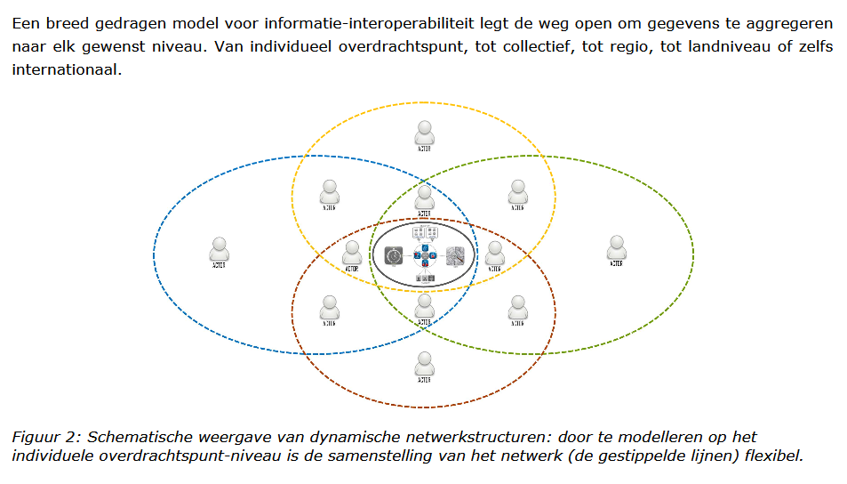

## Bijlagen

### Bijlage 1

**Open BIM-standaarden**

**Indeling naar typen standaarden: Uitwisseling / Semantiek / Proces**

**Indeling naar fasen in het (digitale) bouwproces**

**Toepasbaarheid in sectoren**

Sectoren: Burgerlijke en Utiliteitsbouw / Grond, Weg en Waterbouw, Geo-domein)

**Soorten afspraken over informatie**

### Bijlage 2

**Afsprakenstelsel**

**Samenwerkingsverbanden**

**Kern: gegevens en toepassingen scheiden**

**Bouwstenen**

**Afsprakenstelsel in energiesector**

Toepassing: concept voor afsprakenstelsel voor marktfacilitering (klantgegevens,
meetdata, facturering); opgesteld door Netbeheer NL, Energie NL en Min EZK.

Twee sheets uit presentatie 13 dec 2019 (‘Presentatie toekomstige inrichting van
uitwisseling en governance energiedata 191213.pdf’)

Sheet 4:

Sheet 27:

### Bijlage 3

**ESDL (Energy System Description Language)**

**Illustratie van beschrijving van een energiesysteem met ESDL-componenten:**

**Illustratie van gebruik van ESDL in een concrete toepassing:**

NB: In Bijlage 4 is een tabel opgenomen met het aantal voorkomens van de
verschillende energiecapabilities (production, consumption, etc.) dat
resulteerde uit de behoefte-analyse van 49 brondocumenten.

**Standaarden energiedomein**

### Bijlage 4

**Analyse informatiebehoeften**

Bron: Informatiebehoeften Installaties JanB fits.docx (Jan Bruinenberg)

“Kan je tbv het installatie register aangeven welke installaties daarin horen en
vervolgens ook aangeven welke attributen voor dat installatieregister relevant
zijn?”. Dat was in essentie de vraag die ik meekreeg uit gesprekken met jullie
(Lydia/Bas) tijdens en na de startbijeenkomst van VIVET.

Om de vraag te beantwoorden heb ik alle vragen die gerelateerd waren aan
installaties gefilterd uit de 2964 geïdentificeerde informatiebehoeften.
Onderstaande cijfers voor installaties kwamen tot stand uit een analyse uit 49
energietransitie gerelateerde brondocumenten. Deze analyse –gedaan met 15
verschillende analisten- heeft uiteindelijk geresulteerd in 2964
geïdentificeerde informatiebehoeften.

De vastgestelde informatievragen zijn toe te wijzen aan de in ESDL gedefinieerde
energie-capabilities:

### Bijlage 5

**Specificatie installaties door EG-ETRM**

Door enkele deelnemers aan de **ExpertGroep EnergieTransitieRekenModellen** is
een inventarisatie gemaakt van componenten van energiesystemen en eigenschappen.

De volledige opsomming is te vinden in ModelParametersEnergieTransitie.xlsx. In
deze bijlage is daar een extract uit weergegeven.

Het betreft:

-   een uitputtende lijst van parameters, die te gebruiken zijn als parameters
    bij de verschillende typen installaties en netten;

-   een overzicht van typen installaties & netten per doel (bijv.
    ProductieDuurzame Energie, EnergieOpslag, CO2-Opslag, CO2-Reductie,
    AanpassingNetten), en een lijst van Installaties voor energieconversie;

-   een opsomming van te gebruiken parameters van gebouwen (inclusief kassen &
    schuren), onderscheiden in drie categorieën: algemeen, schil en
    energiegebruik.

Voor elk van de parameters en installaties/netten is in genoemde spreadsheet
aangegeven op welk ruimtelijk schaalniveau (van pand tot provincie) welke
informatie gewenst is.

Het betreft de volgende schaalniveaus en de op dat schaalniveau beoogde doelen:

| Schaal        | Type                          | Doel                                                                           |
|---------------|-------------------------------|--------------------------------------------------------------------------------|
| 1 – Pand      | Woningeigenaren / gebruikers  | Verduurzaming gebouw / kas / schuur                                            |
| 2 – Buurt     | Gemeente per Buurt            | Verwarmen woonwijk en bijbehorende netinfra                                    |
| 3 – RES-regio | Regionale Energie-Strategieën | Locaties Productie duurzame energie Verduurzaming verwarming gebouwde omgeving |
| 4 – Provincie | Systeemplannen Provincies     | Net-infra tbv leveringszekerheid, congestiemgmt, verduurzaming energievragers  |

Ter illustratie zijn hieronder de geïnventariseerde typen installatie en
parameters in tabelvorm weergegeven.

**Parameters behorende bij elk type installatie of net-infra**

Hieronder volgt een uitputtende lijst van parameters, die te gebruiken zijn als
parameters bij de verschillende typen installaties en netten. Uiteraard hangt
het af van het type installatie en het type net welke parameters van toepassing
zijn.

| Parameter                          | Voorbeelden/Toelichting                                                                         |
|------------------------------------|-------------------------------------------------------------------------------------------------|
| Type installatie                   | zie blad typeInstallaties&netten                                                                |
| VestNr                             | Vestigingsnummer                                                                                |
| KvKnr                              |                                                                                                 |
| Sector                             | SBI code; woningen, utiliteitsbouw, glastuinbouw, veeteelt, landbouw, industrie, energie, afval |
| Naam                               |                                                                                                 |
| Plaats                             |                                                                                                 |
| Status                             | potentie, plan, besluit (investeringsbesluit of bestuurlijk besluit), in gebruik, buitengebruik |
| Lat                                | latitude                                                                                        |
| Lng                                | longitude                                                                                       |
| Wkt                                | de hele geometry in wkt-, gml-, shape-, ...formaat                                              |
| InstallatieJaar                    |                                                                                                 |
| Doeltype                           | \>woning/ubouw/kas/schuur                                                                       |
| M2 doel oppervlak                  | voor verwarmingsinstallatie of verlichtingsinstallatie of productie of opslag installatie       |
| DiepteHoogteLengte_m               | diepte voor ondergrondse, hoogte voor wind, lengte voor net-infrastructuur                      |
| Debiet (m3/h)                      | aardwarmte, bodemenergie en netten                                                              |
| Druk_Pa                            |                                                                                                 |
| Spanning_V                         |                                                                                                 |
| Temperatuur_C                      |                                                                                                 |
| Vermogen_MW                        |                                                                                                 |
| VollastUren                        |                                                                                                 |
| Capaciteit_MWh/eenheid             | max opslag, conversie, productie of vraag                                                       |
| Eenheid                            |                                                                                                 |
| Aantal aansluitingen               | netten                                                                                          |
| Gelijktijdigheidsfactor            | netten                                                                                          |
| efficientie/SPF/COP/isolatiewaarde | netten, aardwarmte, wko..                                                                       |
| Aantal onderstations               | netten                                                                                          |
| CO2_ktpj_vermeden                  | CO2 opslag/reductie door efficiëntie / reductie door verduurzaming etc.                         |
| Uur_profiel                        |                                                                                                 |
| Dag profiel                        | productie, levering, opslag of gebruiks- profiel                                                |
| Jaar profiel                       | productie, levering, opslag of gebruiks- profiel                                                |
| Investering_mlnEU                  | CAPEX                                                                                           |
| Jaarlijkse kosten                  | OPEX                                                                                            |
| Doel                               | zie blad typeInstallaties&netten                                                                |
| In_1                               | energiedrager                                                                                   |
| In_2                               | energiedrager                                                                                   |
| Uit_1                              | energiedrager                                                                                   |
| Uit_2                              | energiedrager                                                                                   |
| Energie_In_1                       | Wh/jaar                                                                                         |
| Energie_In_2                       | Wh/jaar                                                                                         |
| Energie_Uit_1                      | Wh/jaar                                                                                         |
| Energie_Uit_2                      | Wh/jaar                                                                                         |

**Type installaties en netten van het duurzame-energiesysteem**

Hieronder is weergegeven welk type installatie en net van toepassing is bij
bepaalde energiedoelen. De lijst wordt aangevuld met een lijst van type
installaties voor energieconversie.

| **Doel**                 | **Typen installaties en netten** |
|--------------------------|----------------------------------|
| ProductieDuurzameEnergie | bioProductie                     |
| ProductieDuurzameEnergie | bioVergasser                     |
| ProductieDuurzameEnergie | bioVergister                     |
| ProductieDuurzameEnergie | bioWarmte                        |
| ProductieDuurzameEnergie | bio-WKK                          |
| ProductieDuurzameEnergie | waterKracht                      |
| ProductieDuurzameEnergie | windStroom                       |
| ProductieDuurzameEnergie | zonneStroom                      |
| ProductieDuurzameEnergie | zonneWarmte                      |
| ProductieDuurzameEnergie | aerothermie                      |
| ProductieDuurzameEnergie | hydrothermie                     |
| ProductieDuurzameEnergie | aquathermie                      |
| ProductieDuurzameEnergie | riothermie                       |
| ProductieDuurzameEnergie | bodemenergie                     |
| ProductieDuurzameEnergie | MDG-aardWarmte                   |
| ProductieDuurzameEnergie | ODG-aardWarmte                   |
| ProductieDuurzameEnergie | UDG-aardWarmte                   |
| EnergieOpslag            | batterij-opslag                  |
| EnergieOpslag            | buffer-vat                       |
| EnergieOpslag            | HTW-opslag                       |
| EnergieOpslag            | MTW-opslag                       |
| EnergieOpslag            | PCM-opslag                       |
| EnergieOpslag            | power2H2-opslag                  |
| EnergieOpslag            | power2NH3-opslag                 |
| EnergieOpslag            | vliegwiel-opslag                 |
| EnergieOpslag            | WKO-opslag                       |
| Opslag                   | CO2-opslag                       |
| AanpassingNetten         | CO2-net                          |
| AanpassingNetten         | E-net                            |
| AanpassingNetten         | GroenGas-net                     |
| AanpassingNetten         | Gas-net                          |
| AanpassingNetten         | H2-net                           |
| AanpassingNetten         | LTW-net                          |
| AanpassingNetten         | HTW-net                          |
| AanpassingNetten         | stoom-net                        |
| ReductieCO2eqEndOfPipe   | CO2-afvang                       |
| Installatie              | Turbine                          |
| Installatie              | WKK                              |
| Installatie              | Fornuis                          |
| Installatie              | Ketel                            |
| Installatie              | HR-Ketel                         |
| Installatie              | Condensatie-Ketel                |
| Installatie              | ORC                              |
| Installatie              | WP                               |
| Installatie              | bodemwarmtepomp                  |
| Installatie              | luchtwarmtepomp                  |
| Installatie              | hybride warmtepomp               |
| Installatie              | HT-WP                            |
| Installatie              | WW                               |
| Installatie              | Station                          |
| Installatie              | Pelletkachel                     |
| Installatie              | Waterstof-ketel                  |

**Parameters Gebouwen / Kassen / Schuren**

Hieronder volgt een opsomming van de door rekenmodellen te gebruiken parameters
van gebouwen (inclusief kassen & schuren), onderscheiden in drie categorieën:
algemeen, de schil van het gebouw en het energiegebruik in het gebouw. In
genoemd spreadsheet is per parameter nog onderscheiden of deze van toepassing is
voor een vbo (verblijfsobject, bijv. appartement) of voor een pand (flatgebouw).

| Algemeen                  | Schil                | Gebruik                                      |
|---------------------------|----------------------|----------------------------------------------|
| Postcode 6                | Glasoppervlak        | Binnentemperatuur                            |
| BAG ID                    | Isolatiewaarde vloer | η Warmterugwinning                           |
| Huisnr                    | Isolatiewaarde gevel | Infiltratievoud (1)                          |
| Straat                    | Isolatiewaarde dak   | Aantal bewoners                              |
| Buurt                     | U-waarde glas        | Elektriciteitsgebruik                        |
| Gemeente                  | Schillabel           | Gebruik van energie voor verwarming          |
| Grond Oppervlakte         |                      | Gebruik van energie voor koeling             |
| Gebruiks Oppervlakte      |                      | Gasgebruik                                   |
| Omtrek                    |                      | Productie duurzame elektriciteit             |
| Hoogte                    |                      | Productie duurzame warmte                    |
| Gebouw functie            |                      | Warm water gebruik                           |
| Bouwjaar                  |                      | Huidig type kookinstallatie                  |
| Verdiepingen              |                      | Huidig type verwarmingsinstallatie           |
| Hoogte per verdieping (m) |                      | Vermogen verwarmingsinstallatie              |
| Hoek gebouw tov Zuiden    |                      | Huidige type koelinstallatie                 |
| Helling dak               |                      | Huidige boilervat (liter)                    |
| EnergieLabel              |                      | Productie Vermogen zonnestroom panelen       |
|                           |                      | Productie Vermogen zonnewarmte               |
|                           |                      | Aantal elektrische auto's                    |
|                           |                      | Aansluiting op het warmtenet (≥ 70°C)        |
|                           |                      | Aansluiting op het warmtenet (circa 50°C)    |
|                           |                      | Aansluiting op het warmtenet (circa 30°C)    |
|                           |                      | Aansluiting op het warmtenet (circa 15°C)    |
|                           |                      | Warmtebron voeding warmtenet per aansluiting |

### Bijlage 6

**Informatiemodel EBIF**

Bron: [Documentatie Project CERISE-SG](https://www.geonovum.nl/themas/energie)
op site van Geonovum.

Een EBIF (Energy Balancing Information Facility) is een informatievoorziening
ter ondersteuning van het beheer van lokale opwek van en vraag naar energie in
een Smart Grid, op een dusdanige manier dat er een lokale balans blijft
behouden. Het Informatiemodel Smart Grid-ebif (IMSG-ebif) voorziet in het
semantisch begrippenkader, een informatiemodel en implementatierichtlijnen
daarvoor. Op basis van het IMSG-ebif kan gestandaardiseerd elektronisch
berichtenverkeer voor een EBIF worden gedefinieerd.

### Bijlage 7

**Installatie- en keuringenregister**

### Bijlage 8

**Betrokkenen bij deze voorstudie**

| Naam                 | Organisatie        |
|----------------------|--------------------|
| Gineke van Putten    | Geonovum           |
| Jan van Gelder       | Geonovum           |
| Leen van Doorn       | Geonovum           |
| Paul Padding         | Geonovum           |
| Paul Janssen         | Geonovum           |
| Jeroen Baltussen     | RVO                |
| Lydia Dijkshoorn     | RVO                |
| Bas Zeegers          | RVO                |
| Gert Nijsink         | RWS                |
| Hanneke de Jong      | EDSN               |
| Jan de Jong          | EDSN               |
| Yun Wu               | EDSN               |
| Jan Bruinenberg      | Alliander          |
| Jeroen Damhuiser     | Stedin             |
| Koen Smekens         | TNO                |
| Richard Westerga     | TNO                |
| Margreet van Zanten  | RIVM               |
| Matthieu Zuidema     | Kadaster           |
| Otto Swertz          | CBS                |
| Remco van der Linden | Techniek Nederland |
| Thomas Piessens      | Techniek Nederland |
| Peter Zwakhals       | Techniek Nederland |
| Ruud van de Wijgaart | PBL                |

### Bijlage 9

**Context Verkenning (uitgebreid)**

De opdracht aan Geonovum om een Verkenning Informatiemodel energie-installaties
uit te voeren valt onder het VIVET-programma onderdeel E.2. Voorstudie centraal
installatieregister.

**VIVET**

Met de energietransitie en de klimaatafspraken van Parijs staat Nederland voor
een grote opgave. In Nederland werken veel partijen samen om klimaat- en
energieafspraken na te komen. Voor de onderbouwing en uitvoering van alle
initiatieven, visies, plannen en strategieën is veel en betrouwbare informatie
nodig over de huidige en verwachte ontwikkeling van het energiesysteem.

Met betere data kunnen actoren informatie sneller en tegen lagere (zoek)-kosten
vergaren en zijn ze sneller en beter in staat om goed onderbouwde besluiten te
nemen over hun bijdrage aan de energietransitie. Om die reden is het van
nationaal belang om de informatievoorziening te optimaliseren. Dat is de reden
geweest voor de ministeries van Binnenlandse Zaken en Koninkrijkrelaties (BZK)
en Economische Zaken en Klimaat (EZK) om in augustus 2018 het project
‘Verbetering van de Informatievoorziening voor de Energietransitie’ (hierna:
VIVET) te starten.

De opdrachtgevers hebben het VIVET-programmateam verzocht om zich in 2019 te
richten op het inrichten van het samenwerkingsverband en op vijf projecten:

A. Gebiedsgerichte ontsluiting energie-infrastructuur

B. Overzicht bekende warmtebronnen

C. Energieverbruik, warmtevoorziening en zonnestroom

D. Afstemming en voeding viewers

E. Verkenning centraal register energie-installaties, verdeeld in twee onderdelen:

E1. Eerste verkenning van de mogelijkheden om hernieuwbare energie installatieregisters samen te voegen;

E2. Voorstudie centraal installatieregister onderzoeken.

Dit rapport bevat het onderzoeksverslag van de voorstudie als bedoeld in E2.

**Voorstudie centraal installatieregister onderzoeken (E2)**

*Probleemstelling:* Voor lokale overheden en netbeheerders is er onvoldoende
zicht op installaties voor opwek, conversie en opslag van energie (warmte en
elektriciteit) op lokaal niveau. Dit was een aantal jaar geleden nog niet zo’n
groot probleem, maar in de veranderende energiehuishouding neemt lokale opwek
een steeds belangrijkere plek in. Zo is er sinds 2015 een sterke groei van
zonnestroom en warmtepompen in woningen. Het huidige gebrek aan data hierover
zorgt ervoor dat er te weinig bekend is over de lokale/regionale
energieproductie – en dus ook de bijhorende energieconsumptie. Dit vertroebelt
het totaalbeeld van de Nederlandse energiehuishouding en de statistieken op
regionaal niveau.

Dit is een probleem omdat goede besluitvorming in de RES en TVW, de
systeemintegratie, systeemstudies en energie hoofdinfrastructuur nu niet
mogelijk is. Die besluitvorming heeft namelijk betrekking op het vinden van een
juiste balans tussen het beperken van energieconsumptie enerzijds en
verduurzamen van energieproductie anderzijds. Ook voor het beheren, managen van
congestie en het plannen van energienetwerken is het van belang te weten welke
installaties aangesloten zijn. Dit maakt bijvoorbeeld duidelijk wat de huidige
en toekomstige belasting van het energiesysteem is tijdens seizoenfluctuaties,
piek- en dal-fluctuaties. Dit helpt (des)investeringsplannen onderbouwen en
leidt tot een efficiënt beheer van energienetwerken, waar iedereen van
profiteert.

*Doel:* Het gaat om de verkenning van de haalbaarheid van een centraal register
met alle energie-installaties; dus zowel alle energiebronnen -fossiel, kern,
hernieuwbaar, mix - als alle typen installaties; productie, conversie als
opslag). Het doel van het register is vierledig: 1. Om een goede lokale en
regionale afweging te kunnen maken voor een investering in de energietransitie,
(zoals infrastructuur, isolatie, opslag) is het noodzakelijk een accuraat
plaatje te hebben van de lokale energie vraag, de energieproductie en energie
conversie mogelijkheden en opslag van alle energiedragers. Zo kunnen
verschillende scenario’s goed doorgerekend worden. Bijvoorbeeld voor de
warmteplannen gemeentes, RES, omgevingsvisies. Hier spelen vragen als: hoeveel
en welke woningen in de wijk hebben reeds een warmtepomp, bio-ketel, en/of
warmtenetaansluiting en kunnen dus van het gas af? Op dit moment kunnen we deze
vraag nog niet beantwoorden op basis van de beschikbare informatieproducten. 2.
Rekening houdend met het feit dat in 2030, (i) 70% van onze jaarlijkse
elektriciteitsvraag uit duurzame elektriciteit zal bestaan en (ii) dat deze
elektriciteitsvraag door toename van warmtepompen, elektrisch verwarmen,
elektrisch vervoer en elektrificatie van de industrie zal toenemen en (iii)
zowel de afname als de productie ervan een grillig patroon zullen hebben is het
noodzakelijk goed te weten hoe we deze fluctuatie op kunnen vangen met de
bestaande installaties; flexibilisering van het net Hier spelen vragen als:
Welke conversie installaties (hybride boilers, wijk ecovaten, elektrolysers,
industriële processen) kunnen snel en economisch efficiënt schakelen? Waar, hoe
snel, hoeveel kunnen we opslaan en in welke vorm (gas, elektra, warmte)? Welke
vragers kunnen tijdelijk snel af of omschakelen (tuinbouw, industrie,
koelhuizen)? 3. Middels bovenstaande kan beleid beter inzicht krijgen in de
consequenties van bestaande en nieuwe marktmechanismen op het energiesysteem.
Nieuwe marktpartijen kunnen sneller en slimmer inspelen op regionale
energetische knelpunten. En de netbeheerder kan betere inschattingen maken voor
hun investeringen in verzwaring en nieuwe netten. Zo zou het register goed
gebruikt kunnen worden voor de systeemstudies die de provincies en netbeheerder
uitvoeren. 4. Om nu en in de toekomst een accuraat plaatje van de
energiestatistieken op laag regionaal niveau te kunnen maken, is het nodig dat
er een overzicht komt van wat er op lokaal niveau aan energie gewonnen en
gebruikt wordt. Op dit moment vindt er wat betreft hernieuwbare energie nog veel
bijschatting plaats op nationaal niveau. De nationale overheid kan zo probleem
regio’s accurater volgen en gerichter ondersteunen. Om nu en in de toekomst
aldus een accuraat plaatje van de energiehuishouding te kunnen maken, is het
nodig dat er een overzicht komt van wat er op lokaal niveau aan energie
gewonnen, gebruikt en opgeslagen wordt. Hiervoor dient informatie over alle
energie-installaties in een regio (RES-niveau) bij elkaar gezet te worden en die
informatie moet, al dan niet via een intermediair, worden ontsloten voor de
belanghebbenden. Belanghebbenden zijn partijen die werken aan RES en TVW,
netwerkbeheerders, energieleveranciers en onderzoek/adviesbureaus.

*Aanpak langs twee sporen:* Om het beoogde doel te bereiken dient zich een
aanpak aan langs twee sporen:  
E1. Eerste verkenning van de mogelijkheden om hernieuwbare energie
installatieregisters samen te voegen;  
E2. Voorstudie centraal installatieregister onderzoeken.

**Voorstudie centraal installatieregister**

Het ontbreekt de partijen die bijdragen aan de energietransitie aan informatie
over installaties die energie kunnen opwekken of converteren of opslaan. De
informatie over de installaties is niet te raadplegen doordat deze niet
beschikbaar is, niet vindbaar is, niet ontsloten wordt, niet koppelbaar is of
een combinatie van deze factoren. Hierdoor ontbreekt de informatie benodigd voor
een optimale besluitvorming voor de RES en TVW, de systeemintegratie, de
systeemstudies en de hoofdinfrastructuur energie.

Uit de verkenning moet blijken op welke manier de reeds bestaande informatie
over energie-installaties naar besluitvormers in de energietransitie ontsloten
kan worden. Tevens zal de verkenning een PoC starten om ervaring op te doen.
Hiermee creëert het project mogelijkheden om informatie die nu niet vindbaar,
niet ontsloten of niet koppelbaar is beschikbaar te krijgen en geeft het advies
over de wijze waarop informatie die niet beschikbaar is alsnog beschikbaar kan
worden gemaakt.

Het project bestaat uit twee delen. Het inzichtelijke maken van het
‘informatiemodel’ en ‘ICT-infrastructuur’ en het uitvoeren van een PoC aan de
hand van een aantal usecases. De uitkomsten hiervan worden vastgelegd in een
Advies.

Randvoorwaarden Proof of Concept:  
A) **Inzicht ‘informatiemodel’** (Dit project): Voor het op een juiste wijze
beschikbaar en deelbaar kunnen maken van de data is het van belang een beeld te
vormen over het format en de standaardisatie van de informatie met de focus op
installaties. Welke verplichtingen en (internationale) formats zijn er en wat is
er al door partijen ontwikkeld.  
B) Inzicht ‘ICT-architectuur’: Er is geen architectuur voor het op een juiste
wijze verzamelen, koppelen en beschikbaar maken van de benodigde informatie. Om
een PoC te kunnen uitvoeren moet er zicht zijn op de wijze waarop de data kan
worden georganiseerd. Hierbij speler principes als ‘enkelvoudige opslag,
meervoudige gebruik’ of inspiratiebronnen als ‘common grounds’ van VNG en PDOK
Next een rol. Tevens ontstaat hier een inzicht in de meest kansrijke
dataomgevingen om nog niet ontsloten data in te ontsluiten.  
C) Proof of Concept: - Usecases: Voor het uitvoeren van de PoC is het nuttig
voor VIVET en de partijen in de Energietransitie om te werken met een beperkt
aantal cases die ieder een unieke component behelzen (bijvoorbeeld, wel
beschikbaar/niet ontsloten, ontsloten/niet koppelbaar). De usecases worden
binnen VIVET aangeleverd. - Inzicht belemmeringen: Naast belemmeringen van
technische aard zijn, kunnen er ook juridische, institutionele of financiële
belemmeringen zijn voor het niet beschikbaar of niet ontsluitbaar zijn van data.
De bevindingen uit de usecases zijn weer van belang voor andere VIVET-projecten
die deze belemmeringen pogen weg te nemen.

<figure id="stroomschema-installatieregister">
    
    <figcaption>Samenhang projectonderdelen voorstudie centraal installatieregister.</figcaption>
</figure>

