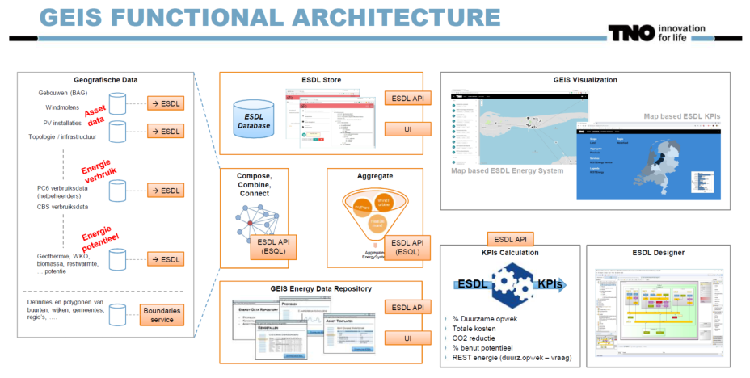
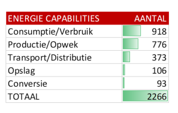

## Bijlagen

### Bijlage 1

**Open BIM-standaarden**

**Indeling naar typen standaarden: Uitwisseling / Semantiek / Proces**

**Indeling naar fasen in het (digitale) bouwproces**

**Toepasbaarheid in sectoren**

Sectoren: Burgerlijke en Utiliteitsbouw / Grond, Weg en Waterbouw, Geo-domein)

**Soorten afspraken over informatie**

### Bijlage 2

**Afsprakenstelsel**

**Samenwerkingsverbanden**

**Kern: gegevens en toepassingen scheiden**

**Bouwstenen**

**Afsprakenstelsel in energiesector**

Toepassing: concept voor afsprakenstelsel voor marktfacilitering (klantgegevens,
meetdata, facturering); opgesteld door Netbeheer NL, Energie NL en Min EZK.

Twee sheets uit presentatie 13 dec 2019 (‘Presentatie toekomstige inrichting van
uitwisseling en governance energiedata 191213.pdf’)

Sheet 4:

Sheet 27:

### Bijlage 3

**ESDL (Energy System Description Language)**

**Illustratie van beschrijving van een energiesysteem met ESDL-componenten:**

**Illustratie van gebruik van ESDL in een concrete toepassing:**

NB: In Bijlage 4 is een tabel opgenomen met het aantal voorkomens van de
verschillende energiecapabilities (production, consumption, etc.) dat
resulteerde uit de behoefte-analyse van 49 brondocumenten.

**Standaarden energiedomein**

### Bijlage 4

**Analyse informatiebehoeften**

Bron: Informatiebehoeften Installaties JanB fits.docx (Jan Bruinenberg)

“Kan je tbv het installatie register aangeven welke installaties daarin horen en
vervolgens ook aangeven welke attributen voor dat installatieregister relevant
zijn?”. Dat was in essentie de vraag die ik meekreeg uit gesprekken met jullie
(Lydia/Bas) tijdens en na de startbijeenkomst van VIVET.

Om de vraag te beantwoorden heb ik alle vragen die gerelateerd waren aan
installaties gefilterd uit de 2964 geïdentificeerde informatiebehoeften.
Onderstaande cijfers voor installaties kwamen tot stand uit een analyse uit 49
energietransitie gerelateerde brondocumenten. Deze analyse –gedaan met 15
verschillende analisten- heeft uiteindelijk geresulteerd in 2964
geïdentificeerde informatiebehoeften.

De vastgestelde informatievragen zijn toe te wijzen aan de in ESDL gedefinieerde
energie-capabilities:

### Bijlage 5

**Specificatie installaties door EG-ETRM**

Door enkele deelnemers aan de **ExpertGroep EnergieTransitieRekenModellen** is
een inventarisatie gemaakt van componenten van energiesystemen en eigenschappen.

De volledige opsomming is te vinden in ModelParametersEnergieTransitie.xlsx. In
deze bijlage is daar een extract uit weergegeven.

Het betreft:

-   een uitputtende lijst van parameters, die te gebruiken zijn als parameters
    bij de verschillende typen installaties en netten;

-   een overzicht van typen installaties & netten per doel (bijv.
    ProductieDuurzame Energie, EnergieOpslag, CO2-Opslag, CO2-Reductie,
    AanpassingNetten), en een lijst van Installaties voor energieconversie;

-   een opsomming van te gebruiken parameters van gebouwen (inclusief kassen &
    schuren), onderscheiden in drie categorieën: algemeen, schil en
    energiegebruik.

Voor elk van de parameters en installaties/netten is in genoemde spreadsheet
aangegeven op welk ruimtelijk schaalniveau (van pand tot provincie) welke
informatie gewenst is.

Het betreft de volgende schaalniveaus en de op dat schaalniveau beoogde doelen:

| Schaal        | Type                          | Doel                                                                           |
|---------------|-------------------------------|--------------------------------------------------------------------------------|
| 1 – Pand      | Woningeigenaren / gebruikers  | Verduurzaming gebouw / kas / schuur                                            |
| 2 – Buurt     | Gemeente per Buurt            | Verwarmen woonwijk en bijbehorende netinfra                                    |
| 3 – RES-regio | Regionale Energie-Strategieën | Locaties Productie duurzame energie Verduurzaming verwarming gebouwde omgeving |
| 4 – Provincie | Systeemplannen Provincies     | Net-infra tbv leveringszekerheid, congestiemgmt, verduurzaming energievragers  |

Ter illustratie zijn hieronder de geïnventariseerde typen installatie en
parameters in tabelvorm weergegeven.

**Parameters behorende bij elk type installatie of net-infra**

Hieronder volgt een uitputtende lijst van parameters, die te gebruiken zijn als
parameters bij de verschillende typen installaties en netten. Uiteraard hangt
het af van het type installatie en het type net welke parameters van toepassing
zijn.

| Parameter                          | Voorbeelden/Toelichting                                                                         |
|------------------------------------|-------------------------------------------------------------------------------------------------|
| Type installatie                   | zie blad typeInstallaties&netten                                                                |
| VestNr                             | Vestigingsnummer                                                                                |
| KvKnr                              |                                                                                                 |
| Sector                             | SBI code; woningen, utiliteitsbouw, glastuinbouw, veeteelt, landbouw, industrie, energie, afval |
| Naam                               |                                                                                                 |
| Plaats                             |                                                                                                 |
| Status                             | potentie, plan, besluit (investeringsbesluit of bestuurlijk besluit), in gebruik, buitengebruik |
| Lat                                | latitude                                                                                        |
| Lng                                | longitude                                                                                       |
| Wkt                                | de hele geometry in wkt-, gml-, shape-, ...formaat                                              |
| InstallatieJaar                    |                                                                                                 |
| Doeltype                           | \>woning/ubouw/kas/schuur                                                                       |
| M2 doel oppervlak                  | voor verwarmingsinstallatie of verlichtingsinstallatie of productie of opslag installatie       |
| DiepteHoogteLengte_m               | diepte voor ondergrondse, hoogte voor wind, lengte voor net-infrastructuur                      |
| Debiet (m3/h)                      | aardwarmte, bodemenergie en netten                                                              |
| Druk_Pa                            |                                                                                                 |
| Spanning_V                         |                                                                                                 |
| Temperatuur_C                      |                                                                                                 |
| Vermogen_MW                        |                                                                                                 |
| VollastUren                        |                                                                                                 |
| Capaciteit_MWh/eenheid             | max opslag, conversie, productie of vraag                                                       |
| Eenheid                            |                                                                                                 |
| Aantal aansluitingen               | netten                                                                                          |
| Gelijktijdigheidsfactor            | netten                                                                                          |
| efficientie/SPF/COP/isolatiewaarde | netten, aardwarmte, wko..                                                                       |
| Aantal onderstations               | netten                                                                                          |
| CO2_ktpj_vermeden                  | CO2 opslag/reductie door efficiëntie / reductie door verduurzaming etc.                         |
| Uur_profiel                        |                                                                                                 |
| Dag profiel                        | productie, levering, opslag of gebruiks- profiel                                                |
| Jaar profiel                       | productie, levering, opslag of gebruiks- profiel                                                |
| Investering_mlnEU                  | CAPEX                                                                                           |
| Jaarlijkse kosten                  | OPEX                                                                                            |
| Doel                               | zie blad typeInstallaties&netten                                                                |
| In_1                               | energiedrager                                                                                   |
| In_2                               | energiedrager                                                                                   |
| Uit_1                              | energiedrager                                                                                   |
| Uit_2                              | energiedrager                                                                                   |
| Energie_In_1                       | Wh/jaar                                                                                         |
| Energie_In_2                       | Wh/jaar                                                                                         |
| Energie_Uit_1                      | Wh/jaar                                                                                         |
| Energie_Uit_2                      | Wh/jaar                                                                                         |

**Type installaties en netten van het duurzame-energiesysteem**

Hieronder is weergegeven welk type installatie en net van toepassing is bij
bepaalde energiedoelen. De lijst wordt aangevuld met een lijst van type
installaties voor energieconversie.

| **Doel**                 | **Typen installaties en netten** |
|--------------------------|----------------------------------|
| ProductieDuurzameEnergie | bioProductie                     |
| ProductieDuurzameEnergie | bioVergasser                     |
| ProductieDuurzameEnergie | bioVergister                     |
| ProductieDuurzameEnergie | bioWarmte                        |
| ProductieDuurzameEnergie | bio-WKK                          |
| ProductieDuurzameEnergie | waterKracht                      |
| ProductieDuurzameEnergie | windStroom                       |
| ProductieDuurzameEnergie | zonneStroom                      |
| ProductieDuurzameEnergie | zonneWarmte                      |
| ProductieDuurzameEnergie | aerothermie                      |
| ProductieDuurzameEnergie | hydrothermie                     |
| ProductieDuurzameEnergie | aquathermie                      |
| ProductieDuurzameEnergie | riothermie                       |
| ProductieDuurzameEnergie | bodemenergie                     |
| ProductieDuurzameEnergie | MDG-aardWarmte                   |
| ProductieDuurzameEnergie | ODG-aardWarmte                   |
| ProductieDuurzameEnergie | UDG-aardWarmte                   |
| EnergieOpslag            | batterij-opslag                  |
| EnergieOpslag            | buffer-vat                       |
| EnergieOpslag            | HTW-opslag                       |
| EnergieOpslag            | MTW-opslag                       |
| EnergieOpslag            | PCM-opslag                       |
| EnergieOpslag            | power2H2-opslag                  |
| EnergieOpslag            | power2NH3-opslag                 |
| EnergieOpslag            | vliegwiel-opslag                 |
| EnergieOpslag            | WKO-opslag                       |
| Opslag                   | CO2-opslag                       |
| AanpassingNetten         | CO2-net                          |
| AanpassingNetten         | E-net                            |
| AanpassingNetten         | GroenGas-net                     |
| AanpassingNetten         | Gas-net                          |
| AanpassingNetten         | H2-net                           |
| AanpassingNetten         | LTW-net                          |
| AanpassingNetten         | HTW-net                          |
| AanpassingNetten         | stoom-net                        |
| ReductieCO2eqEndOfPipe   | CO2-afvang                       |
| Installatie              | Turbine                          |
| Installatie              | WKK                              |
| Installatie              | Fornuis                          |
| Installatie              | Ketel                            |
| Installatie              | HR-Ketel                         |
| Installatie              | Condensatie-Ketel                |
| Installatie              | ORC                              |
| Installatie              | WP                               |
| Installatie              | bodemwarmtepomp                  |
| Installatie              | luchtwarmtepomp                  |
| Installatie              | hybride warmtepomp               |
| Installatie              | HT-WP                            |
| Installatie              | WW                               |
| Installatie              | Station                          |
| Installatie              | Pelletkachel                     |
| Installatie              | Waterstof-ketel                  |

**Parameters Gebouwen / Kassen / Schuren**

Hieronder volgt een opsomming van de door rekenmodellen te gebruiken parameters
van gebouwen (inclusief kassen & schuren), onderscheiden in drie categorieën:
algemeen, de schil van het gebouw en het energiegebruik in het gebouw. In
genoemd spreadsheet is per parameter nog onderscheiden of deze van toepassing is
voor een vbo (verblijfsobject, bijv. appartement) of voor een pand (flatgebouw).

| Algemeen                  | Schil                | Gebruik                                      |
|---------------------------|----------------------|----------------------------------------------|
| Postcode 6                | Glasoppervlak        | Binnentemperatuur                            |
| BAG ID                    | Isolatiewaarde vloer | η Warmterugwinning                           |
| Huisnr                    | Isolatiewaarde gevel | Infiltratievoud (1)                          |
| Straat                    | Isolatiewaarde dak   | Aantal bewoners                              |
| Buurt                     | U-waarde glas        | Elektriciteitsgebruik                        |
| Gemeente                  | Schillabel           | Gebruik van energie voor verwarming          |
| Grond Oppervlakte         |                      | Gebruik van energie voor koeling             |
| Gebruiks Oppervlakte      |                      | Gasgebruik                                   |
| Omtrek                    |                      | Productie duurzame elektriciteit             |
| Hoogte                    |                      | Productie duurzame warmte                    |
| Gebouw functie            |                      | Warm water gebruik                           |
| Bouwjaar                  |                      | Huidig type kookinstallatie                  |
| Verdiepingen              |                      | Huidig type verwarmingsinstallatie           |
| Hoogte per verdieping (m) |                      | Vermogen verwarmingsinstallatie              |
| Hoek gebouw tov Zuiden    |                      | Huidige type koelinstallatie                 |
| Helling dak               |                      | Huidige boilervat (liter)                    |
| EnergieLabel              |                      | Productie Vermogen zonnestroom panelen       |
|                           |                      | Productie Vermogen zonnewarmte               |
|                           |                      | Aantal elektrische auto's                    |
|                           |                      | Aansluiting op het warmtenet (≥ 70°C)        |
|                           |                      | Aansluiting op het warmtenet (circa 50°C)    |
|                           |                      | Aansluiting op het warmtenet (circa 30°C)    |
|                           |                      | Aansluiting op het warmtenet (circa 15°C)    |
|                           |                      | Warmtebron voeding warmtenet per aansluiting |

### Bijlage 6

**Informatiemodel EBIF**

Bron: [Documentatie Project CERISE-SG](https://www.geonovum.nl/themas/energie)
op site van Geonovum.

Een EBIF (Energy Balancing Information Facility) is een informatievoorziening
ter ondersteuning van het beheer van lokale opwek van en vraag naar energie in
een Smart Grid, op een dusdanige manier dat er een lokale balans blijft
behouden. Het Informatiemodel Smart Grid-ebif (IMSG-ebif) voorziet in het
semantisch begrippenkader, een informatiemodel en implementatierichtlijnen
daarvoor. Op basis van het IMSG-ebif kan gestandaardiseerd elektronisch
berichtenverkeer voor een EBIF worden gedefinieerd.

### Bijlage 7

**Installatie- en keuringenregister**

### Bijlage 8

**Betrokkenen bij deze voorstudie**

| Naam                 | Organisatie        |
|----------------------|--------------------|
| Bas Zeegers          | RVO                |
| Gert Nijsink         | RWS                |
| Gineke van Putten    | Geonovum           |
| Hanneke de Jong      | EDSN               |
| Jan Bruinenberg      | Alliander          |
| Jan van Gelder       | Geonovum           |
| Jeroen Baltussen     | Geonovum           |
| Jeroen Damhuiser     | Stedin             |
| Koen Smekens         | TNO                |
| Leen van Doorn       | Geonovum           |
| Lydia Dijkshoorn     | RVO                |
| Margreet van Zanten  | RIVM               |
| Matthieu Zuidema     | Kadaster           |
| Otto Swertz          | CBS                |
| Paul Janssen         | Geonovum           |
| Paul Padding         | Geonovum           |
| Remco van der Linden | Techniek Nederland |
| Richard Westerga     | TNO                |
| Ruud van de Wijgaart | PBL                |
| Thomas Piessens      | Techniek Nederland |
| Yun Wu               | EDSN               |
| Jan de Jong          | EDSN               |
| Peter Zwakhals       | Techniek Nederland |