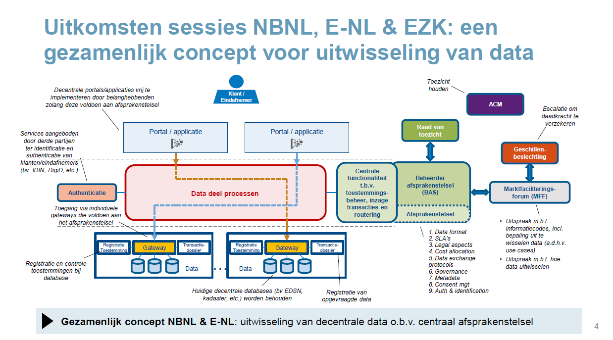
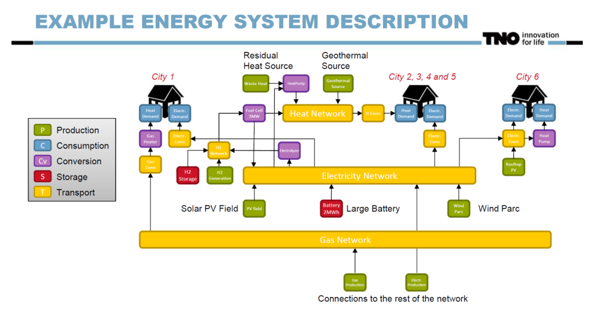
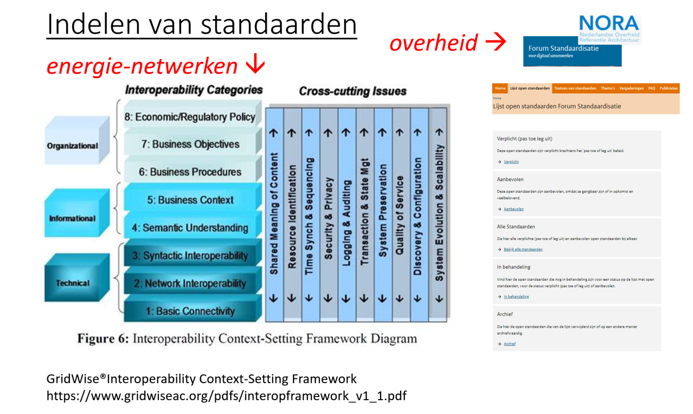
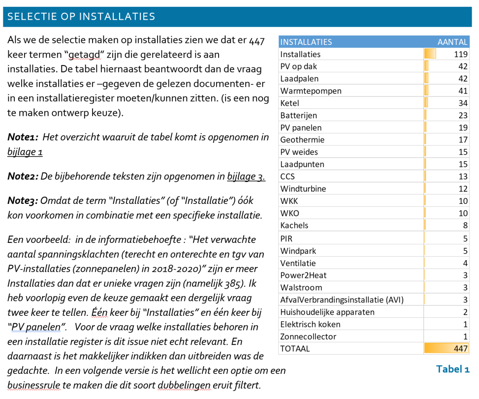
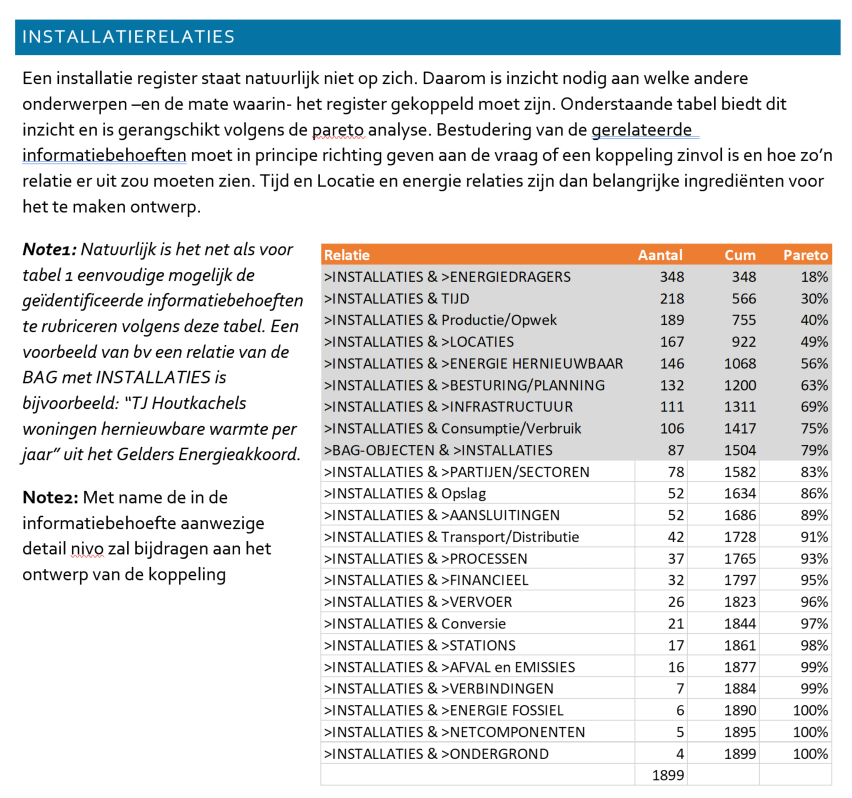
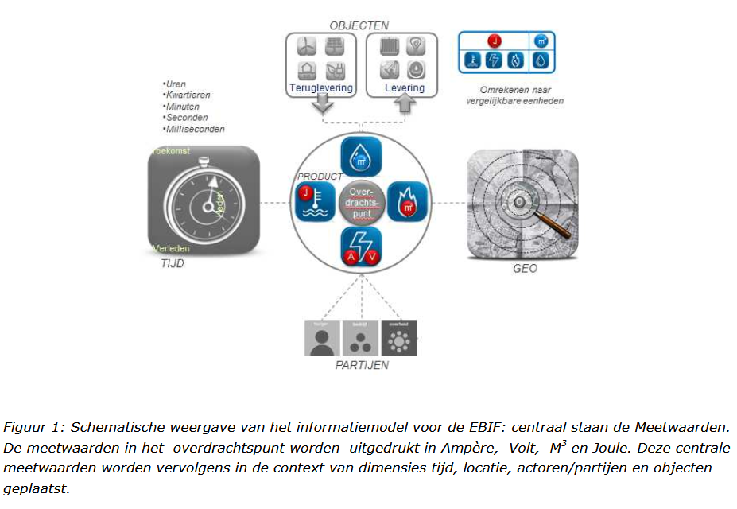
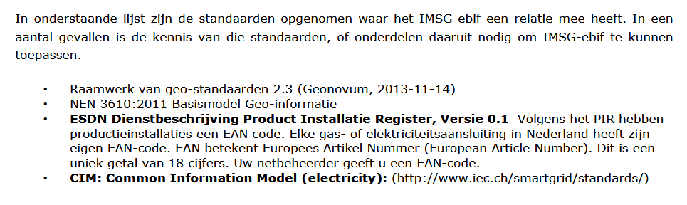

Bijlagen
--------

### Bijlage 1 – Open BIM-standaarden

**Indeling naar typen standaarden: Uitwisseling / Semantiek / Proces**

**Indeling naar fasen in het (digitale) bouwproces**

**Toepasbaarheid in sectoren**

Sectoren: Burgerlijke en Utiliteitsbouw / Grond, Weg en Waterbouw, Geo-domein)

**Soorten afspraken over informatie**

### Bijlage 2 - Afsprakenstelsel

**Samenwerkingsverbanden**

**Kern: gegevens en toepassingen scheiden**

Bouwstenen

**Afsprakenstelsel in energiesector**

Toepassing: concept voor afsprakenstelsel voor marktfacilitering (klantgegevens,
meetdata, facturering); opgesteld door Netbeheer NL, Energie NL en Min EZK.

Twee sheets uit presentatie 13 dec 2019.

Sheet 4:

Sheet 27:

### [./media/image10.png](./media/image10.png)

### Bijlage 3A - ESDL (Energy System Description Language)

**Illustratie van beschrijving van een energiesysteem met ESDL-componenten:**

**Illustratie van gebruik van ESDL in een concrete toepassing:**

NB: In Bijlage 4 is een tabel opgenomen met het aantal voorkomens van de
verschillende energiecapabilities (production, consumption, etc.) dat
resulteerde uit de behoefte-analyse van 49 brondocumenten.

### Bijlage 3B – Standaarden energiedomein

#### –Standaarden energiedomein

### Bijlage 4 – ANALYSE INFORMATIEBEHOEFTEN

Bron: Informatiebehoeften Installaties JanB fits.docx (Jan Bruinenberg)

“Kan je tbv het installatie register aangeven welke installaties daarin horen en
vervolgens ook aangeven welke attributen voor dat installatieregister relevant
zijn?”. Dat was in essentie de vraag die ik meekreeg uit gesprekken met jullie
(Lydia/Bas) tijdens en na de startbijeenkomst van VIVET.

Om de vraag te beantwoorden heb ik alle vragen die gerelateerd waren aan
installaties gefilterd uit de 2964 geïdentificeerde informatiebehoeften.
Onderstaande cijfers voor installaties kwamen tot stand uit een analyse uit 49
energietransitie gerelateerde brondocumenten. Deze analyse –gedaan met 15
verschillende analisten- heeft uiteindelijk geresulteerd in 2964
geïdentificeerde informatiebehoeften.

De vastgestelde informatievragen zijn toe te wijzen aan de in ESDL gedefinieerde
energie-capabilities:

### Bijlage 5 – Specificatie installaties door EG-ETRM

*NB: Formattering van de tabellen in deze bijlage moet nog aangepast!!*

Door enkele deelnemers aan de **ExpertGroep EnergieTransitieRekenModellen** is
een inventarisatie gemaakt van component van energiesystemen. Dit betreft:

-   typen installaties & netten per doel (reductie, conversie, etc.);

-   de bij de typen installaties en netten behorende parameters

-   de parameters van gebouwen & kassen

Bij deze componenten en parameters is aangegeven op welk ruimtelijk schaalniveau
(van pand tot provincie) informatie gewenst is.

Het betreft de volgende schaalniveaus:

\| **Schaal** \| **Schaal 1** \| **Schaal 2** \| **Schaal 3** \| **Schaal 4** \|
\| \| **Pand Modellen** \| **Buurt Modellen** \| **RES-regio Modellen** \|
**Provincie Modellen** \|
\|------------\|---------------------------------\|---------------------------------------------------------\|--------------------------------------------------------------------------------------------------\|------------------------------------------------------------------------------------------------------------------------------------------------------------------------------\|
\| **Type** \| \| Warmteplannen Gemeente per Buurt -(leidraad ECW -Vesta) \| RES
-Regionale Energie Strategieën \| Systeemplannen - Provincies \| \| **Doel** \|
Verduurzaming Gebouw/Kas/Schuur \| Verwarmen woonwijk + bijbehorende net
infrastructuur \| 1. Locaties voor Productie duurzame elektriciteit en \|
Toekomstige net-infrastructuur tbv leveringszekerheid, congestie management en
verduurzaming energievragers (gebouwen, glastuinbouw, landbouw, veeteelt,
industrie, vervoer) \| \| \| \| \| 2. Verduurzaming verwarmen gebouwde omgeving
\| \|

De volledige opsomming is te vinden in ModelParametersEnergieTransitie.xlsx

Ter illustratie zijn hieronder enkele (extracten uit) de tabellen overgenomen.

| **Parameters behorende bij elk type installatie of net-infra.**  |                                  |         |                                              |
|------------------------------------------------------------------|----------------------------------|---------|----------------------------------------------|
| Type                                                             |                                  |         |                                              |
| VestNr                                                           |                                  |         |                                              |
| KvKnr                                                            |                                  |         |                                              |
| Sector                                                           |                                  |         |                                              |
| Naam                                                             |                                  |         |                                              |
| Plaats                                                           |                                  |         |                                              |
| Status                                                           |                                  |         |                                              |
| lat                                                              |                                  |         |                                              |
| lng                                                              |                                  |         |                                              |
| wkt                                                              |                                  |         |                                              |
| InstallatieJaar                                                  |                                  |         |                                              |
| doeltype \>woning/ubouw/kas/schuur                               |                                  |         |                                              |
| m2 doel oppervlak                                                |                                  |         |                                              |
| DiepteHoogteLengte_m                                             |                                  |         |                                              |
| Debiet (m3/h)                                                    |                                  |         |                                              |
| Druk_Pa                                                          |                                  |         |                                              |
| Spanning_V                                                       |                                  |         |                                              |
| Temperatuur_C                                                    |                                  |         |                                              |
| Vermogen_MW                                                      |                                  |         |                                              |
| VollastUren                                                      |                                  |         |                                              |
| Capaciteit_MWh/eenheid                                           |                                  |         |                                              |
| Eenheid                                                          |                                  |         |                                              |
| Aantal aansluitingen                                             |                                  |         |                                              |
| Gelijktijdigheidsfactor                                          |                                  |         |                                              |
| efficientie/SPF/COP/isolatiewaarde                               |                                  |         |                                              |
| Aantal onderstations                                             |                                  |         |                                              |
| CO2_ktpj_vermeden                                                |                                  |         |                                              |
| uur_profiel                                                      |                                  |         |                                              |
| dag profiel                                                      |                                  |         |                                              |
| jaar profiel                                                     |                                  |         |                                              |
| investering_mlnEU                                                |                                  |         |                                              |
| jaarlijkse kosten                                                |                                  |         |                                              |
| Doel                                                             |                                  |         |                                              |
| In_1                                                             |                                  |         |                                              |
| In_2                                                             |                                  |         |                                              |
| Uit_1                                                            |                                  |         |                                              |
| Uit_2                                                            |                                  |         |                                              |
| Energie_In_1                                                     |                                  |         |                                              |
| Energie_In_2                                                     |                                  |         |                                              |
| Energie_Uit_1                                                    |                                  |         |                                              |
| Energie_Uit_2                                                    |                                  |         |                                              |
| **Type installaties en netten van het duurzame energie systeem** |                                  |         |                                              |
| **Doel**                                                         | **Typen installaties en netten** |         |                                              |
| ProductieDuurzameEnergie                                         | bioProductie                     |         |                                              |
| ProductieDuurzameEnergie                                         | bioVergasser                     |         |                                              |
| ProductieDuurzameEnergie                                         | bioVergister                     |         |                                              |
| ProductieDuurzameEnergie                                         | bioWarmte                        |         |                                              |
| ProductieDuurzameEnergie                                         | bio-WKK                          |         |                                              |
| ProductieDuurzameEnergie                                         | waterKracht                      |         |                                              |
| ProductieDuurzameEnergie                                         | windStroom                       |         |                                              |
| ProductieDuurzameEnergie                                         | zonneStroom                      |         |                                              |
| ProductieDuurzameEnergie                                         | zonneWarmte                      |         |                                              |
| ProductieDuurzameEnergie                                         | aerothermie                      |         |                                              |
| ProductieDuurzameEnergie                                         | hydrothermie                     |         |                                              |
| ProductieDuurzameEnergie                                         | aquathermie                      |         |                                              |
| ProductieDuurzameEnergie                                         | riothermie                       |         |                                              |
| ProductieDuurzameEnergie                                         | bodemenergie                     |         |                                              |
| ProductieDuurzameEnergie                                         | MDG-aardWarmte                   |         |                                              |
| ProductieDuurzameEnergie                                         | ODG-aardWarmte                   |         |                                              |
| ProductieDuurzameEnergie                                         | UDG-aardWarmte                   |         |                                              |
| EnergieOpslag                                                    | batterij-opslag                  |         |                                              |
| EnergieOpslag                                                    | buffer-vat                       |         |                                              |
| EnergieOpslag                                                    | HTW-opslag                       |         |                                              |
| EnergieOpslag                                                    | MTW-opslag                       |         |                                              |
| EnergieOpslag                                                    | PCM-opslag                       |         |                                              |
| EnergieOpslag                                                    | power2H2-opslag                  |         |                                              |
| EnergieOpslag                                                    | power2NH3-opslag                 |         |                                              |
| EnergieOpslag                                                    | vliegwiel-opslag                 |         |                                              |
| EnergieOpslag                                                    | WKO-opslag                       |         |                                              |
| Opslag                                                           | CO2-opslag                       |         |                                              |
| AanpassingNetten                                                 | CO2-net                          |         |                                              |
| AanpassingNetten                                                 | E-net                            |         |                                              |
| AanpassingNetten                                                 | GroenGas-net                     |         |                                              |
| AanpassingNetten                                                 | Gas-net                          |         |                                              |
| AanpassingNetten                                                 | H2-net                           |         |                                              |
| AanpassingNetten                                                 | LTW-net                          |         |                                              |
| AanpassingNetten                                                 | HTW-net                          |         |                                              |
| AanpassingNetten                                                 | stoom-net                        |         |                                              |
| ReductieCO2eqEndOfPipe                                           | CO2-afvang                       |         |                                              |
| Installatie                                                      | Turbine                          |         |                                              |
| Installatie                                                      | WKK                              |         |                                              |
| Installatie                                                      | Fornuis                          |         |                                              |
| Installatie                                                      | Ketel                            |         |                                              |
| Installatie                                                      | HR-Ketel                         |         |                                              |
| Installatie                                                      | Condensatie-Ketel                |         |                                              |
| Installatie                                                      | ORC                              |         |                                              |
| Installatie                                                      | WP                               |         |                                              |
| Installatie                                                      | bodemwarmtepomp                  |         |                                              |
| Installatie                                                      | luchtwarmtepomp                  |         |                                              |
| Installatie                                                      | hybride warmtepomp               |         |                                              |
| Installatie                                                      | HT-WP                            |         |                                              |
| Installatie                                                      | WW                               |         |                                              |
| Installatie                                                      | Station                          |         |                                              |
| Installatie                                                      | Pelletkachel                     |         |                                              |
| Installatie                                                      | Waterstof-ketel                  |         |                                              |
| **Parameters Gebouwen en Kassen**                                |                                  |         |                                              |
| Gebouwen/Kas/                                                    | Kenmerken                        |         | Postcode6                                    |
| Schuur                                                           |                                  |         |                                              |
|                                                                  |                                  |         | BAG ID                                       |
|                                                                  |                                  |         | Huisnr                                       |
|                                                                  |                                  |         | Straat                                       |
|                                                                  |                                  |         | Buurt                                        |
|                                                                  |                                  |         | Gemeente                                     |
|                                                                  |                                  |         | Grond Oppervlakte                            |
|                                                                  |                                  |         | Gebruiks Oppervlakte                         |
|                                                                  |                                  |         | Omtrek                                       |
|                                                                  |                                  |         | Hoogte                                       |
|                                                                  |                                  |         | Gebouw functie                               |
|                                                                  |                                  |         | Bouwjaar                                     |
|                                                                  |                                  |         | Verdiepingen                                 |
|                                                                  |                                  |         | Hoogte per verdiep (m)                       |
|                                                                  |                                  |         | Hoek gebouw tov Zuiden                       |
|                                                                  |                                  |         | Helling dak                                  |
|                                                                  |                                  |         | EnergieLabel                                 |
| Gebouwen/Kas/                                                    | Bestaand                         | Schil   | glasoppervlak                                |
| Schuur                                                           |                                  |         |                                              |
|                                                                  |                                  |         | isolatiewaarde vloer                         |
|                                                                  |                                  |         | isolatiewaarde gevel                         |
|                                                                  |                                  |         | isolatiewaarde dak                           |
|                                                                  |                                  |         | U-waarde glas                                |
|                                                                  |                                  |         | schillabel                                   |
| Gebouwen/Kas/                                                    | Bestaand                         | Gebruik | binnentemperatuur                            |
| Schuur                                                           |                                  |         |                                              |
|                                                                  |                                  |         | η warmterugwinning                           |
|                                                                  |                                  |         | infiltratievoud (1)                          |
|                                                                  |                                  |         | aantal bewoners                              |
|                                                                  |                                  |         | electriciteitsgebruik                        |
|                                                                  |                                  |         | gebruik van energie voor verwarming          |
|                                                                  |                                  |         | gebruik van energie voor koeling             |
|                                                                  |                                  |         | gasgebruik                                   |
|                                                                  |                                  |         | productie duurzame elektriciteit             |
|                                                                  |                                  |         | productie duurzame warmte                    |
|                                                                  |                                  |         | warm water gebruik                           |
|                                                                  |                                  |         | huidig type kook installatie                 |
|                                                                  |                                  |         | huidig type verwarmings installatie          |
|                                                                  |                                  |         | vermogen verwarmings installatie             |
|                                                                  |                                  |         | huidige type koel installatie                |
|                                                                  |                                  |         | huidige boiler vat (liter)                   |
|                                                                  |                                  |         | Productie Vermogen zonneStroom panelen       |
|                                                                  |                                  |         | Productie Vermogen zonneWarmte               |
|                                                                  |                                  |         | Aantal elektrische auto's                    |
|                                                                  |                                  |         | Aansluiting op het warmtenet (≥ 70°C)        |
|                                                                  |                                  |         | Aansluiting op het warmtenet (circa 50°C)    |
|                                                                  |                                  |         | Aansluiting op het warmtenet (circa 30°C)    |
|                                                                  |                                  |         | Aansluiting op het warmtenet (circa 15°C)    |
|                                                                  |                                  |         | Warmtebron voeding warmtenet per aansluiting |

### Bijlage 6 – Informatiemodel EBIF

Bron: [Documentatie Project CERISE-SG](https://www.geonovum.nl/themas/energie)
op site van Geonovum.

Een EBIF (Energy Balancing Information Facility) is een informatievoorziening
ter ondersteuning van het beheer van lokale opwek van en vraag naar energie in
een Smart Grid, op een dusdanige manier dat er een lokale balans blijft
behouden. Het Informatiemodel Smart Grid-ebif (IMSG-ebif) voorziet in het
semantisch begrippenkader, een informatiemodel en implementatierichtlijnen
daarvoor. Op basis van het IMSG-ebif kan gestandaardiseerd elektronisch
berichtenverkeer voor een EBIF worden gedefinieerd.

