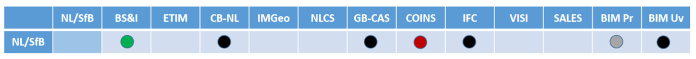

Desk Research
-------------

### VIMET-I – Ordening Speelveld

Een overzicht van de elementen van het Speelveld, een aanzet tot ordening  
versie 13 februari 2020

#### Inleiding

Dit document is een aanzet tot ordening van wat er gebeurt op het gebied van
afsprakenstelsels / standaarden / informatiemodellen / taxonomieën in het
energiedomein en in aanpalende domeinen, daar waar een verbinding bestaat met
installaties in het energiedomein. De afbakening is gebaseerd op ‘common sense’,
getoetst in de kick-off workshop bij Geonovum op 10 februari 2020 en door de
nodige experts te betrekken. Een uitgebreide inventarisatie van Jeroen
Baltussen, RVO, was de start van dit document.

#### Gebruikte documenten

-   Versie 0.3 van het Speelveld installatieregister energie-installaties
    (Jeroen Baltussen)

-   De daarin opgenomen informatiebehoeften van installaties in beleidstukken
    (Jan Bruinenberg)

-   De inventarisatie van typen installaties en parameters voor gebouwen en
    netten (EG-ETRM)

#### Indeling

Om het speelveld inzichtelijk te maken, is een indeling gemaakt van relevante
ontwikkelingen in verschillende categorieën: *Afsprakenstelsels* /*Datasets* /
*Informatiemodellen* / *Taxonomieën* / *Standaarden&normen*. Deze indeling is in
zekere zin arbitrair: het verschil tussen standaarden en taxonomieën is niet
altijd event scherp, maar voor deze beschrijving goed genoeg. Bovenstaande
categorieën betreffen resultaten/producten, waarin de weerslag van
ontwikkelingen is vastgelegd. Daarnaast is er ook een lijst gemaakt van
*Projecten* die hier betrekking op hebben.

In de opsommingen is waar mogelijk ook aangeven op welk *Domein* het betrekking
heeft. Dit is niet altijd eenduidig vast te stellen, maar er ligt bijv. de keuze
onder dat het domein Installatie vooral betrekking heeft op objecten die
verbonden zijn aan de (energie)infrastructuur en dat geldt in veel mindere mate
voor het domein Bouw.

Elke opsomming in dit document wordt vooraf gegaan door een toelichtende tekst.

#### Beperkingen / issues / randvoorwaarden

Tijdens de ontwikkeling van dit document zijn er door diverse betrokkenen de
volgende opmerkingen gemaakt, die het waard zijn om hier te benoemen en t.z.t.
op te pakken. Deze zijn opgenomen in de teksten per categorie; hieronder volgen
enkele generieke opmerkingen, die in willekeurige volgorde zijn opgesomd.

-   *Processen* zijn nu in de inventarisatie niet meegenomen. Door deze wel te
    beschouwen zou (de beschrijving van) het speelveld wijzigen. Bijvoorbeeld
    het aanleggen van aansluitingen gebeurt vaak in multi-utility-verband
    (telecom, water) en heeft betrekking op andere wetgeving (vergunningen,
    omgevingswet).

-   Deze beschrijving/indeling roept de vraag op, of er bij installatieregister
    en informatiemodel ook aandacht moet zijn voor het temporele aspect
    (verleden / heden / toekomst).

-   De term ‘installatieregister’ roept de gedachte op van één grote database
    met alle informatie, maar dit register zal toch eerder bestaan door het
    verbinden van datasets dan door het verzamelen van concrete data.

#### Afsprakenstelsels

De overheid is actief op het gebied van digitalisering ([NL
DIGIbeter](https://www.digitaleoverheid.nl/nldigibeter/), [NL
Digitaal](https://www.rijksoverheid.nl/onderwerpen/digitale-overheid/nieuws/2019/03/21/nederland-digitaal-afspraken-voor-betere-samenwerking-digitalisering))
In de [Nederlandse
Digitaliseringsstrategie](https://www.rijksoverheid.nl/documenten/rapporten/2018/06/01/nederlandse-digitaliseringsstrategie)
worden cross-sectorale afsprakenstelsels verkend.

Een afsprakenstelsel is een geschikte infrastructuur voor het op de juiste
schaal *gestructureerd datadelen*; bouwstenen; sectorale focus en verbinding met
andere domeinen. Datadeel-initiatieven bij voorkeur ontwikkelen per sector, maar
zodanig dat je ze kunt verbinden met andere sectoren omdat dit nieuwe use cases
oplevert, bijv. Energie & Bouw/Installatie, Energie en Mobiliteit. Er wordt dan
ook wel gesproken over een datastelsel. Veel ervaring over bouw van
datadeel-initiatieven MKB (rapport Innopay).

Noodzakelijk: kennisuitwisseling, generiek afsprakenstelsel met 9 bouwstenen
voor datadeelcoalitie. Bouwsteen 7: interoperabiliteit van metadata (p.81 en
p.84-90 vv. in rapport Innopay).

Kenmerken van afsprakenstelsel: p. 103-105, ontwikkelingsrichtlijnen: p. 106.

Zie Bijlage 2 voor enkele schema’s en voor toepassing voor energiesector: zie
presentatie Energie-NL en Netbeheer NL.

| Naam                                   | Beschrijving                                                                                                                                                                                                                              | Domein            | Opmerking                                                                                                                                                                                                                               |
|----------------------------------------|-------------------------------------------------------------------------------------------------------------------------------------------------------------------------------------------------------------------------------------------|-------------------|-----------------------------------------------------------------------------------------------------------------------------------------------------------------------------------------------------------------------------------------|
| Installatieregister Techniek NL        | een samenhangend geheel (‘ecosysteem’) van informatie rondom installaties, stelsel van afspraken om informatie uit tal van databronnen te verbinden                                                                                       | Bouw Installaties | bron: Memo 8 nov 2019 Remco vd Linden Niet: één database Bron van data: keuringen, inspecties. Verbinden door open standaarden en classificaties. Verbinden met VIVET en Datastelsel ikv Energiewet 1.0 Proof of Concept door Fluxility |
| DigiDealGO <https://www.digidealgo.nl> | overeenkomst tussen de overheid, de brancheverenigingen van de bouw, de installatiesector en de toeleverende industrie, ondersteund door de BIR (Bouw Informatie Raad), het BIM loket en de DSBI (Digitaal Stelsel Bouw en Installatie ). |                   | Geeft invulling aan DSGO (Digitaal Stelsel Gebouwde Omgeving)                                                                                                                                                                           |
| DiS Geo                                | Samenhangende objectenregistraties in Stelsel van Basisregistraties                                                                                                                                                                       | Bouw              | Unique Object Identification (UIO) als verbindings-mechanisme voor gerelateerde bouwwerkinformatie                                                                                                                                      |

#### Relevante datasets

De inventarisatie van installatieregisters vindt plaats in het andere
deelproject van project VIVET-E en behoort strikt genomen niet bij dit onderzoek
naar de haalbaarheid van een informatiemodel. Om toch enige context te bieden
volgt hier een opsomming van enkele relevante datasets, waarin data is verzameld
die direct of indirect betrekking heeft op installaties.

NB’s:

-   Genoemde datasets als Windkaarten, ThermoGIS en Mestproductie
    (energiepotentie) hebben die verbinding met installaties niet en maken dus
    geen deel uit van de opsomming.

-   Eenduidige datasets over restwarmte worden verwacht in 2020-Q4.

-   De WoOn-dataset van CBS heeft veel gegevens; deze heeft betrekking op een
    zesjaarlijkse steekproef en is daarom vooralsnog niet in onderstaande lijst
    opgenomen.

-   Er zijn ook registraties tbv CO2-wetgeving (installaties) en tbv
    vergunningen (gemeenten, provincies); onduidelijk is of onderstaande
    opsomming nog moet worden aangevuld.

| Naam                                                                          | Beschrijving                                                                                      | Domein                                 | Opmerking                                                                                                                                                                                                             |
|-------------------------------------------------------------------------------|---------------------------------------------------------------------------------------------------|----------------------------------------|-----------------------------------------------------------------------------------------------------------------------------------------------------------------------------------------------------------------------|
| Stelsel van basisregistraties                                                 | Wettelijk geregelde registraties                                                                  |                                        | Relevant: o.a. BAG, BGT, BRO, WOZ. In toenemende mate worden deze registraties verbonden, bijv. IV (Landelijke Inventarisatie Vastgoed), Unique ID, DiSGeo, e.d.                                                      |
| CBS Datasets                                                                  | Registraties voor wettelijke taken, zoals bijv. landelijke energiebalans                          | Energie Bouw                           | Deze dataset bevat ook productie-installaties (bijv. WKK) dus deels overlap met CERES.                                                                                                                                |
| C-AR Centraal Aansluitregister                                                | Alle aansluitingen aan de elektriciteit- en gasnetten in NL Beheer EDSN namens de netbeheerders   | Energie                                | Bevat data over de aansluiting en de energielevering                                                                                                                                                                  |
| Aansluitingen en verbruik Rijksvastgoed                                       | Register met alle energie-installaties incl. verbruik van de Rijksoverheid (incl. bijv. Defensie) | Energie Bouw                           | Beheerd door RWS                                                                                                                                                                                                      |
| CERES Centrale Registratie van Systeem-elementen                              | Installaties die elektriciteit produceren of verbruiken Beheer: EDSN                              | Energie (productie) Energie (verbruik) | Doelgroep: energiesector Opvolger PIR Wettelijke basis: netcode                                                                                                                                                       |
| Register Glastuinbouw CO2-sector                                              | Beheer: RVO                                                                                       | Energie Land- en tuinbouw              |                                                                                                                                                                                                                       |
| Locaties laadpalen                                                            | Locaties va alle laadpalen in Europa                                                              | Mobiliteit                             | <https://www.eco-movement.com/>                                                                                                                                                                                       |
| SCIOS Certificatie-registers [www.scios.nl](http://www.scios.nl)              | Register van o.a. stoominstallaties van 20/100kW – 50 MW                                          | Energie                                | SCIOS verzorgt kwaliteitssysteem technische installaties en beheert ook register van eigenaren, certificeerders.                                                                                                      |
| E-MJV (elektronische meerjaren-verslagen) [www.e-mjv.nl](http://www.e-mjv.nl) | Bevat jaarverslagen van alle (1000) grote inrichtingen in NL die stoffen emitteren. Beheer: RIVM  | Water Lucht Afval Energie              | Toegang voor: bevoegd gezag (lucht, water), RVO (lucht, water, energie), RWS (controle advalmodule) Energiemodule: verbruiken, conversies, typen installaties Later: restwarmte? Geen koppelingen tussen inrichtingen |
| ISDE                                                                          | Investeringssubsidies Duurzame Energie Beheer: RVO                                                | Energie                                |                                                                                                                                                                                                                       |
| Energie-audit EED www.energieinspectie.nl                                     | Registers i.k.v. Energy Efficiency Directive (EU, energieaudits) Beheer: RVO                      | Energie                                | 6000 bedrijven in NL (incl. MJA- en MEE-bedrijven); energie-audit betreft: energiestromen, energieverbruik (gebouw, processen, vervoer, e.d.) en maatregelen                                                          |
| EIA                                                                           | Energie-investeringsaftrek Beheer: RVO                                                            | Energie Bouw Installaties              |                                                                                                                                                                                                                       |
| EP-online                                                                     | Energielabels Beheer: RVO                                                                         | Energie Bouw                           |                                                                                                                                                                                                                       |
| SDE                                                                           | Subsidie Stimulering Duurzame Energie Beheer: RVO                                                 | Energie                                |                                                                                                                                                                                                                       |
|                                                                               |                                                                                                   |                                        |                                                                                                                                                                                                                       |
| Gerelateerd aan datasets:                                                     |                                                                                                   |                                        |                                                                                                                                                                                                                       |
| Factsheets TNO                                                                | Samenvatting van onderliggende datasets en input voor rekenmodellen                               | Energie                                | <https://energy.nl/en/search/?fwp_content_type=factsheets>                                                                                                                                                            |
|                                                                               |                                                                                                   |                                        |                                                                                                                                                                                                                       |

#### Informatiemodellen

Informatiemodellen kunnen op diverse schaalniveaus worden toegepast; we zijn
geïnteresseerd in IM’en met een zo groot mogelijk bereik die nog wel
betekenisvol zijn.

| Naam                            | Beschrijving                                                             | Domein                         | Opmerking                                                                                                                                                                                    |
|---------------------------------|--------------------------------------------------------------------------|--------------------------------|----------------------------------------------------------------------------------------------------------------------------------------------------------------------------------------------|
| CIM Common Information Model    | IM voor het elektriciteitsdomein (van assets tot marktmechanismen, etc.) | Energiesysteem (elektriciteit) | Wereldwijd toegepast, alleen elektriciteit als energiedrager. Doel: informatie-uitwissleing over elektriciteitssysteem. <https://en.wikipedia.org/wiki/Common_Information_Model_(computing)> |
| BIM                             | Bouw Uniformatie Model                                                   | Bouw Installatie               | verschillende definities van BIM: een werkmethodiek, een digitale representatie van alle fysieke en functionele kenmerken van een gebouw.                                                    |
| IFC Industry Foundation Classes | Beschrijft data voor architectuur en bouw                                | Bouw                           | Zie verder: <https://en.wikipedia.org/wiki/Industry_Foundation_Classes> - relatie met BM                                                                                                     |
| COINS                           | Semantisch datamodel en uitwisselingsformat                              | Bouw                           | Gebruikt voor o.m. BIM-data, GIS-data, SE-data (Systems Engineering). Uitwisseling semantisch BIM (OWL)                                                                                      |
| CERISE-SG                       | Informatiemodel Smart Grids voor energiebalancering                      | Energie Bouw Geo               |                                                                                                                                                                                              |
|                                 |                                                                          |                                |                                                                                                                                                                                              |

#### Standaarden / Normen

| Naam                                                                                                                                                                       | Beschrijving                                                                     | Domein         | Opmerking                                                           |
|----------------------------------------------------------------------------------------------------------------------------------------------------------------------------|----------------------------------------------------------------------------------|----------------|---------------------------------------------------------------------|
| ESDL [TNO](https://www.tno.nl/nl/aandachtsgebieden/informatie-communicatie-technologie/expertisegroepen/monitoring-control-services/grip-op-de-energietransitie-met-esdl/) | Open-sourcetaal om informatie voor de energietransitie te beschrijven.           | Energiesysteem | Veelal gebruikt bij energie-rekenmodellen Bijlage 3 bevat voorbeeld |
| [NEN 2660:1996/C1:1996 nl](https://www.nen.nl/NEN-Shop/Norm/NEN-26601996C11996-nl.htm)                                                                                     | Ordeningsregels voor gegevens in de bouw - Termen, definities en algemene regels | Bouw           |                                                                     |
| Lijst met energiedragers                                                                                                                                                   | Beheer: RVO                                                                      |                |                                                                     |
|                                                                                                                                                                            |                                                                                  |                |                                                                     |
|                                                                                                                                                                            |                                                                                  |                |                                                                     |

#### Taxonomieën / classificaties

In de bouw-sector zijn veel standaarden die een relatie met elkaar hebben. Door
het BIMLoket zijn deze met elkaar in verband gebracht en zijn de
standaarden/taxonomieën beschreven in
<https://www.bimloket.nl/Atlasvan-open-BIM-standaarden>.

NB: Voorlopig is dit in dit document ondergebracht onder het kopje
‘Taxonomieën/classificaties’ en niet onder ‘Standaarden’.

Een voorbeeld van dit verband is:

Op het gebied van biomassa / biofuels bestaan (internationale)
classificatieschema’s. Deze worden nog nagezocht, o.a. bij Team Biomassa van
RVO.

| Naam                                                                      | Beschrijving                                                                                             | Domein                    | Opmerking                                                                                                                                                                                                                                                                                                                               |
|---------------------------------------------------------------------------|----------------------------------------------------------------------------------------------------------|---------------------------|-----------------------------------------------------------------------------------------------------------------------------------------------------------------------------------------------------------------------------------------------------------------------------------------------------------------------------------------|
| ETIM [www.ketenstandaard.nl](http://www.ketenstandaard.nl) & Stabu & BS&I | Productclassificatie voor technische producten Bestekken                                                 | Bouw Installatie          | Internationaal Ketenstandaard en Stabu gaan fuseren                                                                                                                                                                                                                                                                                     |
| NL-SfB <https://www.bimloket.nl/NL-SfB>                                   | Classificatie van bouwdelen en installaties (‘elementen’)                                                | Bouw Installatie          | Gebruikt in bouwproces, link met BIM en CAD-systemen                                                                                                                                                                                                                                                                                    |
| CB-NL                                                                     | Conceptbibliotheek voor de gebouwde omgeving                                                             | Bouw                      | <https://www.public.cbnl.org/> een digitale semantische bibliotheek: een verzameling van taaldefinities van objecten en ruimtes die uniformerend werken tussen bestaande standaarden, normen en object-/productbibliotheken. De CB-NL wordt de verbinder tussen bronnen, zoals die van RAW, STABU, NEN, IMGeo, ETIM en Rioned           |
| UOB Uniforme objecten bibliotheek                                         | Een openbare, niet-merkgebonden online bibliotheek, waaraan alle fabrikanten producten kunnen toevoegen. | Bouw Installatie          | [www.openuob.nl](http://www.openuob.nl) Elk installatiebedrijf kan onafhankelijk van de eigen software de objecten uit de bibliotheek gebruiken voor het ontwerpen van gebouwinstallaties. Met één uniform informatiemodel wisselen de CAD-systemen productinformatie snel en nauwkeurig uit, in elke fase van het bouw- en BIM-proces. |
| IP 2020                                                                   | Informatieplicht energiebesparing Beheer: RVO                                                            | Energie Bouw Installaties | overzicht erkende maatregelen                                                                                                                                                                                                                                                                                                           |
|                                                                           |                                                                                                          |                           |                                                                                                                                                                                                                                                                                                                                         |

#### Relevante projecten

Afspraken zijn hier cruciaal, maar het beperkt zich niet tot het verbinden van
informatiemodellen / metadata.

| Naam                                                                 | Beschrijving                                                                   | Domein                                            | Opmerking                                                                                                                                              |
|----------------------------------------------------------------------|--------------------------------------------------------------------------------|---------------------------------------------------|--------------------------------------------------------------------------------------------------------------------------------------------------------|
| Datastelsel Energieverbruik Utiliteitsbouw                           | Energiedossier per gebouw, verbinden met Kadaster / benchmarks / maatregelen   | Energie (verbruik) Bouw (techniek) Bouw (gebruik) | Doelgroep: gebouweigenaren, omg.diensten, diensten-leveranciers (software). Door RVO in opdr. van BZK via Platform Duurzame Huisvesting; 1e helft 2020 |
| Digitale dossiers i.k.v. WKB (Wet kwaliteitsborging voor het bouwen) | Realiseren uniforme dossiervorming van opgeleverde bouwwerken                  | Bouw                                              | “Ten minste voor dossier bevoegd gezag en consumentendossier” Bron: notitie Begeleidingsgroep 19 dec 2019                                              |
| Informatiebehoeften documentanalyse                                  | Analyse van 49 brondocumenten naar informatiebehoeften                         | Energie                                           | door Jan Bruinenberg (Alliander / Netbeheer NL) Resultaat: bijna 3000 informatievragen Zie bijlage 4 voor de onderkende installatietypen               |
| Gebouwen en installaties tbv rekenmodellen                           | Een inventarisatie door EG-ETRM (ExpertGroep EnergieTransitieRekenModellen)    | Energie                                           | Installatietypen, parameters, verschillende ruimtelijke schaalniveaus                                                                                  |
| EGO Datavoorziening Energietransitie Gebouwde Omgeving               | Een hulpmiddel voor gemeenten om deTransitieVisie Warmte op te kunnen stellen. |                                                   | Initiator: Programma Aardgasvrije wijken. <https://commondatafactory.nl/>                                                                              |

#### BIJLAGE 1 - Open BIM standaarden

Indeling naar typen standaarden: Uitwisseling / Semantiek / Proces

Indeling naar fasen in het (digitale) bouwproces

Toepasbaarheid in sectoren

Sectoren: Burgerlijke en Utiliteitsbouw / Grond, Weg en Waterbouw, Geo-domein)

Soorten afspraken

#### BIJLAGE 2 – Afsprakenstelsels

Samenwerkingsverbanden

Kern: gegevens en toepassingen scheiden

Bouwstenen

Afsprakenstelsel in energiesector

Toepassing: concept voor afsprakenstelsel voor marktfacilitering (klantgegevens,
meetdata, facturering); opgesteld door Netbeheer NL, Energie NL en Min EZK.

Twee sheets uit presentatie 13 dec 2019.

Sheet 4:

Sheet 27:

#### BIJLAGE 3A – ESDL (Energy System Description Language)

Illustratie van beschrijving van een energiesysteem met ESDL-componenten:

Illustratie van gebruik van ESDL in een concrete toepassing:

NB: In Bijlage 4 is een tabel opgenomen met het aantal voorkomens van de
verschillende energiecapabilities (production, consumption, etc.) dat
resulteerde uit de behoefte-analyse van 49 brondocumenten.

#### BIJLAGE 3B –Standaarden energiedomein

#### BIJLAGE 4 – ANALYSE INFORMATIEBEHOEFTEN

Bron: Informatiebehoeften Installaties JanB fits.docx (Jan Bruinenberg)

“Kan je tbv het installatie register aangeven welke installaties daarin horen en
vervolgens ook aangeven welke attributen voor dat installatieregister relevant
zijn?”. Dat was in essentie de vraag die ik meekreeg uit gesprekken met jullie
(Lydia/Bas) tijdens en na de startbijeenkomst van VIVET.

Om de vraag te beantwoorden heb ik alle vragen die gerelateerd waren aan
installaties gefilterd uit de 2964 geïdentificeerde informatiebehoeften.
Onderstaande cijfers voor installaties kwamen tot stand uit een analyse uit 49
energietransitie gerelateerde brondocumenten. Deze analyse –gedaan met 15
verschillende analisten- heeft uiteindelijk geresulteerd in 2964
geïdentificeerde informatiebehoeften.

De vastgestelde informatievragen zijn toe te wijzen aan de in ESDL gedefinieerde
energie-capabilities:

#### BIJLAGE 5 – SPECIFICATIE INSTALLATIES ETRM

Door enkele deelnemers aan de **ExpertGroep EnergieTransitieRekenModellen** is
een inventarisatie gemaakt van component van energiesystemen. Dit betreft:

-   typen installaties & netten per doel (reductie, conversie, etc.);

-   de bij de typen installaties en netten behorende parameters

-   de parameters van gebouwen & kassen

Bij deze componenten en parameters is aangegeven op welk ruimtelijk schaalniveau
(van pand tot provincie) informatie gewenst is.

Het betreft de volgende schaalniveaus:

\| **Schaal** \| **Schaal 1** \| **Schaal 2** \| **Schaal 3** \| **Schaal 4** \|
\| \| **Pand Modellen** \| **Buurt Modellen** \| **RES-regio Modellen** \|
**Provincie Modellen** \|
\|------------\|---------------------------------\|---------------------------------------------------------\|--------------------------------------------------------------------------------------------------\|------------------------------------------------------------------------------------------------------------------------------------------------------------------------------\|
\| **Type** \| \| Warmteplannen Gemeente per Buurt -(leidraad ECW -Vesta) \| RES
-Regionale Energie Strategieën \| Systeemplannen - Provincies \| \| **Doel** \|
Verduurzaming Gebouw/Kas/Schuur \| Verwarmen woonwijk + bijbehorende net
infrastructuur \| 1. Locaties voor Productie duurzame elektriciteit en \|
Toekomstige net-infrastructuur tbv leveringszekerheid, congestie management en
verduurzaming energievragers (gebouwen, glastuinbouw, landbouw, veeteelt,
industrie, vervoer) \| \| \| \| \| 2. Verduurzaming verwarmen gebouwde omgeving
\| \|

De volledige opsomming is te vinden in ModelParametersEnergieTransitie.xlsx

Ter illustratie zijn hieronder enkele (extracten uit) de tabellen overgenomen.

| **Parameters behorende bij elk type installatie of net-infra.**  |                                  |         |                                              |
|------------------------------------------------------------------|----------------------------------|---------|----------------------------------------------|
| Type                                                             |                                  |         |                                              |
| VestNr                                                           |                                  |         |                                              |
| KvKnr                                                            |                                  |         |                                              |
| Sector                                                           |                                  |         |                                              |
| Naam                                                             |                                  |         |                                              |
| Plaats                                                           |                                  |         |                                              |
| Status                                                           |                                  |         |                                              |
| lat                                                              |                                  |         |                                              |
| lng                                                              |                                  |         |                                              |
| wkt                                                              |                                  |         |                                              |
| InstallatieJaar                                                  |                                  |         |                                              |
| doeltype \>woning/ubouw/kas/schuur                               |                                  |         |                                              |
| m2 doel oppervlak                                                |                                  |         |                                              |
| DiepteHoogteLengte_m                                             |                                  |         |                                              |
| Debiet (m3/h)                                                    |                                  |         |                                              |
| Druk_Pa                                                          |                                  |         |                                              |
| Spanning_V                                                       |                                  |         |                                              |
| Temperatuur_C                                                    |                                  |         |                                              |
| Vermogen_MW                                                      |                                  |         |                                              |
| VollastUren                                                      |                                  |         |                                              |
| Capaciteit_MWh/eenheid                                           |                                  |         |                                              |
| Eenheid                                                          |                                  |         |                                              |
| Aantal aansluitingen                                             |                                  |         |                                              |
| Gelijktijdigheidsfactor                                          |                                  |         |                                              |
| efficientie/SPF/COP/isolatiewaarde                               |                                  |         |                                              |
| Aantal onderstations                                             |                                  |         |                                              |
| CO2_ktpj_vermeden                                                |                                  |         |                                              |
| uur_profiel                                                      |                                  |         |                                              |
| dag profiel                                                      |                                  |         |                                              |
| jaar profiel                                                     |                                  |         |                                              |
| investering_mlnEU                                                |                                  |         |                                              |
| jaarlijkse kosten                                                |                                  |         |                                              |
| Doel                                                             |                                  |         |                                              |
| In_1                                                             |                                  |         |                                              |
| In_2                                                             |                                  |         |                                              |
| Uit_1                                                            |                                  |         |                                              |
| Uit_2                                                            |                                  |         |                                              |
| Energie_In_1                                                     |                                  |         |                                              |
| Energie_In_2                                                     |                                  |         |                                              |
| Energie_Uit_1                                                    |                                  |         |                                              |
| Energie_Uit_2                                                    |                                  |         |                                              |
| **Type installaties en netten van het duurzame energie systeem** |                                  |         |                                              |
| **Doel**                                                         | **Typen installaties en netten** |         |                                              |
| ProductieDuurzameEnergie                                         | bioProductie                     |         |                                              |
| ProductieDuurzameEnergie                                         | bioVergasser                     |         |                                              |
| ProductieDuurzameEnergie                                         | bioVergister                     |         |                                              |
| ProductieDuurzameEnergie                                         | bioWarmte                        |         |                                              |
| ProductieDuurzameEnergie                                         | bio-WKK                          |         |                                              |
| ProductieDuurzameEnergie                                         | waterKracht                      |         |                                              |
| ProductieDuurzameEnergie                                         | windStroom                       |         |                                              |
| ProductieDuurzameEnergie                                         | zonneStroom                      |         |                                              |
| ProductieDuurzameEnergie                                         | zonneWarmte                      |         |                                              |
| ProductieDuurzameEnergie                                         | aerothermie                      |         |                                              |
| ProductieDuurzameEnergie                                         | hydrothermie                     |         |                                              |
| ProductieDuurzameEnergie                                         | aquathermie                      |         |                                              |
| ProductieDuurzameEnergie                                         | riothermie                       |         |                                              |
| ProductieDuurzameEnergie                                         | bodemenergie                     |         |                                              |
| ProductieDuurzameEnergie                                         | MDG-aardWarmte                   |         |                                              |
| ProductieDuurzameEnergie                                         | ODG-aardWarmte                   |         |                                              |
| ProductieDuurzameEnergie                                         | UDG-aardWarmte                   |         |                                              |
| EnergieOpslag                                                    | batterij-opslag                  |         |                                              |
| EnergieOpslag                                                    | buffer-vat                       |         |                                              |
| EnergieOpslag                                                    | HTW-opslag                       |         |                                              |
| EnergieOpslag                                                    | MTW-opslag                       |         |                                              |
| EnergieOpslag                                                    | PCM-opslag                       |         |                                              |
| EnergieOpslag                                                    | power2H2-opslag                  |         |                                              |
| EnergieOpslag                                                    | power2NH3-opslag                 |         |                                              |
| EnergieOpslag                                                    | vliegwiel-opslag                 |         |                                              |
| EnergieOpslag                                                    | WKO-opslag                       |         |                                              |
| Opslag                                                           | CO2-opslag                       |         |                                              |
| AanpassingNetten                                                 | CO2-net                          |         |                                              |
| AanpassingNetten                                                 | E-net                            |         |                                              |
| AanpassingNetten                                                 | GroenGas-net                     |         |                                              |
| AanpassingNetten                                                 | Gas-net                          |         |                                              |
| AanpassingNetten                                                 | H2-net                           |         |                                              |
| AanpassingNetten                                                 | LTW-net                          |         |                                              |
| AanpassingNetten                                                 | HTW-net                          |         |                                              |
| AanpassingNetten                                                 | stoom-net                        |         |                                              |
| ReductieCO2eqEndOfPipe                                           | CO2-afvang                       |         |                                              |
| Installatie                                                      | Turbine                          |         |                                              |
| Installatie                                                      | WKK                              |         |                                              |
| Installatie                                                      | Fornuis                          |         |                                              |
| Installatie                                                      | Ketel                            |         |                                              |
| Installatie                                                      | HR-Ketel                         |         |                                              |
| Installatie                                                      | Condensatie-Ketel                |         |                                              |
| Installatie                                                      | ORC                              |         |                                              |
| Installatie                                                      | WP                               |         |                                              |
| Installatie                                                      | bodemwarmtepomp                  |         |                                              |
| Installatie                                                      | luchtwarmtepomp                  |         |                                              |
| Installatie                                                      | hybride warmtepomp               |         |                                              |
| Installatie                                                      | HT-WP                            |         |                                              |
| Installatie                                                      | WW                               |         |                                              |
| Installatie                                                      | Station                          |         |                                              |
| Installatie                                                      | Pelletkachel                     |         |                                              |
| Installatie                                                      | Waterstof-ketel                  |         |                                              |
| **Parameters Gebouwen en Kassen**                                |                                  |         |                                              |
| Gebouwen/Kas/                                                    | Kenmerken                        |         | Postcode6                                    |
| Schuur                                                           |                                  |         |                                              |
|                                                                  |                                  |         | BAG ID                                       |
|                                                                  |                                  |         | Huisnr                                       |
|                                                                  |                                  |         | Straat                                       |
|                                                                  |                                  |         | Buurt                                        |
|                                                                  |                                  |         | Gemeente                                     |
|                                                                  |                                  |         | Grond Oppervlakte                            |
|                                                                  |                                  |         | Gebruiks Oppervlakte                         |
|                                                                  |                                  |         | Omtrek                                       |
|                                                                  |                                  |         | Hoogte                                       |
|                                                                  |                                  |         | Gebouw functie                               |
|                                                                  |                                  |         | Bouwjaar                                     |
|                                                                  |                                  |         | Verdiepingen                                 |
|                                                                  |                                  |         | Hoogte per verdiep (m)                       |
|                                                                  |                                  |         | Hoek gebouw tov Zuiden                       |
|                                                                  |                                  |         | Helling dak                                  |
|                                                                  |                                  |         | EnergieLabel                                 |
| Gebouwen/Kas/                                                    | Bestaand                         | Schil   | glasoppervlak                                |
| Schuur                                                           |                                  |         |                                              |
|                                                                  |                                  |         | isolatiewaarde vloer                         |
|                                                                  |                                  |         | isolatiewaarde gevel                         |
|                                                                  |                                  |         | isolatiewaarde dak                           |
|                                                                  |                                  |         | U-waarde glas                                |
|                                                                  |                                  |         | schillabel                                   |
| Gebouwen/Kas/                                                    | Bestaand                         | Gebruik | binnentemperatuur                            |
| Schuur                                                           |                                  |         |                                              |
|                                                                  |                                  |         | η warmterugwinning                           |
|                                                                  |                                  |         | infiltratievoud (1)                          |
|                                                                  |                                  |         | aantal bewoners                              |
|                                                                  |                                  |         | electriciteitsgebruik                        |
|                                                                  |                                  |         | gebruik van energie voor verwarming          |
|                                                                  |                                  |         | gebruik van energie voor koeling             |
|                                                                  |                                  |         | gasgebruik                                   |
|                                                                  |                                  |         | productie duurzame elektriciteit             |
|                                                                  |                                  |         | productie duurzame warmte                    |
|                                                                  |                                  |         | warm water gebruik                           |
|                                                                  |                                  |         | huidig type kook installatie                 |
|                                                                  |                                  |         | huidig type verwarmings installatie          |
|                                                                  |                                  |         | vermogen verwarmings installatie             |
|                                                                  |                                  |         | huidige type koel installatie                |
|                                                                  |                                  |         | huidige boiler vat (liter)                   |
|                                                                  |                                  |         | Productie Vermogen zonneStroom panelen       |
|                                                                  |                                  |         | Productie Vermogen zonneWarmte               |
|                                                                  |                                  |         | Aantal elektrische auto's                    |
|                                                                  |                                  |         | Aansluiting op het warmtenet (≥ 70°C)        |
|                                                                  |                                  |         | Aansluiting op het warmtenet (circa 50°C)    |
|                                                                  |                                  |         | Aansluiting op het warmtenet (circa 30°C)    |
|                                                                  |                                  |         | Aansluiting op het warmtenet (circa 15°C)    |
|                                                                  |                                  |         | Warmtebron voeding warmtenet per aansluiting |

#### BIJLAGE 6 – Informatiemodel EBIF

Bron: <https://www.geonovum.nl/themas/energie> - project CERISE-SG

Een EBIF (Energy Balancing Information Facility) is een informatievoorziening
ter ondersteuning van het beheer van lokale opwek van en vraag naar energie in
een Smart Grid, op een dusdanige manier dat er een lokale balans blijft
behouden. Het Informatiemodel Smart Grid-ebif (IMSG-ebif) voorziet in het
semantisch begrippenkader, een informatiemodel en implementatierichtlijnen
daarvoor. Op basis van het IMSG-ebif kan gestandaardiseerd elektronisch
berichtenverkeer voor een EBIF worden gedefinieerd.

