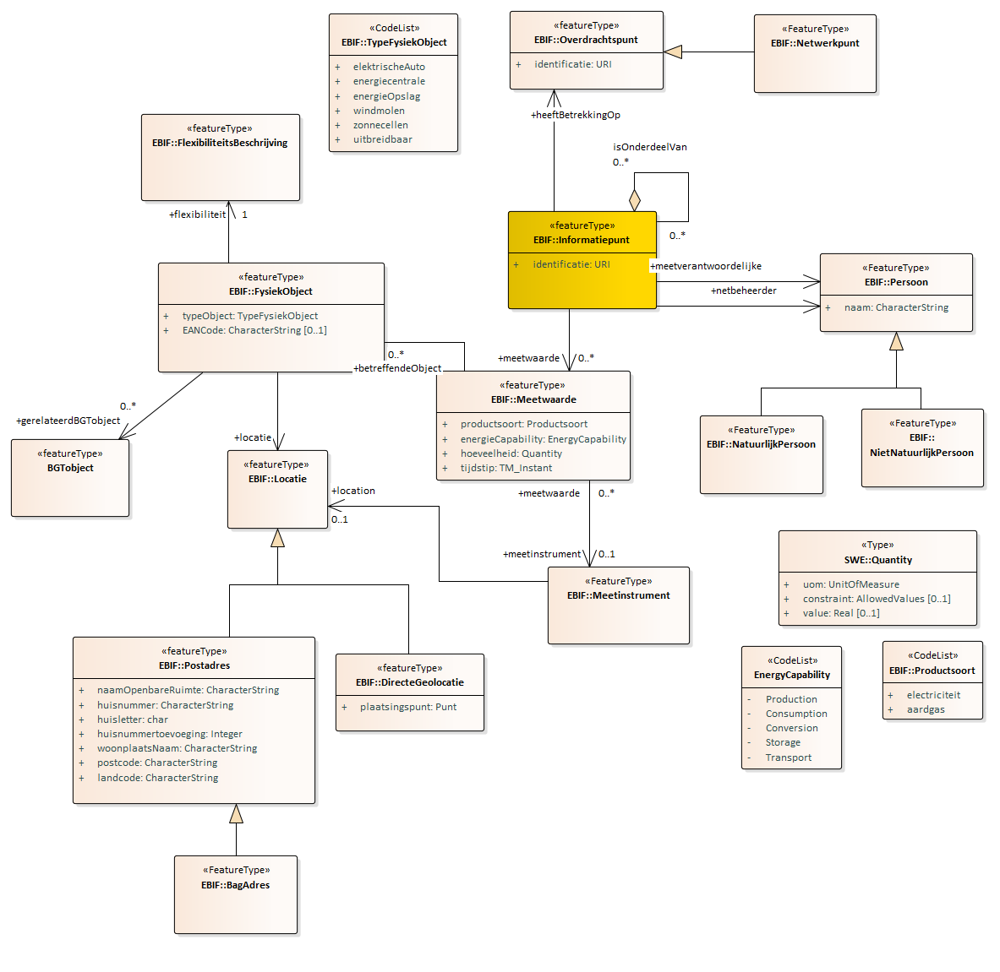

Informatiemodel
---------------

-   Informatiemodel Energie-installaties

-   Minimum viable product

-   Aanbevelingen voor doorontwikkeling

### Informatiemodel Energie-installaties

Het informatiemodel Energie-installaties beschrijft de informatie die je over
energie installaties wilt weten en delen. Het toepassingsgebied bepaalt hierbij
de context van het type informatie. Dit toepassingsgebied is in hoofdstuk 1
beschreven.

Uitgangspunten bij de modellering:

\- model beschrijft informatie op hoofdlijnen en geeft hiermee een eerste beeld
van de informatiebehoefte;

\- model is ingebed in Nederlandse informatie architectuur en maakt gebruik van
bestaande informatiestandaarden en domeinmodellen;

\- model

### Minimum viable product

Het minimum viable product voor het IMEnergie-installaties ……..

### Aanbevelingen voor doorontwikkeling

Lorem ipsum dolor sit amet, consectetuer adipiscing elit. Aenean commodo ligula
eget dolor. Aenean massa. Cum sociis natoque penatibus et magnis dis parturient
montes, nascetur ridiculus mus. Donec quam felis, ultricies nec, pellentesque
eu, pretium quis, sem. Nulla consequat massa quis enim. Donec pede justo,
fringilla vel, aliquet nec, vulputate eget, arcu. In enim justo, rhoncus ut,
imperdiet a, venenatis vitae, justo. Nullam dictum felis eu pede mollis pretium.
Integer tincidunt. Cras dapibus. Vivamus elementum semper nisi. Aenean vulputate
eleifend tellus. Aenean leo ligula, porttitor eu, consequat vitae, eleifend ac,
enim. Aliquam lorem ante, dapibus in, viverra quis, feugiat a, tellus. Phasellus
viverra nulla ut metus varius laoreet. Quisque rutrum. Aenean imperdiet. Etiam
ultricies nisi vel augue. Curabitur ullamcorper ultricies nisi. Nam eget dui.

~~~~~~~~~~~~~~~~~~~~~~~~~~~~~~~~~~~~~~~~~~~~~~~~~~~~~~~~~~~~~~~~~~~~~~~~~~~~~~~~
Aanbevelingen in een mooi tabelletje misschien?
~~~~~~~~~~~~~~~~~~~~~~~~~~~~~~~~~~~~~~~~~~~~~~~~~~~~~~~~~~~~~~~~~~~~~~~~~~~~~~~~

| Kolom-1 | Kolom-2 | Kolom-3 | Kolom 4 | Kolom-n |
|---------|---------|---------|---------|---------|
| Rij-1   |         |         |         |         |
| Rij-2   |         |         |         |         |
| Rij-3   |         |         |         |         |
| Rij-4   |         |         |         |         |
| Rij-5   |         |         |         |         |
| Rij-6   |         |         |         |         |

### UML diagram

Als start voor het bepalen van het denkraam van het model is uitgegaan van een
model voor het uitwisselen van meetgegevens in een netwerk genomen. In dat model
staat het informatiepunt centraal. Een punt waar je gegevens over vastlegt.
Gegevens zijn meetwaarden. Meetwaarden betreffen een energieproduct, een
energieproces (productie, gebruik, opslag, conversie of transport) en gelden op
een tijdstip. De meetwaarde (of specificatie) is van toepassing op een
energie-installatie. Deze is gemodelleerd als een fysiek object van een bepaald
type. De energie-installatie is gerelateerd aan een topografisch object uit de
BGT. Via adres en persoon is er een koppeling naar de BAG en de

