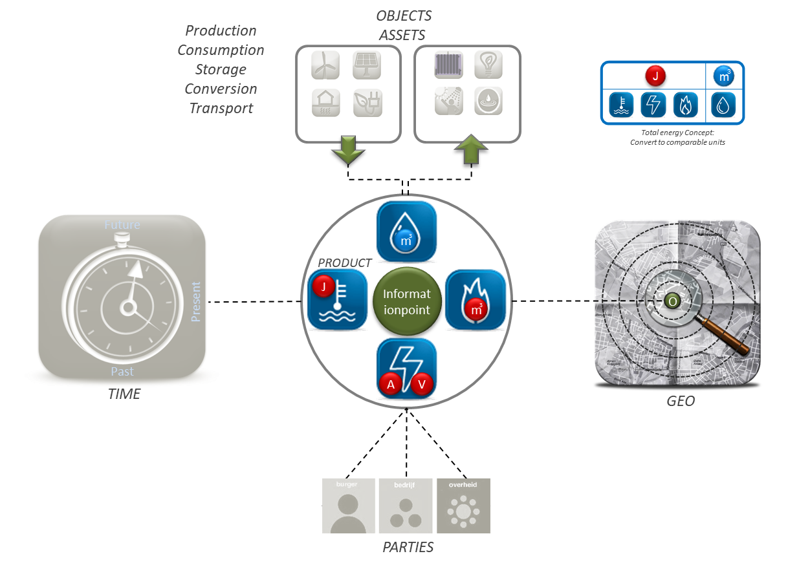

Informatiemodel
---------------

-   Informatiemodel Energie-installaties

-   Minimum viable product

-   Aanbevelingen voor doorontwikkeling

### Informatiemodel Energie-installaties

Het informatiemodel Energie-installaties beschrijft de informatie die je over
energie installaties wilt weten en delen. Het toepassingsgebied bepaalt hierbij
de context van het type informatie. Dit toepassingsgebied is in hoofdstuk 1
beschreven.

Uitgangspunten bij de modellering:

\- model beschrijft informatie op hoofdlijnen en geeft hiermee een eerste beeld
van de informatiebehoefte;

\- de informatiebehoefte is gefocused op energiegegevens als afgeleide van een
energiesysteem of energiesystemen. Het is geen model van energiesystemen.

\- model is ingebed in Nederlandse informatie architectuur en maakt gebruik van
bestaande informatiestandaarden en domeinmodellen;

\- …..

Model op hoofdlijn

Als start voor het bepalen van het denkraam van het model is uitgegaan van een aantal kern-entiteiten die centraal staan:
Energie-installatie
Energieproduct
Installatie-eigenschap (verbruik, opwek, opslag e.d.)
Energie hoeveelheid
Locatie
Persoon/bedrijf

Deze kern-entiteiten zijn geprojecteerd op een model voor het uitwisselen van meetgegevens van energie-installaties in een
netwerk. Het model is relatief eenvoudig en is onafhankelijk van de vaak
complexe structuur van energiesystemen. In het model staat het informatiepunt
centraal. Een punt waar je gegevens over vastlegt en opvraagt. In dit geval van
een energie-installatie. Een energie-installatie is een asset voor productie,
consumptive, opslag, conversie en of transport. De gegevens die van belang zijn
hebben betrekking op de producten elektriciteit, gas en warmte. De dimenies
ruimte en tijd zijn van belang en de relatie met beheer en eigendom. Als we die
vijf onderdelen met elkaar verbinden krijgen we onderstaand overzicht.

<!--  -->
<!-- Figuur X: Informatie over energie-installaties gaat over het type product, het type energieproces en kent een aantal basisgegevens: ruimte, tijd en eigendom. -->

<figure id="basisgegevens">
    
    <figcaption>Informatie over energie-installaties gaat over het type product, het type energieproces en kent een aantal basisgegevens: ruimte, tijd en eigendom.
    </figcaption>
</figure>

Op basis van dit diagram is een informatiemodel ontwikkeld.

### Minimum viable product

In deze fase is het informatiemodel nog bedoeld als denkraam voor de verdere
doorontwikkeling. Het model ondersteund de behoefte om de use case over welke
informatie van belang is scherper te krijgen. Het model moet verschillende
bestaande modellen in relatie tot elkaar brengen om een beeld te krijgen waar de
focus voor hergebruik en doorontwikkeling ligt.

### UML diagram

Het model is weergegeven in UML een gestandaardiseerde taal voor
informatiemodellering. In de onderstaande beschrijving worden een aantal
conventies van UML toegelicht.

Het model is relatief eenvoudig en is onafhankelijk van de vaak complexe
structuur van energiesystemen. Een model bestaat uit entiteiten of objecttypen.
In het diagram aangegeven als \<\<Objectype\>\>. In het model staat het
informatiepunt centraal. Een punt waar je gegevens over vastlegt en opvraagt. In
dit geval van een energie-installatie. Een informatiepunt heeft 0 of meer
meetwaardes. In het model aangegeven met de uitgaande pijl. Gegevens zijn
meetwaarden of specificaties. Een meetwaarde betreft een waarde van een
energieproduct. In het model aangegeven met het attribuut productsoort. Bij dat
attribuut kan gekozen worden uit de lijst Productsoort met de waarden
elektricteit, aardgas, warmte. Tevens is er een attribuut energyCapability om
het energieproces op te nemen waar de meetwaarde betrekking op heeft: productie,
gebruik, opslag, conversie of transport. Het attribuut tijdstip bevat het
tijdstip of periode van de meetwaarde. De meetwaarde (of specificatie) is van
toepassing op 0 of meer energie-installaties. Deze is gemodelleerd als een
fysiek object van een bepaald type. Koppeling met het PIR (Product Installatie
Register) kan hier voor een nadere invulling zorgen. Dit is nog niet in het
model opgenomen. De energie-installatie is gerelateerd aan een topografisch
object uit de BGT. Via adres en persoon is er een koppeling naar de BAG, de
NHR en de BRP. Bij persoon geeft een gesloten pijl aan dat NatuurlijkPersoon (BRP) en
NietNatuurlijkPersoon (NHR) verbijzonderingen van Persoon zijn.

<!--  -->
<!-- Figuur X: UML diagram van informatiemodel ‘energie-installaties’. Dit is een startmodel om de denkrichting te bepalen voor doorontwikkeling. -->

<figure id="startmodel">
    
    <figcaption>UML diagram van informatiemodel ‘energie-installaties’. Dit is een startmodel om de denkrichting te bepalen voor doorontwikkeling.
    </figcaption>
</figure>

De volgende belangrijkste objecttypen (of kern-entiteiten) worden onderscheiden:

**Informatiepunt en Meetwaarde.**

Voor het bepalen van energie gerelateerde capaciteit in relatie tot productie en
opslag is veel informatie nodig van vele onderdelen van een energiesysteem. In
dit model worden netwerkonderdelen waarover informatie bijgehouden wordt
beschreven als informatiepunten en de bijbehorende informatie wordt beschreven
in meetwaardes. Een informatiepunt is een schaalbaar begrip gekoppeld aan
fysieke objecten of andere virtuele eenheden. De meetwaarden zijn getypeerd naar
energie product elektriciteit, aardgas en warmte. De meetwaarde is ook gespecificeerd per type ‘EnergyCapability’, de
vijf hoofdgoepen productie, consumptive, conversie, opslag en transport.

**Meetinstrument**

Meetwaardes ontstaan uit metingen worden gedaan met een meetinstrument. Wanneer
de eigenschappen van een meetinstrument van belang zijn kunnen deze in de klasse
Meetinstrument beschreven worden.

**FysiekObject**

Zichtbaar en tastbaar object dat energie produceert, opslaat, converteert of
gebruikt. Een ander mogelijke term is asset of nog beperketre energie-asset. Deze objecten zijn wellicht verder te modelleren volgens het PIR.
(Product Installatie Register)

**Locatie**

Van veel objecten is de locatie van belang. Deze kan op twee manieren beschreven
zijn: : (1) Als coordinaten in een bekend referentiestelsel. (2) Als
(post)-adres uit de BAG.

**Persoon**
Persoon vormt de verbinding met personen, natuurlijk of rechtspersonen die een relatie hebben met een informatiepunt in een netwerk..

**Overdrachtspunt**

Overdrachtspunten vormen de link met het fysieke netwerk: Informatiepunten
worden volledig losstaand van het bestaande netwerk beschreven, wanneer de
plaatsing in het fysieke netwerk van belang is kan een informatiepunt middels
een overdrachtspunt gekoppeld worden aan fysieke netwerklocatie.

Voor harmonisatie met andere energie-informatiemodellen is er een mapping met het ESDL en
met CIM.

### ESDL mapping op IMEnergie.

Het ESDL, Energy System Description Language is door TNO ontwikkeld voor het
standaardiseren van data-uitwisseling voor het toepassen van rekenmodellen op
energiesystemen https://energytransition.gitbook.io/esdl/. Het beschrijft elementen uit het energiesysteem als input voor
rekenmodellen over onder andere netbelasting, energiebalancering. Het model ondersteund ruimtelijke en individuele asset selectie en differentiatie op productie, consumptie, conversie, opslag en transport.

<!--  -->
<!-- Figuur X: Twee voorbeelden van informatieverstrekking via ESDL. -->

<figure id="ESDL-voorbeelden">
    
    <figcaption>Twee voorbeelden van informatieverstrekking via ESDL.</figcaption>
</figure>

Van het ESDL informatiemodel is er onderstaand een gesimplificeerde subset opgenomen.

<!--  -->

<!-- Figuur X: Gesimplificeerd UML diagram van informatiemodel ESDL (Energie System Description Language). -->

<figure id="ESDL-objecttypen">
    
    <figcaption>Gesimplificeerd UML diagram van informatiemodel ESDL (Energie SystemDescription Language).
    </figcaption>
</figure>

Een EnergySystem bevat (het dichte wiebertje) EnergySystemInformation. Hierin zitten datasources met gegevens over Assets. Een Asset heeft een Geometry en een Building bevat Assets. Assets zijn EnergyAssets van verschillende typen van Consumer tot Conversion.

Het ESDL zet de objecttypen EnergySystem, EnergyAssets gespecificeerd naar Production, Consumption, Storage, Conversion en Transport centraal. Zij heeft hier mee een meer specifiek model voor het definieren van gegevens per type asset. De uitwerking van type gegevens, enkelvoudig of profielen vian tijdseries is ook gedetailleerd uitgewerkt.

Mapping op IMEnergie.

In onderstaand diagram zijn de belangrijkste objecttypen van ESDL in relatie tot het startmodel gebracht.

<!--  -->
<!-- Figuur X: ESDL in relatie tot IMEnergie-installaties. -->

<figure id="IMEnergie_en_ESDL">
    
    <figcaption>ESDL in relatie tot IMEnergie-installaties.</figcaption>
</figure>

Een EnergySystem 

### CIM mapping op IMEnergie.

<!--  -->
<!-- Figuur X: CIM in relatie tot IMEnergie-installaties. -->

<figure id="media/IMEnergie_en_CIM">
    
    <figcaption>CIM in relatie tot IMEnergie-installaties.
    </figcaption>
</figure>

### Aanbevelingen voor doorontwikkeling

TODO

~~~~~~~~~~~~~~~~~~~~~~~~~~~~~~~~~~~~~~~~~~~~~~~~~~~~~~~~~~~~~~~~~~~~~~~~~~~~~~~~
Aanbevelingen in een mooi tabelletje misschien?
~~~~~~~~~~~~~~~~~~~~~~~~~~~~~~~~~~~~~~~~~~~~~~~~~~~~~~~~~~~~~~~~~~~~~~~~~~~~~~~~

| Kolom-1 | Kolom-2 | Kolom-3 | Kolom 4 | Kolom-n |
|---------|---------|---------|---------|---------|
| Rij-1   |         |         |         |         |
| Rij-2   |         |         |         |         |
| Rij-3   |         |         |         |         |
| Rij-4   |         |         |         |         |
| Rij-5   |         |         |         |         |
| Rij-6   |         |         |         |         |
