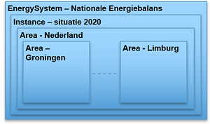

## Informatiemodel

In dit hoofdstuk wordt het Informatiemodel Energie-installaties
(IMEnergie-installaties) beschreven. De beschrijving is nog op hoofdlijnen. Bij
de bepaling van het model zijn drie modellen als startpunt genomen: (a)
Informatiemodel Energiebalancering, (b) Informatiemodel EDSL (EnergieSystem
Description Language), (c) Informatiemodel CIM-Ceres (Centrale Registratie van
Systeemelementen) en (d) Model Installatieregister.

Aan de hand van de inventarisatie beschreven in de voorafgaande hoofdstukken en
een aantal expertsessies is een startmodel gemaakt. Het startmodel is de basis
voor keuzes voor doorontwikkeling in een volgende fase.

### Informatiemodel Energie-installaties

Het informatiemodel Energie-installaties beschrijft de informatie die je over
energie installaties wilt weten en delen. Het toepassingsgebied bepaalt hierbij
de context van het type informatie. Dit toepassingsgebied is in hoofdstuk 1
beschreven.

De volgende uitgangspunten zijn bij de modellering gehanteerd:

\- het model beschrijft informatie op hoofdlijnen en geeft hiermee een eerste
beeld van de informatiebehoefte;

\- de informatiebehoefte is gefocust op energiegegevens als *afgeleide* van een
energiesysteem of energiesystemen. Het is geen model van energiesystemen;

\- het model is ingebed in de Nederlandse informatie architectuur en maakt
gebruik van bestaande informatiestandaarden en domeinmodellen;

#### Het model op hoofdlijnen

Als start voor het bepalen van het denkraam van het model is uitgegaan van een
aantal *kernentiteiten* die centraal staan. Paragraaf 4.4.5 beschrijft die als:
installatie, gebouw/locatie, persoon/bedrijf en meetwaarde. Voor het
informatiemodel zijn die als volgt geformuleerd: Energie-installatie,
Energieproduct, Installatie-eigenschap (verbruik, opwek, opslag e.d.),
Energiehoeveelheid en Locatie Persoon/bedrijf

Deze kernentiteiten zijn geprojecteerd op een model voor het uitwisselen van
meetgegevens van energie-installaties in een netwerk. Het model is relatief
eenvoudig en is onafhankelijk van de vaak complexe structuur van
energiesystemen. In het model staat het informatiepunt centraal: een punt waar
je gegevens over vastlegt en opvraagt. In dit geval van een energie-installatie.
Een energie-installatie is een asset voor productie, consumptie, opslag,
conversie of transport. De gegevens die van belang zijn hebben betrekking op de
producten elektriciteit, gas en warmte. De dimensies ruimte en tijd zijn van
belang en de relatie met beheer en eigendom. Als we die vijf onderdelen met
elkaar verbinden krijgen we onderstaand overzicht.

<figure id="energie-installaties">
    
    <figcaption>*Informatie over energie-installaties gaat over het type product, het type energieproces en kent een aantal basisgegevens: ruimte, tijd en eigendom.*</figcaption>
</figure>

Op basis van dit diagram is een informatiemodel ontwikkeld.

Als start is het informatiemodel voor energiebalancering genomen omdat dit het
meest globale model is en daarmee het best de eerste globale informatiebehoefte
en informatiestructuur weergeeft. Informatie-elementen uit ESDL en CIM-Ceres
zijn hier vervolgens aan gekoppeld. De samenhang tussen de modellen komt daarmee
in beeld.

### Minimum viable product

In deze fase is het informatiemodel nog bedoeld als denkraam voor de verdere
doorontwikkeling. Het model ondersteunt de behoefte om de usecase over welke
informatie van belang is scherper te krijgen. Het model brengt verschillende
bestaande modellen in relatie tot elkaar om een beeld te krijgen waar de focus
voor hergebruik en doorontwikkeling ligt.

### UML-diagram

Het model is weergegeven in UML een gestandaardiseerde taal voor
informatiemodellering. In de onderstaande beschrijving worden een aantal
conventies van UML toegelicht.

Het model is relatief eenvoudig en is onafhankelijk van de vaak complexe
structuur van energiesystemen. Een model bestaat uit entiteiten of objecttypen.
In het diagram aangegeven als \<<Objecttype\>>. In het model staat het
informatiepunt centraal. Een punt waar je gegevens over vastlegt en opvraagt. In
dit geval van een energie-installatie. Een informatiepunt heeft 0 of meer
meetwaardes, in het model aangegeven met de uitgaande pijl. Gegevens zijn
meetwaarden of specificaties. Een meetwaarde betreft een waarde van een
energieproduct, in het model aangegeven met het attribuut productsoort. Bij dat
attribuut kan gekozen worden uit de lijst Productsoort met de waarden
elektriciteit, aardgas, warmte. Tevens is er een attribuut EnergyCapability om
het energieproces op te nemen waar de meetwaarde betrekking op heeft: productie,
gebruik, opslag, conversie of transport. Het attribuut tijdstip bevat het
tijdstip of periode van de meetwaarde. De meetwaarde (of specificatie) is van
toepassing op 0 of meer energie-installaties. Deze is gemodelleerd als een
fysiek object van een bepaald type. Koppeling met het PIR (Product Installatie
Register) kan hier voor een nadere invulling zorgen, maar dit is nog niet in het
model opgenomen. De energie-installatie is gerelateerd aan een topografisch
object uit de BGT. Via adres en persoon is er een koppeling naar de BAG, de NHR
en de BRP. Bij Persoon geeft een gesloten pijl aan dat NatuurlijkPersoon (BRP)
en NietNatuurlijkPersoon (NHR) verbijzonderingen van Persoon zijn.

<figure id="IMEnergie-installaties">
    
    <figcaption>*UML diagram van informatiemodel ‘energie-installaties’. Dit is een startmodel om de denkrichting te bepalen voor doorontwikkeling.*</figcaption>
</figure>

De volgende belangrijkste objecttypen (of kern-entiteiten) worden onderscheiden:

#### Informatiepunt en Meetwaarde

Voor het bepalen van energiegerelateerde capaciteit in relatie tot productie en
opslag is veel informatie nodig van veel onderdelen van een energiesysteem. In
dit model worden netwerkonderdelen waarover informatie bijgehouden wordt,
beschreven als informatiepunten en de bijbehorende informatie wordt beschreven
in meetwaardes. Een informatiepunt is een schaalbaar begrip gekoppeld aan
fysieke objecten of andere virtuele eenheden. De meetwaarden zijn getypeerd naar
de energieproducten elektriciteit, aardgas en warmte. De meetwaarde is ook
gespecificeerd per type ‘EnergyCapability’, de vijf hoofdgroepen productie,
consumptie, conversie, opslag en transport.

#### Meetinstrument

Meetwaarden ontstaan uit metingen die worden gedaan met een meetinstrument.
Wanneer de eigenschappen van een meetinstrument van belang zijn kunnen deze in
de klasse Meetinstrument beschreven worden.

#### FysiekObject

Zichtbaar en tastbaar object dat energie produceert, opslaat, converteert,
gebruikt of transporteert. Een ander mogelijke term is asset of (nog beperkter)
energie-asset. Deze objecten zijn wellicht verder te modelleren volgens
CIM-Ceres.

#### Locatie

Van veel objecten is de locatie van belang. Deze kan op twee manieren beschreven
zijn: (a) als coördinaten in een bekend referentiestelsel en (b) als
(post)-adres uit de BAG.

#### Persoon 

Persoon vormt de verbinding met personen, natuurlijke of rechtspersonen die een
relatie hebben met een informatiepunt in een netwerk.

#### Overdrachtspunt

Overdrachtspunten vormen de link met het fysieke netwerk: Informatiepunten
worden volledig losstaand van het bestaande netwerk beschreven; wanneer de
plaatsing in het fysieke netwerk van belang is kan een informatiepunt middels
een overdrachtspunt gekoppeld worden aan een fysieke netwerklocatie.

Voor harmonisatie met andere energie-informatiemodellen is een mapping
geconstrueerd met het ESDL en met CIM.

### ESDL mapping op IMEnergie.

[ESDL](https://energytransition.gitbook.io/esdl), de Energy System Description
Language is door TNO ontwikkeld voor het standaardiseren van data-uitwisseling
voor – in eerste instantie - rekenmodellen voor energiesystemen. Het beschrijft
elementen uit het energiesysteem als input voor rekenmodellen over onder andere
netbelasting en energiebalancering. Het model ondersteunt ruimtelijke en
individuele assetselectie en differentiatie op productie, consumptie, conversie,
opslag en transport.

<figure id="Solar">
    
    <figcaption>*Twee voorbeelden van informatieverstrekking via ESDL.*</figcaption>
</figure>

Van het ESDL-informatiemodel is onderstaand een gesimplificeerde subset
opgenomen.

<figure id="ESDL_placeholder_objecttypen">
    
    <figcaption>*Gesimplificeerd UML diagram van informatiemodel ESDL (Energie SystemDescription Language).*</figcaption>
</figure>

Een EnergySystem bevat (het dichte wybertje) EnergySystemInformation. Hierin
zitten datasources met gegevens over Assets. Een Asset heeft een Geometry en een
Building bevat Assets. Assets zijn EnergyAssets van verschillende typen van
Consumer tot Conversion.

Het ESDL zet de objecttypen EnergySystem en EnergyAssets (gespecificeerd naar
Production, Consumption, Storage, Conversion en Transport) centraal. Zij heeft
hiermee een meer specifiek model voor het definiëren van gegevens per type
asset. De uitwerking van type gegevens, enkelvoudig of profielen van tijdseries
is ook gedetailleerd uitgewerkt.

In onderstaand diagram zijn de belangrijkste objecttypen van ESDL in relatie tot
het startmodel gebracht.

<figure id="IMEnergie_en_ESDL">
    
    <figcaption>*ESDL in relatie tot IMEnergie-installaties.*</figcaption>
</figure>

### CIM-Ceres mapping op IMEnergie.

Het informatiemodel voor de Centrale Registratie van Systeemelementen (Ceres) is
ontwikkeld door EDSN en registreert installaties die elektriciteit produceren of
verbruiken op het niveau van een aansluiting. Ceres is een toepassing van het
internationale IEC/CIM. Bij de ontwikkeling van het IMSG, dat nu als
uitgangspunt voor in deze verkenning is genomen, is ook het Ceres model als
input gebruikt. Hiermee is ook de relatie met het IEC/CIM gerealiseerd.
Onderstaand diagram beschrijft de mapping van informatie-elementen uit Ceres op
IMEnergie-installaties.

<figure id="IMEnergy_en_CIM_Ceres">
    
    <figcaption>*CIM_Ceres in relatie tot IMEnergie-installaties.*</figcaption>
</figure>

### Model Installatieregister mapping op IMEnergie.

Het model voor het Installatieregister is ontwikkeld door Techniek Nederland. Het beschrijft de componenten van een installatie binnen een gebouw. In die beschrijving wordt gebruik gemaakt van de NL/SfB classificatie van systeemdelen en gekoppeld aan de ETIM productclassificatie. SALES productgegevens zorgen voor koppeling naar specificaties van specifieke toegepaste producten. Keuring op producten en systeemdelen kunnen worden vastgelegd.

Van het informatiemodel Installatieregister is onderstaand een gesimplificeerde subset
opgenomen.

<figure id="(placeholder)Installatieregister">
    
    <figcaption>Gesimplificeerd UML diagram van informatiemodel Installatieregister.</figcaption>
</figure>

In onderstaand diagram zijn de belangrijkste objecttypen van informatiemodel Installatieregister in relatie tot
het startmodel gebracht.

<figure id="IMEnergie_en_Instalregister">
    
    <figcaption>Informatiemodel Installatieregister in relatie tot IMEnergie-installaties.</figcaption>
</figure>

De informatie uit het Installatieregister is zeer gedetailleerd op delen van assets. Productspecificaties zijn of zijn te relateren aan energiecapaciteit van assets. 

### Aanbevelingen voor doorontwikkeling

De volgende observaties en aanbevelingen komen voort uit een eerste
verkenning naar een informatiemodel.

-	Het was inspirerend om de stakeholders uit verschillende toepassingen bij elkaar te brengen en de verschillende domeinen informatietechnisch te verbinden. Oplossingen voor relevante use cases ontstaan door die verbinding.

-   De vier gebruikte informatiemodel IMSG, ESDL, CIM-Ceres en Installatieregister zijn op een
    globaal niveau met elkaar vergelijkbaar. Ze hebben ook overlappende
    usecases.

-	Het model voor Installatieregister bevat operationele detailinformatie van onderdelen van energie-assets achter de aansluiting. Gedetailleerde 		productinformatie van ETIM en SALES zijn of zijn te herleiden tot specificaties over energiekenmerken zoals specificaties over capaciteit, verbruik etc.

-   Het nu ontwikkelde IMEnergie-installaties is nog zeer globaal maar stuurt de
    verdere ontwikkeling van de usecase. Op basis daarvan wordt weer het informatiemodel doorontwikkeld.

-   De samenhang tussen de betrokken modellen is positief voor het ontwikkelen
    van een bruikbaar geharmoniseerd model. Verder onderzoek naar informatiedetail moet nog plaatsvinden.

-   Het IMEnergie-installatie zal in de doorontwikkeling naar verwachting
    vervangen worden door delen van het ESDL en/of CIM-Ceres met input van Installatieregister.

-   In potentie zou ESDL met een harmonisatie richting CIM-Ceres en harmonisatie
    met geo-standaarden een kandidaat kunnen zijn voor een informatiemodel dat
    aan de usecase voldoet.
