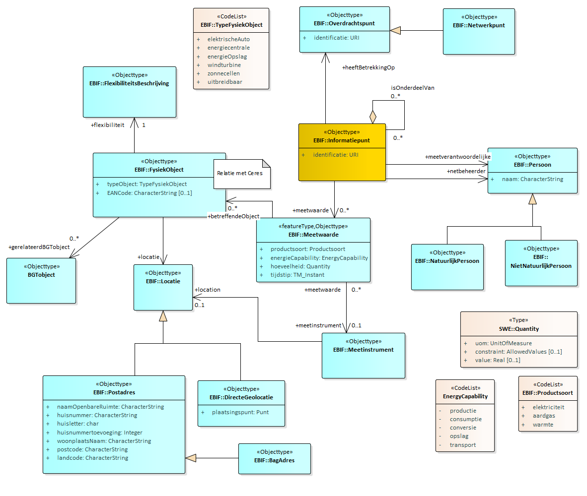
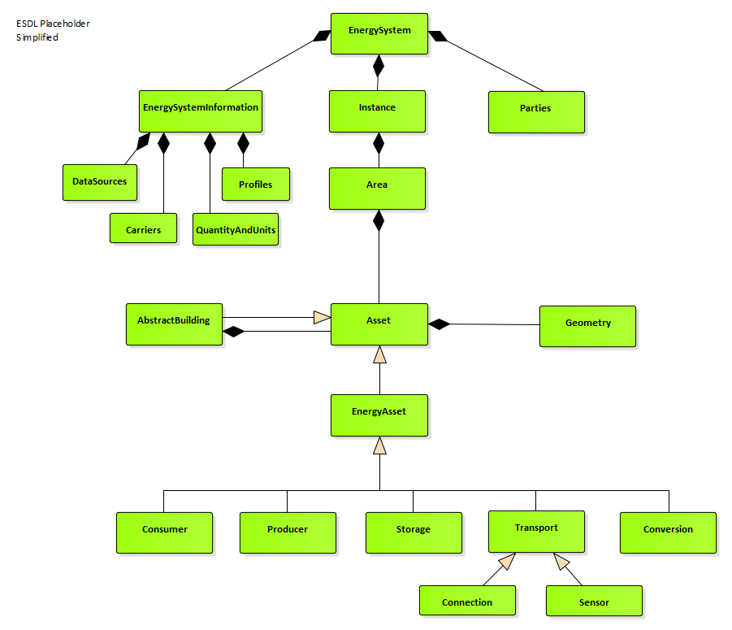
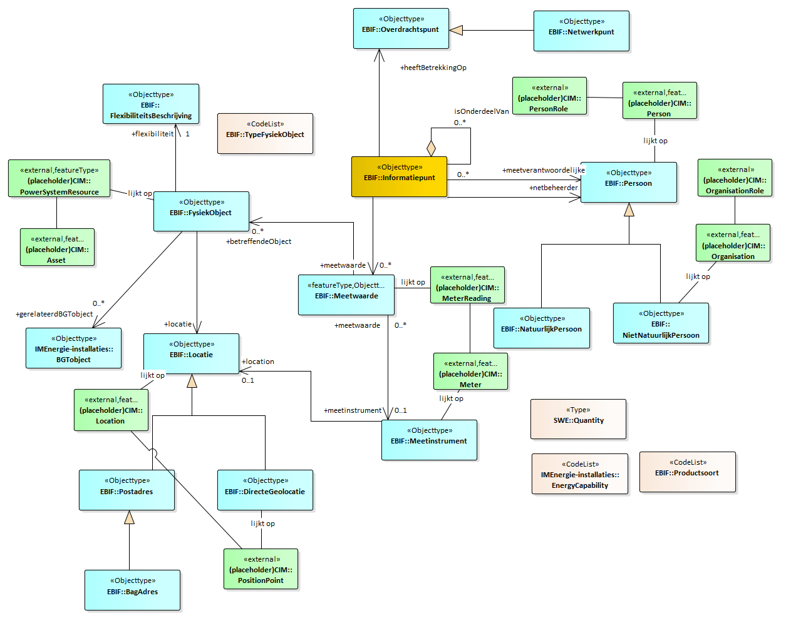

Informatiemodel
---------------

-   Informatiemodel Energie-installaties

-   Minimum viable product

-   Aanbevelingen voor doorontwikkeling

### Informatiemodel Energie-installaties

Het informatiemodel Energie-installaties beschrijft de informatie die je over
energie installaties wilt weten en delen. Het toepassingsgebied bepaalt hierbij
de context van het type informatie. Dit toepassingsgebied is in hoofdstuk 1
beschreven.

Uitgangspunten bij de modellering:

\- model beschrijft informatie op hoofdlijnen en geeft hiermee een eerste beeld
van de informatiebehoefte;

\- de informatiebehoefte is gefocused op energiegegevens als afgeleide van een
energiesysteem of energysystemen. Het is geen model van energysystemen.

\- model is ingebed in Nederlandse informatie architectuur en maakt gebruik van
bestaande informatiestandaarden en domeinmodellen;

\- …..

### Minimum viable product

Het minimum viable product voor het IMEnergie-installaties ……..

### Aanbevelingen voor doorontwikkeling

TODO

~~~~~~~~~~~~~~~~~~~~~~~~~~~~~~~~~~~~~~~~~~~~~~~~~~~~~~~~~~~~~~~~~~~~~~~~~~~~~~~~
Aanbevelingen in een mooi tabelletje misschien?
~~~~~~~~~~~~~~~~~~~~~~~~~~~~~~~~~~~~~~~~~~~~~~~~~~~~~~~~~~~~~~~~~~~~~~~~~~~~~~~~

| Kolom-1 | Kolom-2 | Kolom-3 | Kolom 4 | Kolom-n |
|---------|---------|---------|---------|---------|
| Rij-1   |         |         |         |         |
| Rij-2   |         |         |         |         |
| Rij-3   |         |         |         |         |
| Rij-4   |         |         |         |         |
| Rij-5   |         |         |         |         |
| Rij-6   |         |         |         |         |

### UML diagram

Als start voor het bepalen van het denkraam van het model is uitgegaan van een
model voor het uitwisselen van meetgegevens in een netwerk genomen. Het model is
relatief eenvoudig en is onafhankelijk van de vaak complexe structuur van
energiesystemen. In het model staat het informatiepunt centraal. Een punt waar
je gegevens over vastlegt en opvraagd. Gegevens zijn meetwaarden. Meetwaarden
betreffen een waarde van een energieproduct, een energieproces (productie,
gebruik, opslag, conversie of transport) en gelden op een tijdstip. De
meetwaarde (of specificatie) is van toepassing op een energie-installatie. Deze
is gemodelleerd als een fysiek object van een bepaald type. De
energie-installatie is gerelateerd aan een topografisch object uit de BGT. Via
adres en persoon is er een koppeling naar de BAG en de NHR.

Voor harmonisatie met andere energiemodellen is er een mapping met het ESDL en
met CIM.

### ESDL mapping op IMEnergie.

Voor het ESDL is er onderstaand een gesimplificeerde subset opgenomen.

  
  
Mapping op IMEnergie

### CIM mapping op IMEnergie.

