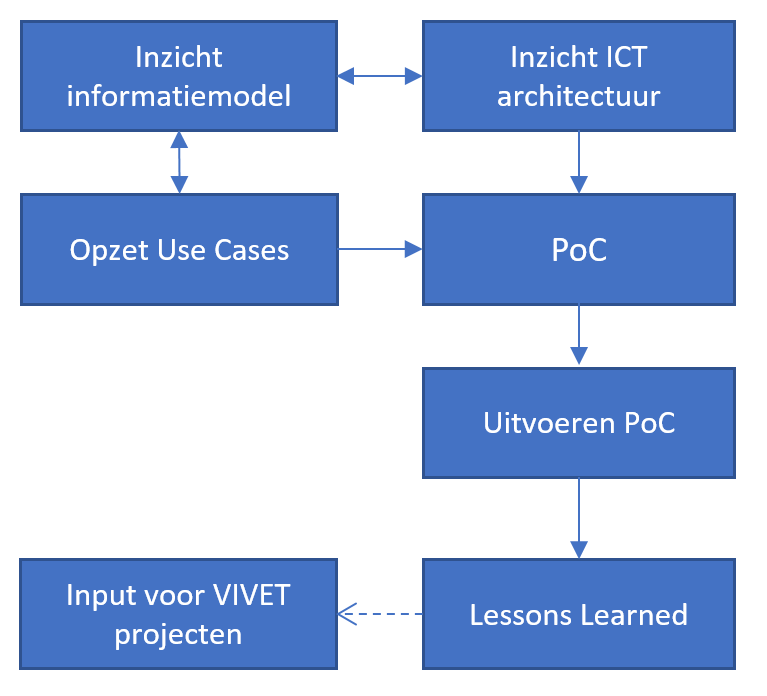

Inleiding
---------

### Context 

Het programma
[VIVET](https://www.geonovum.nl/uploads/documents/Rapport%20VIVET%20Definitief-1.0.pdf)
(Verbetering Informatie Voorziening EnergieTransitie) bevat voorstellen voor de
verbetering van de informatievoorziening van de energietransitie. Het programma
is opgesteld door het CBS, het Kadaster, PBL, RVO.nl en Rijkswaterstaat op
verzoek van de ministeries van Economische Zaken en Klimaat en Binnenlandse
Zaken en Koninkrijksrelaties. In het werkplan VIVET t/m maart 2020 is een
vijftal activiteiten voorzien. Een van die activiteiten is een verkenning van
een centraal energieregister energie-installaties, met als deelstudie een
Voorstudie voor een centraal installatieregister. Op dit moment ontbreekt het
betrokken partijen aan informatie over installaties die energie kunnen opwekken,
converteren of opslaan. De informatie is deels niet beschikbaar, deels niet
vindbaar, deels niet ontsloten, en deels niet koppelbaar. Dat betekent dat
optimale besluitvorming voor de regionale energiestrategieën (RES) en
transitievisie warmte (WW), systeemintegratie en de hoofdinfrastructuur energie
niet goed mogelijk is. Uit de voorstudie moet blijken op welke manier de reeds
bestaande informatie over energie-installaties naar relevante stakeholders
(besluitvormers, dataspecialisten e.d.) in de energietransitie ontsloten kan
worden.

### Context (uitgebreid)

De opdracht aan Geonovum om een Verkenning Informatiemodel energie-installaties
uit te voeren valt onder het VIVET-programma onderdeel E.2. Voorstudie centraal
installatieregister.

#### VIVET:

Met de energietransitie en de klimaatafspraken van Parijs staat Nederland voor
een grote opgave. In Nederland werken veel partijen samen om klimaat- en
energieafspraken na te komen. Voor de onderbouwing en uitvoering van alle
initiatieven, visies, plannen en strategieën is veel en betrouwbare informatie
nodig over de huidige en verwachte ontwikkeling van het energiesysteem.

Met betere data kunnen actoren informatie sneller en tegen lagere (zoek)-kosten
vergaren en zijn ze sneller en beter in staat om goed onderbouwde besluiten te
nemen over hun bijdrage aan de energietransitie. Om die reden is het van
nationaal belang om de informatievoorziening te optimaliseren. Dat is de reden
geweest voor de ministeries van Binnenlandse Zaken en Koninkrijkrelaties (BZK)
en Economische Zaken en Klimaat (EZK) om in augustus 2018 het project
‘Verbetering van de Informatievoorziening voor de Energietransitie’ (hierna:
VIVET) te starten.

De opdrachtgevers hebben het VIVET-programmateam verzocht om zich in 2019 te
richten op het inrichten van het samenwerkingsverband en op vijf projecten:

A. Gebiedsgerichte ontsluiting energie-infrastructuur

B. Overzicht bekende warmtebronnen

C. Energieverbruik, warmtevoorziening en zonnestroom

D. Afstemming en voeding viewers

E. Verkenning centraal register energie-installaties, verdeeld in twee
onderdelen:

E1. Eerste verkenning van de mogelijkheden om hernieuwbare energie
installatieregisters samen te voegen;

E2. Voorstudie centraal installatieregister onderzoeken.

Dit rapport bevat het onderzoeksverslag van de voorstudie als bedoeld in E2.

#### Voorstudie centraal installatieregister onderzoeken (E2)

*Probleemstelling:* Voor lokale overheden en netbeheerders is er onvoldoende
zicht op installaties voor opwek, conversie en opslag van energie (warmte en
elektriciteit) op lokaal niveau. Dit was een aantal jaar geleden nog niet zo’n
groot probleem, maar in de veranderende energiehuishouding neemt lokale opwek
een steeds belangrijkere plek in. Zo is er sinds 2015 een sterke groei van
zonnestroom en warmtepompen in woningen. Het huidige gebrek aan data hierover
zorgt ervoor dat er te weinig bekend is over de lokale/regionale
energieproductie – en dus ook de bijhorende energieconsumptie. Dit vertroebelt
het totaalbeeld van de Nederlandse energiehuishouding en de statistieken op
regionaal niveau.

Dit is een probleem omdat goede besluitvorming in de RES en TVW, de
systeemintegratie, systeemstudies en energie hoofdinfrastructuur nu niet
mogelijk is. Die besluitvorming heeft namelijk betrekking op het vinden van een
juiste balans tussen het beperken van energieconsumptie enerzijds en
verduurzamen van energieproductie anderzijds. Ook voor het beheren, managen van
congestie en het plannen van energienetwerken is het van belang te weten welke
installaties aangesloten zijn. Dit maakt bijvoorbeeld duidelijk wat de huidige
en toekomstige belasting van het energiesysteem is tijdens seizoenfluctuaties,
piek- en dal-fluctuaties. Dit helpt (des)investeringsplannen onderbouwen en
leidt tot een efficiënt beheer van energienetwerken, waar iedereen van
profiteert.

*Doel:* Het gaat om de verkenning van de haalbaarheid van een centraal register
met alle energie-installaties; dus zowel alle energiebronnen -fossiel, kern,
hernieuwbaar, mix - als alle typen installaties; productie, conversie als
opslag). Het doel van het register is vierledig: 1. Om een goede lokale en
regionale afweging te kunnen maken voor een investering in de energietransitie,
(zoals infrastructuur, isolatie, opslag) is het noodzakelijk een accuraat
plaatje te hebben van de lokale energie vraag, de energieproductie en energie
conversie mogelijkheden en opslag van alle energiedragers. Zo kunnen
verschillende scenario’s goed doorgerekend worden. Bijvoorbeeld voor de
warmteplannen gemeentes, RES, omgevingsvisies. Hier spelen vragen als: hoeveel
en welke woningen in de wijk hebben reeds een warmtepomp, bio-ketel, en/of
warmtenetaansluiting en kunnen dus van het gas af? Op dit moment kunnen we deze
vraag nog niet beantwoorden op basis van de beschikbare informatieproducten. 2.
Rekening houdend met het feit dat in 2030, (i) 70% van onze jaarlijkse
elektriciteitsvraag uit duurzame elektriciteit zal bestaan en (ii) dat deze
elektriciteitsvraag door toename van warmtepompen, elektrisch verwarmen,
elektrisch vervoer en elektrificatie van de industrie zal toenemen en (iii)
zowel de afname als de productie ervan een grillig patroon zullen hebben is het
noodzakelijk goed te weten hoe we deze fluctuatie op kunnen vangen met de
bestaande installaties; flexibilisering van het net Hier spelen vragen als:
Welke conversie installaties (hybride boilers, wijk ecovaten, elektrolysers,
industriële processen) kunnen snel en economisch efficiënt schakelen? Waar, hoe
snel, hoeveel kunnen we opslaan en in welke vorm (gas, elektra, warmte)? Welke
vragers kunnen tijdelijk snel af of omschakelen (tuinbouw, industrie,
koelhuizen)? 3. Middels bovenstaande kan beleid beter inzicht krijgen in de
consequenties van bestaande en nieuwe marktmechanismen op het energiesysteem.
Nieuwe marktpartijen kunnen sneller en slimmer inspelen op regionale
energetische knelpunten. En de netbeheerder kan betere inschattingen maken voor
hun investeringen in verzwaring en nieuwe netten. Zo zou het register goed
gebruikt kunnen worden voor de systeemstudies die de provincies en netbeheerder
uitvoeren. 4. Om nu en in de toekomst een accuraat plaatje van de
energiestatistieken op laag regionaal niveau te kunnen maken, is het nodig dat
er een overzicht komt van wat er op lokaal niveau aan energie gewonnen en
gebruikt wordt. Op dit moment vindt er wat betreft hernieuwbare energie nog veel
bijschatting plaats op nationaal niveau. De nationale overheid kan zo probleem
regio’s accurater volgen en gerichter ondersteunen. Om nu en in de toekomst
aldus een accuraat plaatje van de energiehuishouding te kunnen maken, is het
nodig dat er een overzicht komt van wat er op lokaal niveau aan energie
gewonnen, gebruikt en opgeslagen wordt. Hiervoor dient informatie over alle
energie-installaties in een regio (RES-niveau) bij elkaar gezet te worden en die
informatie moet, al dan niet via een intermediair, worden ontsloten voor de
belanghebbenden. Belanghebbenden zijn partijen die werken aan RES en TVW,
netwerkbeheerders, energieleveranciers en onderzoek/adviesbureaus.

*Aanpak langs twee sporen:* Om het beoogde doel te bereiken dient zich een
aanpak aan langs twee sporen:  
E1. Eerste verkenning van de mogelijkheden om hernieuwbare energie
installatieregisters samen te voegen;  
E2. Voorstudie centraal installatieregister onderzoeken.

#### Voorstudie centraal installatieregister

Het ontbreekt de partijen die bijdragen aan de energietransitie aan informatie
over installaties die energie kunnen opwekken of converteren of opslaan. De
informatie over de installaties is niet te raadplegen doordat deze niet
beschikbaar is, niet vindbaar is, niet ontsloten wordt, niet koppelbaar is of
een combinatie van deze factoren. Hierdoor ontbreekt de informatie benodigd voor
een optimale besluitvorming voor de RES en TVW, de systeemintegratie, de
systeemstudies en de hoofdinfrastructuur energie.

Uit de verkenning moet blijken op welke manier de reeds bestaande informatie
over energie-installaties naar besluitvormers in de energietransitie ontsloten
kan worden. Tevens zal de verkenning een PoC starten om ervaring op te doen.
Hiermee creëert het project mogelijkheden om informatie die nu niet vindbaar,
niet ontsloten of niet koppelbaar is beschikbaar te krijgen en geeft het advies
over de wijze waarop informatie die niet beschikbaar is alsnog beschikbaar kan
worden gemaakt.

Het project bestaat uit twee delen. Het inzichtelijke maken van het
‘informatiemodel’ en ‘ICT-infrastructuur’ en het uitvoeren van een PoC aan de
hand van een aantal usecases. De uitkomsten hiervan worden vastgelegd in een
Advies.

Randvoorwaarden Proof of Concept:  
A) **Inzicht ‘informatiemodel’** (Dit project): Voor het op een juiste wijze
beschikbaar en deelbaar kunnen maken van de data is het van belang een beeld te
vormen over het format en de standaardisatie van de informatie met de focus op
installaties. Welke verplichtingen en (internationale) formats zijn er en wat is
er al door partijen ontwikkeld.  
B) Inzicht ‘ICT-architectuur’: Er is geen architectuur voor het op een juiste
wijze verzamelen, koppelen en beschikbaar maken van de benodigde informatie. Om
een PoC te kunnen uitvoeren moet er zicht zijn op de wijze waarop de data kan
worden georganiseerd. Hierbij speler principes als ‘enkelvoudige opslag,
meervoudige gebruik’ of inspiratiebronnen als ‘common grounds’ van VNG en PDOK
Next een rol. Tevens ontstaat hier een inzicht in de meest kansrijke
dataomgevingen om nog niet ontsloten data in te ontsluiten.  
C) Proof of Concept: - Usecases: Voor het uitvoeren van de PoC is het nuttig
voor VIVET en de partijen in de Energietransitie om te werken met een beperkt
aantal cases die ieder een unieke component behelzen (bijvoorbeeld, wel
beschikbaar/niet ontsloten, ontsloten/niet koppelbaar). De usecases worden
binnen VIVET aangeleverd. - Inzicht belemmeringen: Naast belemmeringen van
technische aard zijn, kunnen er ook juridische, institutionele of financiële
belemmeringen zijn voor het niet beschikbaar of niet ontsluitbaar zijn van data.
De bevindingen uit de usecases zijn weer van belang voor andere VIVET-projecten
die deze belemmeringen pogen weg te nemen.

~~~~~~~~~~~~~~~~~~~~~~~~~~~~~~~~~~~~~~~~~~~~~~~~~~~~~~~~~~~~~~~~~~~~~~~~~~~~~~~~

<figcaption>Samenhang projectonderdelen voorstudie centraal installatieregister.</figcaption>
~~~~~~~~~~~~~~~~~~~~~~~~~~~~~~~~~~~~~~~~~~~~~~~~~~~~~~~~~~~~~~~~~~~~~~~~~~~~~~~~

### Verkenning Informatiemodel energie-installaties

#### Doel en resultaat

RVO wil via deze voorstudie zicht krijgen op welke manier de reeds bestaande
informatie over energie-installaties naar relevante stakeholders
(besluitvormers, dataspecialisten e.d.) in de energietransitie ontsloten kan
worden. Daartoe zal Geonovum de volgende resultaten opleveren.

1.  Een voorstel hoe een breed gedragen informatiemodel voor
    energie-installaties tot stand kan komen om de huidige en toekomstige
    informatie-uitwisseling te faciliteren voor versnelling van de
    energietransitie.

2.  Draagvlak bij de belangrijkste stakeholders om tot een gemeenschappelijk
    informatiemodel te komen.

3.  Eerste versie van een informatiemodel, waarmee een Proof Of Concept (POC)
    kan worden gevoerd. De scope hiervan beperkt zich tot de door VIVET
    aangedragen usecases, maar met de potentie om dat uit te bouwen tot een
    breder model binnen het energiedomein, onder andere voor installaties,
    gebouwen, energienetwerken.

In de gesprekken over de opdracht is een aantal organisaties genoemd die worden
betrokken bij de voorstudie: TNO, RVO, Netbeheer Nederland, EDSN, Expertgroep
EnergieTransitieRekenmodellen (EG ETRM), en partners binnen VIVET. Voorts wordt
voorgesteld om voort te bouwen op bestaande informatiemodellen en systemen voor
installaties, zoals ESDL, Cerise, CERES, PIR, INSPIRE, en de Basisregistraties.

#### Aanpak

De aanpak bestaat uit deskresearch van bestaande modellen, overleg met
kennisdragers en stakeholders, en het realiseren van een concept informatiemodel
voor een PoC-energie-installaties. Concreet denken we aan de volgende stappen.

1.  Voorgesprekken en kick-off meeting met opdrachtgever en stakeholders

-   Verder concretiseren van context en scope.

-   Realiseren van betrokkenheid van partijen bij dit onderzoek.

1.  Deskresearch om bestaande modellen te bestuderen

-   Eerste inventarisatie van de uitgangspunten en onderdelen van een
    informatiemodel door bestuderen van bestaande modellen en systemen.

1.  Expertsessies

-   Organiseren en faciliteren van enkele werksessies met actieve stakeholders
    om de uitgangspunten van het informatiemodel scherper te krijgen.

1.  Realisatie concept informatiemodel gericht op usecases voor POC

-   De eerste versie van het informatiemodel bevat een conceptuele beschrijving
    van informatiebehoeften in de keten van gegevensuitwisseling.

-   De beschrijving is geschikt voor verder gebruik in VIVET-usecases voor de
    POC.

1.  Consultatie stakeholders

-   Communiceren van resultaten van het onderzoek en ophalen commentaar.

1.  Schrijven eindrapportage

-   Voorstel en aanbevelingen hoe te komen tot een breed gedragen
    informatiemodel waarmee informatie voor energie-installaties kan worden
    verzameld, beheerd en uitgewisseld.

Doelgroep
---------

Dit document is primair bestemd voor de opdrachtgever, de Stuurgroep VIVET.
Daarnaast is het gericht op beheerders van huidige registraties, stakeholders
uit energiedomein en beleidswereld, en kennisdragers op het gebied van
informatievoorziening.

Leeswijzer
----------

\@\@ op het laatst nog een check of onderstaande klopt (plek van samenvatting)

Na deze inleiding bevat dit rapport achtereenvolgens een beschrijving van het
landschap met registraties van energie-installaties, zowel qua datasets als
gehanteerde informatietooling (informatiemodellen, classificaties e.d.).

Deze beschrijving is vervolgens gestructureerd door de geïnventariseerde
datasets te verbinden met de aanwezige informatietooling.

In het hoofdstuk ‘Informatiemodellen’ is een eerste stap gemaakt naar het
verbinden van datasets door enkele kernentiteiten in de gebruikte
informatiemodellen op elkaar te mappen.

De bevindingen van deze voorstudie hebben geleid tot een aantal conclusies en
aanbevelingen voor het vervolg die zijn opgenomen in het laatste hoofdstuk.

Gedurende dit onderzoek is veel informatie verzameld, die is vastgelegd in de
bijlagen bij dit rapport.

Management samenvatting
-----------------------
