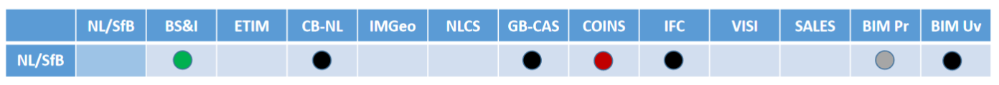

## Landschapsverkenning

Dit hoofdstuk is in ontwikkeling.

### Inleiding

Dit document is een aanzet tot ordening van wat er gebeurt op het gebied van
lsels / standaarden / informatiemodellen / taxonomieën in het
energiedomein en in aanpalende domeinen, daar waar een verbinding bestaat met
installaties in het energiedomein. De afbakening is gebaseerd op ‘common sense’,
getoetst in de kick-off workshop bij Geonovum op 10 februari 2020 en door de
nodige experts te betrekken.

Aandachtspunten:

-   hier ook nog opnemen een inventarisatie van informatieportalen (VIVET-D)?
    Deze hebben vaak ook een relatie met energie-installaties en serveren daar
    data over. Nog niet opgepakt.

-   overzicht RVO ‘Rijksbrede datastromen’ noemt ook nog KvK Handelsregister,
    TNO Ondergrond, Grondwater, Afval, Dieren, RVO Perceelsdatabase.

-   kunnen we de methodiek MHM (Model Harmonisatie Methodiek) van het
    LinkED-project gebruiken?

Gebruikt materiaal

-   Een uitgebreide inventarisatie van Jeroen Baltussen, RVO/Geonovum, genaamd
    ‘Speelveld installatieregister energie-installaties' was de start van dit
    document;

-   De in die inventarisatie opgenomen informatiebehoeften van
    energie-installaties in beleidstukken (Jan Bruinenberg - Alliander,
    Netbeheer NL);

-   De inventarisatie van typen installaties en parameters voor gebouwen en
    netten (EG-ETRM)

-   Uit bouw- en installatiewereld: documenten van Techniek Nederland, de Atlas
    van Open BIM Standaarden 1.3.

### Stakeholders

### Relevante registraties en afsprakenstelsels

#### Afsprakenstelsel 

De overheid is actief op het gebied van digitalisering ([NL
DIGIbeter](https://www.digitaleoverheid.nl/nldigibeter/), [NL
Digitaal](https://www.rijksoverheid.nl/onderwerpen/digitale-overheid/nieuws/2019/03/21/nederland-digitaal-afspraken-voor-betere-samenwerking-digitalisering))
In de [Nederlandse
Digitaliseringsstrategie](https://www.rijksoverheid.nl/documenten/rapporten/2018/06/01/nederlandse-digitaliseringsstrategie)
worden cross-sectorale afsprakenstelsels verkend.

Een afsprakenstelsel is een geschikte infrastructuur voor het op de juiste
schaal *gestructureerd datadelen*; bouwstenen; sectorale focus en verbinding met
andere domeinen. Datadeel-initiatieven bij voorkeur ontwikkelen per sector, maar
zodanig dat je ze kunt verbinden met andere sectoren omdat dit nieuwe use cases
oplevert, bijv. Energie & Bouw/Installatie, Energie en Mobiliteit. Er wordt dan
ook wel gesproken over een datastelsel. Veel ervaring over bouw van
datadeel-initiatieven MKB (rapport Innopay).

Noodzakelijk: kennisuitwisseling, generiek afsprakenstelsel met 9 bouwstenen
voor datadeelcoalitie. Bouwsteen 7: interoperabiliteit van metadata (p.81 en
p.84-90 vv. in rapport Innopay).

Kenmerken van afsprakenstelsel: p. 103-105, ontwikkelingsrichtlijnen: p. 106.

Zie [Bijlage 2](#bijlage-2) voor enkele schema’s en voor toepassing voor
energiesector: zie [Presentatie toekomstige inrichting van uitwisseling en
governance
energiedata](https://github.com/Geonovum/VIVET-Werkomgeving/blob/master/Dossier/Presentatie%20toekomstige%20inrichting%20van%20uitwisseling%20en%20governance%20energiedata.191213.pdf)
door Energie-NL en Netbeheer NL (\@Check: is dit de goede link?)

| Naam                                                                                             | Beschrijving                                                                                                                                                                                                              | Domein            | Opmerking                                                                                                                                                                                                                               |
|--------------------------------------------------------------------------------------------------|---------------------------------------------------------------------------------------------------------------------------------------------------------------------------------------------------------------------------|-------------------|-----------------------------------------------------------------------------------------------------------------------------------------------------------------------------------------------------------------------------------------|
| Installatieregister Techniek NL                                                                  | een samenhangend geheel (‘ecosysteem’) van informatie rondom installaties, stelsel van afspraken om informatie uit tal van databronnen te verbinden. Zie ook [Bijlage 7](#bijlage-7) voor een overzicht van de registers. | Bouw Installaties | bron: Memo 8 nov 2019 Remco vd Linden Niet: één database Bron van data: keuringen, inspecties. Verbinden door open standaarden en classificaties. Verbinden met VIVET en Datastelsel ikv Energiewet 1.0 Proof of Concept door Fluxility |
| Stelsel voor technische producten Bouw en Techniek                                               | ETIM, NL-SfB, Sales en Unifeed bieden een samenhangend stelsel                                                                                                                                                            | Installaties Bouw | sluit aan op bovenstaande                                                                                                                                                                                                               |
| Afsprakenstelsel marktfacilitering | Afspraken rond datauitwisseling in het kader van marktfacilitering en energiewet 1.0 | Energie | Initiatief van Netbeheer NL en Energie NL |
| [DigiDealGO](http://www.digidealgo.nl) omvat ook v/h DSBI (Digitaal Stelsel Bouw en Installatie) | Een overeenkomst tussen de overheid, de brancheverenigingen van de bouw, de installatiesector en de toeleverende industrie, gecoördineerd door de BDR (Bouw Digitaliserings Raad), en ondersteund door het BIM-loket.     |                   | Geeft invulling aan DSGO (Digitaal Stelsel Gebouwde Omgeving); hierop zou Informatiemodel Energie-installaties (en activiteiten ikv Energiewet 1.0) kunnen aansluiten. BDR wordt ondersteund door programmateam ‘Digiteam’.             |
| BIM -Afspraken                                                                                   | Gefaciliteerd door BIM-Loket                                                                                                                                                                                              |                   |                                                                                                                                                                                                                                         |
| [DiS Geo](https://www.geobasisregistraties.nl/basisregistraties/doorontwikkeling-in-samenhang)   | Samenhangende objectenregistraties in Stelsel van Basisregistraties                                                                                                                                                       | Bouw              | Doorontwikkeling in samenhang is initiatief van BZK om de basisregistraties onderling te gaan verbinden en als een stelsel te laten werken                                                                                                                                      |

#### Relevante datasets

De inventarisatie van installatieregisters vindt plaats in het andere
deelproject van project VIVET-E en behoort strikt genomen niet bij dit onderzoek
naar de haalbaarheid van een informatiemodel. Om toch enige context te bieden
volgt hier een opsomming van enkele relevante datasets, waarin data is verzameld
die direct of indirect betrekking heeft op installaties.

NB’s:

-   Genoemde datasets als Windkaarten, ThermoGIS en Mestproductie
    (energiepotentie) hebben die verbinding met installaties niet en maken dus
    geen deel uit van de opsomming.

-   Eenduidige datasets over restwarmte worden verwacht in 2020-Q4.

-   De WoOn-dataset van CBS heeft veel gegevens; deze heeft betrekking op een
    zesjaarlijkse steekproef en is daarom vooralsnog niet in onderstaande lijst
    opgenomen.

-   Er zijn ook registraties tbv CO2-wetgeving (installaties) en tbv
    vergunningen (gemeenten, provincies); onduidelijk is of onderstaande
    opsomming nog moet worden aangevuld.

| Naam                                                                                                                                 | Beschrijving                                                                                                                                                                | Domein                                                                                | Opmerking                                                                                                                                                                                                             |
|--------------------------------------------------------------------------------------------------------------------------------------|-----------------------------------------------------------------------------------------------------------------------------------------------------------------------------|---------------------------------------------------------------------------------------|-----------------------------------------------------------------------------------------------------------------------------------------------------------------------------------------------------------------------|
| Stelsel van basisregistraties                                                                                                        | Wettelijk geregelde registraties                                                                                                                                            |                                                                                       | Relevant: o.a. BAG, BGT, BRO, WOZ. In toenemende mate worden deze registraties verbonden, bijv. IV (Landelijke Inventarisatie Vastgoed), Unique ID, DiSGeo, e.d.                                                      |
| CBS Datasets                                                                                                                         | Registraties voor wettelijke taken, zoals bijv. landelijke energiebalans                                                                                                    | Energie Bouw                                                                          | Deze dataset bevat ook productie-installaties (bijv. WKK) dus deels overlap met CERES.                                                                                                                                |
| C-AR Centraal Aansluitregister, beheerd door [EDSN](http://www.edsn.nl)                                                              | Alle aansluitingen aan de elektriciteit- en gasnetten in NL Beheer EDSN namens de netbeheerders NB: *warmte-aansluitingen* zouden integraal hierin opgenomen moeten worden. | Energie                                                                               | Bevat data over de aansluiting en de energielevering. Mutaties via [www.mijnaansluiting.nl](http://www.mijnaansluiting.nl) EAN-code als id. Zakelijke warmte-aansluitingen zijn niet goed in beeld.                   |
| Leidingenregistratie-systemen van de netbeheerders                                                                                   | Toegankelijk via KLIC (Kadaster)                                                                                                                                            |                                                                                       | Elektriciteit en gas is gereguleerd. *Warmte-netten* niet; wel is er meldplicht bij ACM bij \> 10 aansluitingen.                                                                                                      |
| (NB: er zijn ook private netten)                                                                                                     |                                                                                                                                                                             |                                                                                       |                                                                                                                                                                                                                       |
| Energie Mgmt Systemen Netbeheerders en warmtebedrijven                                                                               | Metingen van energiestromen                                                                                                                                                 |                                                                                       | Metingen elektriciteit vaak per 5 minuten, gas per uur. Kwantiteiten en kwaliteiten. Doorgaans SCADA-software                                                                                                         |
| Meterregistatie Registratie van elektriciteit- en gasmeters. NB: Complex veld (bijv. huish. vs. zakelijk); evt. precies beschrijven. | Bij EDSN namens de netbeheerders. NB: *warmte-meters* zouden integraal hierin opgenomen moeten worden.                                                                      | [VMNED](http://www.vmned.nl) = Vereniging Meetbedrijven Nederland; behartigt belangen | Kealiteit van de meters: VMNED en [Sentiunt](http://www.sentiunt.nl) meterbeheer (tbv woningcorp.). NB: voor warmte bestaan ook radiatormeters, bijv. [Techem](http://www.techem.nl).                                 |
| Aansluitingen en verbruik Rijksvastgoed                                                                                              | Register met alle energie-installaties incl. verbruik van de Rijksoverheid (incl. bijv. Defensie)                                                                           | Energie Bouw                                                                          | Beheerd door RWS                                                                                                                                                                                                      |
| CERES Centrale Registratie van Systeem-elementen                                                                                     | Installaties die elektriciteit produceren of verbruiken Beheer: EDSN                                                                                                        | Energie (productie) Energie (verbruik)                                                | Doelgroep: energiesector Opvolger PIR Wettelijke basis: netcode                                                                                                                                                       |
| Register Glastuinbouw CO2-sector                                                                                                     | Beheer: RVO                                                                                                                                                                 | Energie Land- en tuinbouw                                                             |                                                                                                                                                                                                                       |
| Locaties laadpalen                                                                                                                   | Locaties van alle laadpalen in Europa                                                                                                                                       | Mobiliteit                                                                            | [www.eco-movement.com](http://www.eco-movement.com)                                                                                                                                                                   |
| SCIOS Certificatie-registers [www.scios.nl](http://www.scios.nl)                                                                     | Register van o.a. stookinstallaties van 20/100kW – 50 MW                                                                                                                    | Energie                                                                               | SCIOS verzorgt kwaliteitssysteem technische installaties en beheert ook register van eigenaren, certificeerders.                                                                                                      |
| E-MJV (elektronische milieuverslagen) [www.e-mjv.nl](http://www.e-mjv.nl)                                                            | Bevat jaarverslagen van alle (1000) grote inrichtingen in NL die stoffen emitteren. Beheer: RIVM                                                                            | Water Lucht Afval Energie                                                             | Toegang voor: bevoegd gezag (lucht, water), RVO (lucht, water, energie), RWS (controle advalmodule) Energiemodule: verbruiken, conversies, typen installaties Later: restwarmte? Geen koppelingen tussen inrichtingen |
| ISDE                                                                                                                                 | Investeringssubsidies Duurzame Energie Beheer: RVO                                                                                                                          | Energie                                                                               |                                                                                                                                                                                                                       |
| Energie-audit EED                                                                                                                    | Registers i.k.v. Energy Efficiency Directive (EU, energieaudits) Beheer: RVO                                                                                                | Energie                                                                               | 6000 bedrijven in NL (incl. MJA- en MEE-bedrijven); energie-audit betreft: energiestromen, energieverbruik (gebouw, processen, vervoer, e.d.) en maatregelen                                                          |
| EIA                                                                                                                                  | Energie-investeringsaftrek Beheer: RVO                                                                                                                                      | Energie Bouw Installaties                                                             |                                                                                                                                                                                                                       |
| EP-online                                                                                                                            | Energielabels Beheer: RVO                                                                                                                                                   | Energie Bouw                                                                          |                                                                                                                                                                                                                       |
| SDE                                                                                                                                  | Subsidie Stimulering Duurzame Energie Beheer: RVO                                                                                                                           | Energie                                                                               |                                                                                                                                                                                                                       |
|                                                                                                                                      |                                                                                                                                                                             |                                                                                       |                                                                                                                                                                                                                       |
| Gerelateerd aan datasets:                                                                                                            |                                                                                                                                                                             |                                                                                       |                                                                                                                                                                                                                       |
| [Factsheets TNO](http://www.energy.nl/en/search/?fwp_content_type=factsheets)                                                        | Samenvatting van onderliggende datasets en input voor rekenmodellen                                                                                                         | Energie                                                                               |                                                                                                                                                                                                                       |
|                                                                                                                                      |                                                                                                                                                                             |                                                                                       |                                                                                                                                                                                                                       |

### Relevante informatiemodellen

-   definitie informatiemodellen

Informatiemodellen kunnen op diverse schaalniveaus worden toegepast; we zijn
geïnteresseerd in IM’en met een zo groot mogelijk bereik die nog wel
betekenisvol zijn.

| Naam                            | Beschrijving                                                             | Domein                         | Opmerking                                                                                                                                                                          |
|---------------------------------|--------------------------------------------------------------------------|--------------------------------|------------------------------------------------------------------------------------------------------------------------------------------------------------------------------------|
| IEC CIM (Common Information Model )   | IM voor het elektriciteitsdomein (van assets tot marktmechanismen, etc.) | Energiesysteem (elektriciteit) | Wereldwijd toegepast, alleen elektriciteit als energiedrager. Doel: informatie-uitwissleing over elektriciteitssysteem. https://en.wikipedia.org/wiki/Common_Information_Model_(electricity) |
| BIM                             | Bouw Uniformatie Model                                                   | Bouw Installatie               | verschillende definities van BIM: een werkmethodiek, een digitale representatie van alle fysieke en functionele kenmerken van een gebouw.                                          |
| IFC Industry Foundation Classes | Beschrijft data voor architectuur en bouw                                | Bouw                           | Zie verder: [en.wikipedia.org/wiki/Industry_Foundation_Classes](https://en.wikipedia.org/wiki/Industry_Foundation_Classes) - relatie met BM                                        |
| COINS                           | Semantisch datamodel en uitwisselingsformat                              | Bouw                           | Gebruikt voor o.m. BIM-data, GIS-data, SE-data (Systems Engineering). Uitwisseling semantisch BIM (OWL)                                                                            |
| CERISE-SG                       | IM-SG                                                                    | Energie Bouw Geo               | Zie [Bijlage 6](#bijlage-6)                                                                                                                                                        |
|                                 | Informatie-model Smart Grids voor energiebalancering                     |                                |                                                                                                                                                                                    |
|                                 |                                                                          |                                |                                                                                                                                                                                    |

#### Relevante standaarden en taxonomieën

#### Standaarden

\*\* Definitie standaarden, normen

| Naam                                                                                                                                                                       | Beschrijving                                                                     | Domein            | Opmerking                                                                         |
|----------------------------------------------------------------------------------------------------------------------------------------------------------------------------|----------------------------------------------------------------------------------|-------------------|-----------------------------------------------------------------------------------|
| ESDL [TNO](https://www.tno.nl/nl/aandachtsgebieden/informatie-communicatie-technologie/expertisegroepen/monitoring-control-services/grip-op-de-energietransitie-met-esdl/) | Open-sourcetaal om informatie voor de energietransitie te beschrijven.           | Energiesysteem    | Veelal gebruikt bij energie-rekenmodellen.                                        |
|                                                                                                                                                                            |                                                                                  |                   | [Bijlage 3](#bijlage-3) bevat voorbeeld                                           |
| [NEN 2660:1996/C1:1996 nl](https://www.nen.nl/NEN-Shop/Norm/NEN-26601996C11996-nl.htm)                                                                                     | Ordeningsregels voor gegevens in de bouw - Termen, definities en algemene regels | Bouw              |                                                                                   |
| Sales Unifeed                                                                                                                                                              | Standaard berichtensets                                                          | Bouw Installaties | Met deze berichtensets kan informatie uit UOB en ETIM worden ontsloten.           |
| IEC 61970 /IEC 61968 / IEC 62325   | Set aan standaarden rondom IEC CIM   | Elektriciteit                  | Standaard voor informatie uitwisseling in het elektriciteitsdomein.                                                                             |

#### Taxonomieën / classificaties

\*\* Definities opnemen

In de bouw-sector zijn veel standaarden die een relatie met elkaar hebben. Door
het BIMLoket zijn deze met elkaar in verband gebracht en zijn de
standaarden/taxonomieën beschreven in de [Atlas van open
BIM-standaarden](https://www.bimloket.nl/Atlasvan-open-BIM-standaarden).

Zie ook [Bijlage 1](#bijlage-1).

NB: Voorlopig is dat in dit document ondergebracht onder het kopje
‘Taxonomieën/classificaties’ en niet onder ‘Standaarden’.

Een voorbeeld van dit verband is:

Op het gebied van biomassa / biofuels bestaan (internationale)
classificatieschema’s. Deze worden nog nagezocht, o.a. bij Team Biomassa van
RVO.

| Naam                                                                                                             | Beschrijving                                                                                                                       | Domein                    | Opmerking                                                                                                                                                                                                                                                                                                                                                                                                                   |
|------------------------------------------------------------------------------------------------------------------|------------------------------------------------------------------------------------------------------------------------------------|---------------------------|-----------------------------------------------------------------------------------------------------------------------------------------------------------------------------------------------------------------------------------------------------------------------------------------------------------------------------------------------------------------------------------------------------------------------------|
| Lijst met energiedragers                                                                                         | Beheer: RVO                                                                                                                        |                           |                                                                                                                                                                                                                                                                                                                                                                                                                             |
| ETIM [www.ketenstandaard.nl](http://www.ketenstandaard.nl) & Stabu & BS&I                                        | Product-classificatie voor technische producten bestekken                                                                          | Bouw Installatie          | ETIM wordt beheerd door ‘Ketenstandaard Bouw en Techniek’. Internationaal Ketenstandaard en Stabu gaan fuseren                                                                                                                                                                                                                                                                                                              |
| [NL-SfB](http://www.bimloket.nl/NL-SfB)                                                                          | Classificatie van bouwdelen en installaties (‘elementen’)                                                                          | Bouw Installatie          | Gebruikt in bouwproces, link met BIM en CAD-systemen                                                                                                                                                                                                                                                                                                                                                                        |
| [CB-NL](http://www.public.cbnl.org)                                                                              | Conceptbibliotheek voor de gebouwde omgeving                                                                                       | Bouw                      | Een digitale semantische bibliotheek met een verzameling van taaldefinities van objecten en ruimtes die uniformerend werken tussen bestaande standaarden, normen en object-/productbibliotheken.                                                                                                                                                                                                                            |
|                                                                                                                  |                                                                                                                                    |                           | De CB-NL wordt de verbinder tussen bronnen, zoals die van RAW, STABU, NEN, IMGeo, ETIM en Rioned                                                                                                                                                                                                                                                                                                                            |
| [UOB](http://www.openuob.nl) Uniforme objecten bibliotheek Technische installatieproducten o.b.v. ETIM-MC        | Een openbare, niet-merkgebonden online bibliotheek van geometrische modellen, waaraan alle fabrikanten producten kunnen toevoegen. | Bouw Installatie          | Wordt beheerd door [2BA](http://www.2ba.nl), dé neutrale datapool van handels- en productgegevens in de installatiebranche. Elk installatiebedrijf kan onafhankelijk van de eigen software de objecten uit de bibliotheek gebruiken voor het ontwerpen van gebouwinstallaties. Met één uniform informatiemodel wisselen de CAD-systemen productinformatie snel en nauwkeurig uit, in elke fase van het bouw- en BIM-proces. |
| [IP 2020](https://www.rvo.nl/onderwerpen/duurzaam-ondernemen/energie-besparen/informatieplicht-energiebesparing) | Informatieplicht energiebesparing Beheer: RVO                                                                                      | Energie Bouw Installaties | Overzicht [erkende maatregelen](https://www.rvo.nl/onderwerpen/duurzaam-ondernemen/energie-besparen/informatieplicht-energiebesparing/bedrijven-en-instellingen/erkende-maatregelenlijsten)                                                                                                                                                                                                                                 |
| [Entso-e codelist](https://docstore.entsoe.eu/Documents/EDI/Library/Core/entso-e-code-list-v29r0.pdf) Paragraaf 3.2
)    | Lijst met de codes voor productie installaties zoals gebruik in GLDPM.                                                                                                              | Elektriciteit  | Binnen de Ensto-e gestandaardiseerd   |

### Relevante rekenmodellen

### Relevante projecten

Afspraken zijn hier cruciaal, maar het beperkt zich niet tot het verbinden van
informatiemodellen / metadata.

| Naam                                                                 | Beschrijving                                                                   | Domein                                            | Opmerking                                                                                                                                              |
|----------------------------------------------------------------------|--------------------------------------------------------------------------------|---------------------------------------------------|--------------------------------------------------------------------------------------------------------------------------------------------------------|
| Datastelsel Utiliteitsbouw                           | Energiedossier per gebouw, verbinden EAN/BAG/BRK / benchmarks / gebouwkenmerken / maatregelen   | Energie Bouw   | Doelgroep: gebouweigenaren, omg.diensten, diensten-leveranciers (software). Door RVO in opdr. van BZK via Platform Duurzame Huisvesting; 1e helft 2020 |
| Digitale dossiers i.k.v. WKB (Wet kwaliteitsborging voor het bouwen) | Realiseren uniforme dossiervorming van opgeleverde bouwwerken                  | Bouw Installaties                                              | “Ten minste voor dossier bevoegd gezag en consumentendossier” Bron: notitie Begeleidingsgroep 19 dec 2019                                              |
| Consumentendossier | Dosier dat aanemer overhandigt met volledig inzicht in het bouwwerk en bijbehorende installaties  | Gebouw Installaties | Verplicht in het kader van de WKB |
| Digitaal Gebouwdossier | Uitwerken concept digitaal gebouwdossier in een startarchitectuur | Gebouw | BZK initiatef adhv 3 use cases: consumentendossier, dossier bevoegd gezag, het vernieuwde energielabel en het platform verbeterjehuis.nl |
| Informatie-behoefte dmv document-analyse                             | Analyse van 49 brondocumenten naar informatiebehoeften                         | Energie Installaties Bebouw                      | door Jan Bruinenberg (Alliander / Netbeheer NL) Resultaat: bijna 3000 informatievragen Zie [Bijlage 4](#bijlage-4) voor de onderkende installatietypen |
| Gebouwen en installaties tbv rekenmodellen                           | Een inventarisatie door EG-ETRM (ExpertGroep EnergieTransitieRekenModellen)    | Energie Installaties Gebouw                       | Installatietypen, parameters, verschillende ruimtelijke schaalniveaus. Zie [Bijlage 5](#bijlage-5)                                                     |
| EGO Datavoorziening Energietransitie Gebouwde Omgeving               | Een hulpmiddel voor gemeenten om deTransitieVisie Warmte op te kunnen stellen. | Energie Bouw                                      | Initiator: [Programma Aardgasvrije wijken](https://www.aardgasvrijewijken.nl/).                                                                        |
| PoC voor centraal, geaggregeerd Installatie-Register                 | Installatieregister                                                            | Installaties                                      | Initiator: Techniek NL                                                                                                                                 |
| TKI Linked energy data (LinkED)   | Het ontwikkelen van een methode voor het komen tot gemeenschappelijke informatiestandaarden en informatiesystemen | Energie | Resultaat (gereed) Model Harmonisatie Methodiek (MHM). Initiatief van Netbeheerders en TNO | 
| UOI: Unieke Object Identificatie | Internationale koppeling voor gebouwregistraties                                                                                                                                                       | Gebouw              |  BZK initiatief binnen DisGEO en gerelateerd aan WKB verplichtingen (Wet Kwaliteitsborging voor Bouwen)                                                                                                                                  |

### Relevante documentatie

