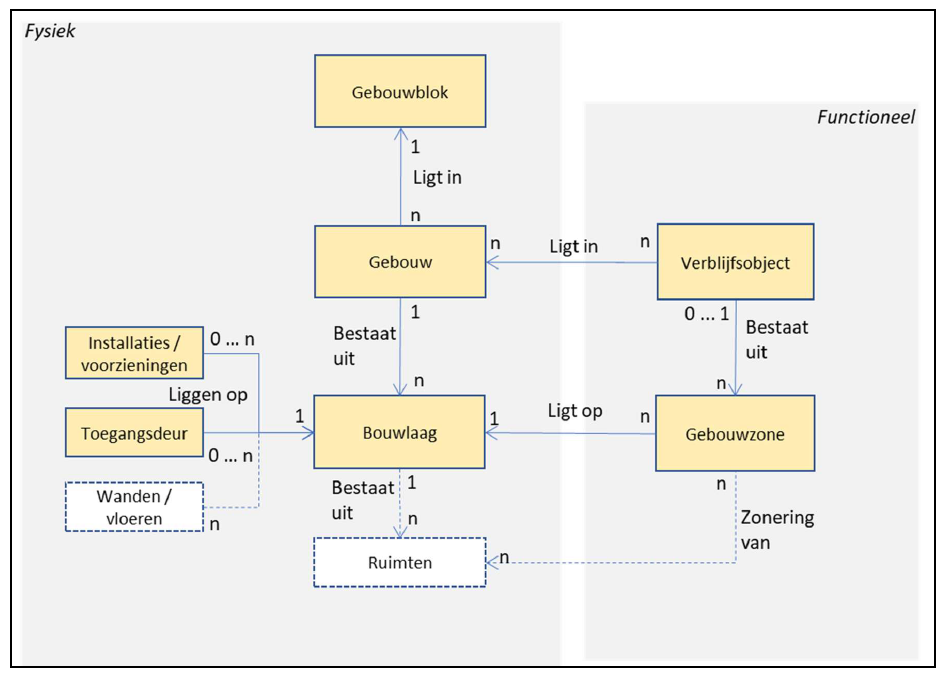
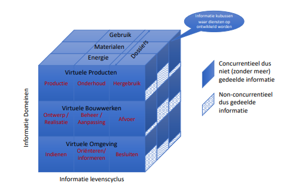
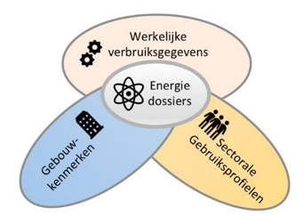
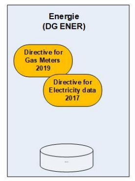

Use case 1 – Gebouw en energie
------------------------------

#### Mogelijke scope

-   gebouwen: link met gebouw decompositie, datastelsel utiliteitsbouw,
    installatieregister, EAN \<\> BAG, DiSGeo, WKB, en andere projecten in de
    kolom ‘Bouw’ (schema hierboven)  
    leidt tot bijv. IM-Gebouw, als verbinding tussen Energie / Installatie /
    DiSgeo / BIM

#### Omgevingsanalyse / stakeholders

Aan de use case ‘Gebouw en Energie’ direct gerelateerde Initiatieven en partijen
(stakeholders, bestuurlijke organisaties):

| **Uitvoerings-initiatieven**                                                  | **Stakeholders**                  | **Belang van stakeholders**                                                                                 | **Bestuurlijk**            | **Rol Vivet**                                                                                          |
|-------------------------------------------------------------------------------|-----------------------------------|-------------------------------------------------------------------------------------------------------------|----------------------------|--------------------------------------------------------------------------------------------------------|
| **RES, TVW (Warmte transitieplannen)**                                        | RES, ETRM, PBL, CBS               | Randvoorwaardelijk voor ET, Inzicht in energieverbruik, Input voor TVW                                      | BZK, EZK                   | VIVET core belang, standaardisatie en afspraken                                                        |
| **EAN-BAG koppeling**                                                         | Netbeheer NL, Kadaster, CBS, EDSN | Energiewet, koppelen verbruik en gebouwen                                                                   | ACM, EZK                   | parallel met Vivet VII; kennis, verbinden, start- / top model aanleveren                               |
| **WEU ( Werkelijk Energieverbruik Utiliteitsgebouwen)**                       | RVO, Platform duurzaam bouwen     | In 2020 werkende 1e versie opleveren                                                                        | BZK, Topsector energie     | In sept / okt start model aanleveren                                                                   |
| **DisGeo**                                                                    | BZK en partners                   | Uitwerken IM mbv use cases                                                                                  | BZK                        | Koppeling Basisregistraties met energiedomein                                                          |
| **Installatieregister**                                                       | TechniekNL                        | Verbinding met ketenpartners en invulling afsprakenstelsel-gedachte                                         | EZK                        | Verbinden installatie domein met DisGeo (o.a. gebouwen) en energiedomein                               |
| **Opstellen van datastandaard energienetten door en voor alle netbeheerders** | Netbeheerders                     | Eigen informatiesystemen ‘tijd-stabiel’ verbinden met ‘buitenwereld’ (basisreg., IMKL, DSO, etc.)           | pm                         | Direct verbonden met Vivet IV, maar ook relatie met bijv. Vivet VII                                    |
| **DSO Digitaal Stelsel Omgevingswet**                                         | Partijen DSO                      | Ow kan gemakkelijk gewijzigde info mbt energie-infra opnemen                                                | Gemeenten, Provincies, BZK | Afstemming DSO en Energiedomein: begrippen, datastandaarden en informatiemodellen                      |
| **ESDL**                                                                      | TNO                               | EDSL vermarkten en uitbreiden                                                                               | Topsector energie          | Harmoniseren ESDL met DisGeo en andere domeinen                                                        |
| **Vivet partners**                                                            | BZK, EZK                          | Creëren en bewaken van samenhang informatie-modellen, Realiseren ontwikkelen en Beheer IM energie-transitie |                            | Initiatief en realiseren samenhang en standaardisatie van informatie in energie en aanpalende domeinen |

Er zijn ook initiatieven die *indirect* gerelateerd zijn aan deze use case; wel
aan het energiesysteem, maar losser aan de gebouwde omgeving. Die zijn in
onderstaande tabel opgenomen:

| **Uitvoerings-initiatieven**                   | **Stakeholders**          | **Belang van stakeholders**                                                                                      | **Bestuurlijk** | **Rol Vivet**                                       |
|------------------------------------------------|---------------------------|------------------------------------------------------------------------------------------------------------------|-----------------|-----------------------------------------------------|
| **Afsprakenstelsel Facilitering Energiemarkt** | Sectoren in energiedomein | Energieverbruiken en opwek verbinden met basisregistraties (proces-aspect marktfacilitering is losser verbonden) | EZK             | afstemming datamodellen energiemarkt                |
| **Energiewet**                                 | EZK, Energiesector        | Data is één van de pijlers in de wet; datastandaarden zorgen voor een fundament                                  | EZK             | data-aspecten van energiewet verwerken in projecten |

#### Relevante documenten 

##### Bouwwerken in samenhangende objectenregistratie

Binnen het programma Samenhangende Object Registraties (SOR) is een onderzoek uitgevoerd naar de realisatie van een model voor bouwwerken. Het resulterende model is nog in een 'houtskoolschetsfase'.

Een belangrijke constatering in het onderzoek is dat het BIM-concept als meest belovend uitgangspunt is genomen. Voor het domein van energie en energie-installaties lijkt dat een goed uitgangspunt omdat er een relatie met de (utiliteits)bouw sector is.

Figuur X: Model voor gebouw in ontwikkeling bij SOR (bron: Eindrapport werkgroep bouwwerken, SOR 25-02-2020)

Een uitgangspunt van het model is dat op elk niveau behalve het kleinste het geheel uit delen is op te bouwen.
Dit model is te vertalen naar de concepten van de IFC standaard. Het model is in ontwikkeling, doorontwikkeling is o.a. naar 3D.

Interessant is het concept Installaties / voorzieningen:
Omschrijving:  
Geheel van een relevantie installatie of andere voorziening in of aan en ten dienste van het Gebouw(blok).
Toelichting:  
Begrip gebaseerd op de fysieke deelobjecten uit de WOZ, de GebouwInstallatie uit NEN.

Het is de vraag of in, op of aan het gebouw aanwezige energie-installatie hier ook onder vallen.

##### Common ground architectuurprincipes

PM

##### Digideal Gebouwde Omgeving

De DigiDealGO kan worden beschouwd als de Nationale Digitaliseringsagenda voor de Gebouwde Omgeving.

Citaat uit document DigiDealGO: *' Voor de circulaire bouweconomie is op termijn een actuele virtuele kopie van
het bouwwerk nodig gekoppeld aan digitale product- en materiaalinformatie Voor Smart Cities,
energietransitie en waterhuishouding moeten we slimme bouwwerken koppelen aan actuele
omgevingsinformatie. Het gaat om informatie-ketens en diensten rondom een virtueel bouwwerk
dat de levenscyclus van dat bouwwerk volgt (van ontwerp tot sloop)' *

Figuur X: Het virtuele bouwwerk (middelste laag) draagt de informatie over het fysieke bouwwerk gedurende zijn levenscyclus. Verschillende dossiers waaronder energie zijn gekoppeld aan het virtuele bouwwerk. (bron: Digitaal Stelsel Gebouwde Omgeving, versie 0.9 - Concept)

DigiDealGo werkt met 'versnellingsprojecten' die passen binnen de visie.

Het project Datastelsel Energieverbruik Utiliteit is een project met een DigiDealGo stempel.
Dat project heeft o.a. als doel meer data-gedreven verduurzaming.

DatastelselEnergieverbruikUtiliteit.png

Figuur X:  Data-gedreven verduurzamingsprojecten kenmerken zich veelal door realistische business-cases en lagere integrale
kosten.  (bron: Project Datastelsel Energieverbruik Utiliteit)

##### Digitaal Gebouwdossier

PM

##### DiSGeo

PM

##### Europa en data-infrastructuur voor fysieke leefomgeving

 “In 2024 is de Nederlandse
INSPIRE-infrastructuur de basis voor het beantwoorden van de pan-Europese vraag naar geo- en milieuinformatie. Hiermee draagt INSPIRE bij aan het versterken van het klimaat- en milieubeleid. Europese en
internationale instanties halen kwalitatief hoogwaardige INSPIRE-data bij de Nederlandse dataproviders (en
vice versa). De vraag naar gegevens wordt daarbij leidend, daarom wordt bij het harmoniseren van
gegevens prioriteit gegeven aan gegevens waar vraag naar is”

INSPIRE is onderdeel van de Europese Green Deal, een nieuwe groeistrategie, die de EU moet omvormen tot een eerlijke en
welvarende samenleving, met een moderne, hulpbronnenefficiënte en concurrerende economie, waar vanaf
2050 netto geen broeikasgassen meer worden uitgestoten en economische groei is losgekoppeld van het
gebruik van hulpbronnen. Het nieuwe Europese beleid kent twee belangrijke pijlers: de vergroening in de Green Deal en digitalisering
oftewel ‘’Shaping Europe’s digital future’. In de Europese Datastrategie promoot de Commissie de ontwikkeling van een gemeenschappelijke Europese
data space om de ontwikkeling van een data economie te ondersteunen en het gegevensgebruik in de hele
EU te vergroten.

Figuur X:  Het energiedomein (a Common European energy data space) is een onderdeel van de gedeelde Europese dataspace. (bron: Quick scan Europa en data-infrastructuur fysieke leefomgeving)

DG ENER omvat nieuw EU beleid rond energie en data.

##### Installatiergister Visie TN

PM

##### Landelijke Informatievoorziening Vastgoed - behoeftenonderzoek

PM

##### PIR Logisch gegevensmodel

PM

##### Referentiemodel Stelsel Basisregistraties

PM

##### TNO Data voor TVW en WUP

Inventarisatie van bechikbare data voor het opstellen van Transitievisie Warmte
en Wijkuitoveringsplannen door gemeenten.

##### Unieke Object Identifier

Verkenning in het kader van:

1.regie op bouwgegevens

2.samenhangende objectenregistratie

##### Werkelijke Energieverbruik Utiliteitsgebouwen (WEU)

Het opvragen van verbruiksgegevens door zakelijke energiecontractanten,
vastgoedeigenaren en gebouweigenaren. Andere gebruikers zijn Omgevingsdiensten
(tbv handhaving), ODA’s en beleidsmakers.

##### Data Sharing Coalition

<https://datasharingcoalition.eu/>

Gerelateerd aan Data Deel Afsprakenstelsel?
