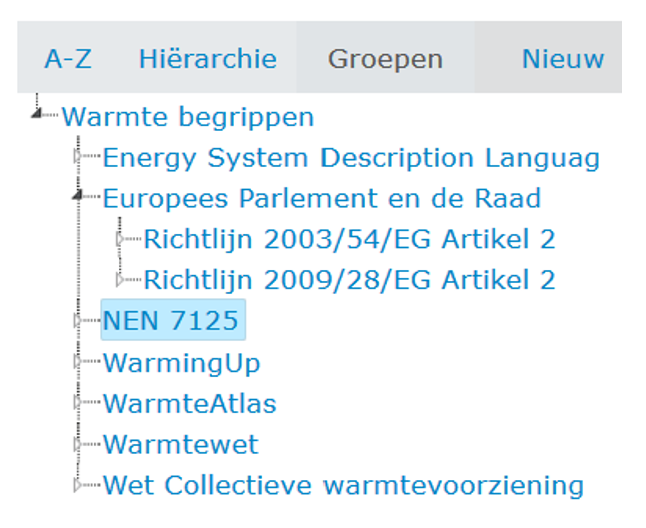
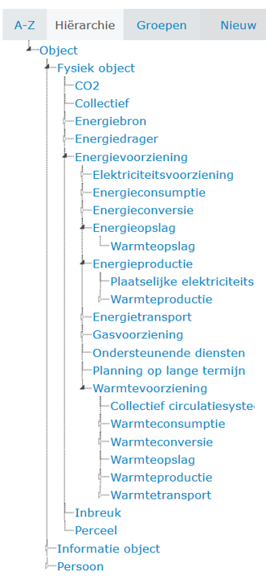

Hoofdstuk Begrippencatalogus Warmte
-----------------------------------

*Dit hoofdstuk: ??*

### Inleiding
Eerst wordt de opzet van de begrippencatalogus beschreven: de
scope, de keuzen bij de *inrichting* van de onderscheiden Groepen, Hïerarchie en
Begrippen.

Vervolgens wordt de *inhoud* van de Groepen, Hïerarchie en Begrippen kort
beschreven, met verwijzingen naar bijlagen en naar de begrippencatalogus zelf.

### Verantwoording van de inrichting van de begrippencatalogus

-   keuzen bij de opzet van de Begrippencatalogus.

Bijv. Context van de begrippencatalogus: verbindingen met andere
begrippencatalogi, zoals die van de basisregistraties?

Bijv. ‘Warmte’ als keuze leidt tot ‘Energiedragers’ als hoger niveau.
Energietransitie is thema voor Vivet, maar Energievoorziening is universeler
term.

Bijv. Momenteel (2021) is de term ‘systeemintegratie’ in zwang, waarbij men
doelt op samengaan van elektriciteit, gas, warmte en andere nog te ontwikkelen
energiedragers. Met de inrichting van deBegrippencatalogus moet je daarmee
rekening houden. De energiecapability ‘Energieconversie’ is hier een
sleutelbegrip.

Zijn er nog meer afwegingen gemaakt die het vermelden waard zijn?

-   keuzen bij het bepalen van de Groepen

Inventarisatie op basis van stakeholder-analyse, Vivet-rapportages, kennis van
energiesector en warmtedomein (literatuur, interviews, ervaring in de sector).

keuze gemaakt om de herkomstbronnen als groepen op te nemen; argumenten daarvoor

-   keuzen bij het bepalen van de Hiërarchie (methode v opdeling

veel herkomstbronnen bevatten begrippen en definities zonderdaar verbindingen
tussen aan te leggen. ESDL heeft dat wel. Daarom deze indeling, met name de vijf
z.g. energie-capabilities die daar centraal staan, als basis genomen voor de
verdere opzet en indelling van de begrippencatalogus.

Methode van opdeling (MIM..., koppeling andere (basis)registraties)

### Beschijving van de Groepen / Herkomstbronnen

-   Opsomming en korte beschrijving van de bronnen van de definities onder
    Groepen
<figure id="Groepen">

<figcaption>Groepen</figcaption>
</figure>
Hier verwijzen naar in bijlage op te nemen document ‘*Herkomstbronnen
begripsdefinities per energiedrager*’. met wat wel en wat niet in aanmerking
komt voor begrippencatalogus en een beetje toelichting op deze lijst. Ook
verwijzen naar het bijbehorende (bollen) schema

Geen structuur opgezet tussen de opgenomen groepen

-   Korte toelichting per opgenomen Groep in begrippencatalogus

### Beschrijving van de Hiërarchie

-   Uitleg van de hierarchie (zie ook ESDL uitleg document van Edwin Mathijssen,
    evt in bijlage opnemen)
<figure id="Hiërarchie">

<figcaption>Hiërarchie</figcaption>
</figure>
-   met voorbeeld : object - fysiek object - energievoorziening -
    energietransport - warmtetransport - aansluiting

### Beschrijving van de Begrippen

-   Algemene toelichting op begrippen in begrippencatalogus

Welke velden worden vastgelegd per begrip.

-   Enkele voorbeelden met plaatje en uitleg van begrippen en relaties tussen
    begrippen

-   Eén of meerdere afbeeldingen uit de begrippengraph (wolk) van
    Begrippencatalogus Warmte met ook verbinding met andere begrippen
    (basisregistraties?).
