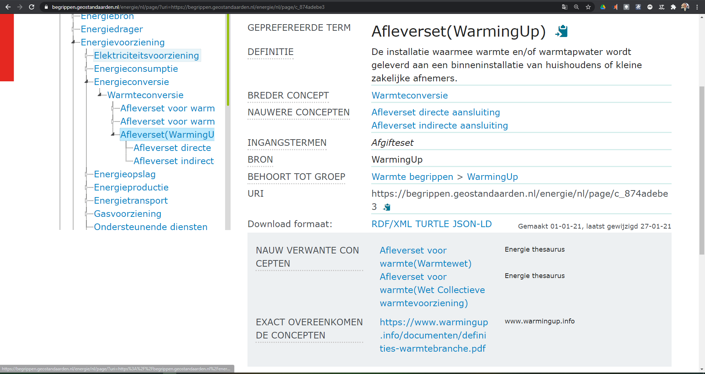
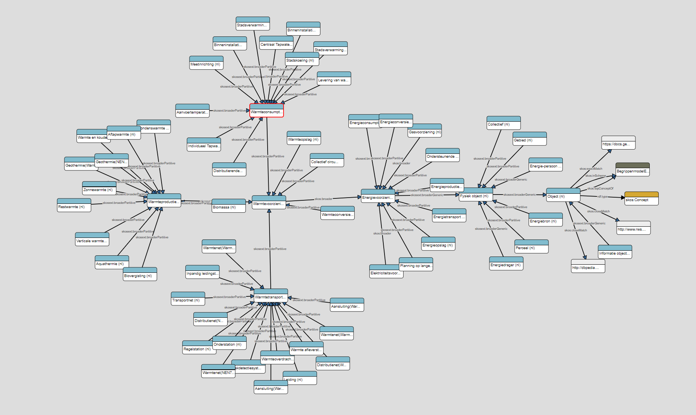

Hoofdstuk Begrippencatalogus Warmte
-----------------------------------

\*Dit hoofdstuk: ??\*

### Inleiding

De begrippencatalogus Energiedragers bevat de begrippen uit het Nederlandse

energielandschap. Het is een online woordenboek dat zowel voor mensen als

machines te doorzoeken is. Dit woordenboek brengt begrippen vanuit verschillende

begrippenkaders uit de energiewereld samen en biedt een transparant platform

voor vergelijking en harmonisatie. De focus van de begrippencatalogus ligt
initieel op de energiedrager warmte, maar er is al voorgesorteerd op de andere
energiedragers. De begrippen zijn overgenomen uit een

groeiende lijst van bronnen zoals:

- Warmtewet

- Wet Collectieve warmtevoorziening

- NEN 7125

- Richtlijnen van het Europees Parlement en de Raad

Door de overzichtelijke zoekfunctie op term, definitie en bron helpt de

Begrippencatalogus Energie de leesbaarheid en toepassing van deze bronnen te

vergroten.

De technologie achter de Begrippencatalogus biedt de ruimte om de Begrippen op
verschillende manier en te bekijken. Er kan voor gekozen worden de begrippen
alfabetisch weer te geven, binnen een hiërarchie, of vanuit vooraf bepaalde
groepen. Ook kunnen alle nieuw toegevoegde begrippen worden bekeken. Hoe deze
mogelijkheden ingericht zijn wordt uitgelegd in de volgende paragraaf.

### Verantwoording van de inrichting van de begrippencatalogus

In deze paragraaf zal dieper worden ingegaan op de inrichting van de
begrippencatalogus. Hierbij zal ook woorden ingegaan op de technologie dit is
gebruikt om de Begrippencatalogus te realiseren.

De technologieën hierachter zijn Linked Data technologieën. Dit houd in dat ze
ontworpen zijn conform de 4 [Linked Data Principes](
<https://www.w3.org/DesignIssues/LinkedData.html>). Deze 4 principes zijn:

1.  Gebruik URI’s (Unique Resource Identifiers) om dingen te benoemen.

2.  Gebruik HTTP URI’s zodat mensen deze namen kunnen opzoeken.

3.  Zorg dmv gebruik van standaarden, voor bruikbare informatie voor wanneer
    iemand een URI opzoekt.

4.  Voeg links naar andere URI’s toe zodat mensen meer dingen kunnen ontdekken.

Een voorbeeld van een technologie die deze principes toepast is het [Simple
Knowledge Organization System](
https://www.w3.org/TR/2009/REC-skos-reference-20090818/), afgekort SKOS. SKOS
wordt gebruikt in de Begrippencatalogus energiedragers om de begrippen te
structureren. Daarnaast wordt ook gebruik gemaakt van verschillende
metadata-[vocabulaires]( https://www.pldn.nl/wiki/Vocabularies). Deze
vocabulaires bevatten een aantal gestandaardiseerde constructies die kunnen
worden gebruikt, om meer bruikbare informatie toe te voegen aan dingen. Door het
gebruik van deze Linked Data technologieën wordt de data kwaliteit beter en
worden dingen beter vindbaar voor zowel mensen als machines.

#### Beschrijving van de Begrippen

De begrippen in de Begrippencatalogus zijn afkomstig uit verschillende bestaande
begrippenlijsten. Deze begrippenlijsten staan vaak ergens verstopt in een pdf
bestand of ergens binnen een wetsartikel. Hierdoor vallen deze begrippen vaak
lastig te vinden en al helemaal lastig te vergelijken. Binnen de
Begrippencatalogus worden alle relevante begrippen ingevoerd als een [SKOS
concept](<https://www.w3.org/TR/2009/REC-skos-reference-20090818/#concepts>).
Een SKOS concept wordt gedefinieerd als een idee of een begrip door de SKOS
specificatie, daarom is dit de geschikte klasse om aan energiebegrippen te
koppelen.

Begrippen kunnen verschillende eigenschappen hebben. Om te voldoen aan het derde
Linked Data principe, nemen we per begrip in de begrippencatalogus een aantal
eigenschappen op. Naar deze eigenschappen wordt ook wel eens gerefereerd met de
termen: “Linked Data properties” of “metadata”. Om de begrippen in de
begrippencatalogus vergelijkbaar te maken met andere Linked Data thesauri, wordt
gebruik gemaakt van een veelgebruikte vocabulaire. Deze vocabulaire, [Dublin
Core]( <https://www.dublincore.org/specifications/dublin-core/dcmi-terms/>)
bevat eigenschappen die worden gebruik op veel verschillende websites op het
internet. Het gebruik van vocabulaires sluit ook aan bij de OWMS 4.0 mantel
(Overheid.nl Web Metadata Standaard). Welke eigenschappen precies per begrip
gebruikt worden is te vinden in de onderstaande tabel.

| Eigenschap         | Linked Data Property                                               | Omschrijving                                                                                                                                                                                                             |
|--------------------|--------------------------------------------------------------------|--------------------------------------------------------------------------------------------------------------------------------------------------------------------------------------------------------------------------|
| Geprefereerde term | [skos:prefLabel](http://www.w3.org/2004/02/skos/core\#prefLabel)   | Bevat de naam van het begrip in tekst. Deze naam wordt weergegeven in de publicatieomgeving. Achter de geprefereerde term wordt tussen haakjes de Bron herhaald als verschillende bronnen hetzelfde begrip definiëren.   |
| Bron               | [dct:source]()                                                     | In dit veld wordt de bron van herkomst opgeslagen van het begrip.                                                                                                                                                        |
| Definitie          | [skos:definition](http://www.w3.org/2004/02/skos/core\#definition) | Binnen het definitie veld wordt de betekenis van het begrip vastgelegd. Uit de definitie komt de semantiek van het begrip voort.                                                                                         |
| Ingangstermen      | [Skos:altLabel](http://www.w3.org/2004/02/skos/core\#altLabel)     | Een andere naam voor het begrip. Dit kan bijvoorbeeld een synoniem zijn of een afkorting.                                                                                                                                |
| In schema          | [skos:inScheme]()                                                  | Deze eigenschap maakt het voor machines leesbaar dat een begrip bij de begrippencatalogus hoort.                                                                                                                         |
| Laatst aangepast   | [dct:modified]()                                                   | Wordt niet weergegeven op de publicatieomgeving, maar wordt gebruikt om het voor het systeem traceerbaar te maken wanneer een begrip voor het laatst is aangepast. Wordt automatisch bijgehouden door de beheeromgeving. |
| Aangemaakt         | [dct:created]()                                                    | Wordt niet weergegeven op de publicatieomgeving, maar wordt automatisch toegevoegd wanneer het begrip in de begrippencatalogus wordt aangemaakt.                                                                         |
| Toelichting        | [skos:scopeNote](http://www.w3.org/2004/02/skos/core\#scopeNote)   | Dit is een extra veld waar tekstuele toelichtingen over het begrip kunnen worden opgeslagen.                                                                                                                             |

Naast deze bruikbare informatie over het begrip zelf, bied de begrippencatalogus
ook mogelijkheden begrippen om begrippen aan elkaar te relateren. Relaties zijn
binnen Linked Data technisch gezien vergelijkbaar met eigenschappen. Per begrip
kan worden bijgehouden welke andere interne-, of externe-begrippen gerelateerd
zijn. Een relatie kan worden gebruikt om begrippen op elkaar te mappen of om de
hiërarchie tussen begrippen aan te duiden. Binnen de SKOS standaard zijn een
heel aantal relaties opgenomen. Een aantal die binnen de begrippencatalogus zijn
gebruikt, zullen in de tabel hieronder nader worden toegelicht.

| Relatie                     | Linked Data Property                                               | Omschrijving                                                                                                                                                                                                                                                                   |
|-----------------------------|--------------------------------------------------------------------|--------------------------------------------------------------------------------------------------------------------------------------------------------------------------------------------------------------------------------------------------------------------------------|
| Exact overeenkomend concept | [skos:exactMatch](http://www.w3.org/2004/02/skos/core\#exactMatch) | Legt een link naar een concept dat wat betreft betekenis exact overeenkomt. Deze relatie wordt gebruikt om de link te legen naar de bron van het begrip.                                                                                                                       |
| Nauw verwant concept        | [skos:closeMatch](http://www.w3.org/2004/02/skos/core\#closeMatch) | Legt een link naar een begrip dat wat betreft betekenis nauw verwant is. Deze wordt gebruikt om binnen de begrippencatalogus verschillende begrippen met een vergelijkbare betekenis aan elkaar te koppelen. Bijvoorbeeld begrippen met dezelfde naam, maar andere definities. |
| Breder concept              | [skos:broader](http://www.w3.org/2004/02/skos/core\#broader)       | Deze relatie wordt gebruikt om de structuur binnen de begrippencatalogus te brengen. Een breder begrip ligt in de hiërarchie boven een ander begrip.                                                                                                                           |
| Nauwer concept              | [skos:narrower](http://www.w3.org/2004/02/skos/core\#narrower)     | Deze relatie is precies het tegenovergestelde van de breder relatie.                                                                                                                                                                                                           |
| Gerelateerd concept         | [skos:related](http://www.w3.org/2004/02/skos/core\#related)       | Deze relatie zegt dat er een relatie bestaat met een ander concept. Deze relatie wordt niet verder geduid en is minder sterk dan de andere relaties dit in deze tabel genoemd staan.                                                                                           |

Op de afbeelding hieronder is een voorbeeld te zien van het begrip Afleverset.
Aan “WarmingUp” tussen haakjes is te zien dat het hier gaat over een begrip dat
uit WarmingUp komt, maar dat binnen de begrippencatalogus meerdere keren
voorkomt. Rechts in beeld vallen de verschillende eigenschappen en relaties
terug te vinden.

<figure id="voorbeeldBegrip">

<figcaption>Voorbeeld van een Begrip binnen de publicatieomgeving van de Begrippencatalogus.</figcaption>
</figure>

#### Inrichting van de hïerarchie
<figure id="Hierarchie">

<figcaption>Graaf visualisatie van de hïerarchie binnen het begrippenmodel.</figcaption>
</figure>

Een uitgangspunt bij het inrichten van de hïerarchie binnen de begrippencatalogus, is dat er zo veel mogelijk gekeken wordt naar bestaande structuren. Internetzoekmachines zijn gebruikt om te zoeken naar andere begrippencatalogi. Zo is bijvoorbeeld de definitie van het meest algemene beegrip "object", afkomstig uit [MIM](https://docs.geostandaarden.nl/mim/mim/#objecten-en-objecttype).  
-   keuzen bij de opzet van de Begrippencatalogus.

-   Uitleg van de hierarchie (zie ook ESDL uitleg document van Edwin Mathijssen,
    evt in bijlage opnemen)

-   met voorbeeld : object - fysiek object - energievoorziening -
    energietransport - warmtetransport - aansluiting

Bijv. Context van de begrippencatalogus: verbindingen met andere
begrippencatalogi, zoals die van de basisregistraties?

Bijv. ‘Warmte’ als keuze leidt tot ‘Energiedragers’ als hoger niveau.
Energietransitie is thema voor Vivet, maar Energievoorziening is universeler
term.

Bijv. Momenteel (2021) is de term ‘systeemintegratie’ in zwang, waarbij men
doelt op samengaan van elektriciteit, gas, warmte en andere nog te ontwikkelen
energiedragers. Met de inrichting van deBegrippencatalogus moet je daarmee
rekening houden. De energiecapability ‘Energieconversie’ is hier een
sleutelbegrip.

Zijn er nog meer afwegingen gemaakt die het vermelden waard zijn?

-   keuzen bij het bepalen van de Groepen

Inventarisatie op basis van stakeholder-analyse, Vivet-rapportages, kennis van
energiesector en warmtedomein (literatuur, interviews, ervaring in de sector).

keuze gemaakt om de herkomstbronnen als groepen op te nemen; argumenten daarvoor

-   keuzen bij het bepalen van de Hiërarchie (methode v opdeling

veel herkomstbronnen bevatten begrippen en definities zonderdaar verbindingen
tussen aan te leggen. ESDL heeft dat wel. Daarom deze indeling, met name de vijf
z.g. energie-capabilities die daar centraal staan, als basis genomen voor de
verdere opzet en indelling van de begrippencatalogus.

Methode van opdeling (MIM..., koppeling andere (basis)registraties)

#### Inrichting van Groepen

-   Opsomming en korte beschrijving van de bronnen van de definities onder
    Groepen
<figure id="Groepen">

<figcaption>Groepen</figcaption>
</figure>
Hier verwijzen naar in bijlage op te nemen document ‘*Herkomstbronnen
begripsdefinities per energiedrager*’. met wat wel en wat niet in aanmerking
komt voor begrippencatalogus en een beetje toelichting op deze lijst. Ook
verwijzen naar het bijbehorende (bollen) schema

Geen structuur opgezet tussen de opgenomen groepen

-   Korte toelichting per opgenomen Groep in begrippencatalogus

#### Beschrijving van de Hiërarchie

