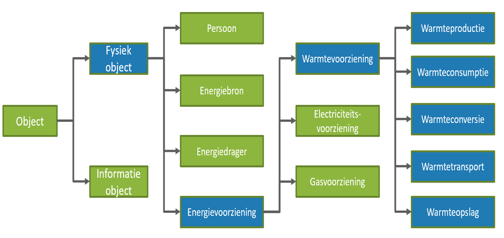

Hoofdstuk Begrippencatalogus Warmte
-----------------------------------

### Inleiding

De begrippencatalogus Energiedragers bevat de begrippen uit het Nederlandse energielandschap. Het is een online woordenboek dat zowel voor mensen als
machines te doorzoeken is. Dit woordenboek brengt begrippen vanuit verschillende begrippenkaders uit de energiewereld samen en biedt een transparant platform voor vergelijking en harmonisatie. De focus van de begrippencatalogus ligt initieel op de energiedrager warmte, maar er is al voorgesorteerd op de andere energiedragers. De begrippen zijn overgenomen uit een omvangrijke reeks bronnen zoals:
- Warmtewet en het voorstel Wet Collectieve warmtevoorziening
- Algemene Voorwaarden Warmte 2014
- NEN 7125
- Richtlijnen van de Europese Unie
- CBS Statline
- Energy System Description Language (ESDL)
- WarmingUp, innovatieprogramma van de warmtesector en TKI Energie
- WarmteAtlas, informatieportaal van RVO

Door de overzichtelijke zoekfunctie op term, definitie en bron helpt de Begrippencatalogus Energie de leesbaarheid en toepassing van deze bronnen te vergroten.

De technologie achter de begrippencatalogus biedt de ruimte om de Begrippen op verschillende manier en te bekijken. Er kan  gekozen worden de begrippen alfabetisch weer te geven, binnen een hiërarchie, of vanuit vooraf bepaalde groepen. Ook kunnen alle nieuw toegevoegde begrippen worden bekeken. Hoe deze mogelijkheden ingericht zijn wordt uitgelegd in de volgende paragraaf.

### Verantwoording van de inrichting van de begrippencatalogus

In deze paragraaf zal dieper worden ingegaan op de inrichting van de begrippencatalogus. Hierbij zal ook woorden ingegaan op de technologie dit is
gebruikt om de Begrippencatalogus te realiseren. 
De technologieën hierachter zijn Linked Data technologieën. Dit houd in dat deze ontworpen zijn conform de vier [Linked Data Principes](https://www.w3.org/DesignIssues/LinkedData.html). Deze vier principes zijn:
1.  Gebruik URI’s (Unique Resource Identifiers) om zaken te benoemen.
2.  Gebruik HTTP URI’s zodat mensen deze namen kunnen opzoeken.
3.  Zorg door het gebruik van standaarden voor bruikbare informatie wanneer iemand een URI opzoekt.
4.  Voeg links naar andere URI’s toe, zodat mensen meer zaken kunnen ontdekken.

Een voorbeeld van een technologie die deze principes toepast is het [Simple
Knowledge Organization System](https://www.w3.org/TR/2009/REC-skos-reference-20090818/), afgekort SKOS. SKOS
wordt gebruikt in de Begrippencatalogus energiedragers om de begrippen te
structureren. Daarnaast wordt ook gebruik gemaakt van verschillende
metadata-[vocabulaires]( https://www.pldn.nl/wiki/Vocabularies). Deze
vocabulaires bevatten een aantal gestandaardiseerde constructies die kunnen
worden gebruikt, om meer bruikbare informatie toe te voegen. Door het
gebruik van deze Linked Data technologieën wordt de data kwaliteit beter en
worden dingen beter vindbaar voor zowel mensen als machines.

#### URI's en verwijzingen
Ieder begrip in de begrippencatalogus heeft een URI. Deze URI is opgebouwd uit twee onderdelen. De namespace en een lokale unieke identificerende code voor het begrip binnen de namespace. De namespace is voor alle begrippen hetzelfde. Deze komt overeen met de HTTP-weblocatie van de begrippencatalogus en komt daarmee overeen met het 2e principe van linked data. Deze namespace staat nog niet vast aangezien het nog onzeker is of de begrippencatalogus op de ontwikkel weblocatie gaat worden beheerd. De lokale unieke identificerende code wordt gegenereerd door de ontwikkelomgeving VocBench. Hieronder volgt een voorbeeld van de opbouw van een URI.

> URI van een begrip: "https://begrippen.geostandaarden.nl/energie/nl/page/c_aa7eaf64"  
> Namespace: "https://begrippen.geostandaarden.nl/energie/nl/page/"  
> unieke ID-code: "c_aa7eaf64"
> 
Concepten in externe bronnen staan vaak niet als Linked Data gepubliceerd. Om toch naar deze externe concepten te kunnen verwijzen, wordt de meest specifieke weblocatie (URL) gebruikt (indien deze bestaat). In het geval van bijvoorbeeld de Warmtewet wordt er verwezen naar een specifiek artikel van de wet waar de definities in te vinden zijn. Deze artikelen staan wel gepubliceerd in Linked data, maar niet met een unieke URI per begrip. Een risico bij het gebruik van URL's is dat deze kunnen wijzigen. Wanneer deze URL's wijzigen, werkt de verwijzing niet meer. Dit heeft als gevolg dat de begrippencatalogus dan zal moeten worden bijgewerkt. Met behulp van de SPARQL query taal is dit een relatief eenvoudige operatie. 

#### Beschrijving van de Begrippen

De begrippen in de Begrippencatalogus zijn afkomstig uit verschillende bestaande begrippenlijsten. Deze begrippenlijsten staan vaak ergens verstopt in een pdf-bestand of wetsartikel. Hierdoor zijn deze begrippen vaak lastig te vinden en al helemaal lastig te vergelijken. Binnen de begrippencatalogus worden alle relevante begrippen ingevoerd als een [SKOS concept](https://www.w3.org/TR/2009/REC-skos-reference-20090818/#concepts).
Een SKOS-concept wordt gedefinieerd als een idee of een begrip door de SKOS specificatie en daarom is dit de geschikte klasse om aan energiebegrippen tekoppelen.

Begrippen kunnen verschillende eigenschappen hebben. Om te voldoen aan het derde
Linked Data principe, nemen we per begrip in de begrippencatalogus een aantal
eigenschappen op. Naar deze eigenschappen wordt ook wel gerefereerd met de
termen: “Linked Data properties” of “metadata”. Om de begrippen in de
begrippencatalogus vergelijkbaar te maken met andere Linked Data thesauri, wordt
gebruik gemaakt van een veelgebruikte vocabulaire. Deze vocabulaire, [Dublin
Core](https://www.dublincore.org/specifications/dublin-core/dcmi-terms/)
bevat eigenschappen die worden toegepast op veel verschillende websites op het
internet. Het gebruik van vocabulaires sluit ook aan bij de OWMS 4.0 mantel
(Overheid.nl Web Metadata Standaard). Welke eigenschappen per begrip
gebruikt worden is te zien in onderstaande tabel.

| Eigenschap         | Linked Data Property                                               | Omschrijving                                                                                                                                                                                                             |
|--------------------|--------------------------------------------------------------------|--------------------------------------------------------------------------------------------------------------------------------------------------------------------------------------------------------------------------|
| Geprefereerde term | [skos:prefLabel](http://www.w3.org/2004/02/skos/core\#prefLabel)   | Bevat de naam van het begrip in tekst. Deze naam wordt weergegeven in de publicatieomgeving. Achter de geprefereerde term wordt tussen haakjes de Bron herhaald als verschillende bronnen hetzelfde begrip definiëren.   |
| Bron               | [dct:source]()                                                     | In dit veld wordt de bron van herkomst opgeslagen van het begrip.                                                                                                                                                        |
| Definitie          | [skos:definition](http://www.w3.org/2004/02/skos/core\#definition) | Binnen het definitieveld wordt de betekenis van het begrip vastgelegd. Uit de definitie komt de semantiek van het begrip voort.                                                                                         |
| Ingangstermen      | [Skos:altLabel](http://www.w3.org/2004/02/skos/core\#altLabel)     | Een andere naam voor het begrip. Dit kan bijvoorbeeld een synoniem zijn of een afkorting.                                                                                                                                |
| In schema          | [skos:inScheme]()                                                  | Deze eigenschap maakt het voor machines leesbaar dat een begrip bij de begrippencatalogus hoort.                                                                                                                         |
| Laatst aangepast   | [dct:modified]()                                                   | Wordt niet weergegeven op de publicatieomgeving, maar wordt gebruikt om het voor het systeem traceerbaar te maken wanneer een begrip voor het laatst is aangepast. Wordt automatisch bijgehouden door de beheeromgeving. |
| Aangemaakt         | [dct:created]()                                                    | Wordt niet weergegeven op de publicatieomgeving, maar wordt automatisch toegevoegd wanneer het begrip in de begrippencatalogus wordt aangemaakt.                                                                         |
| Toelichting        | [skos:scopeNote](http://www.w3.org/2004/02/skos/core\#scopeNote)   | Dit is een extra veld waar tekstuele toelichtingen over het begrip kunnen worden opgeslagen.                                                                                                                             |

Naast deze bruikbare informatie over het begrip zelf, biedt de begrippencatalogus
ook mogelijkheden om begrippen aan elkaar te relateren. Relaties zijn
binnen Linked Data technisch gezien vergelijkbaar met eigenschappen. Per begrip
kan worden bijgehouden welke andere interne-, of externe-begrippen gerelateerd
zijn. Een relatie kan worden gebruikt om begrippen op elkaar te mappen of om de
hiërarchie tussen begrippen aan te duiden. Binnen de SKOS standaard zijn een
heel aantal relaties opgenomen. Een aantal die binnen de begrippencatalogus zijn
gebruikt, zullen in de tabel hieronder nader worden toegelicht.

| Relatie                     | Linked Data Property                                               | Omschrijving                                                                                                                                                                                                                                                                   |
|-----------------------------|--------------------------------------------------------------------|--------------------------------------------------------------------------------------------------------------------------------------------------------------------------------------------------------------------------------------------------------------------------------|
| Exact overeenkomend concept | [skos:exactMatch](http://www.w3.org/2004/02/skos/core\#exactMatch) | Legt een link naar een concept dat wat betreft betekenis exact overeenkomt. Deze relatie wordt gebruikt om de link te legen naar de bron van het begrip.                                                                                                                       |
| Nauw verwant concept        | [skos:closeMatch](http://www.w3.org/2004/02/skos/core\#closeMatch) | Legt een link naar een begrip dat wat betreft betekenis nauw verwant is. Deze wordt gebruikt om binnen de begrippencatalogus verschillende begrippen met een vergelijkbare betekenis aan elkaar te koppelen. Bijvoorbeeld begrippen met dezelfde naam, maar andere definities. |
| Breder concept              | [skos:broader](http://www.w3.org/2004/02/skos/core\#broader)       | Deze relatie wordt gebruikt om de structuur binnen de begrippencatalogus te brengen. Een breder begrip ligt in de hiërarchie boven een ander begrip.                                                                                                                           |
| Nauwer concept              | [skos:narrower](http://www.w3.org/2004/02/skos/core\#narrower)     | Deze relatie is precies het tegenovergestelde van de breder relatie.                                                                                                                                                                                                           |
| Gerelateerd concept         | [skos:related](http://www.w3.org/2004/02/skos/core\#related)       | Deze relatie zegt dat er een relatie bestaat met een ander concept. Deze relatie wordt niet verder geduid en is minder sterk dan de andere relaties dit in deze tabel genoemd staan.                                                                                           |

Op de afbeelding hieronder is een voorbeeld te zien van het begrip Afleverset.
Aan “WarmingUp” tussen haakjes is te zien dat het hier gaat over een begrip dat uit het innovatieprogramma WarmingUp komt, maar dat binnen de begrippencatalogus meerdere keren voorkomt. Rechts in beeld vallen de verschillende eigenschappen en relaties terug te vinden.

<figure id="voorbeeldBegrip">

<figcaption>Voorbeeld van een Begrip binnen de publicatieomgeving van de Begrippencatalogus.</figcaption>
</figure>

Een gerlateerd voorbeeld is de term 'Aansluiting'. Deze komt voor in verschillende bronnen: de Algemene Levereringsvoorwaarden, de huidige Warmtewet en het innovatieprogramma WarmingUp. De verschillende beschrijvingen die gevonden worden bij het ingeven van 'Aansluiting' als zoekterm zijn als volgt. 
De verschillen zijn duidelijk. 

Aansluiting (bron: Warmtewet)
-	Een individuele of centrale aansluiting. 

Aansluiting (bron: WarmingUp)
-	De leidingen van het warmtebedrijf die de binneninstallatie met het distributienet verbinden, inclusief alle apparatuur en het afleverstation of de afleverset, voor zover deze door het warmtebedrijf zijn aangebracht. Dit kan zowel een directe aansluiting of een indirecte aansluiting zijn. In het eerste geval heeft de binneninstallatie een directe verbinding met het distributienet en in het tweede geval is de binneninstallatie door middel van een warmtewisselaar gescheiden van het distributienet.

Aansluiting (bron: Algemene Leveringsvoorwaarden Warmte 2014)
-	De leiding van het bedrijf die de binneninstallatie met de hoofdleiding verbindt, met inbegrip van de meetinrichting én de warmtewisselaar voor zover deze door het bedrijf zijn aangebracht en alle andere door of vanwege het bedrijf in of aan die leiding aangebrachte apparatuur. 

Aansluitingsverantwoordelijke (bron: Wet Collectieve Warmtevoorzieningn)
- Degene op wie de verantwoordelijkheid, bedoeld in artikel 5.17, eerste lid, rust. 

#### Inrichting van de hiërarchie
De hiërarchie van begrippen brengt de relaties tussen begrippen in beeld, in het bijzonder de 'broader term',  de 'narrower term' en de 'related term'. De visualisatie van dit verband is als volgt. 

<figure id="Hiërarchie in boomvorm">

<figcaption>Hiërarchische visualisatie van de relaties tussen begrippen.</figcaption>
</figure>

Bij de opbouw van de hiërarchie van begrippen voor het warmtedomein is het uitgangspunt, dat deze moet passen binnen een groter geheel. Hierbij is gebruik gemaakt van bestaande kennishiërarchieën zoals de ABDL-thesaurus die gehanteerd wordt bij RWS. Het is met name de hogere, abstracte begrippen als Object, Fysiek object, Informatie object, Persoon, die het mogelijk maken om begrippen uit een specifiek domein als Warmte te verbinden met begrippen die elders gedefinieerd zijn. 

Warmte is geplaatst binnen de bredere energiecontext, door begrippen als Energievoorziening, Energiedrager, Elektriciteit en Gas op te nemen. Daarmee is de basis gelegd om de Begrippencatalogus Warmte uit te breiden met begrippen van andere energiedragers. 

De hiërarchie-relatie tussen begrippen wordt gekenmerkt door de ‘is breder dan’-relatie (Energiedrager is breder dan Warmte) en de ‘is nauwer dan’-relatie (Geothermie is nauwer dan Warmteproductie). 
Tevens is het mogelijk om aan te geven dat begrippen  ('close' of  'exact') aan elkaar gerelateerd zijn (Geothermie is gerelateerd aan Aardwarmte). Op deze manieren zijn begrippen aan elkaar verbonden en wordt het mogelijk om met zoekinstructies veel rijkere antwoorden te geven. 

Een schema van de hoogste niveaus is als volgt: 

<figure id="Schema hiërarchie warmtebegrippen">

<figcaption>Hoogste niveaus in hiërarchie schematisch weergegeven.</figcaption>
</figure>

De vijf warmtefuncties aan de rechterkant van het schema zijn overgenomen van de z.g. Energy Capabilities van ESDL, de Energy System Description Language van TNO. Deze zijn, met uitzondering van de capability Warmteopslag, weer verder onderverdeeld in ‘sub-bomen’ met warmtebegrippen. 

Het is ook mogelijk om de relaties in de vorm van een graaf weer  te geven. Deze kan automatisch gegenereerd worden, en opgebouwd zijn uit begrippen en relaties uit verschillende thesauri. 

<figure id="Hierarchie in graafvorm">

<figcaption>Graaf visualisatie van de hiërarchie binnen het begrippenmodel.</figcaption>
</figure>

Een uitgangspunt bij het inrichten van de hïerarchie binnen de begrippencatalogus, is dat er zo veel mogelijk gekeken wordt naar bestaande structuren. Internetzoekmachines zijn gebruikt om te zoeken naar andere begrippencatalogi. Zo is bijvoorbeeld de definitie van het meest algemene begrip "object", afkomstig uit [MIM](https://docs.geostandaarden.nl/mim/mim/#objecten-en-objecttype).  

De geconstrueerde hiërarchie is gebaseerd op de wijze waarop de werkelijkheid wordt beschouwd. Deze is uiteraard dynamisch en een goed gekozen hiërarchie maakt het dan ook mogelijk om mee te ontwikkelen. zo is momenteel (2021) de term ‘systeemintegratie’ in zwang, waarbij men doelt op samengaan van elektriciteit, gas, warmte en andere nog te ontwikkelen energiedragers. De inrichting van de Begrippencatalogus moet daarop zijn ingesteld. 
De energiecapability ‘Energieconversie’ is hier een sleutelbegrip dat daarvoor ingezet kan worden. 

#### Inrichting van Groepen

PMPMPM Opsomming en korte beschrijving van de herkomstbronnen van definities onder Groepen
<figure id="Groepen">

<figcaption>Groepen</figcaption>
</figure>

Bijlage 1, ‘*Herkomstbronnen begripsdefinities per energiedrager*’, bevat een lijst van herkomstbronnen en de vindplaatsen daarvan. Bij de keuze van welke herkomstbronnen wel en niet op te nemen in de begrippencatalogus zijn de gesprekken met stakeholders, de analyse van materiaal van Vivet-projecten, desk-research en kennis van de energiesector richtinggevend geweest. 
De relatie tussen de herkomstbronnen is gevisualiseerd in de plaat in hoofdstuk Landschapsverkenning. 

Vrijwel alle herkomstbronnen bevatten begrippen en definities zonder daar verbindingen tussen te leggen. Dat is de reden geweest om de herkomstbronnen ook als groep te beschouwen; elke poging tot structurering binnen de herkomstbron zou namelijk in het bestek van dit project (zonder uitgebreide stakeholder-consultaties) niet zorgvuldig genoeg kunnen gebeuren. 

ESDL heeft echter wel een goed-overwogen structuur tussen alle begrippen aangelegd. Dat is aanleiding geweest om de structuur van de begrippen, zoals vastgelegd in de hiërarchie daarop te baseren. De groepsindeling dient daarbij als bronverwijzing van de opgenomen begrippen. Gelijkluidende begrippen krijgen een onderscheiden aanduiding doordat de groep (dus de herkomstbron) op te nemen achter de naam van het begrip. Bijvoorbeeld Aansluiting(Warmtewet). 

Bij de opzet van de begrippencatalogus bleek de indeling conform de ESDL-uitgangspunten goed werkbaar. Met name de vijf z.g. energie-capabilities die als het ware als fundamentstenen centraal staan, vormden een goed ankerpunt. Daardoor bleken begrippen die buiten de ESDL-scope vallen,  relatief eenvoudig te verbinden  met de zich ontwikkelende structuur van de begrippencatalogus. 
