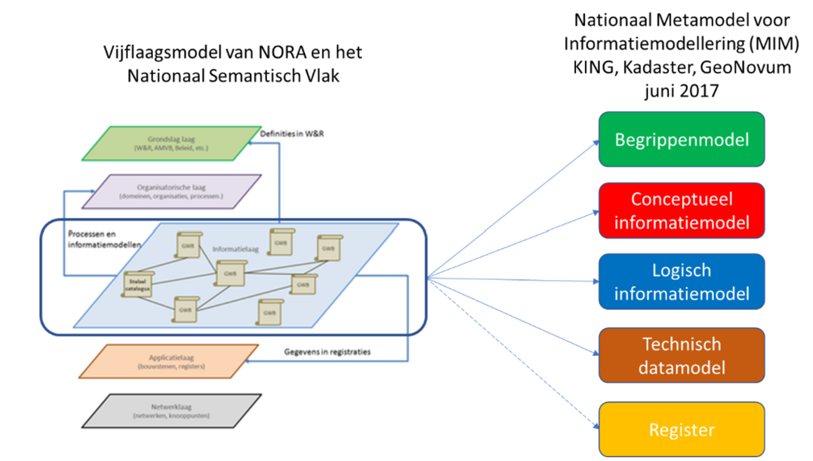

TIPS VOOR VERDERE AFRONDING

Op veel plekken telegramstijl
\@\@ = vraagtekens – nog uit te werken.
Bron van de afbeeldingen: ‘*Verzameling afbeeldingen eindrapport.pptx*’ op
U-schijf / map Eindrapport 
De plaatjes hebben per sheet een naamgeving (onderin notitie van elke sheet).  
De afbeeldingen worden bij een wijziging vanuit deze .pptx als afbeelding (.png)
in de map ‘media’ gezet. Deze .png’s krijgen de naam zoals in de notitie van
elke sheet staat. En dat is ook de naam die in dit rapport gebruikt wordt. 

Hoofdstuk Inleiding
-------------------

-   Context

Energietransitie / versnipperd energielandschap / Vivet / Use case Warmte
gekozen vanwege grote diversiteit van sector en informatiebronnen.

-   Punt op de horizont

Plaatje *Lagen Nationaal Metamodel
(https://www.noraonline.nl/wiki/Modellering_van_gegevens)*
<figure id="Metamodel">

<figcaption>Metamodel</figcaption>
</figure>

Toelichting: informatie onderdeel van informatiesystemen die deel uitmaken van
organisaties. Informatielandschap versnipperd, maar ingrijpend om hier in te
grjpen omdat je dan aan organisatie komt. Hoe meer versnippering, hoe
ingrijpender.

Begrippen zijn minder verankerd in informatiesystemen, begrippen slaan op de
taal die men spreekt. Informatiemodellering zorgt voor vertaalslag van begrippen
naar informatiesystemen.

-   Waarom begrippenkader

Geen gevestigde informatiemodellen gevonden in warmtedomein. Wel grote behoefte
aan uniformiteit qua taal. Begrippenkader: minder belangen en breed ecosysteem:
ook wetgeving, subsidies. De basis voor informtiemodellering

Proces: inventariseren en relateren van begrippen / vaststellen van begrippen en
hun relaties / harmoniseren van begrippen / beheer en onderhoud.

-   Terugblik op Vimet 2019

Waar zit de verbinding met Vimet 2019 precies? Use case Installaties /
Gebouwen - Domein in Vivet Conceptueel InformatieModel

-   BegrippenCatalogus warmte 2020

Het idee bij het inrichten van een begrippencatalogus: toegankelijk / verbindend / ...

-   Doel met deze aanpak

Ambitie: alle herkomstbronnen van begripsdefinities in het warmtedomein

-   Resultaat

Een rijkdom aan bronnen en goede kansen om deze brede verzameling aan
elkaar te relateren en in de toekomst te harmoniseren.

-   Doelgroep

Partijen met herkomstbronnen benoemen. Doelgroep volgende stap: beleidsmakers,
materiedeskundigen warmtesector, wetgeving, informatiespecialisten, partij die
autoriteit / governance op zich wil nemen.

-   Leeswijzer

Hoofdstuk *Methodiek en techniek* beschrijft achtergrond van begrippencatalogus,
MIM, selectie van tooling, en ‘spoorzoeken’ naar warmtebegrippen, opsomming van
bronnen, opsomming van benaderde partijen.

Hoofdstuk *Begrippencatalogus* geeft een beschrijving van het resultaat: de
geïnventariseerde begripen, de linkjes naar de herkomstbronnen van
begripsdefinities, de gemaakte keuzen bij het bouwen van de hiërachie van
begrippen.

Hoofdstuk *Bevindingen, Conclusies en Aanbevelingen* doet in grote lijnen verslag van wat we tijdens dit
project zijn tegengekomen, en zet deze in Vivet-perspectief van Vivet.

Hoofdstuk Samenvatting
----------------------

Dit schrijven wanneer hoofdstuk bevindingen, conclusies, aanbevelingen gereed is.
Of deze samenvatting weglaten als deze beperkt blijft. 

Hoofdstuk Aanleiding en opdracht
--------------------------------

Hoofdstuk Methodiek en techniek
-------------------------------

*dit hoofdstuk: Joeri*  
### Begrippencatalogus

Een begrippencatalogus is méér dan een opsomming van begrippen: het beschrijft ook – op structurele wijze – de wijze waarop de begrippen met elkaar samenhangen. 
Zo is een energienet een bredere term van warmtenet, is een kleinverbruiker een smallere term van verbruiker en is consument een geletateerde term aan verbruiker. 
Synoniemen voor begrippencatalogus zijn *thesaurus* en *vocabulaire*. 

De begrippencatalogus wordt stapsgewijs opgebouwd, en de bouwstenen krijgen ook deze benaming: Begrippencatalogus Warmte, Begrippencatalogus Hernieuwbare Energie. 
Deze bouwstenen worden later opgenomen in de Begrippencatalogus Energievoorziening. 
De begrippen zijn in doorgaans niet zelfstandig gedefinieerd in de begrippencatalogus, maar verwijzen naar Herkomstbronnen begripsdefinities, waarin de definities beschreven zijn. Dit kunnen wetten zijn, normen, documenten met subsidie-voorstellen, artikelen op websites, etc. Maar ook kan verwezen worden naar andere begrippencatalogi. 
Bij voorkeur gebeurt dat met Linked Data-technieken, zodat begrippen en definities machinaal vindbaar zijn. 
Door de overzichtelijke zoekfunctie op term, definitie en bron helpt de Begrippencatalogus Energie de leesbaarheid en toepassing van deze bronnen te vergroten. 
De begrippencatalogus is het woordenboek, waaruit geput kan worden bij de beschrijving van de informatie, en dat gebeurt in informatiemodellen. We onderkennen twee lagen: het Conceptueel informatiemodel en het Logisch informatie of -gegevensmodel. Het conceptuele niveau is onafhankelijk van de operationele informatiesystemen, de beschrijving van hoe informatie door deze systemen worden vastgelegd en gebruikt gebeurt op het niveau van de logische informatiemodellen. 

### Conceptueel Informatiemodel Energietransitie 
Overgenomen uit https://docs.geostandaarden.nl/mim/mim/#wat-is-een-informatiemodel:  
Wanneer we informatie over bepaalde onderwerpen willen inwinnen, registreren of uitwisselen, dan is het van belang om deze informatie eerst goed te beschrijven. We doen dit zodat het voor eenieder die met de informatie aan de slag gaat helder en eenduidig is:
* waarover de informatie gaat, bv. informatie over een persoon of een gebouw, we noemen dit de objecten, de onderwerpen van gesprek
* de eigenschappen/kenmerken zelf, waarvan we informatie bijhouden, bv. de naam van een persoon of het bouwjaar van een gebouw
* wat de betekenis is van die informatie, de semantiek
* hoe deze informatie qua structuur in elkaar zit, qua onderlinge relaties en qua interne structuur van de data
We doen dit door een model te maken van de informatie. Een Informatiemodel beschrijft daarom de structuur, semantiek en de eigenschappen van informatie over dingen in de werkelijkheid. De beschrijving van de informatie heeft de vorm van een model dat een gestructureerde weergave is van die werkelijkheid. Een dergelijk model is noodzakelijk om deze informatie te kunnen beheren en gebruiken (door mensen en machines) bij het communiceren over deze werkelijkheid, in registraties of anderszins, zoals het specificeren van de tussen registraties uit te wisselen gegevens of van de te bevragen informatie uit een registratie.
Het beschrijven vindt plaats door de informatie van de objecten die we beschouwden te modelleren, met hun kenmerken en hun onderlinge relaties. We gebruiken daarvoor termen als objecten, objecttype, atttribuut, attribuutsoort, relatie, relatiesoort. Hiermee kunnen we de werkelijke data beschrijven. 

<figure id="Vivet Conceptueel Informatiemodel Framework">

<figcaption>Vivet Conceptueel Informatiemodel Framework</figcaption>
</figure>
 
Het Vivet Conceptueel InformatieModel (CIM) framework heeft een gelaagde structuur, en hiermee is het verbonden met de informatiemodellen van de Nederlandse overheid (de bovenste laag van dit model). Een belangrijk onderdeel hiervan zijn de basisregistraties, die zich baseren op (of: de eigenschappen overnemen van) de bovenste laag. 
Het z.g. Generiek Informatiemodel Energietransitie op zijn beurt is gebaseerd op de eigenschappen van de basisregistraties. 
In de praktijk betekent dit, dat de eigenschappen van begrippen die bekend zijn in de basisregistraties (zoals ‘Adres’, ‘Persoon’) ook in het Generiek Informatiemodel Energietransatie worden gebruikt. De eigenschappen worden ‘overerfd’. Het generieke aspect doelt op het overerven van de eigenschappen naar de informatiemodellen van specifieke energietransitie-toepassingen of -projecten (zoals hierboven bij voorbeeld Informatieportalen). 
Op deze manier ontstaat een bouwwerk met samenhangende onderdelen dat een deel van de versplintering van het informatrielandschap opheft en robuustheid voor de toekomst creëert. Met nadruk moet hier genoemd worden dat de dynamiek van de energietransitie betekent dat dit gebouw onderhoud behoeft en voortdurend aangepast moet worden aan nieuwe eisen die gesteld worden aan de energie-informatievoorziening. 
Het Vivet Conceptueel InformatieModel (CIM) Framework heeft een gelaagde structuur, en hiermee is het verbonden met de informatiemodellen van de Nederlandse overheid (de bovenste laag van dit model). Een belangrijk onderdeel hiervan zijn de basisregistraties, die zich baseren op (of: de eigenschappen overnemen van) de bovenste laag.

### Methodologisch framework

Datastandaarden zorgen voor de consistentie en uitwisselbaarheid van data. Met datastandaarden kunnen verschillende informatieproducten elkaar begrijpen en tegen elkaar praten. Zoals omschreven in de withpaper  "Vinden en verbinden met taal" [REFERENTIE Paper Danny], wordt de betekenis van data steeds belangrijker. De betekenis van data komt voort uit taal en taal bestaat uit begrippen met definities. Om taal te kunnen definiëren moet men gebruik maken van een taalinfrastructuur. Centraal binnen een taalinfrastrctuur, staat het woordenboek. 

<figure id="Taalnfrastructuur Vinden en verbinden met taal">

<figcaption> Taalnfrastructuur zoals omschreven in "Vinden en verbinden met taal"</figcaption>
</figure>

Om de taal uit een domein consistent en uitwisselbaar te maken, zijn taalstandaarden noodzakelijk. Veelboorkomende keuzes voor standaarden zijn UML, zoals MIM [REFERENTIE], of het gebruik van Linked Data standaarden zoals SKOS [REFERENTIE]. De samenhang tussen deze standaarden valt terug te vinden op het niveau van begrippen. MIM maakt onderscheid in 4 verschillende niveaus van informatiemodellen, waarbij niveau 1 een model van begrippen is. Een model van begrippen beschrijft de werkelijkheid binnen het beschouwde domein  door middel van de daarin gehanteerde begrippen en hun relaties tot elkaar. Wanneer de taal die deze werkelijkheid omschrijft niet is gedefinieerd, dan is het ook lastig om een informatiemodel van een hoger niveau te maken, dat dichter bij een digitale registratie staat. MIM kan niet worden toegepast op een model van niveau 1 volgens [IM 1.1 specificatie](https://docs.geostandaarden.nl/mim/mim/#typen-informatiemodellen), maar Linked Data wel.

<figure id="informatiemodel plaatje MIM">

<figcaption> Omschrijving van de samenhang tussen de werkelijkheid, informatiemodellen en Digitale registraties zoals omschreven door MIM.</figcaption>
</figure>

De belangrijkste Linked Data standaard voor het definiëren van woordenboeken is SKOS (Simple Knowledge Organization System). Het is een standaard van het W3C waarmee woorden in een thesaurus worden gedefinieerd. Het staat ook op de “pas toe, leg uit” lijst van standaarden van Forum Standaardisatie en is daarmee verplicht voor overheidsorganisaties. Een thesaurus is te zien als een woordenboek waaraan meer structuur is gegeven door ook relaties tussen begrippen aan te brengen. Begrippen kunnen meer specifiek of meer algemeen zijn dan andere begrippen of een meer algemene relatie hebben tot andere begrippen. Begrippen worden uniek geïdentificeerd door een URI (uniform Resource Identifier). Dat ziet er uit als het adres van een website en de definitie van een begrip is idealiter ook echt als zodanig toegankelijk via een web browser. 

    DiSGeo en visie architectuur zie ppt Ruud van Rossem (op U-schijf)  
    Fair principes (zie plaatje vivet workshop begrippenkader op U-schijf)

Vraag van Jeroen: refereren aan <https://www.noraonline.nl/wiki/Gegevensbeschrijvingen/Handreiking>?

### Applicatie voor de begrippencatalogus

Er zijn allerlei tools beschikbaar voor het werken met SKOS.
#### Beheer- en ontwikkelomgeving

Kort beschrijven welke typen tools hievoor bestaan? Waarom gekozen voor vocbench?
#### Publicatieomgeving

Voor het uitwisselen van data is het tegenwoordig logisch om deze via API’s te ontsluiten. Dat geldt ook voor woordenboeken. Een woordenboek API kan in allerlei applicaties worden gebruikt om woorden en hun definitie op te halen.
Aanwezige functionaliteit, gemaakte keuzen

-   beheeromgeving

Aanwezige functionaliteit, gemaakte keuzen

### Onderzoekmethode

-   spoorzoekend / interviews

Versnipperde landschap. Begonnen met opvraag informatiemodellen; weinig
resultaat. Wel enkele netwerkorganisaties. Stichting warmtenetwerk. Warmtesector
via Energie Nederland. Overheid: RVO, ECW, PBL.  
Overal grote bereidheid tot medewerking. Overal herkenning problematiek. Overal:
“nodig, maar grote taak”.

Spoorzoeken niet afgerond. Tot op heden interviews/presentaties per stakeholder
(benoemen: EnergieNL (sector) / overheid / ACM / kennisdragers / ...). Volgende
stap: verschillende stakeholders bij elkaar brengen – dan kunnen ook de eerste
vragen richting vaststellen en harmoniseren van begrippen en governance gesteld
worden.
