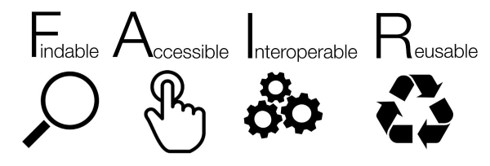
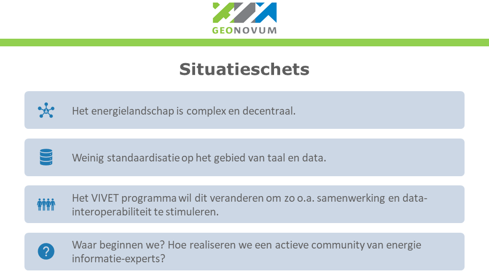
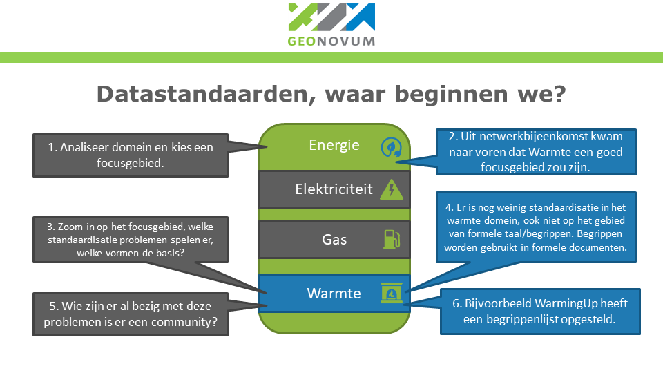
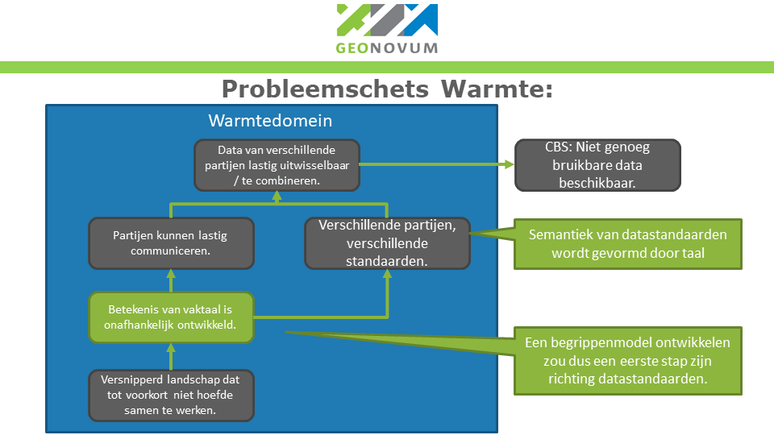
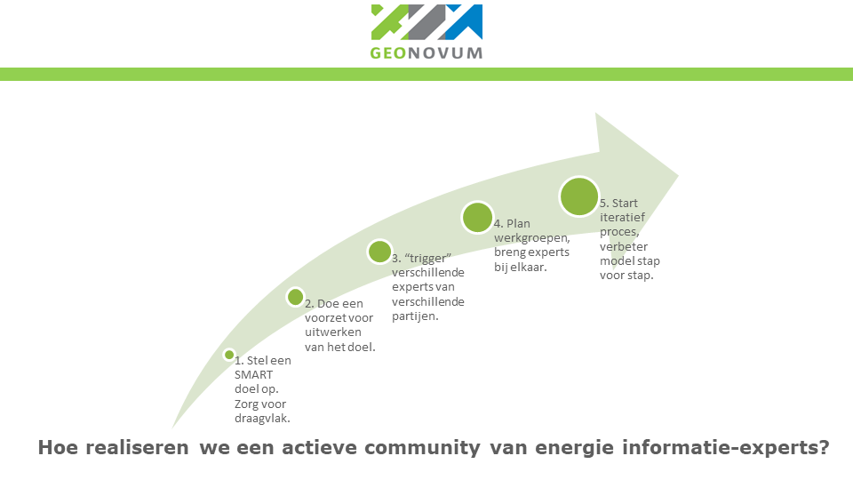

Hoofdstuk Methodiek en techniek
-------------------------------

### Begrippencatalogus

Een begrippencatalogus is méér dan een opsomming van begrippen: het beschrijft ook – op structurele wijze – de wijze waarop de begrippen met elkaar samenhangen. 
Zo is een energienet een bredere term van warmtenet, is een kleinverbruiker een smallere term van verbruiker en is consument een gerelateerde term aan verbruiker. 
Synoniemen voor begrippencatalogus zijn *thesaurus* en *vocabulaire*. 

De begrippencatalogus wordt stapsgewijs opgebouwd en de bouwstenen krijgen ook deze benaming: Begrippencatalogus Warmte, Begrippencatalogus Hernieuwbare Energie. 
Deze bouwstenen worden later opgenomen in de Begrippencatalogus Energievoorziening. 

De begrippen zijn doorgaans niet zelfstandig gedefinieerd in de begrippencatalogus, maar verwijzen naar Herkomstbronnen begripsdefinities, waarin de definities beschreven zijn. Dit kunnen wetten zijn, normen, documenten met subsidie-voorstellen, artikelen op websites, etc. Maar ook kan verwezen worden naar andere begrippencatalogi. Bij voorkeur gebeurt dat met Linked Data-technieken, zodat begrippen en definities machinaal vindbaar zijn. 

Door de overzichtelijke zoekfunctie op term, definitie en bron helpt de Begrippencatalogus Energie de leesbaarheid en toepassing van deze bronnen te vergroten. 
De begrippencatalogus is het woordenboek, waaruit geput kan worden bij de beschrijving van de informatie en dat gebeurt in informatiemodellen. 

We onderkennen twee lagen: het Conceptueel informatiemodel en het Logisch informatie of -gegevensmodel. Het conceptuele niveau is onafhankelijk van de operationele informatiesystemen, de beschrijving van hoe informatie door deze systemen worden vastgelegd en gebruikt gebeurt op het niveau van de logische informatiemodellen. 

### Conceptueel Informatiemodel Energietransitie 
Overgenomen uit [MIM - Metamodel Informatie Modellering](https://docs.geostandaarden.nl/mim/mim/#wat-is-een-informatiemodel).    
Wanneer we informatie over bepaalde onderwerpen willen inwinnen, registreren of uitwisselen, dan is het van belang om deze informatie eerst goed te beschrijven. We doen dit zodat het voor eenieder die met de informatie aan de slag gaat helder en eenduidig is:
* waarover de informatie gaat, bv. informatie over een persoon of een gebouw, we noemen dit de objecten, de onderwerpen van gesprek
* de eigenschappen/kenmerken zelf, waarvan we informatie bijhouden, bv. de naam van een persoon of het bouwjaar van een gebouw
* wat de betekenis is van die informatie, de semantiek
* hoe deze informatie qua structuur in elkaar zit, qua onderlinge relaties en qua interne structuur van de data. 

We doen dit door een model te maken van de informatie. Een Informatiemodel beschrijft daarom de structuur, semantiek en de eigenschappen van informatie over dingen in de werkelijkheid. De beschrijving van de informatie heeft de vorm van een model dat een gestructureerde weergave is van die werkelijkheid. 

Een dergelijk model is noodzakelijk om deze informatie te kunnen beheren en gebruiken (door mensen en machines) bij het communiceren over deze werkelijkheid, in registraties of anderszins, zoals het specificeren van de tussen registraties uit te wisselen gegevens of van de te bevragen informatie uit een registratie.

Het beschrijven vindt plaats door de informatie van de objecten die we beschouwden te modelleren, met hun kenmerken en hun onderlinge relaties. We gebruiken daarvoor termen als objecten, objecttype, attribuut, attribuutsoort, relatie, relatiesoort. Hiermee kunnen we de werkelijke data beschrijven. 

<figure id="Vivet Conceptueel Informatiemodel Framework">

<figcaption>Vivet Conceptueel Informatiemodel Framework</figcaption>
</figure>
 
Het Vivet Conceptueel InformatieModel (CIM) framework heeft een gelaagde structuur en hiermee is het verbonden met de informatiemodellen van de Nederlandse overheid (de bovenste laag van dit model). Een belangrijk onderdeel hiervan zijn de basisregistraties, die zich baseren op (of: de eigenschappen overnemen van) de bovenste laag. 
Het z.g. Generiek Informatiemodel Energietransitie op zijn beurt is gebaseerd op de eigenschappen van de basisregistraties. 

De horizontale gelaagdheid is aangebracht om toepassingsgericht en per use case aan dit model te kunnen werken. Hierdoor worden onderdelen uitgewerkt, maar gebeurt dit wel in samenhang, zodat uiteindelijk een groter geheel ontstaat.

In de praktijk betekent dit, dat de eigenschappen van begrippen die bekend zijn in de basisregistraties (zoals ‘Adres’, ‘Persoon’) ook in het Generiek Informatiemodel Energietransitie worden gebruikt. De eigenschappen worden ‘overerfd’. Het generieke aspect doelt op het overerven van de eigenschappen naar de informatiemodellen van specifieke energietransitie-toepassingen of -projecten (zoals hierboven bij voorbeeld Informatieportalen). 

Op deze manier ontstaat een bouwwerk met samenhangende onderdelen dat een deel van de versplintering van het informatielandschap opheft en robuustheid voor de toekomst creëert. Met nadruk moet hier genoemd worden dat de dynamiek van de energietransitie betekent dat dit gebouw onderhoud behoeft en voortdurend aangepast moet worden aan nieuwe eisen die gesteld worden aan de energie-informatievoorziening. 

Het Vivet Conceptueel InformatieModel (CIM) Framework heeft een gelaagde structuur en hiermee is het verbonden met de informatiemodellen van de Nederlandse overheid (de bovenste laag van dit model). Een belangrijk onderdeel hiervan zijn de basisregistraties, die zich baseren op (of: de eigenschappen overnemen van) de bovenste laag.

### Methodologisch framework

Datastandaarden zorgen voor de consistentie en uitwisselbaarheid van data. Met datastandaarden kunnen verschillende informatieproducten elkaar begrijpen en met elkaar praten. Zoals omschreven in de whitepaper [Vinden en verbinden met taal](https://www.archixl.nl/files/Vinden_en_verbinden_met_taal.pdf), wordt de betekenis van data steeds belangrijker. De betekenis van data komt voort uit taal en taal bestaat uit begrippen met definities. Om taal te kunnen definiëren moet men gebruik maken van een taalinfrastructuur. Centraal binnen een taalinfrastructuur, staat het woordenboek. 

<figure id="Taalinfrastructuur_Vinden_en_verbinden_met_taal">

<figcaption> Taalinfrastructuur zoals omschreven in "Vinden en verbinden met taal"</figcaption>
</figure>

Om de taal uit een domein consistent en uitwisselbaar te maken, zijn taalstandaarden noodzakelijk. Veelvoorkomende keuzes voor standaarden zijn UML, zoals beschreven in MIM, het [Metamodel Informatie Modellering](https://docs.geostandaarden.nl/mim/mim/), of het gebruik van Linked Data standaarden zoals SKOS, Simple Knowledge Organization System, hier beschreven in de [NORA Standaarden](https://www.noraonline.nl/wiki/SKOS_(Simple_Knowledge_Organization_System). De samenhang tussen deze standaarden valt terug te vinden op het niveau van begrippen, zoals beschreven in de [Handreiking Gegevensbeschrijvingen van NORA](https://www.noraonline.nl/wiki/Gegevensbeschrijvingen/Handreiking). 

MIM maakt onderscheid in 4 verschillende niveaus van informatiemodellen, waarbij niveau 1 een model van begrippen is. Een model van begrippen beschrijft de werkelijkheid binnen het beschouwde domein  door middel van de daarin gehanteerde begrippen en hun relaties tot elkaar. Wanneer de taal die deze werkelijkheid omschrijft niet is gedefinieerd, dan is het ook lastig om een informatiemodel van een hoger niveau te maken, dat dichter bij een digitale registratie staat. MIM kan niet worden toegepast op een model van niveau 1 volgens [MIM 1.6 specificatie](https://docs.geostandaarden.nl/mim/mim/#typen-informatiemodellen), maar Linked Data wel.

<figure id="informatiemodel_plaatje_MIM">

<figcaption> Omschrijving van de samenhang tussen de werkelijkheid, informatiemodellen en Digitale registraties zoals omschreven door MIM.</figcaption>
</figure>

De belangrijkste Linked Data standaard voor het definiëren van woordenboeken is SKOS (Simple Knowledge Organization System). Het is een standaard van het W3C [World Wide Web Consortium](https://www.w3.org), waarmee woorden in een thesaurus worden gedefinieerd. Het staat ook op de “pas toe, leg uit” lijst van standaarden van Forum Standaardisatie en is daarmee verplicht voor overheidsorganisaties. Een thesaurus is te zien als een woordenboek waaraan meer structuur is gegeven door ook relaties tussen begrippen aan te brengen. Begrippen kunnen meer specifiek of meer algemeen zijn dan andere begrippen of een meer algemene relatie hebben tot andere begrippen. Begrippen worden uniek geïdentificeerd door een URI (uniform Resource Identifier). Dat ziet er uit als het adres van een website en de definitie van een begrip is idealiter ook echt als zodanig toegankelijk via een web browser. 

De internationale Findable, Accessible, Interoperable, and Re-usable [(FAIR)-principes](https://www.pldn.nl/wiki/FAIR) zijn richtlijnen voor de manier van beschrijven, opslag en publicatie van wetenschappelijke data. De principes dienen als richtlijn om wetenschappelijke data geschikt te maken voor hergebruik onder duidelijk beschreven condities, door zowel mensen als machines. 
Het idee is dat de verschillende domeinen op basis van de FAIR principes eigen standaarden ontwikkelen. Sinds de publicatie van de FAIR-principes worden deze inmiddels ook gezien als toepasbaar op software, workflows en wetenschappelijke diensten. Dit maakt de FAIR-principes ook toepasbaar op de software die gebruikt wordt om taalstandaarden te ontsluiten, zoals bijvoorbeeld de Begrippencatalogus Warmte.

<figure id="FAIR_Principes">

<figcaption> Visualisatie van de FAIR principes</figcaption>
</figure>

### Onderzoekmethode

Het doel van VIVET project VIII Data ontsluiten houdt in:

Basiscondities scheppen om op een efficiënte manier en zonder exponentiële kostenstijging, gemeenschappelijk data te kunnen delen voor de energietransitie en hiermee de Vivet projecten te ondersteunen en te verbinden. Ook legt het de basis voor samenwerking inzake toekomstig onderhoud en beheer van de informatieverbindingen binnen het energiedomein en met andere domeinen of aandachtsgebieden als de bouw- en installatiewereld. Het realiseren van een community van energie informatie-experts van de stakeholders is hiervan een essentieel onderdeel. 

In het "Methodologisch framework" staat omschreven dat taalstandaarden aan de basis liggen van datastandaarden. Eén van de meest basale basiscondities om op een efficiënte manier en zonder exponentiële kostenstijging, gemeenschappelijk data te kunnen delen, zou dus kunnen liggen bij taalstandaarden. Het onderzoek om te komen tot de meest basale basisconditie valt op te delen in 3 fases:

1. Een verkenning van het domein. 
2. De bevindingen uit de verkenning analyseren om zo tot een kernprobleem te komen.
3. De oplossing iteratief en in samenwerking met het werkveld uitwerken.

#### Verkenning domein

<figure id="Situatieschets_samenvatting">

<figcaption>Een samenvatting van de verkenning van het energiedomein.</figcaption>
</figure>

In de eerste fase ging het om het vormen van een zo helder mogelijke schets van de situatie. Door de versnippering en omvang van het energielandschap, bleek dat er meer focus nodig was om tot de zoektocht naar de meest basale basisconditie te kunnen identificeren. 

<figure id="Focusgebied_samenvatting">

<figcaption>Focus werd gelegd op de warmtesector.</figcaption>
</figure>

Aangezien de warmtesector naar voren kwam als het meest onontgonnen gebied, werd hier de focus op gelegd. De eerste verdiepingsslag binnen de warmtesector, bestond uit het van opvragen van informatiemodellen. Dit leidde tot weinig resultaten. Er bleek nog weinig materiaal te zijn op het gebied van datastandaarden binnen de warmtesector. Vervolgens heeft Geonovum gesproken met partijen uit het werkveld om de schets te verhelderen. Tijdens de ontwikkeling van de begrippencatalogus zijn gesprekken gevoerd met en zijn presentaties gegeven aan experts van ECW, RVO, PBL, het warmte-overleg bij Energie Nederland, CBS, projectleiders Vivet, Min. EZK, ACM, Energie Data Community, TNO/ESDL, de Expertgroep EnergieTransitieRekenmModellen, Tennet en Stedin. 

#### Samenvatting bevindingen uit de verkenning: analyse van het kernprobleem

<figure id="Bevindingen_samenvatting">

<figcaption>Analyse van de meest basale basisconditie voor standaardisatie binnen de warmtesector.</figcaption>
</figure>

Uit gesprekken met verschillende partijen die opereren binnen de warmtesector is gebleken dat het ontbreken van een eenduidige taalstandaard kan worden aangewezen als de meest basale basisconditie om op een efficiënte manier en zonder exponentiële kostenstijging, gemeenschappelijk data te kunnen delen. De bevindingen worden verder toegelicht in [hoofdstuk 3](https://geonovum.github.io/VIVET-Werkomgeving/VIMET-VIII-B/#hoofdstuk-resultaten-landschapsverkenning-warmtewereld). Binnen het warmtedomein bleek er een grote bereidheid tot medewerking, Het probleem werd door alle partijen erkend en gezien als een grote taak. Echter door beperkte schaalgrootte van de warmtebedrijven wil men zelf niet al teveel energie in een taalstandaard stoppen. Zolang er geen verplichting tot standaardisering en harmonisatie is lijkt er geen bereidheid hierin te investeren, maar het nut wordt zeker onderkend. 

Aan de verschillende partijen binnen de warmtesector heeft Geonovum gevraagd wat de reeds bestaande taalstandaarden zijn binnen het Warmtedomein, zodat deze konden worden geanalyseerd. Het doel van de analyse was om verschillen tussen verschillende taalstandaarden zichtbaar te maken. 
Om dit doel te bereiken moest een passende methodiek worden gekozen. Deze methodiek moet aansluiten op het methodologische framework van Geonovum, zodat gebruik kon worden gemaakt van de bestaande infrastructuur om begrippen iteratief met het werkveld te kunnen delen. Het Geonovum VIVET team koos daarom voor het aansluiten bij de methodiek van Doorontwikkeling in Samenhang van de GeoBasisregistraties (DiSGeo). Op basis van deze methodiek werd besloten een Begrippencatalogus voor de warmtesector te ontwikkelen, waarin alle verschillen tussen bestaande taalstandaarden zichtbaar worden. Een aantal voorbeelden van bestaande taalstandaarden zijn: de Warmtewet, de Europese regelgeving en de NEN7125.
#### Iteratief en samen met het werkveld werken naar een oplossing

<figure id="Iteratief_samenwerken_samenvatting">

<figcaption>De weg naar een actieve warmte-community met een gemeenschappelijke taal.</figcaption>
</figure>

Om het werkveld zo dicht mogelijk te betrekken bij de ontwikkeling, was het belangrijk de ontwikkeling van de Begrippencatalogus Warmte voor het werkveld zo transparant en tastbaar mogelijk te organiseren. Een eerste versie van de Begrippencatalogus werd sinds begin januari 2021 beschikbaar gesteld aan het werkveld. De Begrippencatalogus Warmte wordt vanaf dat moment in een iteratief proces in samenwerking met het werkveld uitgebreid en zet Geonovum een proces in gang om verschillende belanghebbenden bij elkaar te brengen om pilots uit te voeren met bestaande informatieproducten binnen het werkveld.

In de toekomst wil Geonovum dit iteratieve proces voortzetten. Bij dit proces horen stappen richting harmonisatie van begrippen en zullen vragen rondom de governance van de Begrippencatalogus worden beantwoord. Door deze cyclische verbeteringen door te zetten, hoopt Geonovum de vorming van een actieve warmte-begrippencommunity te stimuleren. Deze community zou in de toekomst kunnen evalueren naar een warmte-standaardisatie-community. Deze community zou kunnen bijdragen aan de ontwikkeling van informatiestandaarden binnen het warmtedomein.

### Applicatie voor de Begrippencatalogus Warmte

Er zijn allerlei tools beschikbaar voor het werken met SKOS. Voor Begrippencatalogus Warmte heeft het VIVET-Team ervoor gekozen om de methodiek van DiSGeo te volgen, zodat gebruik kon worden gemaakt van bestaande infrastructuur. Deze infrastructuur bestaat uit een Beheer- en ontwikkelomgeving en een publicatieomgeving.

#### Beheer- en ontwikkelomgeving

Voor het ontwikkelen en beheren van de begrippencatalogus in Linked Data, is het handig om goede ondersteunende tooling te hebben. Voor de begrippencatalogus warmte, wordt gebruik gemaakt van de open-source software [VocBench](https://www.pldn.nl/wiki/VocBench). Hierbij wordt het voorbeeld van DiSGeo gevolgd, die in de zomer van 2020 een onderzoek hebben laten uitvoeren welke tooling het gunstigste is voor de toepassingen van Geonovum.

VocBench is een flexibel programma en bevat opties om het werken met een begrippencatalogus makkelijker te maken. Zo kunnen meerdere eigenschappen tegelijkertijd worden aangepast, kan een graaf visualisatie gemaakt worden en kan er op een gemakkelijk wijze worden samengewerkt. VocBench wordt ook gebruikt door de Europese Unie om de [Eurovoc thesaurus](https://op.europa.eu/nl/web/eu-vocabularies/dataset/-/resource?uri=http://publications.europa.eu/resource/dataset/eurovoc) te beheren.

#### Publicatieomgeving

Voor het uitwisselen van data is het tegenwoordig logisch om deze via API’s te ontsluiten. Dat geldt ook voor de Begrippencatalogus. Deze begrippencatalogus API kan in allerlei applicaties worden gebruikt om woorden en hun definitie op te halen. Om dit te ondersteunen, wordt voor de begrippencatalogus gebruik gemaakt van een publicatieomgeving. Het betreft dezelfde publicatieomgeving als die van DiSGeo. Op [begrippen.geostandaarden](https://begrippen.geostandaarden.nl/energie/nl/) wordt de begrippencatalogus ontsloten op een manier die zowel voor mensen als machines leesbaar is. De publicatieomgeving draait op [BegrippenXL](https://archixl.nl/archixl/product/begrippenxl-thesaurusplatform). Dit is een thesaurusplatform gebouwd op de open source-software [Skosmos](https://skosmos.org/). Om een idee te krijgen van hoe deze publicatieomgeving werkt, verwijzen we door naar de [leeswijzer](https://github.com/Geonovum/VIVET-Werkomgeving/raw/master/VIMET-VIII-B/media/20210111%20Leeswijzer%20Begrippenmodel%20Energie.pdf).

