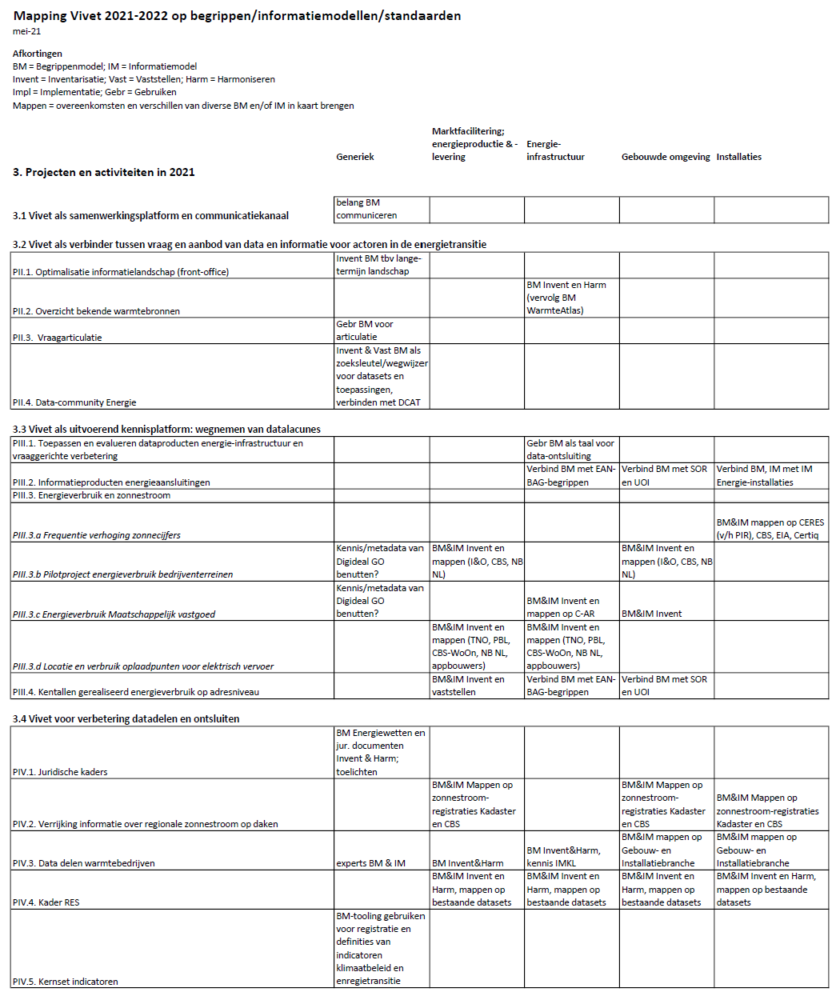

Hoofdstuk Resultaten landschapsverkenning warmtewereld
------------------------------------------------------

### Inleiding

Dit hoofdstuk bevat een compacte beschrijving van 'de warmtewereld' voor zover deze relevant is voor dit project. 
Vanuit *informatie* ligt de focus op partijen waar 
informatie- en datavoorziening van groot belang is, en dat zijn toch vooral de warmtebedrijven. Door het venster *begrippen* te hanteren, verruimt de scope zich echter, en komen ook partijen in beeld in het gebied van bijvoorbeeld warmtewetgeving, toezicht op de sector, monitoring van het energiesysteem en innovatie. 

Allereerst volgt een visualisatie van deze scope in de figuren met het ecosysteem, de stakeholders en de herkomstbronnen van begripsdefinities. 
Vervolgens wordt de toepassingen in het domein Warmte in het Vivet Conceptueel Informatiemodel toegelicht. 

### Ecosysteem Begrippen Energievoorziening

<figure id="Ecosysteem ">

<figcaption>Ecosysteem</figcaption>
</figure>
Dit schema beoogt niet om 'het ecosysteem van de energievoorzieing' weer te geven. De weergegeven constellatie heeft wel gediend als een nuttig startpunt en kijkvenster naar de actoren en processen waar begrippen een belangrijke rol spelen. Ontwikkeld vanuit een blik op de warmtewereld, is dit gegeneraliseerd, zodat het tevens een nuttig kijkvenster voor de situatie wanneer warmtebegrippen in een groter kader een plek vinden. Later ruimer – zie de bollenplaat met herkomstdefinities. Het schema rechtsboven geeft een mogelijke verdieping aan voor vervolgprojecten. 

### Stakeholders Warmtedomein

<figure id="Stakeholders">

<figcaption>Stakeholders</figcaption>
</figure>

In de warmtewereld zijn veel diverse partijen actief. Om hier een overzicht van te maken is dankbaar gebruik gemaakt van de ledenlijst van Stichting Warmtenetwerk: 'het platform voor de warmtesector waar spelers informatief met elkaar netwerken en zich inzetten voor de energietransitie'.  
De warmteketen kent vooral geïntegreerde bedrijven die zowel productie, distributie als levering van warmte verzorgen. Dit in tegenstelling tot de wereld van gas- en elektriciteit waar het beheer van de netten wettelijk afgescheiden moet zijn. Het wetsvoorstel Wet Collectieve warmtevoorziening verandert dit niet, maar geeft wel een zware rol aan gemeenten. Die zijn als eigenaar van warmtefaciliteiten daarom ook in het schema opgenomen. Overigens is over het al dan niet opknippen van de warmteketen al jaren discussie, al dan niet gecombineerd met open toegang tot de warmtenetten, zoals ook bij de andere energiedragers het geval is.In dit kader kan ook genoemd worden dat er in de consultatie va nde nieuwe energiewet door veel partijen een pleidooi wordt gehouden om warmte hier deel van uit te laten maken. 
Voor het inrichten van een begrippencatalogus is dit een belangrijk onderwerp: de energiedragers zullen immers steeds sterker samenkomen: energieconversie is dan ook een centraal begrip en om dat te verbinden met andere begrippen komen defnitief uit bijvoorbeeld verschillende wetten en toezichtkaders samen. 

De warmteketen kent natuurlijk ook veel leveranciers en dienstverleners, en daar is dan ook een verbinding te vinden naar het in het Vivet CIM (zie heronder) opgenomen domein 'Bouw- en Installatiewereld. 

De directe warmteketen kent verschillende typen stakehodlers, die ook in deze figuur zijn opgenomen: overheidsorganisaties en - programma's, kennisinstellingen en gegevensgerichte organisaties. En branche-organisaties die vanuit diverse invalshoeken belangenbehartiging voor partijen in de waremteketen verzorgen. 

### Herkomstbronnen begripsdefinities

<figure id="Schema_Begrippencatalogus_Warmte_Herkomstbronnen_begripsdefinities">

<figcaption>Schema Begrippencatalogus Warmte Herkomstbronnen begripsdefinities</figcaption>
</figure>

Begrippen voor het warmtedomein zijn op veel locaties vastgelegd. De locaties waar de definities zijn vastgelegd noemen we hier 'herkomstbronnen', zoals gebruikelijk in MIM-terminologie. 
De inventarisatie van herkomstbronnen in bovenstaande plaat is gegroepeerd naar de oogmerken waarvoor de betrokken partijen de begrippen gedefinieerd hebben. 

Veel herkomstbronnen zijn aan elkaar gerelateerd, doordat verwezen wordt naar begrippen die elders zijn gedefinieerd. In onderstaand schema is dat gevisualiseerd. Belangrijke bronnen zijn de Europese richtlijnen, die ook naar elkaar verwijzen. 

<figure id="Schema_Relaties_Begrippencatalogus_Warmte_Herkomstbronnen_begripsdefinities">

<figcaption>Schema Relaties Begrippencatalogus Warmte Herkomstbronnen begripsdefinities</figcaption>
</figure>

#### Warmtebedrijven, innovatie
Een samenwerkingskader zoals Netbeheer Nederland, dat al jaren de belangen van de netbeheerders behartigt, kennen de waremtebedrijven (nog) niet. De diversiteit tussen de warmtebedrijven is ook veel groter en dat maakt de sitautie anders. Wel is er belangenbehartiging via Energie Nederland en kennisuitwissleing binnen de actieve Stichting Warmtenetwerk. Samenwerking is er op diverse gebieden. Activiteiten waarvoor begripsdefinities zijn opgesteld en afgestemd zijn de Algemene Leveringsvoorwaarden van de sector en de samenwerking van warmtebedrijven onder leiding van TNO in het het meerjaren-innovatieprogramma WarmingUp. 
#### Wetgeving
In toenemende mate speelt Europese regelgeving een rol, en in toenemende mate worden begrippen en definities overgenomen. Dat speelt bij vooral bij nieuwe wetgeving.  Overigens is het niet altijd mogelijk om Europese defnities één op één over te nemen. Vanuit de Begrippencatalogus Warmte worden verbindingen gelegd naar de brondefinities van wetgeving zoals www.wetten.overheid.nl. Het is doorgaans niet mogelijk om ee nverbinding te maken naar de afzonderlijke begrippen en dan wordt verwezen naar het artikel waarin de definities zijn opgenoemen.   
#### Subsidie
Van groot (financieel) belang zijn de definities die zijn opgenomen in de subsidie-regelgeving. Ook in deze bronnen wordt bij de definities mede verwezen naar Europese regelegeving, in het bijzonder de RED, de Renewable Energy Directive. 
#### Basisregistraties
In toenemende mate worden de basisregistraties gebruikt voor informatiesystemen in het warmtedomein. Registraties van gebouwen, ruimte en ondergrond zijn onmisbaar in vrijwel alle fasen van ontwikkeling en beheer van warmtevoorzieningen, die nu eenmaal fysiek verbonden zijn met gebouwen en vaak ook gerealiseerd zijn in de openbare ruimte. De verwachting is dat de Samenhangende ObjectenRegistratie zal zorgen voor kwalitatief hoogwaardiger en gemakkelijker te realiseren verbindingen. 
#### Bouw- en installatiewereld
Het warmtedomein is natuurlijk nauw gelinkt aan de bouw- en installatiewereld. Hiervoor is in het Vivet-project inzake energie-installaties een inventarisatie gemaakt van classificatieschema's en taxonomieën. Daaronder bijvoorbeeld www.ketenstandaard.nl, NL-SfB (de classificatie van bouwdelen en installaties), CB-NL (conceptbibliotheek voor de gebouwde omgeving) en UOB (de Uniforme ObjectenBibliotheek). Een overzicht is te vinden in https://geonovum.github.io/VIVET-Werkomgeving/VIMET-I/#relevante-taxonomieen-en-informatiemodellen. Ook NEN-normen bevatten veel beschrijvingen/definities van begrippen.  
#### Informatieportalen
In het kader van Vivet is in 2019 een analyse gedaan van het informatielandschap met (rijks)portalen voor energie-en klimaatinformatie. Dat betrof tien informatieportalen die elk van specifieke bronorganisaties of voor bepaalde gebruikers de van toepassing zijnde datasets ontsluiten. De mate waarin begrippen zijn gedefinieerd verschilt. Doordat informatie uit bestaande datasets veelal zonder verdere bewerking op de informatieportalen wordt gepresenteerd, is de noodzaak tot beschrijving van de inhoud van de data vaak niet aanwezig. Voor dit onderzoek is de WarmteAtlas nader bestudeerd en zijn de belangrijkste daar gebruikte begrippen geïnventariseerd. 
### Governance inzake begripen en definities
Begrippen en definities komen tot stand vanuit het gebruik ervan, vanuit de toepassing, en ze ontwikkelen zich met de veranderende werkelijkheid. Een nieuw type warmtenet leidt tot een beschijving die werkt in de desbetreffende context. En zo groeien deze met de tijd mee, en voor die specifieke setting werkt dat prima. Maar wanneer informatie verwerkt moet worden vanuit de verschillende toepassingen, en verschillende begripen en definities bij elkaar komen en er kezues moeten worden gemaakt en wellicht afstemming en harmonisatie wenselijk is, dan roept dat vragen verschilende vragen. 
In het licht van het beschreven landschap met stakeholders en herkomstbronnen, dringt zich de vraag op naar de rollen en verantwoordelijkheden bij de opzet en het beheer van deze definities. Kunnen we spreken van een eigenaar van de begrippen en definities? Wanneer begrippen op elkaar afgestemd worden: wie heeft welke autoriteit? En wie pakt welke rol bij beheer en doorontwikkeling van de bronnen? Vragen die wel een antwoord vereisen, wanneer een stap wordt gemaakt naar de metadata van informatiesystemen die verschillende toepassingen overstijgen. 

### Vivet CIM Framework 

<figure id="Vivet Conceptueel Informatiemodel Framework">

<figcaption>Vivet Conceptueel Informatiemodel Framework</figcaption>
</figure>

In hoofdstuk 1 is de functie en opzet van het Vivet Conceptueel InformatieModel (CIM) beschreven. 

Een CIM voor de energievoorziening is te groot om in één keer te ontwerpen. In de praktijk bestaan er natuurlijk al tal van informatiemodellen, die stapsgewijze door verbinding en harmonisatie geïntegreerd kunnen worden tot een CIM voor het energiedomein. Omdat op dit moment geen aanzetten bestaan om dit op te pakken, is  gekozen voor een stapsgewijze benadering, op basis van concrete casuïstiek in bepaalde context. 
In Vivet jaar 1 is voor het onderwerp 'energie-installaties' een informatiekundige inventarisatie gemaakt. zie hiervoor https://geonovum.github.io/VIVET-Werkomgeving/VIMET-VIII-B/#conceptueel-informatiemodel-energietransitie/. Daar is vooral aandacht gegeven aan het Domein Marktfacilitering (vooral productie-eenheden), het Domein Bouwwereld en het Domein Installatiewereld. Deze laatste twee zijn vanwege de visualisatie samengevoegd. In dit project is het Domein Warmte opgepakt en is een voorschot genomen op het Vivet-jaar 2021-2022 door een pijler voor het Domein Hernieuwbare energie te benoemen. 

De overkoepelende bouwblokken van dit framework hebben tijdens dit project enige aandacht gekregen, maar dat leidt niet tot uitgebreide verslaglegging. Bij het Informatiemodel Basisregistraties is DisGeo een belangrijke ontwikkeling. De Samenhangende Obejct Registratie zorgt voor verbinding tussen de basisregistraties door onderliggende afstemming en begripsdefinities. Dit zal het mogleijk maken om de informatiesystemen in het energiedomein robuuster te verbinden met de baissregistaties. 
In de energiewereld zijn geen grote ontwikkelingen op het gebied van sectorbrede informatiemodellen. Bij Netbeheer Nederland wordt gewerkt aan betere voorzieningen om data te delen met anderen en er zijn interessante aanzetten tot een gedeeld begrippenmodel. Op begrippenniveau hebben we van Stedin wel een model ontvangen. Dat is mede de basis voor een model voor de gezamenlijke netbeheerders. Maar dat is op dit moment nog niet zover uitgewerkt dat we dat in ons begrippenmodel hebben kunnen opnemen. In het project 2020-2021 wordt dat verder opgepakt in het kader van de
uitwerking van Hernieuwbare energie. 

Ook zijn bij Netbeheer Nederland de eerste aanzetten tot inventarisatie en harmonisatie van metadata van de informatiemodellen. De bedoeling was om ons voor de verdere uitwerking van dit framework mede te baseren op de door Netbeheer Nederland te ontwikkelen informatiemodellen, die
een aggregaat zou worden van de informatiemodellen van de onderscheiden netbeheerders. Deze ontwikkeling is echter niet zo ver ontwikkeld dat dat voor ons in dit jaar gebruikt kon worden. 

Een andere ontwikkeling is de internationale data-uitwisseling tussen de landelijke netbeheerders. Het internationale Common Information Model voor elektriciteit dient als basis voor informatiemodellering, tezamen met andere normen zoals van de IEC. 

### Toepassingsgebieden ahv Domein Warmte

HIER AFBEELDING VAN JEROEN MET ACCENTUERING VAN KRUISPUNTEN EN DEZE ALS BASIS BEBRUIKEN VOOR BESCHRIJVING

Vervolgens nog domein Warmte beschrijven. Globale aanduiding van de kruispunten tussen
de benoemde toepassingsgebieden en domein Warmte. Dit blijft globaal, omdat we
ervoor hebben gekozen om het niveau van begrippen verder uit te werken (en niet op het niveau van informatiemodellen.

Na een stakeholder-analyse – zie de blokkenplaat - is een uitvraag gedaan naar
het bestaan van informatiemodellen en de bereidheid om de kennis daarover te
delen. Dit verzoek isgedaan aan de warmtebedrijven, zowel via directe contact
als via de sectororganisatie Energie Nederland. De response daarop was zodanig,
dat dat mede aanleiding was om het niveau van informatiemodellering te laten
rusten en het project verder te richten op begripsniveau.

#### Toepasssing: Informatieportalen

Informatieportalen zijn in Vivet-jaar 2019-2020 uitgebreid in beeld gebracht in
project Vivet-D. Dit jaar zou een keuze voor herordening plaatsvinden, en dat
zou het juiste moment zijn om vanuit toepassingsperspectief de informatiekant
van het Warmtedomein te gaan onderzoeken. Zover is het echter niet gekomen, maar
wel is de indruk ontstaan dat de WarmteAtlas, één van de informatieportalen ook
de komende jaren een belangrijke rol zou blijven spelen. Daarom is ervoor
gekozen om de data die beschikbaar wordt gemaakt in de WarmteAtlas met de
ontwikkelaars verder te gaan onderzoeken. Daarbij zijn we begonnen op
begripsniveau, omdat dat het niveau was waar we aspecten van de WarmteAtlas
kunnen relateren aan andere domeinen.

#### Toepassing: Informatiebehoefte NPRES, TVW, IPO, RVO
Tijdens een overelg met vooral vragende partijen is aangegeven dat het lastig is om monitoring van de energietransitie uit te voeren. Daardoor is het bijvoorbeeld lastig om de gegevens die door RES'sen worden aangeleverd te consolideren en te vergelijken met gegevens van gemeenten en provincies. Een begrippencatalogus zal daarbij helpen, en dient zich uit te strekken tot alle domeinen die worden geraakt, zoals Hernieuwbare energie en netwerken. 

PMPMPM Jeroen*: hier nog aanvullingen met enkele zinnen n.a.v. het gesprek dat op 17 maart plaatsvond?

#### Toepassing: CBS

Door CBS is aangegeven dat het verkrijgen van laagregionale data over warmte al
jaren een hoofdpijndossier is. Dat is mede aanleiding geweest om het domein
Warmte medio dit jaar op te gaan pakken. 

CBS kent specifieke instructies op het gebied van warmte over de onderwerpen waarover zij wel en niet moeten rapporteren. Zo wordt warmte uit warmteketels die niet verkocht wordt, niet meegerekend, en warmte uit warmteketels die wel verkocht wordt wel. De verplichtingen van het CBS komen voort uit verscheidene Europese wetten die te maken hebben met warmte, zoals de Richtlijn Hernieuwbare Energie. Echter, op dit moment zijn er ook elementen op het gebied van warmte die in de internationale statistieken (Eurostat/IEA) wel meegenomen worden, en in de nationale statistieken niet (of omgekeerd). Een voorbeeld hiervan is WKK statistieken. Om deze definities beter af te stemmen wordt er in een werkgroep van Eurostat gewerkt aan een nieuwe richtlijn voor besparing, en dit proces is nog gaande. 
Voor de begrippencatalogus die ontwikkeld wordt in dit VIVET project heeft CBS een aantal bronnen aangeraden die door hen worden gebruikt voor hun begripsdefinities. Enkele hiervan zijn bij ons al bekend, zoals de Europese [Richtlijn Hernieuwbare Energie (RED)](https://eur-lex.europa.eu/legal-content/EN/TXT/?uri=uriserv:OJ.L_.2018.328.01.0082.01.ENG&toc=OJ:L:2018:328:TOC) en het [Protocol Monitoring Hernieuwbare Energie](https://www.rvo.nl/sites/default/files/Protocol%20Monitoring%20HE%20Interactief%20V3.pdf) van RVO. Echter, aanvullende begripsdefinities konden worden betrokken uit de Europese [Richtlijn betreffende Energie Efficiëntie, EER](https://eur-lex.europa.eu/legal-content/NL/TXT/PDF/?uri=CELEX:32018L2001&from=EN), de [Nederlandse Energiehuishouding](https://www.cbs.nl/nl-nl/onze-diensten/methoden/onderzoeksomschrijvingen/korte-onderzoeksbeschrijvingen/nederlandse-energiehuishouding--neh--/de-nederlandse-energiehuishouding) en Statline, de publicatie-omgeving van CBS. 
Statline bevat een aantal tabellen met gegevens die betrekking hebben op zowel warmte als elektriciteit. Ook deze tabellen hebben in de toelichting begripsdefinities. Naast deze geïntegreerde tabellen zijn, vooruitkijkend naar de doorontwikkeling van de begripencatalogus, ook enkele tabellen met statistieken over duurzame energie interessant. 
Het betreft de volgende tabellen: 
- [Woningen; hoofdverwarmingsinstallaties, regio](https://opendata.cbs.nl/statline/#/CBS/nl/dataset/84948NED/table?ts=1614679495273)
- [Aardwarmte en bodemenergie; onttrekking van warmte en koude](https://opendata.cbs.nl/statline/#/CBS/nl/dataset/82379NED)
- [Warmtepompen; aantallen, thermisch vermogen en energiestromen](https://opendata.cbs.nl/statline/#/CBS/nl/dataset/82380NED/table)
- [Windenergie op land; productie en capaciteit per provincie](https://opendata.cbs.nl/statline/#/CBS/nl/dataset/70960ned/table?fromstatweb)
- [Windenergie op land; productie en capaciteit naar ashoogte](https://www.cbs.nl/nl-nl/cijfers/detail/71227ned)
- [Hernieuwbare energie; eindverbr. en vermeden verbr. foss. energie,1990-2019](https://opendata.cbs.nl/statline/#/CBS/nl/dataset/83109NED/table?dl=26C0D)
- [Zonnestroom; vermogen zonnepanelen woningen, wijken en buurten, 2017](https://opendata.cbs.nl/statline/#/CBS/nl/dataset/84517NED/table?ts=1617351339482)
- [Zonnestroom; vermogen bedrijven en woningen, regio(indeling 2018),2012-2018](https://opendata.cbs.nl/statline/#/CBS/nl/dataset/84518NED/table?ts=1567511293208)

#### Toepassing: Vivet-projecten 2021-2022

Er is een aanzet gemaakt tot de bijdrage die een verdere uitwerking van Domein Warmte
en Domein Hernieuwbare energie in de begrippencatalogus kan bieden aan de voorziene Vivet-projecten in
projectjaar 2021-2022. 

<figure id="Vivet-projecten 2021-22 en modellering van begrippen en informatie">

<figcaption>Vivet-projecten 2021-22 en modellering van begrippen en informatie</figcaption>
</figure>

PMPMPM De plaat hier nog enigszins toelichten. Het is een eerste aanzet.

### Digital Twin Fysieke Leefomgeving (DTFL)

PMPMPM Wanneer deze paragraaf akkoord is, dan nog een Toepassing DTFL opnemen in Vivet CIM Framework. 

De digitale tweeling van de fysieke leefomgeving is het uitgelezen instrumentarium om de complexe werkelijkheid bij grote maatschappelijke uitdagingen te verbeelden en tot afgewogen besluitvorming te komen. Met de digitale tweeling van de fysieke leefomgeving bedoelen we een digitale representatie van de fysieke wereld op basis van data die betrokkenen verbindt en helpt de gewenste fysieke leefomgeving te modelleren. De aanleiding hiervoor is de druk die op veel plekken (vooral op regionale schaal) gevoeld wordt om de problematiek van een aantal grote maatschappelijke opgaven in samenhang op te pakken: klimaatverandering, woningopgave,  landbouw, infrastructuur en mobiliteit. Het kunnen visualiseren en modelleren van de stand van zaken en mogelijke ontwikkelingen kan zorgen voor een betere besluitvorming. Informatie met betrekking tot alle domeinen is daarvoor noodzakelijk, en het kunnen verbinden van  informatie uit dfe databronnen is daarvoor noodzakelijk. 
Bovengenoemde toepassingen zullen hier een belangrijke rol in spelen; zo geven de regionale energiestrategieën inzicht in de claims op de fysieke leefomgeving vanuit de energietransaitie. 
