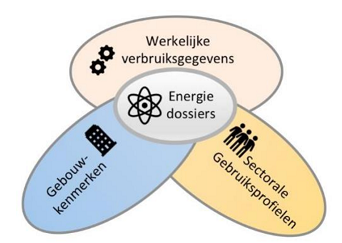

## Bijlagen

### Bijlage 1 Herkomstbronnen begrippen energie

Een eerste inventarisatie en ordening naar de energiedragers Elektriciteit, Gas en Warmte. Er is gestreefd naar een breed overzicht; zorgvuldige selectie moet nog plaats vinden. 
Er is een grote variëteit in herkomstbronnen: van wetgeving tot informatiemodellen en incidentele studies. En tussen de herkomstbronnen bestaan ook relaties; zo zijn er een aantal die zich baseren begrippen in de relevante wetgeving, maar veel bronnen hebben eigen definities opgesteld. Een schematisch overzicht zou een goede volgende stap zijn. De begrippencode Elektriciteit resp. Gas zijn begrippen die aan de basis liggen van begrippen en definities in andere bronnen. 
Ook is er een grote variëteit van de wijze waarop begrippen zijn opgenomen in de bronnen: van een lijst, tot aan definities die in tekstonderdelen zijn opgenomen. Niet alle bronnen zijn gepubliceerd, en de status van de bronnen is ook verschillend, van wetgeving tot interne werkdocumenten. 

| Bron                                                               | Verantwoordelijke Organisatie | Bevat begrippen | Type Energiedrager | Domein              | Verwijzing                                                                                                                                                                      |
|--------------------------------------------------------------------|-------------------------------|-------------|-------------------|---------------------|---------------------------------------------------------------------------------------------------------------------------------------------------------------------------------|
| Int’l Energie Agentschap                                           |                               | -           | Generiek          |                     | https://www.iea.org/reports/iea-guide-to-reporting-energy-rdd-budget-expenditure-statistics                                                                                     |
| Wet Belasting op Milieugrondslag                                   |                               | +           | Generiek          | Wet- en regelgeving | https://wetten.overheid.nl/BWBR0007168/2021-04-01                                                                                                                               |
| Wet Milieubeheer                                                   |                               | +           | Generiek          | Wet- en regelgeving | https://wetten.overheid.nl/BWBR0003245/2021-01-01                                                                                                                               |
| Besluit factuur, verbruiks- en indicatief kostenoverzicht energie  |                               | +           | Generiek          | Wet- en regelgeving | https://wetten.overheid.nl/BWBR0036646/2020-10-25/#Paragraaf1                                                                                                                   |
| Protocol Monitoring Hernieuwbare energie                           | RVO / CBS                     | +           | Generiek          | Wet- en regelgeving | https://www.rvo.nl/onderwerpen/duurzaam-ondernemen/duurzame-energie-opwekken/duurzame-energie/monitoring                                                                        |
| Informatiemodel Kabels & Leidingen                                 | Kadaster                      | +           | Generiek          | Wet- en regelgeving | https://www.geonovum.nl/geo-standaarden/informatiemodel-kabels-en-leidingen                                                                                                     |
| Rekenmodel ETM                                                     | Quintel                       | -           | Generiek          | Adviesbureaus       | https://energytransitionmodel.com/?locale=nl                                                                                                                                    |
| Begrippenkader Stedin, generieke termen                            | Stedin                        | +           | Generiek          | EnergieSector       | https://saref.etsi.org/                                                                                                                                                         |
| SAREF (Smart Appliances REFerence ontology) / SAREF4ENER           | ETSI                          |             | Generiek          | Overheid            | https://www.etsi.org/deliver/etsi_ts/103600_103699/103673/01.01.01_60/ts_103673v010101p.pdf                                                                                     |
| Energieleveranciers                                                | Energieleveranciers.nl        | +           | Generiek          | EnergieSector       | https://www.energieleveranciers.nl/energie/begrippen                                                                                                                            |
| Independer                                                         | Independer.nl                 | +           | Generiek          | EnergieSector       | https://www.independer.nl/energie/info/begrippen.aspx                                                                                                                           |
| NEN-normen (7125, NTA8800)                                         | NEN                           | +           | Generiek          | BouwSector          | https://www.nen.nl/media/wysiwyg/nta_8800_A1_2020.PDF                                                                                                                           |
| ISSO – Energievademecum                                            | ISSO                          | +           | Generiek          | BouwSector          | https://www.hetnieuweisso.nl/                                                                                                                                                   |
| Energy System Description Language (ESDL)                          | TNO                           | +           | Generiek          | Sector              | https://www.tno.nl/en/focus-areas/information-communication-technology/expertise-groups/monitoring-control-services/a-grip-on-the-energy-transition-with-esdl/                  |
| Directives EU: EED / RED /                                         | EU                            | +           | Generiek          | Overheid            | https://ec.europa.eu/jrc/en/jec/renewable-energy-recast-2030-red-ii                                                                                                             |
| Monitor Klimaatbeleid (obv IEA-materiaal)                          | IEA                           | -           | Generiek          | Overheid            | https://www.rijksoverheid.nl/documenten/publicaties/2020/10/30/monitor-klimaatbeleid-2020                                                                                       |
| Vesta-Mais – Documentatie                                          | PBL                           | -           | Generiek          | Overheid            | https://www.pbl.nl/modellen/vesta                                                                                                                                               |
| Monitoring RES systematiek                                         | PBL                           | -           | Generiek          | Overheid            | https://www.pbl.nl/publicaties/systematiek-monitor-res                                                                                                                          |
| Nederlandse Energiehuishouding (NEH)                               | CBS                           | +           | Generiek          | Overheid            | https://www.cbs.nl/nl-nl/onze-diensten/methoden/onderzoeksomschrijvingen/korte-onderzoeksbeschrijvingen/nederlandse-energiehuishouding--neh--/de-nederlandse-energiehuishouding |
| EU Richtlijn betreffende Energie Efficiëntie (EER                  | EU                            | +           | Generiek          | Wet- en regelgeving | https://eur-lex.europa.eu/legal-content/NL/TXT/PDF/?uri=CELEX:32018L2001&from=EN                                                                                                |
| Warmtewet                                                          | EZK                           | +           | Warmte            | Wet- en regelgeving | https://wetten.overheid.nl/BWBR0033729/2020-10-25                                                                                                                               |
| Nieuwe warmtewet                                                   | EZK                           | +           | Warmte            | Wet- en regelgeving | https://www.internetconsultatie.nl/warmtewet2                                                                                                                                   |
| Warmtebesluit AMVD                                                 | EZK                           | +           | Warmte            | Wet- en regelgeving | https://wetten.overheid.nl/BWBR0033940/2020-10-25                                                                                                                               |
| Definities ACM                                                     | ACM                           | -           | Warmte            | Wet- en regelgeving |                                                                                                                                                                                 |
| Rapportage Meetverplichting                                        | RVO                           | +           | Warmte            | Wet- en regelgeving | https://www.rvo.nl/sites/default/files/2020/07/Rapportage-handreiking-meetverplichting_080720.pdf                                                                               |
| Rapportageverplichting duurzaamheid warmtelevering                 | RVO                           | -           | Warmte            | Wet- en regelgeving | https://www.rvo.nl/sites/default/files/2020/02/Rapport-Duurzaamheid-warmtelevering-februari-2020.pdf                                                                            |
| Project WarmingUp                                                  | WarmingUp                     | +           | Warmte            | WarmteSector        | https://www.warmingup.info/documenten/definities-warmtebranche.pdf                                                                                                              |
| Energielinq                                                        | Stroomversnelling.nl          | +           | Warmte            | BouwSector          | https://energielinq.stroomversnelling.nl/algemeen/begrippen-en-definities                                                                                                       |
| Warmteleveringsbedrijven - Algemene Leveringsvoorwaarden           | Warmteleveringsbedrijven      | -           | Warmte            | WarmteSector        | Diverse                                                                                                                                                                         |
| Warmtemonitor                                                      | CBS                           | +           | Warmte            | Overheid            | https://www.cbs.nl/nl-nl/achtergrond/2020/35/warmtemonitor-2019                                                                                                                 |
| Subsidie: EIA/MIA                                                  |                               |             | Warmte            | Overheid            |                                                                                                                                                                                 |
| WarmteAtlas                                                        | RVO                           | +           | Warmte            | Toepassingen        | https://rvo-nl.github.io/EnergieWiki/                                                                                                                                           |
| Warmtebronnenregister provincies                                   | Provincies                    | -           | Warmte            | Toepassingen        |                                                                                                                                                                                 |
| Codes elektriciteit                                            | Netbeheer NL                   | +           | Elektra           | Wet- en regelgeving | https://www.netbeheernederland.nl/publicaties-en-codes/codes                                                                                                                    |
| EU Richtlijn  interne  markt voor  elektriciteit - 2019/944        | EU                            | +           | Elektra           | Wet- en regelgeving | https://eur-lex.europa.eu/legal-content/NL/TXT/PDF/?uri=CELEX:32019L0944                                                                                                        |
| Begrippencode Elektriciteit                                        | EZK                           | +           | Elektra           | Wet- en regelgeving | https://wetten.overheid.nl/BWBR0037938/2020-11-14                                                                                                                               |
| Codebesluit Begrippencode                                          | ACM                           | +           | Elektra           | Wet- en regelgeving | https://www.acm.nl/nl/publicaties/publicatie/15741/Codebesluit-Begrippencode-elektriciteit                                                                                      |
| Nieuwe energiewet                                                  | EZK                           | +           | Elektra           | Wet- en regelgeving |                                                                                                                                                                                 |
| Informatiemodel Netbeheerders i.o.                                 | Netbeheer NL                   | +           | Elektra           | Wet- en regelgeving |                                                                                                                                                                                 |
| Begrippenkader Stedin, specifiek Elektriciteit                     | Stedin                        | +           | Elektra           | EnergieSector       |                                                                                                                                                                                 |
| Informatiemodel Netbeheerders Assetdata                            | Netbeheer NL                   | -           | Elektra           | EnergieSector       |                                                                                                                                                                                 |
| Codes gas                                                 | Netbeheer NL                   | +           | Gas               | Wet- en regelgeving | https://www.netbeheernederland.nl/publicaties-en-codes/codes                                                                                                                    |
| Begrippencode Gas                                                  | EZK                           | +           | Gas               | Wet- en regelgeving | https://wetten.overheid.nl/BWBR0037923/2020-01-01                                                                                                                               |
| Nieuwe energiewet, specifiek gas                                   | EZK                           | +           | Gas               | Wet- en regelgeving |                                                                                                                                                                                 |
| Begrippenkader Stedin, specifiek gas                               | Stedin                        | +           | Gas               | EnergieSector       |                                                                                                                                                                                 |
| Informatiemodel Netbeheerders Assetdata                            | Netbeheer NL                   | -           | Gas               | EnergieSector       |

### Bijlage 2 Definitie en selectie van use cases

**Criteria/afwegingen voor keuze use case**

-   haalbaarheid (juridisch, technisch) om use case met reële data uit te voeren
    (mini-PoC)

-   het belang (waar in zit de urgentie / noodzaak / pijn)

-   link met andere Vivet-projecten en met VIII-B en VIII-C

-   productieve samenloop met VIII-B (ICT-architectuur) en VIII-C (IM
    Energie-installaties)

-   productieve samenloop met andere datastandaardisatieprojecten

-   verbindbaarheid met andere IM’en / ESDL

-   relevantie en actualiteit/urgentie (NP RES, ECW/TVW, Cijfers&Tabellen)

-   bronhouders/stakeholders : belangstelling / expertise / stakeholders (in
    kind bijdrage)

-   van eenvoudig (klein, met weinig afhankelijkheden) naar complex  
    (verbinding met Stelsel BasisReg, CERES, InstallatieRegister e.d.)

-   verbinden met meerdere lagen in *Geospatial Knowledge Infrastructure*  
    *in World Economy, Society and Environment*
    
 **Mogelijke use cases**

-   gebouwen: link met gebouw decompositie, datastelsel utiliteitsbouw,
    installatieregister, EAN \<\> BAG, DiSGeo, WKB, en andere projecten in de
    kolom ‘Bouw’ (schema hierboven)  
    leidt tot bijv. IM-Gebouw, als verbinding tussen Energie / Installatie /
    DiSgeo / BIM

-   enkele datasets (databronnen) uit informatielandschap in Vivet project; Min
    EZK werkt aan scenario’s om viewer-landschap te optimaliseren.

-   RES: Monitoring tbv PBL (relatie met Topsector tender Systeemintegratie?);
    PBL werkt monitoring systematiek om RES-data te consolideren tot landelijke
    monitoring.

-   RES: Verbinding RES Zeeland en A’dam met DSO; zijn de RES-resultaten te
    verbinden met DSO/TPOD-mechanisme e.d.? Deze vraag is onderwerp van
    VNG-project, waar Geonovum (Sandra, Jan Cas) ook bij betrokken zijn.

-   Monitor Klimaatakkoord, met o.a. dashboard en KEV (Klimaat- en
    EnergieVerkenning); project van Min. EZK.

-   enkele datasets uit Warmteatlas; wordt in toenemende mate ingezet als viewer

-   Vesta-Maïs en TVW; Startanalyse van PBL is basis voor wijktransitie naar
    aardgasloos.

-   Project IV ondergrondse energie-infrastructuur (IMKL en IMET en evt. DiSGeo)

**Criteria/afwegingen voor keuze use case**

>   Score: van ++ via O tot --

| **Criterium**                                                                                                                                       | **Gebouw en energie**   | **Datasets viewers Vivet I** |   |   |
|-----------------------------------------------------------------------------------------------------------------------------------------------------|-------------------------|------------------------------|---|---|
| Haalbaarheid (juridisch, technisch) om use case met reële data uit te voeren (mini-PoC)                                                             | PM                      | PM                           |   |   |
| Belang (waar in zit de urgentie / noodzaak / pijn)                                                                                                  | \+                      | \+                           |   |   |
| Link met andere Vivet-projecten en met VIII-B en VIII-C                                                                                             | \++ (PM: Vivet X, Y, ?) | \+ (Vivet I)                 |   |   |
| Synergie met VIII-B (ICT-architectuur) en VIII-C (IM Energie-installaties)                                                                          | B: O C: ++              | B: + C: -                    |   |   |
| Synergie met andere datastandaardisatieprojecten                                                                                                    | \+                      | O                            |   |   |
| Verbindbaarheid met andere IM’en / ESDL                                                                                                             | \++                     | O                            |   |   |
| Relevantie en actualiteit/urgentie (NP RES, ECW/TVW, Cijfers&Tabellen)                                                                              | \+                      | \+                           |   |   |
| Bronhouders & Stakeholders : belangstelling / expertise / medewerking (bijv. in kind bijdrage)                                                      | \+                      | ?                            |   |   |
| Groeipad- kansen: van eenvoudig (klein, met weinig afhankelijkheden) naar complex                                                                   | \++                     | O                            |   |   |
| (verbinding met Stelsel BasisReg, CERES, InstallatieRegister e.d.)                                                                                  |                         |                              |   |   |
| Verbindbaarheid met meerdere lagen in Geospatial Knowledge Infrastructure in World Economy, Society and Environment                                 | PM                      | PM                           |   |   |

### Bijlage 3: Verkenning Use case – Gebouw en energie
------------------------------

**Mogelijke scope**

-   gebouwen: link met gebouw decompositie, datastelsel utiliteitsbouw,
    installatieregister, EAN \<\> BAG, DiSGeo, WKB, en andere projecten in de
    kolom ‘Bouw’ (schema hierboven)  
    leidt tot bijv. IM-Gebouw, als verbinding tussen Energie / Installatie /
    DiSgeo / BIM

**Omgevingsanalyse / stakeholders**

Aan de use case ‘Gebouw en Energie’ direct gerelateerde initiatieven en partijen
(stakeholders, bestuurlijke organisaties):

| **Uitvoerings-initiatieven**                                                  | **Stakeholders**                   | **Belang van stakeholders**                                                                                 | **Bestuurlijk**            | **Rol Vivet**                                                                                          |
|-------------------------------------------------------------------------------|------------------------------------|-------------------------------------------------------------------------------------------------------------|----------------------------|--------------------------------------------------------------------------------------------------------|
| **RES, TVW (Warmte transitieplannen)**                                        | RES, ETRM, PBL, VNG, CBS           | Randvoorwaardelijk voor ET, Inzicht in energieverbruik, Input voor TVW                                      | BZK, EZK                   | VIVET core belang, standaardisatie en afspraken                                                        |
| **EAN-BAG koppeling**                                                         | Netbeheer NL, Kadaster, CBS, EDSN  | Energiewet, koppelen verbruik en gebouwen                                                                   | ACM, EZK                   | parallel met Vivet VII; kennis, verbinden, start- / top model aanleveren                               |
| **WEU (Werkelijk Energieverbruik Utiliteitsgebouwen)**                        | RVO, Platform Duurzame Huisvesting | In 2020 werkende 1e versie opleveren                                                                        | BZK, Topsector energie     | In sept / okt start model aanleveren                                                                   |
| **DisGeo**                                                                    | BZK en partners                    | Uitwerken IM mbv use cases                                                                                  | BZK                        | Koppeling Basisregistraties met energiedomein                                                          |
| **Installatieregister Nederland**                                             | TechniekNL                         | Verbinding met ketenpartners en invulling afsprakenstelsel-gedachte                                         | EZK                        | Verbinden installatie domein met DisGeo (o.a. gebouwen) en energiedomein                               |
| **Opstellen van datastandaard energienetten door en voor alle netbeheerders** | Netbeheerders                      | Eigen informatiesystemen ‘tijd-stabiel’ verbinden met ‘buitenwereld’ (basisreg., IMKL, DSO, etc.)           | pm                         | Direct verbonden met Vivet IV, maar ook relatie met bijv. Vivet VII                                    |
| **DSO Digitaal Stelsel Omgevingswet**                                         | Partijen DSO                       | Ow kan gemakkelijk gewijzigde info mbt energie-infra opnemen                                                | Gemeenten, Provincies, BZK | Afstemming DSO en Energiedomein: begrippen, datastandaarden en informatiemodellen                      |
| **ESDL**                                                                      | TNO                                | EDSL vermarkten en uitbreiden                                                                               | Topsector energie          | Harmoniseren ESDL met DisGeo en andere domeinen                                                        |
| **Vivet partners**                                                            | BZK, EZK                           | Creëren en bewaken van samenhang informatie-modellen, Realiseren ontwikkelen en Beheer IM energie-transitie |                            | Initiatief en realiseren samenhang en standaardisatie van informatie in energie en aanpalende domeinen |

Er zijn ook initiatieven die *indirect* gerelateerd zijn aan deze use case; wel
aan het energiesysteem, maar losser aan de gebouwde omgeving. Die zijn in
onderstaande tabel opgenomen:

| **Uitvoerings-initiatieven**                   | **Stakeholders**          | **Belang van stakeholders**                                                                                      | **Bestuurlijk** | **Rol Vivet**                                       |
|------------------------------------------------|---------------------------|------------------------------------------------------------------------------------------------------------------|-----------------|-----------------------------------------------------|
| **Afsprakenstelsel Facilitering Energiemarkt** | Sectoren in energiedomein | Energieverbruiken en opwek verbinden met basisregistraties (proces-aspect marktfacilitering is losser verbonden) | EZK             | afstemming datamodellen energiemarkt                |
| **Energiewet**                                 | EZK, Energiesector        | Data is één van de pijlers in de wet; datastandaarden zorgen voor een fundament                                  | EZK             | data-aspecten van energiewet verwerken in projecten |

Bovengenoemde initiatieven, inclusief alle Vivet-projecten 2020, zijn
weergegeven in [Contextdiagram Vivet
VIII](media/20200914-Vivet-VIII-Contextdiagram.pdf).

**Relevante documenten**

**Bouwwerken in samenhangende objectenregistratie**

Binnen het programma [Samenhangende Object Registraties
(SOR)](https://www.geobasisregistraties.nl/basisregistraties/doorontwikkeling-in-samenhang/objectenregistratie)
is een onderzoek uitgevoerd naar de realisatie van een model voor bouwwerken.
Het resulterende model is nog in een 'houtskoolschetsfase'.

Een belangrijke constatering in het onderzoek is dat het BIM-concept als meest
belovend uitgangspunt is genomen. Voor het domein van energie en
energie-installaties lijkt dat een goed uitgangspunt omdat er een relatie met de
(utiliteits)bouw sector is.

Figuur X: Model voor gebouw in ontwikkeling bij SOR (bron: Eindrapport werkgroep
bouwwerken, SOR 25-02-2020)

Een uitgangspunt van het model is dat op elk niveau behalve het kleinste het
geheel uit delen is op te bouwen. Dit model is te vertalen naar de concepten van
de IFC-standaard. Het model is in ontwikkeling, doorontwikkeling is o.a. naar
3D.

Interessant is het concept Installaties / voorzieningen, dat is omschreven als:  
‘Geheel van een relevantie installatie of andere voorziening in of aan en ten
dienste van het Gebouw(blok)’ en als volgt is toegelicht: ‘Begrip gebaseerd op
de fysieke deelobjecten uit de WOZ, de GebouwInstallatie uit NEN’.

Het is de vraag of in, op of aan het gebouw aanwezige energie-installaties hier
ook onder vallen.

**Common ground architectuurprincipes**

Uitwisselen van gegevens binnen en tussen gemeenten is van groot belang. ‘Common
Ground’ zorgt voor een andere, gegevensgerichte, manier van uitwisseling, met
behulp van een Gemeentelijk Gegevenslandschap. Dit is gebaseerd op het [GEMMA
Gegevenslandschap](https://www.gemmaonline.nl/index.php/Gegevenslandschap),
waarin processen en gegevens gescheiden zijn door een vijf-lagenstructuur. Er
wordt gewerkt met een gemeenschappelijke integratielaag. Data worden opgehaald
met API’s die voldoen aan de [API-standaarden zaakgericht
werken](https://www.vngrealisatie.nl/producten/api-standaarden-zaakgericht-werken);
er bestaat een [overzicht van API’s binnen de Nederlandse
overheid](https://developer.overheid.nl/apis).  
Common ground is gebaseerd op de volgende
[informatiearchitectuurprincipes](https://www.gemmaonline.nl/images/gemmaonline/6/67/20190328_-_Gemeentelijk_Gegevenslandschap_-_Informatiearchitectuurprincipes.pdf):

Figuur X: Een opsomming van de Informatiearchitectuurprincipes die ten grondslag
liggen aan Common Ground

Daarnaast hanteert Common Ground een aantal realisatiepricipes:

Figuur X: Een opsomming van de Realisatieprincipes die ten grondslag liggen aan
de Common-Groundbenadering

Van deze principes zijn de implicaties beschreven in document
‘CG-realisatieprincipes/docs dat is te vinden op de pagina [Voor architecten bij
gemeenten’](https://commonground.nl/cms/view/54476259/wat-is-common-ground/54476518).
Lees hier méér over [Common
Ground](https://www.vngrealisatie.nl/roadmap/common-ground).

**Digideal Gebouwde Omgeving**

De DigiDealGO kan worden beschouwd als de Nationale Digitaliseringsagenda voor
de Gebouwde Omgeving.

Citaat uit document DigiDealGO: *' Voor de circulaire bouweconomie is op termijn
een actuele virtuele kopie van het bouwwerk nodig gekoppeld aan digitale
product- en materiaalinformatie. Voor Smart Cities, energietransitie en
waterhuishouding moeten we slimme bouwwerken koppelen aan actuele
omgevingsinformatie. Het gaat om informatie-ketens en diensten rondom een
virtueel bouwwerk dat de levenscyclus van dat bouwwerk volgt (van ontwerp tot
sloop).'*

Figuur X: Het virtuele bouwwerk (middelste laag) draagt de informatie over het
fysieke bouwwerk gedurende zijn levenscyclus. Verschillende dossiers waaronder
energie zijn gekoppeld aan het virtuele bouwwerk. (bron: Digitaal Stelsel
Gebouwde Omgeving, versie 0.9 - Concept)

DigiDealGo werkt met 'versnellingsprojecten' die passen binnen de visie.

Het project Datastelsel Energieverbruik Utiliteit is een project met een
DigiDealGo stempel. Dat project heeft o.a. als doel meer data-gedreven
verduurzaming.

Figuur X: Data-gedreven verduurzamingsprojecten kenmerken zich veelal door
realistische business-cases en lagere integrale kosten. (bron: Project
Datastelsel Energieverbruik Utiliteit)

**Digitaal Gebouwdossier**

Min BZK voert (2020) een verkenning uit naar de ontwikkeling van een digitaal
gebouwdossier, waarmee eenmaal digitaal ingewonnen data voor hergebruik
beschikbaar komt, zonder dat gestreefd wordt naar volledigheid. Een groeimodel
wordt voorzien, met als belangrijkste eis aan de data dat deze voorzien wordt
van een uniek objectidentificatienummer (UOI), dat gekoppeld is aan een gebouw
of onderdeel daarvan. Voor het overige worden voorlopig geen eisen aan de data
gesteld; uit de gebruikspraktijk van het gebouwdossier zal blijken waar de
prioriteiten met betrekking tot verdere structurering, standaardisering,
formalisering, validatie en metadatering liggen. Voor zover bestaande wet- en
regelgeving hier niet reeds in voorziet, kunnen hierover naar behoefte op
termijn al dan niet wettelijk vastgelegde en afdwingbare eisen opgesteld worden.

De scope is in eerste instantie gericht op de woning- en utiliteitsbouw, en
neemt daarom de klasse ‘GEBOUW’ in IMGeo als uitgangspunt: “Vrijstaande
overdekte en geheel of gedeeltelijke met wanden omsloten toegankelijke ruimte
die direct of indirect met de grond is verbonden.” Op termijn zal aansluiting
bij de Omgevingswet noodzakelijk zijn en daarin is ‘BOUWWERK’ ruimer omschreven,
omdat deze de grond-, weg- en wegenbouw betreft: “Constructie van enige omvang
van hout, steen, metaal of ander materiaal, die op de plaats van bestemming
hetzij direct of indirect met de grond verbonden is, hetzij direct of indirect
steun vindt in of op de grond, bedoeld om ter plaatse te functioneren, met
inbegrip van de daarvan deel uitmakende bouwwerkgebonden installaties.”

Qua architectuur is ‘data bij de bron’ het uitgangspunt, net zoals bij Common
Ground. Het gebouwdossier krijgt dan een fluïde, virtueel karakter: afhankelijk
van de vraag van de gebruiker en de beschikbare bronnen wordt het dossier ‘on
the fly’ samengesteld.

Goede afspraken met partijen zowel aan vraag als aan bronzijde zijn
noodzakelijk; deze worden tegenwoordig vaak vastgelegd in een z.g.
afsprakenstelsel.

De objectenregistratie, de doorontwikkeling van de huidige
geo-basisregistraties, lijkt een geschikt fundament om zowel publieke als
private gebouwinformatie aan op te hangen. De ontwikkeling van een digitaal
gebouwendossier past overigens prima binnen de beleidslijn Digitale Agenda
Overheid. Min BZK draagt systeemverantwoordelijkheid voor de bouwsector. Vanuit
die rol is het logisch dat BZK aandacht heeft voor een gezonde werking van de
informatiehuishouding in de bouw, te meer daar niet wordt voorzien dat ‘de
markt’ dit op zal pakken. BZK geeft daar middels onder meer de introductie van
het consumentendossier, het subsidiëren van het BIM-loket en het ondertekenen
van de Digitaliseringsdeal Gebouwde Omgeving invulling aan. Het digitaal
gebouwdossier is een volgende stap in het invulling geven aan de regierol.

Er zijn verschillende ontwikkelingen waarbij het bouwdossier groot nut kan
bieden: de energietransitie, circulair bouwen, de bouwopgave.

NB: hier nog verwijzen naar de notitie ‘Rapport Digitaal Gebouwdossier’ van Dirk
van Barneveld c.s. dd 2401-2020?

**DiSGeo**

PM

**Europa en data-infrastructuur voor fysieke leefomgeving**

“In 2024 is de Nederlandse INSPIRE-infrastructuur de basis voor het beantwoorden
van de pan-Europese vraag naar geo- en milieuinformatie. Hiermee draagt INSPIRE
bij aan het versterken van het klimaat- en milieubeleid. Europese en
internationale instanties halen kwalitatief hoogwaardige INSPIRE-data bij de
Nederlandse dataproviders (en vice versa). De vraag naar gegevens wordt daarbij
leidend, daarom wordt bij het harmoniseren van gegevens prioriteit gegeven aan
gegevens waar vraag naar is”

INSPIRE is onderdeel van de Europese Green Deal, een nieuwe groeistrategie, die
de EU moet omvormen tot een eerlijke en welvarende samenleving, met een moderne,
hulpbronnenefficiënte en concurrerende economie, waar vanaf 2050 netto geen
broeikasgassen meer worden uitgestoten en economische groei is losgekoppeld van
het gebruik van hulpbronnen. Het nieuwe Europese beleid kent twee belangrijke
pijlers: de vergroening in de Green Deal en digitalisering oftewel ‘’Shaping
Europe’s digital future’. In de Europese Datastrategie promoot de Commissie de
ontwikkeling van een gemeenschappelijke Europese data space om de ontwikkeling
van een data economie te ondersteunen en het gegevensgebruik in de hele EU te
vergroten.

Figuur X: Het energiedomein (a Common European energy data space) is een
onderdeel van de gedeelde Europese dataspace. (bron: Quick scan Europa en
data-infrastructuur fysieke leefomgeving)

DG ENER omvat nieuw EU-beleid rond energie en data.

****Installatieregister Visie TN**

Techniek Nederland beoogt om met samenwerkingspartners te komen tot een
samenhangend geheel van informatie rondom installaties, onder de werktitel
“Installatieregister Nederland”.

Informatie uit Installatieregister NL is niet voor commerciële en
acquisitiedoeleinden bedoeld en is te gebruiken door onder andere
dienstverleners, fabrikanten, netbeheerders en bevoegd gezag. Dit wordt
gerealiseerd vanuit een stelsel van afspraken.

Met een installatieregister wordt beoogd om een samenhangend geheel te maken,
waar op basis van open standaarden en classificatie informatie ontsloten wordt,
die nu in veel diverse registraties vast ligt. Vanuit deze visie kunnen diverse
gebruikers en raadplegers – binnen de wettelijke en afgesproken kaders –
toegevoegde waarde bieden én krijgen van informatie over installaties en
producten.

Softwareleveranciers kunnen op basis van marktvraag applicaties ontwikkelen.
Fabrikanten van installaties/-onderdelen kunnen gericht eventuele
terugroepakties gefaciliteerd krijgen.

Er bestaan diverse (classificatie-, communicatie-)standaarden (zoals NL-SfB,
ETIM e.d.) en TN beoogt hier een samenhangend ecosysteem van te maken in het
kader van de Digideal Gebouwde Omgeving. Dit kan leiden tot onderdelen van een
toekomstig Digitaal Stelsel Gebouwde Omgeving (DSGO).

**Landelijke Informatievoorziening Vastgoed - behoeftenonderzoek**

De afgelopen jaren hebben het CBS, Kadaster en Geonovum samen gewerkt aan de
ontwikkeling van een landelijke informatievoorziening vastgoedgebruik (LIV). De
huidige LIV is een unieke databron die een aantal registraties verbindt m.b.v.
unieke sleutels. De LIV voorziet in landelijke, integrale, en afgestemde
gegevens over alle vastgoedobjecten in Nederland.

Figuur X: De achterliggende databronnen waaruit LIV is opgebouwd.

Er is onderzocht of deze voorziening tegemoet komt aan de behoefte bij
belangrijke maatschappelijke thema’s, zoals de energietransitie. Dit
behoeftenonderzoek is te vinden bij
[Geonovum](https://www.geonovum.nl/uploads/documents/Quick%20scan%20behoefteonderzoek%20LIV-%20defintief%20%283%29.pdf)
Het is een open deur te stellen dat er bij de energietransitie behoefte is aan
gegevens over vastgoed. Deels gaat het om direct energierelevante kenmerken,
zoals de mate van isolatie, installaties, gevel, bouwhoogte, enzovoorts. Deels
heeft de vraag een meer algemene aard: hetgoed afbakenen van typen vastgoed (wat
is een kantoor, een winkel?), maar ook bouwjaar, volume en oppervlakte zijn
hierbij relevant.

De achterliggende databronnen bepalen de inhoud van de LIV. Dat zijn primair de
basisregistraties BAG, WOZ, HR en BRP. Dezebasisregistraties zijn elk voor een
eigen toepassingsterrein ontwikkeld. Belangrijk uitgangspunt voor de LIV is dat
gegevens gekoppeld worden via het BAG-id.De microdatabestandenover
energieverbruik beschikken ook over deze sleutel en kunnen dus ook met de LIV
gekoppeld worden. Ook informatie over vastgoed op adresniveau kan in principe
aan de LIV gekoppeld worden.

Er kunnen verschillende toepassingen onderkend worden, zoals naast informatie
over energieverbruik het verkrijgen van meer inzicht in de locaties van
zonne-installaties.

LIV kan dus faciliteren bij het verbinden van de basisregistraties met datasets
in het energiedomein. Een robuuste vorm van informatiemodellering is daartoe
noodzakelijk.

**PIR/CERES Logisch gegevensmodel**

PIR, het ProductieInstallatieRegister bevat gegevens van
energie-opwekinstallaties. In de loop van 2020 heeft CERES (Centrale Registratie
van Systeemelementen) deze taak overgenomen. In de studie naar een
energie-installatieregister zijn enkele kernenititeiten van CERES gemapt op het
IM Smart grids.

Figuur X: De mapping van het IMEnergie op CIM-CERES.

**Referentiemodel Stelsel Basisregistraties**

PM

**TNO Data voor TVW en WUP**

Inventarisatie van beschikbare data voor het opstellen van Transitievisie Warmte
en WijkUitvoeringsPlannen door gemeenten.

**Unieke Object Identifier**

Verkenning in het kader van:

1.regie op bouwgegevens

2.samenhangende objectenregistratie

**Werkelijke Energieverbruik Utiliteitsgebouwen (WEU)**

Het opvragen van verbruiksgegevens door zakelijke energiecontractanten,
vastgoedeigenaren en gebouweigenaren. Andere gebruikers zijn Omgevingsdiensten
(tbv handhaving), ODA’s en beleidsmakers.

**Data Sharing Coalition**

<https://datasharingcoalition.eu/>

Gerelateerd aan Data Deel Afsprakenstelsel?
