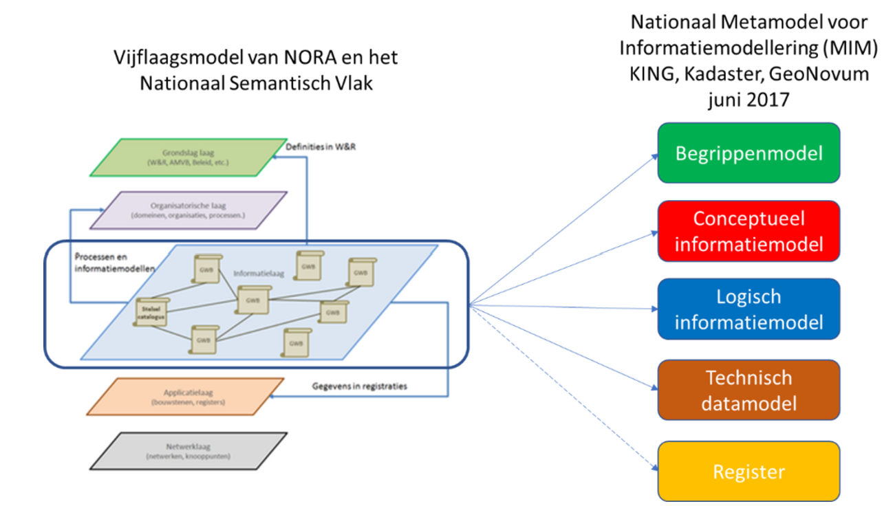

Hoofdstuk Inleiding
-------------------

### Context
Het programma Vivet is gestart om de versnippering van het datalandschap in het energiedomein aan te pakken. Besluitvorming in de energietransitie is immers gebaat bij goede informatie. Dit rapport doet verslag van Vivet-project VIII-Data ontsluiten waarin de informatie in het warmtedomein is beschouwd. Ook de kwaliteit van informatie over de warmtevoorziening kan op een hoger plan worden getild. Een aspect dat hier speelt is de diversiteit van de sector, de commerciële belangen en het ontbreken van samenhang tussen de partijen. Er is daarom een grote diversiteit aan informatiebronnen en door vragers van informatie zoals provincies,CBS en RVO worden behoorlijke informatielacunes ervaren. Ook bij gemeenten ervaren datalacunes, zoals door TNO is onderzocht in het rapport [*Data voor Transitievisie Warmte en Wijkuitvoeringplan*](https://aardgasvrijewijken.nl/documenten/handlerdownloadfiles.ashx?idnv=1701562). 

### Terugblik op Vimet 2019
De verkenning van een Informatiemodel Energie-Installaties in Vimet 2019 heeft een informatiemodel opgeleverd waarin de informatiekundige relaties tussen een aantal topconcepten uit het energiedomein zijn weergegeven. De energiedragers gas, elektriciteit en warmte zijn in relatie gebracht met het transport- en distributienet; met de energie opwek, consumptie, conversie en productie-voorzieningen; met bijbehorende meetwaarden; met locatie; en met gerelateerde informatie uit basisregistraties waaronder BAG en BGT.

NB: Omdat informatiemodellering het doel was, hebben we het project de afkorting VIMET gegeven: Verbetering InformatieModellering EnergieTransitie. Deze afkorting komt ook terug in de naamgeving van het vervolgproject in Vivet-programmajaar 2. 

De structuur en basisclassificaties uit dit model zijn gebruikt als input voor structuur en classificaties van de Begrippencatalogus Warmte 2020. Deze catalogus is daarmee voorbereid op een uitbreiding richting andere energiedragers.

In Vimet 2019 is ook de relatie met het model voor gebouwen uit de Samenhangende Objecten Registratie (SOR) gelegd. De SOR-gebouwdecompositie van o.a. gebouwblok, gebouw, bouwlaag, ruimte en installaties/voorzieningen, kan voor een gestandaardiseerde koppeling zorgen met installaties, voorzieningen, aansluitingen en energiegegevens uit het energiedomein. 

### Aanpak project Datastandarden
Vanwege de omvange van het energiedomein is besloten tot een use case-aanpak. Er is een methodiek ontworpen om use cases te selecteren. Vervolgens zijn deelgebieden binnen het energiedomeine geïdentificeerd, o.a. gebaseerd op de ervaringen en opgedane kennis in Vimet 2019. 
Met de ontwikkelde methode zijn use cases geselecteerd, resp. "Infoportalen" en "Gebouw en Energie". Voor deze laatste is een verkenning uitgevoerd. De beschrijving van de methode en het resultaat van de verkenning zijn opgenomen in Bijlage 2 resp. Biljage 3. 

Besprekingen binnen Vivet over de vervolgstap leidde er toe dat niet gekozen is om de verkenning van de use case Gebouw en Energie verder uit te werken, maar om het onderwerp 'Warmte' op te pakken. De reden hiervoor was het gebrek aan samenhang in dit domein, zowel informatiekundig als organisatorisch, en de warmtetransitie van de gebouwde omgeving is een dermate grote taak, dat ervoor gekozen is om het onerwerp Warmte opp te pakken. Omdat de warmtevoorziening - uiteraard - ook verbonden is met de gebowude omgeving, levert dit ook input op voor de later op te pakken use case Gebouw en Energie. 

Uit een eerste oriëntatie in 'de warmtewereld' bleek dat informatievoorziening een onderwerp is, dat zich uitsluitend op bedrijfsniveau afspeelt en dat er geen of nauwelijks afstemming plaatsvindt tussen bedrijven/organisaties. Ook de kleinste stapejs richting datastandaarden zou daarom impact hebben op informatiesystemen en bedrijfsprocessen en bij gebrek aan een overleg-structuur tussen verschillende organisaties (laat staan op branche-niveau) zou dat binnen deze projectcontext weinig resultaat opleveren. Dat was de aanleiding om in te zetten op de ontwikkeling van een begrippencatalogus voor het warmtedomein. Begrippen zijn minder direct verbonden aan informasitesystemen en aan processen, maar zijn tegelijkertijd wel hét middel om te komen tot één taal. En daarmee kan de basis gelegd zijn voor vervolgstappen. 

In de volgende paragrafen is nader beschreven hoe begripenkader en informatiesystemen zich tot elkaar verhouden. 

### Metamodel
Deze kenmerken van het 'universe of discourse' bepalen de wijze waarop een betere informatievoorziening het beste aangepakt kan worden. De informatielaag van het [gelaagde metamodel van NORA](https://www.noraonline.nl/wiki/Vijflaagsmodel), de Nederlandse Overheid Referentie Architectuur (https://www.noraonline.nl/wiki/Modellering_van_gegevens) biedt hiervoor aangrijpingspunten, zoals in onderstaande afbeelding weergegeven. 

<figure id="Metamodel">

<figcaption>Metamodel</figcaption>
</figure>

Verbetering van data-/informatievoorziening heeft doorgaans informatie en informatiesystemen als aangrijpingspunt. Informatiesystemen zijn sterk verbonden aan bedrijfsprocessen en wijzigingen daarin kunnen daarom vaak forse impact hebben op de organisaties. In de warmtecontext is dit een lastige opgave, vanwege de commerciële belangen en de diversiteit van de warmtesector. Een uitvraag in de warmtesector leverde op dat er geen brede gehanteerde informatiemodellen bestaan in het warmtedomein. Daarom is ervoor gekozen, mede gezien de omvang van dit project,  om als insteek het begripsniveau te kiezen. 

### Waarom begrippenkader
Begrippen zijn minder verankerd in informatiesystemen, begrippen slaan op de taal die men spreekt, en ook op dat gebied is verbetering mogelijk. Het hanteren van één taal is een behoefte die in interviews is uitgesproken en dat maakt het immers mogelijk om te komen tot goede Informatiemodellering, waarin de vertaalslag van begrippen naar informatiesystemen gemaakt wordt. 

Om informatie in samenhang en slim bevraagbaar te maken, bijvoorbeeld in het geval van monitoring door overheden, is het noodzakelijk dat begrippen zoveel mogelijk geharmoniseerd zijn. Hoewel dit simpel lijkt, is het dat niet. Er bestaat namelijk verschil in ‘taal’ tussen de landelijke, de provinciale, de gemeentelijke overheden en regionale samenwerkingsverbanden.  En, nog maar te zwijgen over de verschillen van begrippen en definities tussen overheden en bedrijven uit de sector. Harmonisatie in het kader van de energietransitie en klimaatontwikkelingen is aan te raden. Bij het werken aan een gedeeld begrippenkader – we spreken hier over de Begrippencatalogus Warmte - spelen naar verwachting minder grote belangen, waardoor hier gemakkelijker stappen gezet kunnen worden. Het levert ook een breed ecosysteem op, doordat begrippen niet alleen van belang zijn voor de warmteketen, maar ook voor partijen die actief zijn bij wetgeving, beleid, subsidies, innovatie en technische normen. 

Het proces dat gevolgd wordt bij de totstandkoming van een gedragen begrippentaal bestaat globaal uit de volgende stappen: inventariseren en relateren van begrippen / vaststellen van begrippen en hun relaties / harmoniseren van begrippen / beheer en onderhoud van de begrippen. 

In dit project hebben we ons op de eerste stap gericht, en op het vinden van goede tooling om de begrippen en bijbehorende definities te ontsluiten. Randvoorwaarden hierbij zijn dat dit gereedschap goed genoeg is om het uit te breiden tot een Begrippencatalogus Energievoorziening, faciliteiten heeft om interacties met betrokkenen (het ecosysteem rondom de begrippen) te faciliteren en machine-leesbaar is. 
De ambitie is om alle herkomstbronnen van begripsdefinities in het warmtedomein te identificeren en via de Begrippencatalogus Warmte toegankelijk te maken. Uiteraard worden hier ook de doelgroepen in geïnventariseerd: beleidsmakers, materiedeskundigen warmtesector, wetgeving en -informatiespecialisten.  

De Begrippencatalogus Warmte bevindt zich hier: https://begrippen.geostandaarden.nl/energie

### Leeswijzer

Hoofdstuk *Methodiek en techniek* beschrijft achtergrond van begrippencatalogus,
MIM, selectie van tooling, en ‘spoorzoeken’ naar warmtebegrippen, opsomming van
bronnen en opsomming van benaderde partijen.

Hoofdstuk *Resultaten landschapsverkenning warmtewereld* presenteert de resultaten van een inventarisatie van het warmtedomein: het ecosysteem van de energiedrager Warmte, een inventarisatie van stakeholders in een schematisch overzicht, de bronnen waar begrippen en hun definities zijn te vinden en welke partijen daar zeggenschap over hebben en tenslotte een beschrijving van enkele (voor Vivet) relevante toepassingsgebieden. 

Hoofdstuk *Begrippencatalogus Warmte* geeft de beschrijving van het resultaat: de
geïnventariseerde begrippen, de linkjes naar de herkomstbronnen van
begripsdefinities en de gemaakte keuzen bij het bouwen van de hiërarchie van
begrippen.

Hoofdstuk *Bevindingen, Conclusies en Aanbevelingen* doet in grote lijnen verslag van wat we tijdens dit
project zijn tegengekomen, en zet deze in perspectief van het Vivet-programma.
