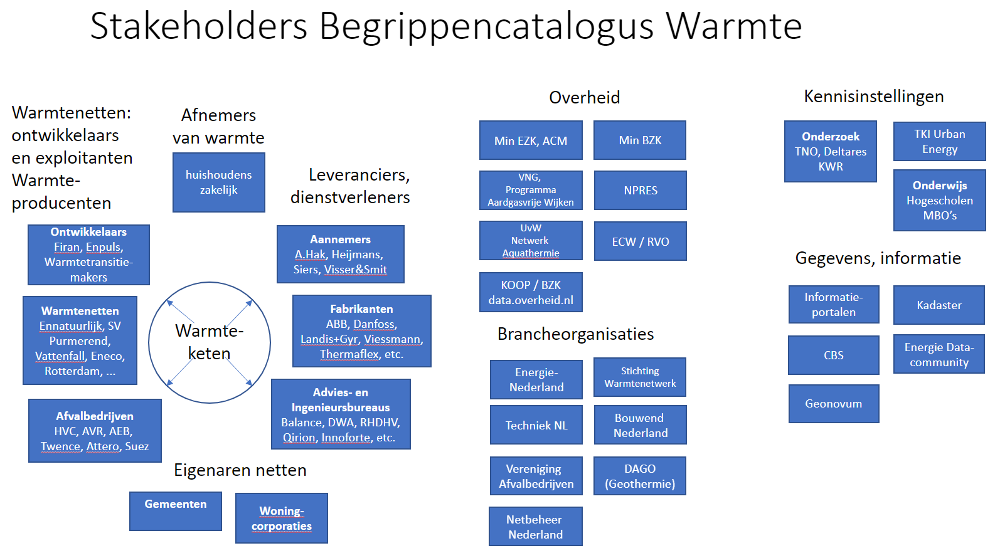
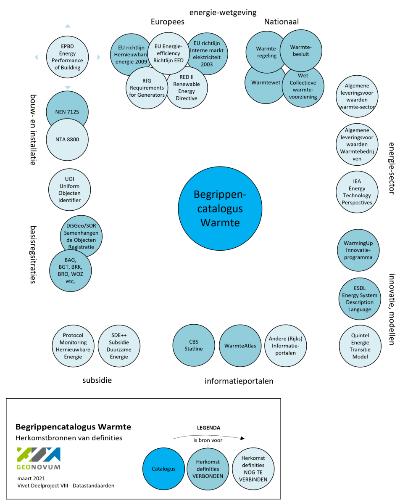

TIPS VOOR VERDERE AFRONDING

Op veel plekken telegramstijl
\@\@ = vraagtekens – nog uit te werken.
Bron van de afbeeldingen: ‘*Verzameling afbeeldingen eindrapport.pptx*’ op
U-schijf / map Eindrapport 
De plaatjes hebben per sheet een naamgeving (onderin notitie van elke sheet).  
De afbeeldingen worden bij een wijziging vanuit deze .pptx als afbeelding (.png)
in de map ‘media’ gezet. Deze .png’s krijgen de naam zoals in de notitie van
elke sheet staat. En dat is ook de naam die in dit rapport gebruikt wordt. 

Hoofdstuk Inleiding
-------------------

-   Context

Energietransitie / versnipperd energielandschap / Vivet / Use case Warmte
gekozen vanwege grote diversiteit van sector en informatiebronnen.

-   Punt op de horizont

Plaatje *Lagen Nationaal Metamodel
(https://www.noraonline.nl/wiki/Modellering_van_gegevens)*
<figure id="Metamodel">

<figcaption>Metamodel</figcaption>
</figure>

Toelichting: informatie onderdeel van informatiesystemen die deel uitmaken van
organisaties. Informatielandschap versnipperd, maar ingrijpend om hier in te
grjpen omdat je dan aan organisatie komt. Hoe meer versnippering, hoe
ingrijpender.

Begrippen zijn minder verankerd in informatiesystemen, begrippen slaan op de
taal die men spreekt. Informatiemodellering zorgt voor vertaalslag van begrippen
naar informatiesystemen.

-   Waarom begrippenkader

Geen gevestigde informatiemodellen gevonden in warmtedomein. Wel grote behoefte
aan uniformiteit qua taal. Begrippenkader: minder belangen en breed ecosysteem:
ook wetgeving, subsidies. De basis voor informtiemodellering

Proces: inventariseren en relateren van begrippen / vaststellen van begrippen en
hun relaties / harmoniseren van begrippen / beheer en onderhoud.

-   Terugblik op Vimet 2019

Waar zit de verbinding met Vimet 2019 precies? Use case Installaties /
Gebouwen - Domein in Vivet Conceptueel InformatieModel

-   BegrippenCatalogus warmte 2020

Het idee bij het inrichten van een begrippencatalogus: toegankelijk / verbindend / ...

-   Doel met deze aanpak

Ambitie: alle herkomstbronnen van begripsdefinities in het warmtedomein

-   Resultaat

Een rijkdom aan bronnen en goede kansen om deze brede verzameling aan
elkaar te relateren en in de toekomst te harmoniseren.

-   Doelgroep

Partijen met herkomstbronnen benoemen. Doelgroep volgende stap: beleidsmakers,
materiedeskundigen warmtesector, wetgeving, informatiespecialisten, partij die
autoriteit / governance op zich wil nemen.

-   Leeswijzer

Hoofdstuk *Methodiek en techniek* beschrijft achtergrond van begrippencatalogus,
MIM, selectie van tooling, en ‘spoorzoeken’ naar warmtebegrippen, opsomming van
bronnen, opsomming van benaderde partijen.

Hoofdstuk *Begrippencatalogus* geeft een beschrijving van het resultaat: de
geïnventariseerde begripen, de linkjes naar de herkomstbronnen van
begripsdefinities, de gemaakte keuzen bij het bouwen van de hiërachie van
begrippen.

Hoofdstuk *Bevindingen, Conclusies en Aanbevelingen* doet in grote lijnen verslag van wat we tijdens dit
project zijn tegengekomen, en zet deze in Vivet-perspectief van Vivet.

Hoofdstuk Samenvatting
----------------------

Dit schrijven wanneer hoofdstuk bevindingen, conclusies, aanbevelingen gereed is.
Of deze samenvatting weglaten als deze beperkt blijft. 

Hoofdstuk Methodiek en techniek
-------------------------------

*dit hoofdstuk: Joeri*  
## Begrippencatalogus

Een begrippencatalogus is méér dan een opsomming van begrippen: het beschrijft ook – op structurele wijze – de wijze waarop de begrippen met elkaar samenhangen. 
Zo is een energienet een bredere term van warmtenet, is een kleinverbruiker een smallere term van verbruiker en is consument een geletateerde term aan verbruiker. 
Synoniemen voor begrippencatalogus zijn *thesaurus* en *vocabulaire*. 

De begrippencatalogus wordt stapsgewijs opgebouwd, en de bouwstenen krijgen ook deze benaming: Begrippencatalogus Warmte, Begrippencatalogus Hernieuwbare Energie. 
Deze bouwstenen worden later opgenomen in de Begrippencatalogus Energievoorziening. 
De begrippen zijn in doorgaans niet zelfstandig gedefinieerd in de begrippencatalogus, maar verwijzen naar Herkomstbronnen begripsdefinities, waarin de definities beschreven zijn. Dit kunnen wetten zijn, normen, documenten met subsidie-voorstellen, artikelen op websites, etc. Maar ook kan verwezen worden naar andere begrippencatalogi. 
Bij voorkeur gebeurt dat met Linked Data-technieken, zodat begrippen en definities machinaal vindbaar zijn. 
Door de overzichtelijke zoekfunctie op term, definitie en bron helpt de Begrippencatalogus Energie de leesbaarheid en toepassing van deze bronnen te vergroten. 
De begrippencatalogus is het woordenboek, waaruit geput kan worden bij de beschrijving van de informatie, en dat gebeurt in informatiemodellen. We onderkennen twee lagen: het Conceptueel informatiemodel en het Logisch informatie of -gegevensmodel. Het conceptuele niveau is onafhankelijk van de operationele informatiesystemen, de beschrijving van hoe informatie door deze systemen worden vastgelegd en gebruikt gebeurt op het niveau van de logische informatiemodellen. 

## Conceptueel Informatiemodel Energietransitie 
Overgenomen uit https://docs.geostandaarden.nl/mim/mim/#wat-is-een-informatiemodel:  
Wanneer we informatie over bepaalde onderwerpen willen inwinnen, registreren of uitwisselen, dan is het van belang om deze informatie eerst goed te beschrijven. We doen dit zodat het voor eenieder die met de informatie aan de slag gaat helder en eenduidig is:
* waarover de informatie gaat, bv. informatie over een persoon of een gebouw, we noemen dit de objecten, de onderwerpen van gesprek
* de eigenschappen/kenmerken zelf, waarvan we informatie bijhouden, bv. de naam van een persoon of het bouwjaar van een gebouw
* wat de betekenis is van die informatie, de semantiek
* hoe deze informatie qua structuur in elkaar zit, qua onderlinge relaties en qua interne structuur van de data
We doen dit door een model te maken van de informatie. Een Informatiemodel beschrijft daarom de structuur, semantiek en de eigenschappen van informatie over dingen in de werkelijkheid. De beschrijving van de informatie heeft de vorm van een model dat een gestructureerde weergave is van die werkelijkheid. Een dergelijk model is noodzakelijk om deze informatie te kunnen beheren en gebruiken (door mensen en machines) bij het communiceren over deze werkelijkheid, in registraties of anderszins, zoals het specificeren van de tussen registraties uit te wisselen gegevens of van de te bevragen informatie uit een registratie.
Het beschrijven vindt plaats door de informatie van de objecten die we beschouwden te modelleren, met hun kenmerken en hun onderlinge relaties. We gebruiken daarvoor termen als objecten, objecttype, atttribuut, attribuutsoort, relatie, relatiesoort. Hiermee kunnen we de werkelijke data beschrijven. 

<figure id="Vivet Conceptueel Informatiemodel Framework">

<figcaption>Vivet Conceptueel Informatiemodel Framework</figcaption>
</figure>
 
Het Vivet Conceptueel InformatieModel (CIM) framework heeft een gelaagde structuur, en hiermee is het verbonden met de informatiemodellen van de Nederlandse overheid (de bovenste laag van dit model). Een belangrijk onderdeel hiervan zijn de basisregistraties, die zich baseren op (of: de eigenschappen overnemen van) de bovenste laag. 
Het z.g. Generiek Informatiemodel Energietransitie op zijn beurt is gebaseerd op de eigenschappen van de basisregistraties. 
In de praktijk betekent dit, dat de eigenschappen van begrippen die bekend zijn in de basisregistraties (zoals ‘Adres’, ‘Persoon’) ook in het Generiek Informatiemodel Energietransatie worden gebruikt. De eigenschappen worden ‘overerfd’. Het generieke aspect doelt op het overerven van de eigenschappen naar de informatiemodellen van specifieke energietransitie-toepassingen of -projecten (zoals hierboven bij voorbeeld Informatieportalen). 
Op deze manier ontstaat een bouwwerk met samenhangende onderdelen dat een deel van de versplintering van het informatrielandschap opheft en robuustheid voor de toekomst creëert. Met nadruk moet hier genoemd worden dat de dynamiek van de energietransitie betekent dat dit gebouw onderhoud behoeft en voortdurend aangepast moet worden aan nieuwe eisen die gesteld worden aan de energie-informatievoorziening. 
Het Vivet Conceptueel InformatieModel (CIM) Framework heeft een gelaagde structuur, en hiermee is het verbonden met de informatiemodellen van de Nederlandse overheid (de bovenste laag van dit model). Een belangrijk onderdeel hiervan zijn de basisregistraties, die zich baseren op (of: de eigenschappen overnemen van) de bovenste laag.

## Methodologisch framework

-   met behulp van over begrippen / thesaurus / taal  
    enkele plaatjes uit presentatie Archi XL – staat op U-schijf (plaatjes
    hieruit kunnen uitgebreider worden opgenomen in een bijlage):  
    MIM als framework  
    linked data  
    DiSGeo en visie architectuur zie ppt Ruud van Rossem (op U-schijf)  
    Fair principes (zie plaatje vivet workshop begrippenkader op U-schijf)

Vraag van Jeroen: refereren aan <https://www.noraonline.nl/wiki/Gegevensbeschrijvingen/Handreiking>?

## Applicatie voor de begrippencatalogus

-   iets over de gekozen tooling

Kort beschrijven welke typen tools hievoor bestaan? Waarom gekozen voor vocbench?

-   publicatieomgeving

Aanwezige functionaliteit, gemaakte keuzen

-   beheeromgeving

Aanwezige functionaliteit, gemaakte keuzen

## Onderzoekmethode

-   spoorzoekend / interviews

Versnipperde landschap. Begonnen met opvraag informatiemodellen; weinig
resultaat. Wel enkele netwerkorganisaties. Stichting warmtenetwerk. Warmtesector
via Energie Nederland. Overheid: RVO, ECW, PBL.  
Overal grote bereidheid tot medewerking. Overal herkenning problematiek. Overal:
“nodig, maar grote taak”.

Spoorzoeken niet afgerond. Tot op heden interviews/presentaties per stakeholder
(benoemen: EnergieNL (sector) / overheid / ACM / kennisdragers / ...). Volgende
stap: verschillende stakeholders bij elkaar brengen – dan kunnen ook de eerste
vragen richting vaststellen en harmoniseren van begrippen en governance gesteld
worden.

Hoofdstuk Resultaten landschapsverkenning warmtewereld
------------------------------------------------------

## Inleiding

Hier wordt de warmtewereld beschreven. Door gebruik te maken van begrippen is de
scope ruim. Vanuit *informatie* zoom je in op partijen waar
informatievoorziening van groot belang is. Via *begrippen* heb je echter een
ruimere scope, zoals is te zien in deze plaat waarin we ecosysteem schematiseren. 

Zie hiervoor ook de ‘bollenplaat’ *Schema Begrippencatalogus
Warmte Herkomstbronnen begripsdefinities.* Deze biedt een goed overzicht om dit
landschap te beschrijven ern biedt aanknopingspunten om stakeholders en
toepassingen te inventariseren.

*deze paragraaf: Jeroen*
## Ecosysteem
-   wet - monitoring – sector

<figure id="Ecosysteem ">

<figcaption>Ecosysteem</figcaption>
</figure>
Dit is startpunt geweest. Later ruimer – zie de bollenplaat met herkomstdefinities. 

## Vivet CIM Framework 

<figure id="Vivet Conceptueel Informatiemodel Framework">

<figcaption>Vivet Conceptueel Informatiemodel Framework</figcaption>
</figure>

CIM – definitie uit MIM ophalen

CIM voor energievoorziening is te groot om in één keer te ontwerpen. Stap voor
stap. Beginnen bij concrete casuïstiek in bepaalde context. Vivet jaar 1: vooral
verbindingen gemaakt met energie-installaties (domeinen energie=markt+netwerk,
domein bouw, domein installaties), nu verder gegaan met domein warmte. En domein
is ook groot, dus daarbinnen beginnen met toepassingen. Vooral de toepassingen
die ons aangereikt zijn via het Vivet-programma.

CIM Energie: eigenlijk nog breder: ook internationaal nog opnemen : nog, verwerken in schema – zie Leen - bijv. RED II, EuroVoc (?), plaatje Nico Vlug van Tennet met internationale definities
	
Korte beschrijving van wat er speelt, m.n. op informatiegebied.
We kunnen hier verwijzen naar rapport E van Vivet 2019-2020; daar staat dat
uitgebreid beschreven.

In schema de pijlers Bouw en Installaties samengevoegd. 
Dat geeft ruimte voor een ‘nog in te voegen domein’; vooruitlopend op Vivet 2021-22 ingevuld met Hernieuwbare energie. 

De bedoeling was om ons voor de verdere uitwerking van dit framework mede te
baseren op de door Netbeheer Nederland te ontwikkelen informatiemodellen, die
een aggregaat zou worden van de informatiemodellen van de onderscheiden
netbeheerders. Deze ontwikkeling is echter niet zo ver ontwikkeld dat dat voor
ons in dit jaar gebruikt kon worden.

Op begrippenniveau hebben we van Stedin wel een model ontvangen. Dat is mede de
basis voor een model voor de gezamenlijke netbeheerders. Maar dat is op dit
moment nog niet zover uitgewerkt dat we dat in ons begrippenmodel hebben kunnen
opnemen. In het project 2020-2021 wordt dat verder opgepakt in het kader van de
uitwerking van Hernieuwbare energie.

## Domein Warmte

### Stakeholders en Herkomstbronnen begripsdefinities 

Kort beschrijven aan de hand van onderstaande platen  en relateren aan de plaat die hierboven staat (bollenplaat). 
Misschien de platen nog iets verder op elkaar afstemmen qua naamgeving?

Stakeholders

<figure id="Stakeholders">

<figcaption>Stakeholders</figcaption>
</figure>

Verwijzen naar Bijlage: geanonimiseerde versie van spreadsheet met partijen en
namen. (deze misschien ook nog even qua terminologie / volgorde afstemmen op
blokkenplaat / bollenplaat?)

Herkomstbronnen

<figure id="Schema_Begrippencatalogus_Warmte_Herkomstbronnen_begripsdefinities">

<figcaption>Schema Begrippencatalogus Warmte Herkomstbronnen begripsdefinities</figcaption>
</figure>

Benoemen herkomstbron per stakeholder(s)

Wie zijn eigenaar van de bronnen? Rollen bij beheer en ontwikkeling van de bronnen? Samenhang tussen de bronnen? Bij welke
stakeholders vinden we wel en waar vinden we (nog) geen begrippen en definities?

## Toepassingsgebieden ahv Domein Warmte

Domein Warmte: dit rapport

Vervolgens nog domein Warmte beschrijven. Globale aanduiding van de kruispunten tussen
de benoemde toepassingsgebieden en domein Warmte. Dit blijft globaal, omdat we
ervoor hebben gekozen om het niveau van begrippen verder uit te werken (en niet op het niveau van informatiemodellen.

Na een stakeholder-analyse – zie de blokkenplaat - is een uitvraag gedaan naar
het bestaan van informatiemodellen en de bereidheid om de kennis daarover te
delen. Dit verzoek isgedaan aan de warmtebedrijven, zowel vias directe contact
als via de sectororganisatie Energie Nederland. De response daarop was zodanig,
dat dat mede aanleiding was om het niveau van informatiemodellering te laten
rusten en het project verder te richten op begripsniveau.

### Toepasssing: Informatieportalen

Informatieportalen zijn in Vivet-jaar 2019-2020 uitgebreid in beeld gebracht in
project Vivet-D. Dit jaar zou een keuze voor herordening plaatsvinden, en dat
zou het juiste moment zijn om vanuit toepassingsperspectief de informatiekant
van het Warmtedomein te gaan onderzoeken. Zover is het echter niet gekomen, maar
wel is de indruk ontstaan dat de WarmteAtlas, één van de informatieportalen ook
de komende jaren een belangrijke rol zou blijven spelen. Daarom is ervoor
gekozen om de data die beschikbaar wordt gemaakt in de WarmteAtlas met de
ontwikkelaars verder te gaan onderzoeken. Daarbij zijn we begonnen op
begripsniveau, omdat dat het niveau was waar we aspecten van de WarmteAtlas
kunnen relateren aan andere domeinen.

### Toepassing: Informatiebehoefte NPRES, TVW, ...

*Jeroen*: enkele zinnen n.a.v. het gesprek dat op 17 maart plaatsvond?

### Toepassing: CBS

Door CBS is aangegeven dat het verkrijgen van laagregionale data over warmte al
jaren een hoofdpijndossier is. Dat is mede aanleiding geweest om het domein
Warmte medio dit jaar op te gaan pakken.

Joeri/Sanne: kunnen jullie hier nog iets melden over begripsdefinities van CBS?

### Toepassing: Vivet-projecten 2021-2022

Er is een aanzet gemaakt tot de bijdrage die een verdere uitwerking van Warmte
in de begrippencatalogus kan bieden aan de voorziene Vivet-projecten in
projectjaar 2021-2022. Aanname hierbij is, dat ook het domein Hernieuwbare
energie zal worden uitgewerkt in de begrippencatalogus.

<figure id="Vivet-projecten 2021-22 en modellering van begrippen en informatie">

<figcaption>Vivet-projecten 2021-22 en modellering van begrippen en informatie</figcaption>
</figure>

De plaat hier nog enigszins toelichten. Het is een eerste aanzet.

### Digital Twin Fysieke Leefomgeving (DTFL)

Moeten we deze hier opnemen?

Hoofdstuk Begrippencatalogus Warmte
-----------------------------------

*Dit hoofdstuk: ??*

## Inleiding
Eerst wordt de opzet van de begrippencatalogus beschreven: de
scope, de keuzen bij de *inrichting* van de onderscheiden Groepen, Hïerarchie en
Begrippen.

Vervolgens wordt de *inhoud* van de Groepen, Hïerarchie en Begrippen kort
beschreven, met verwijzingen naar bijlagen en naar de begrippencatalogus zelf.

## Verantwoording van de inrichting van de begrippencatalogus

-   keuzen bij de opzet van de Begrippencatalogus.

Bijv. Context van de begrippencatalogus: verbindingen met andere
begrippencatalogi, zoals die van de basisregistraties?

Bijv. ‘Warmte’ als keuze leidt tot ‘Energiedragers’ als hoger niveau.
Energietransitie is thema voor Vivet, maar Energievoorziening is universeler
term.

Bijv. Momenteel (2021) is de term ‘systeemintegratie’ in zwang, waarbij men
doelt op samengaan van elektriciteit, gas, warmte en andere nog te ontwikkelen
energiedragers. Met de inrichting van deBegrippencatalogus moet je daarmee
rekening houden. De energiecapability ‘Energieconversie’ is hier een
sleutelbegrip.

Zijn er nog meer afwegingen gemaakt die het vermelden waard zijn?

-   keuzen bij het bepalen van de Groepen

Inventarisatie op basis van stakeholder-analyse, Vivet-rapportages, kennis van
energiesector en warmtedomein (literatuur, interviews, ervaring in de sector).

keuze gemaakt om de herkomstbronnen als groepen op te nemen; argumenten daarvoor

-   keuzen bij het bepalen van de Hiërarchie (methode v opdeling

veel herkomstbronnen bevatten begrippen en definities zonderdaar verbindingen
tussen aan te leggen. ESDL heeft dat wel. Daarom deze indeling, met name de vijf
z.g. energie-capabilities die daar centraal staan, als basis genomen voor de
verdere opzet en indelling van de begrippencatalogus.

Methode van opdeling (MIM..., koppeling andere (basis)registraties)

## Beschijving van de Groepen / Herkomstbronnen

-   Opsomming en korte beschrijving van de bronnen van de definities onder
    Groepen
<figure id="Groepen">

<figcaption>Groepen</figcaption>
</figure>
Hier verwijzen naar in bijlage op te nemen document ‘*Herkomstbronnen
begripsdefinities per energiedrager*’. met wat wel en wat niet in aanmerking
komt voor begrippencatalogus en een beetje toelichting op deze lijst. Ook
verwijzen naar het bijbehorende (bollen) schema

Geen structuur opgezet tussen de opgenomen groepen

-   Korte toelichting per opgenomen Groep in begrippencatalogus

## Beschrijving van de Hiërarchie

-   Uitleg van de hierarchie (zie ook ESDL uitleg document van Edwin Mathijssen,
    evt in bijlage opnemen)
<figure id="Hiërarchie">

<figcaption>Hiërarchie</figcaption>
</figure>
-   met voorbeeld : object - fysiek object - energievoorziening -
    energietransport - warmtetransport - aansluiting

## Beschrijving van de Begrippen

-   Algemene toelichting op begrippen in begrippencatalogus

Welke velden worden vastgelegd per begrip.

-   Enkele voorbeelden met plaatje en uitleg van begrippen en relaties tussen
    begrippen

-   Eén of meerdere afbeeldingen uit de begrippengraph (wolk) van
    Begrippencatalogus Warmte met ook verbinding met andere begrippen
    (basisregistraties?).

Hoofdstuk Bevindingen, Conclusie en Aanbevelingen
-------------------------------------------------

## Bevindingen

-   mening over begrippencatalogus

Algemeen wordt in de warmtesector een begrippencatalogus positieve onthaald.
Termen als ‘nuttig’, ‘verhelderend’ wijzen daarop. Het triggert ook soms het
positief meedenken en dat heeft meegewerkt aan het spoorzoeken naar andere
herkomstbronnen.

-   hoeveelheid en scope van herkomstbronnen

Tijdens dit onderzoek is een grote hoeveelheid bronnen uit heel diverse kanten
aangereikt. De scope daarvan is veel breder dan we vooraf konden vermoeden.

-   versplintering silos

Begonnen met warmte vanwege de specifieke problematiek die daar speelt; uit
onderzoek is niet gebleken dat er veel contacten zijn of affiniteit met de
andere energiedragers. De Begrippencatalogus Warmte konden we dan ook in
relatieve ‘splendid isolation’ opbouwen.

-   governance

Veel gestelde vraag (soms als eerste, tijdens de interviews) : wie gaat
harmonisatie en governance oppakken? Daar bleken in de sector weinig ideeën over
te zijn. Men sprak soms uit dat wij (dus Vivet) hier het voortouw in zouden
nemen.

## Conclusies

Als je op het niveau van begrippen aan de slag gaat, wordt je scope –
spoorzoekenderwijs - veel groter dan een eenzijdig informatiekundige invalshoek.

Er wordt weinig handelingsperspectief gezien in de sector ondanks de positieve
feedback (nuttig, verhelderend, stap richting ontsplintering) door de experts.

De behoefte aan harmonisatie van termen en begrippen is aanwezig, maar dit lijkt
geen onderwerp. Ook werden nauwelijks suggesties gedaan voor welke partij
verantwoordelijkheid zou moeten nemen. Men verwacht dat Vivet hier een rol in
speelt.

De basis die nu gelegd is, kan ook goed gebruikt worden voor andere
energiedragers: er lijkt een mooie kapstok te zijn.

Ondanks dat systeemintegratie (de verbinding tussen de energiedragers) van groot
belang wordt geacht in de energiewereld, is dat bij vrijwel alle contacten met
de warmtewereld in dit onderzoek nauwelijks ter sprake gekomen. De warmtewereld
zoals hier ervaren is in tal van opzichten – nog – gescheiden van de andere
energiedomeinen.

## Aanbevelingen

Vivet moet het initiatief nemen bij opzet en inrichting van de governance over
de informatievoorziening. Het schetsen van een perspectief en het bijeenbrengen
van partijen uit het warmtedomein is daarbij een eerste stap.

Nu voor warmte een opzet is gemaakt, die in principe geschikt is voor andere
energiedragers, zou de verdere uitwerking van het domein warmte parallel moeten
gebeuren aan de inrcihting van de *Begrippencatalogus Hernieuwbare Energie*, om
deze op elkaar af te stemmen, zodat er een robuuste basis ontstaat voor latere
uitbreiding met andere energiedragers.

Vivet zou bij haar projecten moeten inzetten op een benadering waarbij partijen
van verschillende energiedragers gestimuleerd worden om samen te werken.

Hoofdstuk Bijlagen
------------------

### Bijlage Presentatie over Begrippen en Taal

Hier enkele sheets opnemen uit presentatie Joeri en collega.

### Bijlage Geïnterviewde partijen

### Bijlage Herkomstbronnen begripsdefinities per energiedrager
Nog omzetten in kolomvorm?

<figure id="Opsomming Herkomstbronnen">

<figcaption>Opsommming Herkomstbronnen</figcaption>
</figure>

url’s, evt. contactpersonen

### Bijlage Uitleg ESDL (Edwin Matthijssen)

### Bijlage ...
